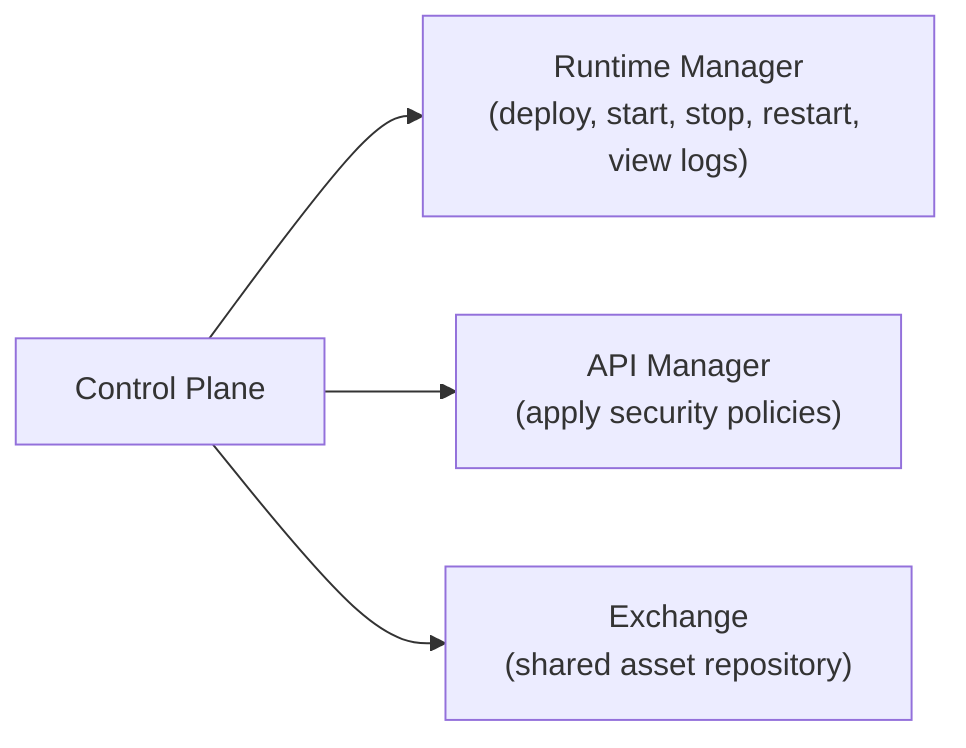
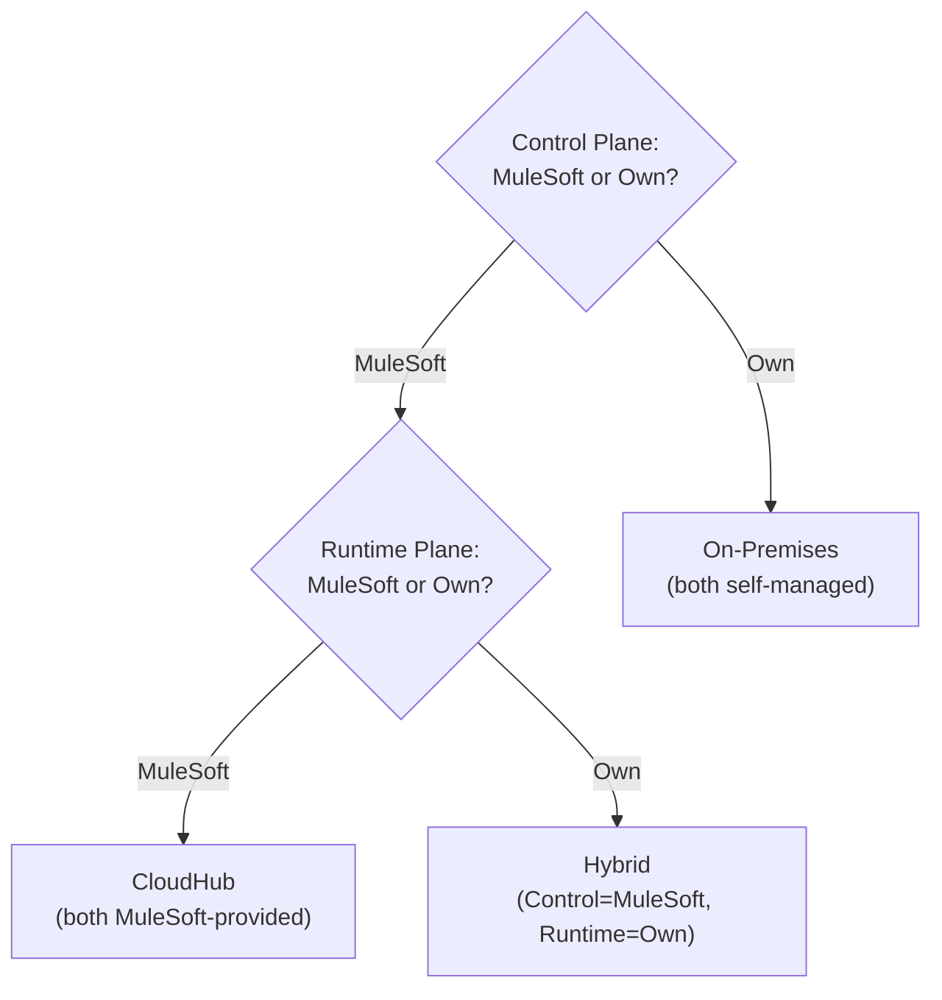
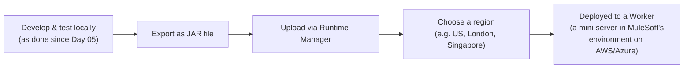
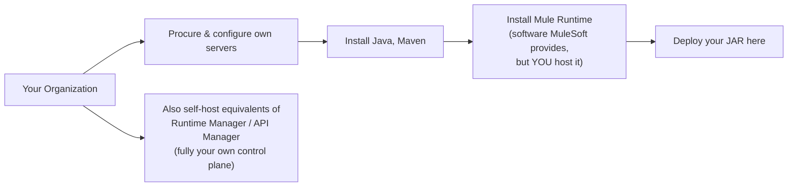
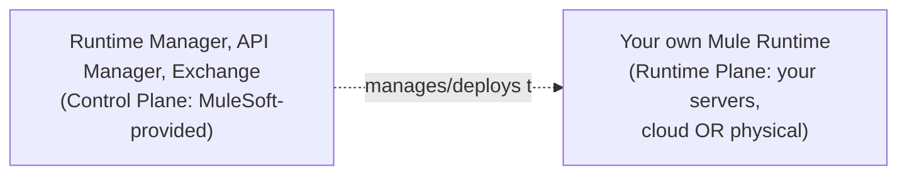
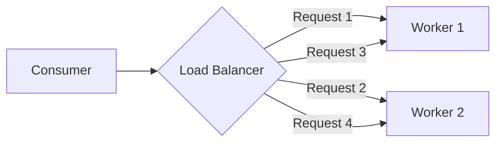
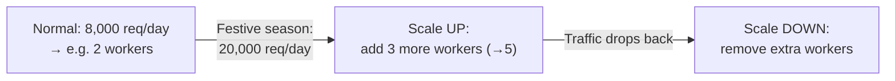

# Day 17 — Deployment Strategies: CloudHub, On-Premises, Hybrid, and Runtime Fabric

## Session Agenda
- Why deployment strategy matters, and the four options: **CloudHub, On-Premises, Hybrid, Runtime Fabric (RTF)**
- The **Control Plane** and **Runtime Plane** — the two factors that actually determine which strategy an organization is using
- Deciding *which* strategy fits which kind of organization, with real examples (banks, small e-commerce)
- **Load balancing** (shared vs. dedicated, round robin), **Workers**, and **scaling** (up/down, auto-scaling)
- A closing, direct honesty note on realistic career exposure to these strategies

## Why This Matters — Framed Directly
*"So far, mostly we are developing the application and testing it locally. Did we deploy it anywhere? No... will this application work for everyone in live? Can they consume us?"* Local testing (everything done since Day 05) is not deployment — an application sitting only on a developer's own laptop is inherently inaccessible to real consumers, and disappears the moment that laptop is closed. This session covers what actually happens next.

## The Four Deployment Strategies, Named Upfront
**CloudHub, On-Premises, Hybrid**, plus a fourth, briefly covered one: **Runtime Fabric (RTF)**. Directly and immediately qualified: *"there is no rule that we have to work in all deployment models... what we use the most is CloudHub, comparatively [to] hybrid or on-premises."*

## The Two Deciding Factors: Control Plane and Runtime Plane

- **These are explicitly generic, cross-technology concepts**, not MuleSoft-specific — the session applies them specifically to MuleSoft's deployment decision.

### Control Plane — "Who provides the management/control tools?"

- **Precise definition given directly**: *"the components which are used to control the aspects of the Mule apps fall under the control plane."* Concretely: **Runtime Manager, API Manager, Exchange** — the Anypoint Platform modules already covered (Day 07) — are all control-plane pieces.
- **The deciding question**: are these provided by **MuleSoft itself** (you just log in with a username/password and use them), or does **your own organization** have to stand up and maintain the equivalent infrastructure itself?

### Runtime Plane — "Where does the application actually execute?"
- **Precise definition given directly**: *"the components which are used while runtime aspects of the Mule application fall under runtime plane"* — where the actual **Mule Runtime** (the software that executes your deployed application, analogous to a JVM for Java) lives, and consequently, where logs and live execution actually happen.
- **The same deciding question, applied here**: is the Mule Runtime hosted on **MuleSoft-provided infrastructure**, or on **your own organization's servers**?

### The Four Combinations, Derived Directly

| Strategy | Control Plane | Runtime Plane |
|---|---|---|
| **CloudHub** | MuleSoft | MuleSoft |
| **Hybrid** | MuleSoft | Your own servers (cloud or physical) |
| **On-Premises** | Your own | Your own |
| **Runtime Fabric** | MuleSoft | Your own infrastructure, but containerized and largely auto-managed by MuleSoft |

## CloudHub — Both Planes Provided by MuleSoft

- **What CloudHub actually is, precisely explained**: *"CloudHub is a solution provided by MuleSoft by taking the help of AWS and Azure"* — MuleSoft doesn't build its own physical data centers; it provisions and pre-configures **AWS/Azure cloud infrastructure specifically for Mule applications**, so you never have to touch the underlying cloud yourself. *"Will AWS/Azure take it directly and apply to a MuleSoft application? It won't — we have to prepare all the applications for the MuleSoft environment. Who is preparing that infrastructure? MuleSoft is preparing it. Just log in and start."*
- **Region selection matters**, and is explicitly tied to a real, recurring compliance theme from the whole course (RBI/banking data-residency rules, first raised on Day 04): *"where is this cloud? Most of the time, in Asia, it's in Singapore. In the US, it's in the US... if we take all our [Indian bank] data and store it there, the RBI will not agree — it's a rule, our data should not go out [of the country]."*
- **A direct, concrete resolution of an apparent contradiction — why a US bank *can* use CloudHub while an Indian bank often can't**: *"AWS, Azure — both are being used in the background [for CloudHub], and both have a lot of data centers in the US... [an Indian bank can't use CloudHub in India] not because of rules and regulations [against cloud generally], but because AWS and Azure setup are [physically] not available [as MuleSoft-ready CloudHub regions] in [India]"* — i.e., the constraint isn't "no cloud allowed," it's specifically "no MuleSoft-ready CloudHub region exists inside the country's own borders" for India at the time of this recording.
- **Worker, defined directly and simply**: *"a mini server where your MuleSoft-related application is working"* — the actual compute unit your app runs on once deployed to CloudHub. (Full depth on Worker/vCore explicitly deferred to a future session, matching the same terminology used in the April-batch course's own notes, for anyone cross-referencing.)
- **Who this suits, stated directly**: organizations without strict data-residency/regulatory constraints — the instructor's example: a small e-commerce site with ~1,000 daily customers has *"no rules and regulations, I don't have any strict rules — I can choose anywhere."* CloudHub trades away infrastructure control for near-zero operational overhead (no server procurement, patching, or 24×7 maintenance team needed).

## On-Premises — Both Planes Self-Managed

- **Full ownership, full burden**: hardware procurement, capacity planning, all software installation (Java, Maven, Mule Runtime), networking setup, and **24×7 maintenance staff** — all your organization's responsibility.
- **Who this suits, stated directly**: *"highly regulated industries — healthcare industries, banks, financial institutions."* The ICICI Bank example (recurring throughout the course) is used directly: highly sensitive data (credit card numbers, account numbers, balances) combined with strict RBI data-residency rules makes full self-hosting the safe, compliant default when no compliant cloud option exists in-region.
- **A useful real-world tangent on data centers, given directly**: large organizations sometimes build their own dedicated data center; others **rent space in a third-party data center business** — described directly with a clean analogy: *"if you open a big office [building], they give lease and rent to multiple companies... daily office cleaning, coffee, meeting rooms — the company provides the rate, [tenant] sub-companies utilize all services and pay the rent."* On-premises doesn't strictly mean "your own building" — it means **your own dedicated, self-managed infrastructure**, whether physically owned or rented as dedicated capacity.

## Hybrid — Control Plane from MuleSoft, Runtime Plane Self-Managed

- **The precise, sometimes-confused distinction, stated directly and emphatically**: *"a lot of people want to call hybrid models as on-premises — but you should understand [the difference]: we are using [MuleSoft's] platform [for management], [even though the runtime] can be cloud or physical server."* Even if your organization's own runtime happens to sit on a private AWS/Azure setup (**your own cloud, not CloudHub**), it's still **Hybrid**, not CloudHub — because the *runtime plane* is still self-managed infrastructure, just one that happens to be cloud-hosted rather than physical.
- **A concrete, direct worked scenario answering "why wouldn't an Indian bank just use their own AWS/Azure in India instead of physical servers?"**: *"you can deploy your own private cloud with AWS or Azure and deploy your own applications in [it]... even then, we call this a hybrid model. Why? [Because] this is a third-party service without the intervention of MuleSoft"* for the runtime piece specifically — the deciding factor is purely **who manages the Mule Runtime**, not whether the underlying hardware happens to be physical or a private cloud instance.

## Runtime Fabric (RTF) — Briefly Covered, Container-Based

- **Precise description given directly**: your own on-premises server, but instead of manually installing/maintaining the Mule Runtime yourself, MuleSoft provides *"a software layer called RTF and a container layer... MuleSoft itself does the software patches and all that automatically in a container"* — reducing (but not eliminating) the self-management burden of a pure on-premises setup, while still keeping the runtime physically on your own infrastructure.
- **Explicitly, briefly covered and deprioritized, with direct honesty about why**: *"I am using [CloudHub, Hybrid, and RTF] regularly... there is no rule for everyone to work in all deployment models... most industries use CloudHub — if you put everything together and ask them questions, it will be difficult."* Pure on-premises specifically is flagged, directly and personally, as something even the instructor hasn't worked on: *"even I didn't get any option to work on complete on-premises till now."*

## Load Balancing and Scaling — Why Deploying to "One Server" Isn't Enough

### The Motivating Business Risk
*"If there is an issue for one hour, will this get a response? ... if the business is lost for one hour, is it very critical? There is an e-commerce platform, and there is no [availability] for one hour — huge business loss."* A single deployed instance is a **single point of failure**.

### Load Balancer — Precisely Explained, With Round Robin

- **Round Robin, defined directly**: *"first request is sent to this, second to this, third to this... if load is equally distributed, this is known as the round robin method... they mostly use this."* Requests cycle evenly across available workers.

### Shared vs. Dedicated Load Balancer
| | Shared Load Balancer | Dedicated Load Balancer |
|---|---|---|
| Who uses it | **Multiple companies**, in the same CloudHub environment | **Your organization only** |
| Cost | Included by default | Premium/paid feature |
| Guarantee | *"Guaranteed services are also not given"* | Dedicated capacity, exclusively yours |

*"This load balancer is utilized by others in the cloud environment — that is why it is called Shared Load Balancer... Company 1 and Company 2 [both] use it."*

### Why Multiple Workers, Precisely — Reliability, Not Raw Speed
> *"Why are we doing [two workers]? ... processing speed doesn't improve, actually — there is only one [real] reason. High availability."*

**Directly and explicitly corrected**: adding more workers is about **not going down entirely if one fails**, not about making individual requests faster. If Worker 2 goes down, the load balancer automatically routes all traffic to Worker 1 — *"who will take care of that? Load balancer will take care of it. It is not our concern."*

### Scaling Up / Down, and Auto-Scaling

- **A genuinely useful cloud-specific advantage, stated directly**: *"even in the cloud, scaling up and down is very, very easy... if we go to on-premises, again it's a process [buy, install, maintain physical hardware]. If you don't use it [in the cloud], it will cost [less/nothing]."* Elasticity is a real, concrete cloud benefit beyond just convenience.
- **Auto-Scaling, precisely scoped**: *"a premium feature provided by MuleSoft — it automatically senses that traffic is increasing... and reduces the number of workers [when it decreases]."* Without this paid feature, scaling is a **manual operation** (go to Runtime Manager, adjust worker count yourself).
- **Sizing is a real architectural estimation task, not a guess**: *"the architect has to estimate how much traffic can [occur], based on non-functional requirements from the business team... it's best to have at least two workers [for anything important] — even if one worker is down, another will handle the traffic"* — directly tying this back to Day 04's earlier "performance testing decides infrastructure sizing" discussion, and to the general principle that **worker count directly drives MuleSoft licensing cost (vCore)**, so over-provisioning "just in case" is a real cost tradeoff, not free insurance.

### Ports Differ by Load Balancer Type — A Concrete, Memorable Rule
| Load Balancer type | HTTP port | HTTPS port |
|---|---|---|
| **Shared** (default) | 8081 | 8082 |
| **Dedicated** | 8091 | 8092 |

*"If we are doing HTTP when we are doing practice, [trial accounts] deploy on one worker... but will they deploy on one [in real production]? They won't — because they need [reliability]."*

## The Honest, Direct Career-Framing Close
- *"Even I didn't get any option to work on complete on-premises till now — I did hybrid, CloudHub, and RTF. Actually, I got these three options."* And directly, generalized advice: *"you have 3 years of MuleSoft experience, you've done 2 projects, both used CloudHub — do you have any other deployment strategy experience? No, not at all. That can also happen. You can clearly tell that in the interview as well... don't bluff in interviews — 'I know that, I know this' — again, it is not good."* Real career exposure to deployment strategies is often narrower than the full theoretical list, and **honestly saying so in an interview is the correct move**, not a weakness to hide.

## Quick Recap
- **Two factors decide deployment strategy: Control Plane (Runtime Manager/API Manager/Exchange) and Runtime Plane (where the Mule Runtime executes)** — each independently either MuleSoft-provided or self-managed, giving **CloudHub** (both MuleSoft), **On-Premises** (both self-managed), **Hybrid** (Control=MuleSoft, Runtime=self-managed, cloud or physical), and **RTF** (self-managed infrastructure, but containerized and largely auto-patched by MuleSoft).
- **CloudHub dominates real-world usage** for organizations without strict data-residency constraints; **On-Premises/Hybrid** are the compliance-driven defaults for regulated industries (banking, healthcare) — often specifically because no compliant CloudHub region exists in-country, not because "cloud is banned."
- **Multiple workers exist primarily for high availability, not raw speed** — a Load Balancer (Shared, by default; Dedicated, as a premium option) distributes traffic (commonly Round Robin) and automatically reroutes around a failed worker.
- **Scaling up/down is a real, practical cloud advantage**; **Auto-Scaling is a separate premium feature**, without which scaling is a manual Runtime Manager operation — and worker count directly drives licensing cost, so sizing is a genuine architectural/business decision, not a free default.
- **It's completely normal, and correct, to have narrow real-world deployment-strategy experience** (e.g. CloudHub-only) — say so honestly in interviews rather than overclaiming.
