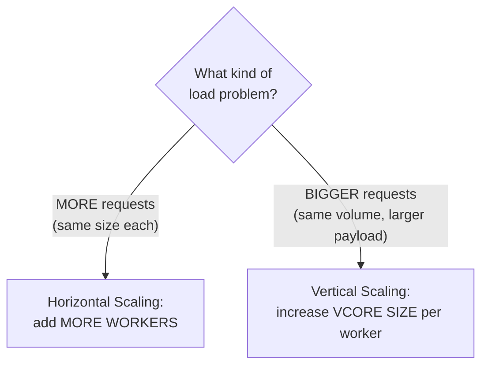

# Day 18 — CloudHub Deep Dive: Workers, vCore, Horizontal & Vertical Scaling, Hands-On Deployment

## Session Agenda
- CloudHub as an "Integration Platform as a Service" (IPaaS) — precisely defined
- **Worker** and **vCore** — the actual units CloudHub deployment/pricing is measured in
- **Horizontal scaling** vs. **Vertical scaling** — precisely distinguished with worked scenarios
- A full, live, hands-on deployment via Runtime Manager, including real version-compatibility troubleshooting
- CloudHub 1.0 vs. 2.0 — terminology differences
- Logs in Runtime Manager, and the correlation ID for tracing a specific request

## CloudHub, Precisely Defined as "Integration Platform as a Service"
- **The core definition, given directly**: *"Cloud Hub is an integration platform as a service where you can deploy your Mule applications in the cloud environment provided by MuleSoft."*
- **Why you can't just use raw AWS/Azure directly, explained precisely**: *"can we deploy the MuleSoft application directly to [AWS]? No, we can't — because in AWS Cloud, we have to prepare everything we need and set up the environment properly [ourselves] — but they are doing it all ready for us [in CloudHub]."* MuleSoft's value-add is specifically **pre-configuring** AWS/Azure infrastructure to be Mule-application-ready, so you never touch the raw cloud layer yourself.

## Worker — the Actual Deployment Unit
- **Precise definition, restated directly**: *"a dedicated Mule instance that runs your Mule application... think of it as a mini server."*
- **A critical, precise constraint, stated directly**: **one Worker can run exactly ONE application** — *"you can deploy multiple applications on a single worker? You can't do it... it acts like a mini server where it will be able to handle only one application."* This is a hard rule, not a soft recommendation.

## vCore — the Unit CloudHub Actually Bills and Sizes By

| vCore size | Memory |
|---|---|
| **0.1** (minimum, default) | 500 MB |
| **0.2** | 1 GB |
| **1** | 1.5 GB |

- **The mobile-phone-memory analogy, given directly, to make the sizing tradeoff concrete**: *"we have 2GB memory in our mobile — for 10-15 apps it works fine without lag; if we add 25-30 applications, memory can't be assigned properly and there will be lag."* An under-provisioned worker behaves the same way — insufficient memory for the actual request load causes failures/crashes, not just slowness.
- **A direct, concrete cost anchor point**: *"25,000 dollars for one vCore... for two or three years... minimum will be almost 70-80 lakhs"* — explicitly framed as **enterprise-level pricing**, not something a small organization would casually take on: *"it's not that small organizations can't bear it — it won't help for large enterprise-level integrations. It's suitable for enterprise-level organizations."*
- **How much sizing actually matters in practice, stated directly and reassuringly**: *"0.1 vCore will handle most of the applications... very rarely will we increase it to 0.2 or 0.3."* The default minimum is genuinely sufficient for the large majority of real applications.
- **Sizing is decided through actual performance/load testing, not guessing**, directly reinforcing Day 03/Day 17's earlier framing: *"we perform performance testing in pre-prod... is memory and CPU sufficient in one worker or not? We finalize [it] there."*

## Horizontal Scaling vs. Vertical Scaling — Fully Distinguished With Worked Numbers

### Horizontal Scaling — More Workers, for More (Same-Size) Requests
- **Precise definition given directly**: *"the process of increasing the number of workers and [deploying the] application on multiple workers."*
- **A fully worked, numbers-driven example**: Flipkart normally handles ~1 lakh requests/day across 3 workers, each capable of ~40,000 requests/day (a total capacity of 120,000). A festive-season surge to **3 lakh (300,000)** requests/day would **crash** the existing setup — the fix is adding more workers (proactively, ahead of the known sale), not making any single worker bigger.
- **A concrete, practical ceiling stated directly**: *"in real time, the maximum number of workers is not more than 8... if you want more than 8, the situation will be very rare — I have never faced such a situation before."*
- **The precise interview-ready trigger condition, stated directly**: *"if you want to process high-frequency, small-payload requests, then go for horizontal scaling"* — i.e., the **number** of requests increased, while individual payload size stayed the same.

### Vertical Scaling — More Memory Per Worker, for Bigger (Same-Volume) Requests
- **Precise definition given directly**: *"the process of increasing the vCore size of a worker."*
- **A fully worked, numbers-driven example**: a workload steadily handling **200 KB** payloads is fine on 0.1 vCore. If the payload size itself grows **~10x** (e.g. due to a business change, not more requests), the same worker can genuinely run **out of memory** and crash — the fix here is increasing vCore size (e.g. to 0.2), not adding more workers.
- **A critical, easy-to-miss operational rule, demonstrated live and stated directly**: *"will there be an option to increase it for each worker [individually]? ... No — if you give 0.2, you have to apply it to ALL of them"* in that application's worker pool. You cannot mix vCore sizes across workers of the same deployed application — it's an all-or-nothing setting, applied uniformly.
- **Why mixed sizing would genuinely break things, explained directly, tying back to Round Robin (Day 17)**: *"the first request will be handled well [by a 0.2 worker], the second request will be out of memory [if it lands on a 0.1 worker]..."* since load balancing distributes requests round-robin across *all* workers indiscriminately, every worker must be able to handle the full range of expected payload sizes uniformly.

## Hands-On: Deploying to CloudHub — Full, Real, Unscripted Walkthrough

### The Deployment Form, Field by Field
1. **Application name** — with **real, concrete naming rules stated directly**: lowercase letters, numbers, and dashes only; cannot start with a number or dash; **minimum 3, maximum 42 characters**; must be globally unique within the org. **A real, direct cautionary anecdote**: *"recently we got a very lengthy name for an application in our project... if we come here and do it, since we're going to open the pipeline, the deployment will fail... finally, if we decode it well, the length is 47 or 48"* — exceeding 42 characters is a genuine, real deployment-blocking mistake worth actively avoiding by using abbreviations (e.g. `conn` instead of `consume`, `svc` instead of `service`).
2. **JAR file** — exported the same way as prior sessions (right-click → Export → Mule Deployable Archive).
3. **Deployment target** — **CloudHub, CloudHub 2.0, or Hybrid.** **A directly-noted, real, live observation**: *"Cloud Hub [1.0] discontinued... it's officially discontinued"* on the instructor's own account at time of recording — only CloudHub 2.0 was actually selectable, despite the course's planning around CloudHub 1.0 terminology.
4. **Runtime version** — with a real compatibility rule stated directly and precisely: *"the lower version will [deploy successfully] in the higher [environment], but the higher version will not [deploy in a] lower [one] — because it will not be backward compatible... an application developed in 4.8 will not deploy in 4.6, but an application built in 4.6 WILL deploy in 4.8."*
5. **vCore/Replica size and count** — as covered above.
6. **Properties** (`mule.env`, `secure.key`, etc.) — supplied directly in this deployment form, matching the exact mechanism from Day 14, plus a newly-shown **"Protect"** toggle: *"if we protect this, these protected values can't be viewed or retrieved by any user — this action can't be undone"* — a genuine, irreversible one-way lock on a sensitive value, worth using deliberately.

### A Real, Live, Unresolved Compatibility Bug — Shown Honestly, Not Hidden
- **The actual failure encountered**: after deploying to CloudHub 2.0 with a newer runtime (4.8.1) than the project was originally built against (4.4.0), `payload.city` **fails to evaluate**, with the request payload apparently arriving in an unexpected **binary** format instead of the expected structure.
- **The instructor's own direct, honest, unresolved troubleshooting narration, preserved because it's a genuinely realistic moment**: *"maybe there is an option to do `payload.message.city`... because I don't have experience working on CloudHub 2.0 practically — till now, I haven't migrated either... let's check it out."* This bug is **not fully resolved within this session** — it's explicitly carried into Day 19 as an ongoing investigation (traced there to an outdated HTTP connector dependency version needing an upgrade via `pom.xml`).
- **The explicit, valuable lesson drawn directly from experiencing this live, rather than glossing over it**: *"it's always a good practice — first develop and test locally... if I have to do something in development, I will develop and test it locally [first]... some people say it will be overconfident [to skip this], but after going there [to a shared environment], the application will be deployed for at least 15-20 minutes, and I think it will fail there — double time will be wasted."* Real version-upgrade/compatibility issues are exactly the kind of problem local testing catches cheaply, before wasting a slow shared-environment deploy cycle on them.

## CloudHub 1.0 vs. 2.0 — The Terminology and Practical Differences

| Concept | CloudHub 1.0 | CloudHub 2.0 |
|---|---|---|
| Compute unit | **Worker** | **Replica** |
| Sizing unit | **vCore** | **Replica Size** |
| Space type | (implicit) | **Shared Space** vs. **Private Space** (an explicit hotel-room analogy given directly: *"sharing a room with other visitors, or trying to take a dedicated room"*) |
| Minimum sizing | 0.1 vCore = 500MB | Smaller fractional sizes possible (e.g. 0.05) mapping to **more** memory per fraction than 1.0's equivalent — noted directly as a genuine, real improvement: *"even if you give 0.05, you will be having more memory to process the request"* |

- **Region/data-center selection, tied directly to Day 17's compliance discussion**: demonstrated deploying to **US East (Ohio)** by default; changing region is done via the **Access Management** module — explicitly noted as typically an **admin/DevOps-controlled activity**, not something a regular developer configures themselves day-to-day.

## Logs in Runtime Manager — Full, Practical Detail

- **Where to find them**: Applications → select environment (e.g. Sandbox) → select the specific application → **Logs** section.
- **Real, practical retention limits, stated directly**: *"logs will generally last up to 30 days — otherwise, it will last up to 100 MB [whichever comes first]"* on the default/trial tier — organizations needing longer retention typically integrate a **separate, dedicated logging system** rather than relying on Runtime Manager's own built-in log storage indefinitely.
- **Filtering by time range** is directly supported and demonstrated, for narrowing down to a specific incident window.
- **Correlation ID — a genuinely important, real-world practical technique, introduced directly**: *"generally, we send a unique ID called correlation ID in headers... the log related to it is the option we are filtering here [by], or we can search with it."* When many concurrent requests are being processed, a correlation ID lets you isolate **all** the log lines belonging to *one specific* request's journey through the flow — essential for real production debugging where dozens of requests interleave in the same log stream.

## Quick Recap
- **CloudHub = "Integration Platform as a Service"** — MuleSoft pre-configures AWS/Azure infrastructure so you never touch the raw cloud layer.
- **Worker = one dedicated mini-server, running exactly one application** (a hard constraint). **vCore = the memory/sizing unit** (0.1 vCore = 500MB is the default, sufficient for most real applications; enterprise-tier licensing is priced by vCore count).
- **Horizontal scaling (more workers)** solves **more requests, same size** (high-frequency, small-payload); **vertical scaling (bigger vCore)** solves **fewer requests, bigger payloads** — and vCore size must be applied **uniformly** across every worker of a given application, never mixed.
- **A real, unresolved version-compatibility bug was demonstrated live** (deploying an older project to a newer runtime on CloudHub 2.0), reinforcing the direct, practical lesson: **always test locally before deploying to a shared environment**, especially across a runtime-version jump.
- **CloudHub 2.0 renames Worker→Replica, vCore→Replica Size**, and introduces Shared vs. Private Space — with generally better memory-per-fraction sizing than 1.0.
- **Correlation IDs are the real, practical tool for isolating one specific request's logs** out of a busy, concurrent production log stream.
