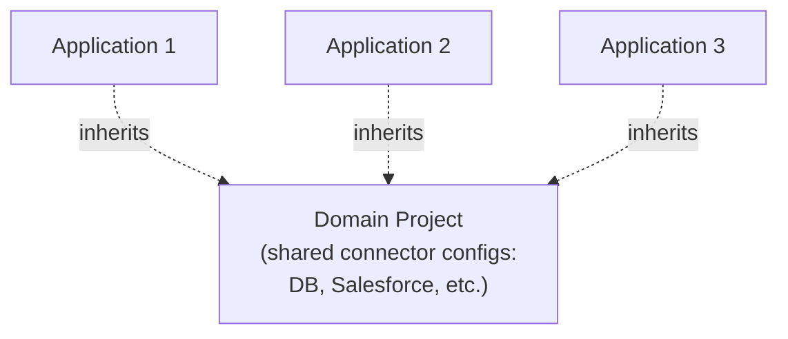

# Day 19 — On-Premises Deployment: Mule Runtime Standalone, Folder Structure, Domain Projects

## Session Agenda
- Resolving yesterday's CloudHub 2.0 compatibility bug (a real, live continuation)
- Downloading and setting up **Mule Runtime Standalone** for on-premises deployment
- The runtime's full folder structure: `apps`, `bin`, `conf`, `domains`, `lib`, `logs`, `policies`
- `wrapper.conf` — how runtime properties are actually supplied on-premises
- **Domain Projects** — sharing connector configuration across multiple applications
- A real, live port-conflict debugging session
- How real on-premises server access actually works day-to-day (remote desktops, restricted server access)

## Resolving Yesterday's Bug — A Real, Continued Investigation
- **The fix, found and applied directly**: the issue traced to an **outdated HTTP connector dependency version** in `pom.xml` — updated via **right-click project → Properties → Mule Project section → Modules** (a GUI alternative to hand-editing `pom.xml` directly, explicitly noted as equally valid: *"there is no rule to do it in POM — you can do it from here too"*), bumping the HTTP connector from an older version toward a newer one (**1.10.x**) to match compatibility with the newer Mule runtime (4.8.1).
- **A real, live tooling hiccup encountered and worked around, directly, without hiding it**: the Properties dialog **hangs/freezes** momentarily while checking for module updates — the instructor's own direct, practical troubleshooting steps: *"can we do something like restart here? We can't — either way we have to restart the system... is it better to restart the system, or deal with it differently? ... go to Task Manager"* and end the specific hung process (an OpenJDK-related task) rather than rebooting the whole machine — a genuinely useful, transferable IT troubleshooting habit, not just a Mule-specific tip.
- **Framed directly and honestly as a real learning moment, not a scripted demo failure**: *"these are all small things, but after we go inside [a real job], we will struggle — we will not be able to find [things]... you can't ask people like this [constantly], but if you ask, there will be a problem [socially]"* — reinforcing, once again, the course's repeated theme that real troubleshooting competence comes from direct, hands-on exposure to exactly this kind of friction, not from being told about it in the abstract.

## Downloading Mule Runtime Standalone
- **Same general download flow as Anypoint Studio** (Day 07): choose version (older versions explicitly available directly from the site, not just the latest), operating system, provide basic details (only email genuinely mandatory) → download → **unzip**.
- **A practical file-naming tip, restated directly, echoing Day 07's own Studio-install advice**: *"it's always a good practice to keep the shortest name possible"* for the extracted folder — avoids path-length issues when working with deeply-nested files inside it later.
- **A genuine prerequisite check, given directly and precisely**: Mule Runtime needs **Java and Maven** installed and correctly configured on the host system — verified via `java -version` and `mvn -version` at a command prompt. *"Both Java and Maven should be available on your system to run your Mule Runtime."* If missing, standard installers are described as straightforward (*"just click next, next, next, and it finishes"*).

## The Mule Runtime Folder Structure — Full, Precise Walkthrough

```
mule-standalone-4.4.0/
├── apps/       ← drop your JAR here to deploy
├── bin/        ← start/stop the runtime server itself
├── conf/       ← wrapper.conf: runtime properties go here
├── domains/    ← shared connector configs (on-premises/RTF only)
├── lib/        ← (low practical significance)
├── logs/       ← per-application AND system-wide logs
├── policies/   ← downloaded API security policies
└── services & tools/  ← (low practical significance, safe to ignore)
```

### `apps/` — Where Deployment Actually Happens
- **The precise, literal deployment mechanism, stated directly**: *"if we bring the JAR file and place it here, then the deployment process will be started... you have to drop your JAR file there."* Unlike CloudHub's form-based upload, on-premises deployment is as simple as **physically copying a JAR file into this folder** — the running Mule Runtime watches this folder and picks it up automatically.
- **How to confirm a deployment genuinely succeeded — the `anchor.txt` file mechanism, fully explained**: *"only when this anchor file is generated, the application is successfully deployed... if it is not generated, it is basically not deployed."* The anchor file's own contents even self-document the mechanism directly: *"delete this file while the mule is running to remove the artifact in a clean way"* — i.e., **deleting the anchor file is also the correct way to undeploy** the application cleanly. This is a genuinely useful, concrete signal to check for, distinct from just watching the console for "success"-looking text.

### `bin/` — Starting and Stopping the Server Itself
- **`mule.bat`** (on Windows) — double-click (or run from command line) to **start the Mule Runtime server** — *"if the Mule Runtime starts, then you will be able to deploy the application"* — the runtime must be running *before* dropping a JAR into `apps/` has any effect.
- **Command-line equivalents demonstrated directly**: `mule start`, `mule stop`, `mule restart` (Windows-specific syntax shown; described as broadly similar in shape on other OSes) — useful when you need to restart the runtime itself (e.g. after changing `conf/wrapper.conf`, since property changes there are **not** picked up live — a fresh restart is required, as demonstrated repeatedly and directly this session).

### `conf/wrapper.conf` — Where Runtime Properties Actually Get Supplied On-Premises
- **The direct, precise parallel drawn to Day 14/Day 18's property-supplying mechanism**: *"where should we pass this from? ... this is for Mule Runtime Standalone — the conf folder. We pass it in this conf folder... in the wrapper.conf file."*
- **Exact syntax, given directly**: `wrapper.java.additional.<N>=-D<key>=<value>` — e.g. `wrapper.java.additional.20=-Dmule.env=prod`. **The `-D` prefix is explicitly called out as mandatory syntax**: *"this minus D should be compulsory — that is syntax."*
- **A real, live numbering-collision bug, demonstrated and debugged directly — genuinely instructive**: two properties were accidentally both assigned the same index number (`18`), causing the runtime to silently get confused about which value to actually use. **The fix, worked through live**: scan the file for the highest already-used index number, and assign genuinely **unique**, unused numbers (e.g. `20`, `21`) to the new entries — *"since we have already given two at the same time, it is getting confused... it's better to give [numbers not already used, e.g.] 50 and 51 randomly [if unsure], [so the] number will [definitely] not [collide]."*
- **A second, subtler real bug demonstrated directly**: accidentally commenting out a line with `#` **without realizing the comment marker wasn't actually applied correctly** — *"even if you comment on it, it will not be identified [as a comment] if you didn't [do it right]"* — a small but genuinely easy syntax mistake in a plain-text config file, caught only by careful, methodical re-reading of the actual file contents.
- **The critical operational rule, demonstrated repeatedly and stated directly**: *"as soon as we restart it, the properties will not be reflected on the Mule Runtime"* automatically — every single change to `wrapper.conf` requires an explicit **stop → start** (or `restart`) of the Mule Runtime server itself to actually take effect; simply saving the file and redeploying the JAR is **not sufficient**.

### `domains/` — Shared Connector Configuration Across Multiple Applications



- **The precise motivating problem, given directly with a fully worked scenario**: *"5 applications [deployed on the same runtime]... total of 10 connectors [across them], [and] 6 [of those 10] are common [i.e., shared/duplicated] across all 5... [if] the DB password is changed, [do I] have to change [it in] every application again, or [just] one?"*
- **The fix — a dedicated "Domain Project"**: *"I will create a small project — [it's] not an actual [runnable] project, it's ONLY a domains project which will have the connector configuration"* — every regular application then **references/inherits** these shared connector configs from the domain project, rather than each maintaining its own independent copy.
- **The inheritance analogy given directly**: *"like inheritance — we are trying to inherit certain things from this particular [domain] project, [the same way] we get some characteristics from our parents."*
- **The direct, concrete payoff, restated plainly**: *"the password has changed — do I have to change one here, or every application again? Only DB has changed — [so] it's enough to go to the DB connector [in the domain project] and change the password [once] — from here, it will be repaired [propagated] basically."* One shared edit point instead of N duplicated ones.
- **Creating one, in Studio, demonstrated directly**: `File → New → New Domain Project.`
- **A precise, important deployment-location distinction, stated directly**: a Domain Project deploys into the **`domains/`** folder specifically — **not** `apps/`, where regular applications go.
- **A critical scope limitation, stated directly and emphatically, worth remembering precisely**: *"Domain Project will be specific to ON-PREMISES only, not [applicable to] CloudHub. Even in the RTF deployment model, Domain Project will not be supported."* **The reasoning given directly**: *"it's like taking an isolated container and deploying an application — when there's no [shared runtime environment to reference], where will it get [the shared config] from the domain? There is no scope for getting it."* Both CloudHub and RTF isolate each application into its own self-contained deployment unit, structurally incompatible with the shared-runtime-folder model that Domain Projects depend on.

### `logs/` — System-Wide and Per-Application Logs, Distinguished
- **Two distinct kinds of log files, shown directly**: a single **`mule-ee.log`**-style **system-level log** (covering the entire runtime, all applications together) **plus** one **separate log file per individually deployed application**.
- **Practical debugging guidance, given directly**: when an application fails to deploy, **check both** — *"because the application failed, it belongs to [the] enterprise system log as well as our own [application-specific] log."* A real, demonstrated error found this way: `"Could not find configuration property value for key mule.env"` — directly traced back to the wrapper.conf indexing bugs described above.

### `policies/` and Other Folders
- **`policies/`**: where downloaded API security policy definitions land (full depth deferred to a dedicated future policies session).
- **`lib/`, `services and tools/`**: explicitly, directly deprioritized — *"you can ignore this too... nothing to be done."*
- **The consolidated, direct summary of what actually matters day-to-day**: *"what is the most useful in this? Apps, logs... the applications are already deployed in the apps folder; after deploying, we use logs for monitoring."*

## A Real, Live Port-Conflict Debugging Session
- **The exact error encountered, directly**: *"HTTP Listener config on port 8081 — 8081 is already in use."*
- **The precise cause, restated directly with the exact same house-number analogy already used for CloudHub Workers**: *"one house address, one house number — we should not give the same house number in the same street... [since] I have already deployed [an earlier test] application [also] using 8081"* on the same standalone runtime instance, the port was still actively claimed.
- **The two legitimate fixes, both stated directly**: either **stop the earlier application** (freeing port 8081), or **configure a different port** for the new one — exactly the same underlying port-uniqueness principle from Day 05/Day 06, now shown causing a real conflict in a standalone, multi-application-capable runtime environment (unlike the isolated, one-app-per-Worker model of CloudHub).

## How Real On-Premises Access Actually Works Day-to-Day
- **A fully worked, direct scenario, worth preserving in full**: *"I am working from Hyderabad — this is our office. I am sitting here, working on my laptop... [but] the data center is [physically] in Bombay. That server, our Mule Runtime, is in that server."*
- **Access is deliberately, tightly restricted, and explained directly with real numbers**: *"there are 100 servers in this data center — do you need access to all 100? No — I have [only] 2 servers, [and] only server 1 and server 2 will have access to MuleSoft developers. The rest are database developers[' servers], sales[-team servers], other[-team] developers[' servers] — [each team] will have access to [only] those [servers relevant to them]."* Getting access to a server you *do* legitimately need requires **raising a ticket and obtaining approvals** — described directly as normal, expected process, not unusual red tape.
- **The typical real working setup, described directly and precisely**: *"this laptop will be in the enterprise network... you work on a remote desktop from [your local] laptop... you will not be working on your laptop itself — you will [almost] always be working on [a] remote desktop [session, itself sitting] in the enterprise[/private] network"* — connecting to the actual on-premises server infrastructure through a secured remote-desktop/VM layer, rather than direct local-machine access to production-adjacent servers.
- **The direct, practical framing on why this matters to internalize now, even without having lived it yet**: *"you will be able to experience all this only if you go inside [a real job]... if you have not heard [a specific tool/process] before, think of it as different software — when they show it to you [on the job], you'll be able to do the same thing... you should remember that terminology too"* — the goal of walking through this scenario is specifically so the *concepts and vocabulary* (data center, restricted server access, remote desktop, ticket/approval process) are already familiar the first time they're actually encountered on a real job, even if the specific tools differ.

## Quick Recap
- **On-premises deployment = physically copying a JAR into the `apps/` folder** of a running Mule Runtime — success is confirmed by the presence of a generated **`anchor.txt`** file (and deleting it is the correct way to cleanly undeploy).
- **Runtime properties are supplied via `conf/wrapper.conf`**, using `wrapper.java.additional.<N>=-D<key>=<value>` syntax — **every change requires a full runtime restart** to take effect, and duplicate index numbers (a real bug demonstrated live) silently cause confusing failures.
- **Domain Projects let multiple applications share connector configuration** (deployed to `domains/`, not `apps/`) — a genuine, practical convenience, but **exclusively an on-premises capability**, unsupported on both CloudHub and RTF due to their isolated, per-application deployment model.
- **Two kinds of logs exist** — one system-wide, one per application — and real deployment failures are diagnosed by checking **both**.
- **Port conflicts are a real, live risk on a standalone runtime** hosting multiple applications, unlike CloudHub's one-Worker-per-application isolation — the same port-uniqueness rule from Day 05 applies, just with higher real collision risk in this model.
- **Real on-premises access is deliberately restricted and mediated through remote desktops and ticket-based approvals** — worth understanding the vocabulary now, even before experiencing it directly on the job.
