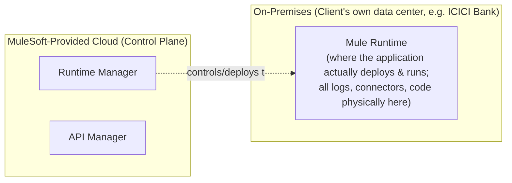
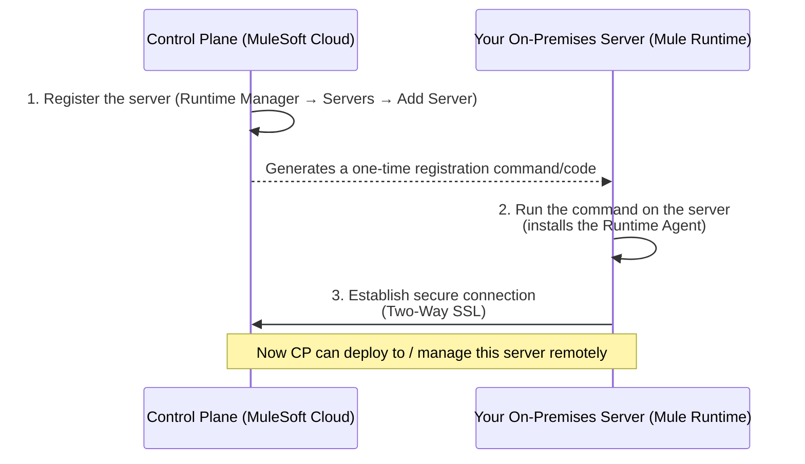
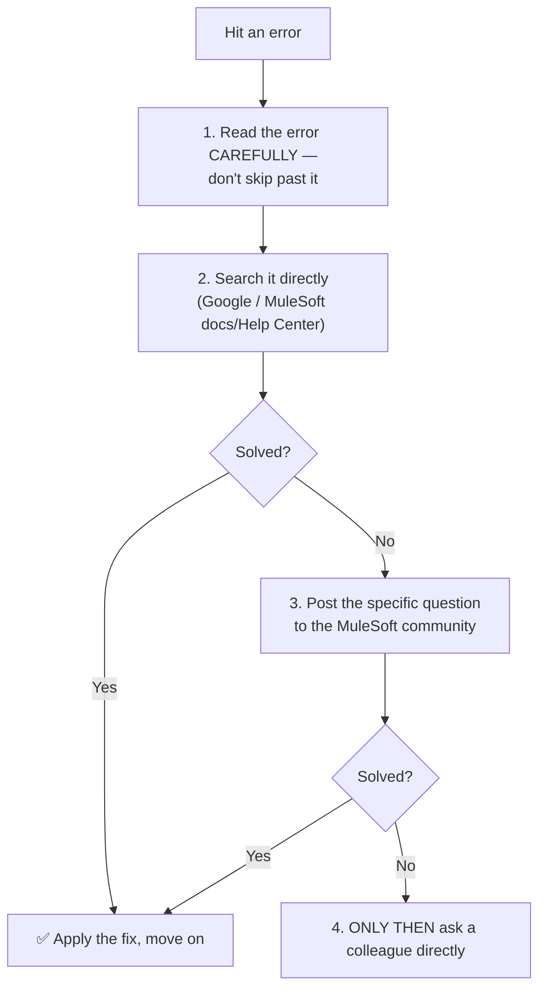

# Day 20 — Hybrid Deployment: Registering an On-Premises Server With the Control Plane, and a General Troubleshooting Philosophy

## Session Agenda
- The **Hybrid** deployment model, fully worked: which pieces live where, and how the two sides connect
- **Registering a server**, installing the **Runtime Agent**, and **two-way SSL** — the actual connection mechanism
- A real, extended, honestly-unresolved live troubleshooting session (certificate errors, version compatibility)
- The **MuleSoft Community and Meetup Groups** — a genuine professional-development resource
- A direct, honest reframing of how much of "all of MuleSoft" this course (and even the instructor's own daily work) actually covers
- A general, transferable **troubleshooting philosophy**: self-search → community → colleague, in that order

## Hybrid, Precisely Mapped: Which Piece Lives Where

- **The precise, direct restatement of the split**: *"which one should be on-premises and which one should be used by MuleSoft? ... where we are deploying the application — that particular segment will be used by the client [on-premises]... [but] the Anypoint Platform [Runtime Manager, API Manager] — we use all of them in the cloud provided by MuleSoft."*
- **The genuinely important operational difference from pure On-Premises (Day 19), stated directly**: *"in normal [on-premises] way, we have to directly log in [to the server] and do everything — we will not be able to do it from the control plane. [In Hybrid,] we can do it from the control plane of MuleSoft-provided [Runtime Manager] — start the application, stop it, restart the server, all these can be activated from here."* This is the entire practical payoff of Hybrid over pure On-Premises: **you keep your own infrastructure, but manage it through MuleSoft's own tooling**, rather than needing to directly log into the server for every operational task.

## Connecting the Two Sides — The 3-Step Registration Process

1. **Register the server** in Runtime Manager (Servers → Add Server, giving it a name).
2. **Install the Runtime Agent** on the actual on-premises server — done by copying a generated command (from the registration step) and running it on that server's own command line, from its `bin` directory. This agent is what actually lets the remote Control Plane talk to this specific Mule Runtime.
3. **A secure connection is established via Two-Way SSL** — explained directly, reusing the WhatsApp encryption analogy from Day 14: *"if you send [communication] without encrypting, [it's exposed]... communication will happen in the most secure way, [via] Two-Way SSL"* — mutual authentication between the Control Plane and the Runtime Agent, so neither side blindly trusts the other without cryptographic verification.

## A Real, Extended, Honestly-Unresolved Troubleshooting Session

This session is notable specifically for **not** being a clean, pre-solved demo — the instructor hits a genuine, real error and works through it live, in front of the class, without pretending to have an immediate answer.

- **The exact error hit, repeatedly, across multiple attempts**: *"the certificate provided by the Anypoint Management Center is not valid — probably you are a victim of a man-in-the-middle attack... contact support."*
- **The direct, honest, in-the-moment reaction**: *"I haven't faced this error [before] — this is the first time."*
- **Attempted fixes tried live, in sequence, several unsuccessful**:
  1. Deleting and re-adding the server registration.
  2. Renaming/using a completely fresh, differently-versioned Mule Runtime folder (moving from 4.4.0 toward a newer 4.8.1 download), suspecting a version-compatibility mismatch with the current Anypoint Management Center.
  3. **A genuine Java-version compatibility check, performed live and correctly, as a real diagnostic step**: checking MuleSoft's own official documentation for which Java versions are compatible with Mule Runtime 4.8 (confirmed: **Java 8, 11, and 17** are all compatible) — and confirming the local machine's installed Java version (11) was, in fact, fine — **ruling out** Java version as the actual root cause, rather than just guessing.
- **The session ends with the issue explicitly still unresolved, and the instructor saying so directly, without spin**: *"I think there is a change in 4.4.0... maybe now these compatibility issues are not matching... I will check it out and I'll come back to you"* — with a **specific, concrete follow-up plan stated directly**: dedicated extra sessions on **Friday, Saturday, and Sunday**, at the same time slot, specifically to resolve this and continue.
- **Why this is worth studying as-is, not skipping past**: this is a direct, live illustration of the exact same message repeated throughout the course — that real MuleSoft work involves genuine, sometimes multi-day troubleshooting against tooling/version issues that have no immediately obvious fix, and that **methodically checking official documentation** (not guessing) is the correct default move when stuck, exactly as modeled here.

## Hybrid Deployment, Mechanically — Once Working
- **From Runtime Manager's Deploy Application screen**: select **Hybrid** as the deployment target (instead of CloudHub) — the rest of the form (properties, replica count/size) works identically to the CloudHub flow already covered on Day 18.
- **What actually happens on deploy, traced directly**: *"this will take the JAR file from here [Runtime Manager] and deploy the application in the Mule Runtime of [the] registered server — then we will get the status from there and check whether it is running or not, and show it as running"* — i.e., Runtime Manager pushes the JAR *through* the established secure connection to the actual on-premises Mule Runtime, and reflects that runtime's real status back in the cloud-based dashboard.
- **Real-world access-control note, given directly, extending Day 19's server-access discussion**: *"in real time, developers [may or may not] have options like [stop/start/delete] — they will give it in lower environments [Dev/Test]. In higher environments — production or DR — only the respective [production support] teams will have access."* Even where Hybrid *technically* allows a developer to stop/start applications remotely via Runtime Manager, **organizational policy still restricts who is actually permitted to do so**, especially in production.

## The MuleSoft Community and Meetup Groups — A Genuine Professional Resource

- **Precisely described, directly**: a **free**, global network of local (city-based) MuleSoft user groups — *"there are no charges to join, to attend, to register, to attend the session — everything is free."*
- **Who runs them, explained directly**: *"MuleSoft officially has an employee who has an interest in MuleSoft — they are assigned as a group leader... they form 2-3 groups, manage all the events, bring the speakers."* A **Meetup Leader** role exists formally within MuleSoft's own community structure, and can itself be applied for as a form of community involvement/credibility-building.
- **The instructor's own direct, personal example, used as encouragement**: *"recently I have spoken in 5-6 different communities... I spoke at the Goa meetup... the advantage is our credibility will increase and our subject [knowledge] will also increase."*
- **Direct, practical advice on how to use this as a learner, not just a speaker**: *"at least participate — join the groups, participate in those events. Once you learn the subject, if you go there, you'll be able to understand"* the more advanced discussions — *"good, experienced people will come... some people will have worked on that policy before... you will have good interaction."*
- **The MuleSoft Help/Community forum, described directly, as a genuine troubleshooting resource**: *"if I have an issue, I search for that issue — this is called a Help Center... MuleSoft tech experts... will give you responses related to the error — we get almost 60-70% of the time [that] it will solve the problem."* Sometimes a known, documented issue in a specific version is directly identified this way, with an official suggested workaround.

## A Direct, Honest Reframing: How Much of "All of MuleSoft" Does This Course (or Even a Working Developer) Actually Cover?
- **A genuinely candid, self-deprecating admission, stated directly and precisely**: *"if you ask me, how much do you get from MuleSoft [as a whole]? We [use] 20-25%, actually — because MuleSoft still has a lot of tools, such as RPA (Robotic Process Automation), IDP (Intelligent Document Processing), etc."* The instructor's own real, professional working knowledge covers a genuine minority of MuleSoft's total product surface.
- **The direct, reassuring reframing of why this is fine, not a shortcoming**: *"what we are learning in our course is that 80-85% of the time, we are using these [specific] concepts in real time — that is why we are discussing it today. We are not learning all of them... you should have more benefit — that is the reason we are trying to share 80-90% of the [most commonly-needed] knowledge with you."* This is the same "learn less, get more" philosophy from Day 01/02, now given a concrete, honest percentage: the course targets the ~20-25% of the overall MuleSoft ecosystem that accounts for ~80-90% of real, everyday usage — not comprehensive coverage of everything MuleSoft as a company offers.

## The General Troubleshooting Philosophy — Stated Directly, as Explicit, Ordered Advice

- **The precise, direct ordering given, and — importantly — the reasoning behind it, not just the sequence**: *"read the error properly, read it, and check what is connected to it. If it doesn't work, take the error [text] blindly and go to Google and search it... [if that fails,] you can post it [to the community], you can ask your question — or you can immediately reach out to other people in your office. [But] without checking Google, without checking anything, if you go directly to your colleague, it's not the right strategy."*
- **The direct, explicit reason this ordering matters, stated plainly**: *"dependency will increase every time — [you'll] be dependent on them [colleagues]... my suggestion for people entering the industry: if they follow this approach, they will be able to succeed faster. Within one to two years, you will be able to reduce your dependence on others."* Habitually asking a colleague *before* attempting self-resolution builds a long-term dependency habit that actively slows your own growth as an independent troubleshooter — the discipline of self-search-first is framed as a genuine career investment, not just etiquette.
- **A direct, honest acknowledgment that experienced people sometimes skip steps, without condoning it as the ideal**: *"those who have already worked in IT will be applying it [differently, more casually] — but my suggestion for people who are entering into it or who are new to the industry [specifically]"* is to follow the full, disciplined sequence.

## Quick Recap
- **Hybrid = Control Plane (Runtime Manager, API Manager) from MuleSoft's cloud + Runtime Plane (actual execution) on your own on-premises servers**, connected via a **Runtime Agent** installed on your server and a **Two-Way SSL** secured connection — the entire payoff over pure On-Premises is managing your own infrastructure *through* MuleSoft's cloud tooling, rather than needing direct server logins for every operation.
- **This session showed a genuine, live, unresolved troubleshooting session** (a certificate/version-compatibility error) — worth studying specifically because it's real, not scripted, and models the correct diagnostic instinct (check official docs for compatibility, don't just guess) even when the fix isn't found within the session itself.
- **The MuleSoft Community/Meetup ecosystem is free and genuinely useful** — both for troubleshooting (Help Center, ~60-70% real resolution rate on searched issues) and for career/credibility building (local Meetup groups, speaking opportunities).
- **A direct, honest reframing worth remembering**: even a working MuleSoft professional's real day-to-day knowledge covers only ~20-25% of MuleSoft's total product surface — but that slice accounts for ~80-90% of real usage, which is exactly the deliberate scope this entire course targets.
- **The disciplined troubleshooting order — read the error → search it yourself (docs/Google) → ask the community → only then ask a colleague** — is presented as a genuine career-accelerating habit, not just politeness, specifically because skipping straight to a colleague builds long-term dependency instead of independent competence.
