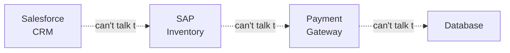
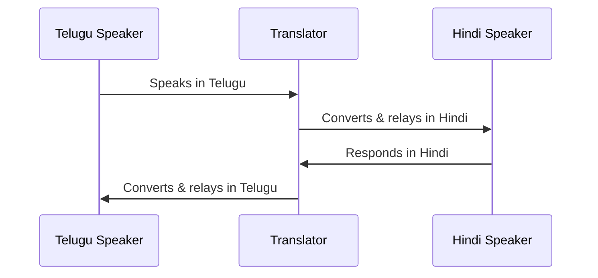
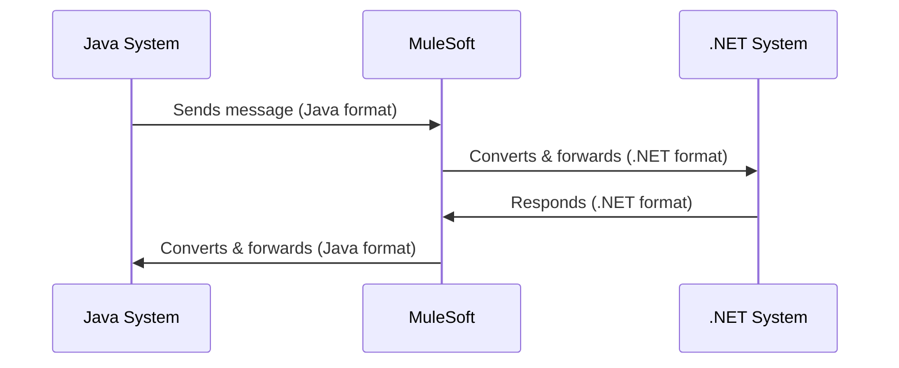
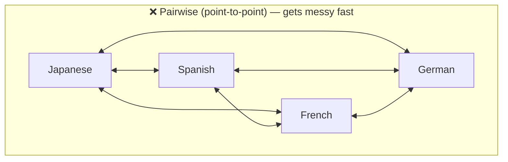
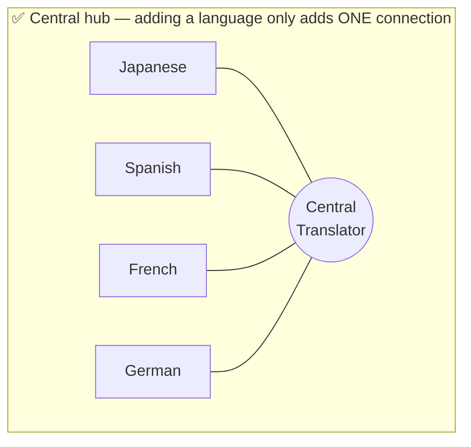
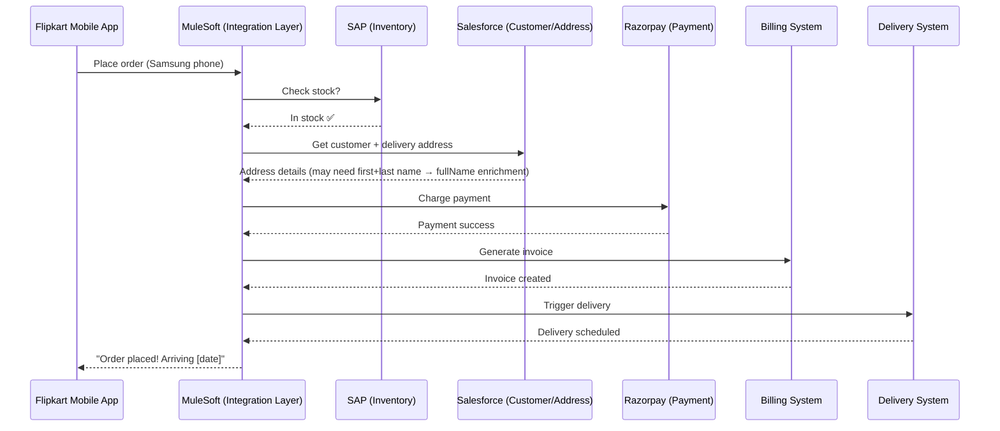
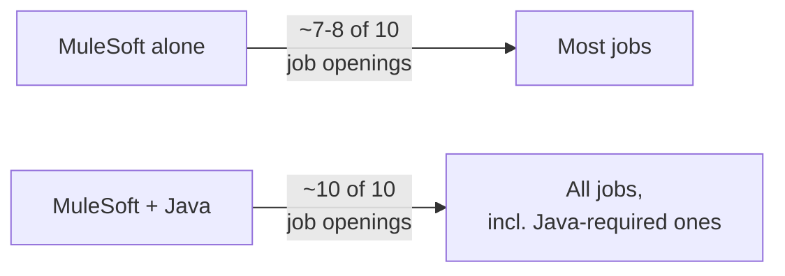

# Day 01 — Detailed Notes: What Is MuleSoft & Why Learn It

> **Watch alongside:** this is the orientation day — no hands-on building yet, but it sets up every mental model the rest of the course builds on: what "integration" actually means, why a whole industry of tools exists for it, and why MuleSoft specifically is worth the time investment.

---

## 1. The Core Problem: Systems Don't Speak the Same Language

Every large organization runs on **many different systems** — a CRM (Salesforce), an ERP (SAP), databases, payment gateways, shipping systems, and so on. Each was built by a different vendor, in a different era, using different data formats and protocols. Left alone, none of them can talk to each other.

**Integration** = any tool/program/software that connects two or more of these systems so they *can* exchange data. **MuleSoft is a platform purpose-built to do this fast**, instead of hand-writing custom glue code in Java or .NET for every single connection.

> 💡 **Why does speed matter so much?** The instructor's framing: whoever gets a product to market fastest wins. Hand-coding integrations in Java/.NET might take a week; the same integration in MuleSoft might take 1-2 days, because most of the "language conversion" work is handled by pre-built, configurable **connectors** instead of code you write from scratch.

---

## 2. The Translator Analogy (memorize this — it's the mental model for everything)

**Scenario:** A Telugu speaker and a Hindi speaker want to have a conversation. Neither understands the other's language.

The translator does exactly two things:
1. **Establishes communication** between two parties who otherwise couldn't talk.
2. **Facilitates the exchange of messages**, converting format/language both ways.

**This is precisely MuleSoft's job**, just between software systems instead of people:

### Scaling the analogy: an international conference
Add more languages (Japanese, Spanish, French, German) to the mix, and pairwise translators become unmanageable — you'd need a translator for *every possible pair* of languages. A single **central hub** that everyone routes through instead is dramatically simpler:

This exact contrast — pairwise chaos vs. central hub — is the same argument used later (Day 4) for **why ESB architecture replaced point-to-point integration** at the enterprise level. It's worth internalizing now.

---

## 3. Technical Walkthrough: Placing a Flipkart Order

This is the concrete, real-world version of the analogy above.

Notice what MuleSoft is actually doing across this whole sequence:
- **Format conversion**: the mobile app speaks JSON; SAP might expect XML; Salesforce expects yet another shape. MuleSoft converts at every hop.
- **Sequencing/coordination**: stock must be confirmed *before* payment is charged — if you charged first and then found no stock, that's a business problem. MuleSoft enforces the correct order of operations.
- **Data enrichment**: Salesforce might return `firstName` and `lastName` separately, but the delivery system wants one `fullName` field — MuleSoft combines them.

**Why is Flipkart called an "enterprise"?** Because it depends on *many* distinct applications (inventory, CRM, payment, billing, delivery) to complete one simple-looking user action. **MuleSoft integrating all of them is why it's called an Enterprise Application Integration (EAI) tool.**

---

## 4. Why MuleSoft Specifically? (not just "an" integration tool)

| Reason | Detail |
|---|---|
| **Industry-recognized leader** | Analyst firms (evaluating vendors on business handled, complexity supported, cloud/on-prem support, etc.) have ranked MuleSoft the integration leader ~9-10 times. |
| **Salesforce acquired it (2018, ~$6.5B / 40,000+ crores)** | Salesforce dominates CRM (~28% market share, no close #2/#3) and needed a strong integration layer to connect Salesforce deployments to everything else in a customer's enterprise — buying the leader was faster than building one. |
| **300+ pre-built connectors** | Most integrations need *zero* custom code — just configure an existing connector (Salesforce, SAP, AWS, etc.). |
| **Full API lifecycle in one platform** | Design → Build → Secure → Deploy → Monitor, all natively — competitors often need bolt-on third-party tools for some of these steps, adding licensing cost and integration overhead. |
| **Cloud AND on-premises support** | Banks/financial institutions often can't move fully to the cloud (regulatory, legacy reasons) — MuleSoft supports both without forcing a choice. |
| **Fast to learn** | ~55-60 hours of training vs. 4-6 months for something like Salesforce — a genuinely smaller tool, heavily drag-and-drop. |

---

## 5. Career Framing (useful context, not just trivia)

- You don't need Java to work in MuleSoft — it's a **low-code, drag-and-drop tool**; DataWeave (the transformation language) covers most "coding" needs.
- Knowing Java **is an advantage** (opens a few extra job postings that explicitly require it) but isn't a blocker if you don't have it — the instructor's own stated experience is MuleSoft without Java, at a senior salary level.
- **Career gaps** are broadly accepted outside of a handful of very large/strict companies — the advice given is to focus effort on the much larger pool of small/medium companies rather than a narrow set of gap-intolerant employers.
- **Developer roles vastly outnumber admin/architect roles** — admin work is largely absorbed by DevOps teams in practice, and architect roles require years of experience. This is why the course's focus (and this note series' focus) is squarely on the **developer** skill set.

---

## Quick Recap

- **Integration** = connecting systems that don't natively understand each other. **MuleSoft** is a platform that does this fast, via the "translator" pattern: establish communication + convert/exchange messages.
- Central-hub thinking (one integration layer everyone routes through) beats pairwise point-to-point connections as system count grows — this idea resurfaces as **ESB architecture** on Day 4.
- MuleSoft's edge: analyst-recognized leadership, Salesforce's backing, 300+ connectors, full API lifecycle tooling, cloud+on-prem flexibility, and a genuinely fast learning curve.
- You don't need a programming background to start — the tool is intentionally low-code.
