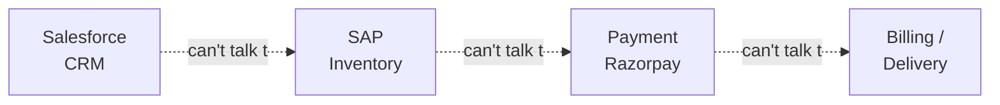
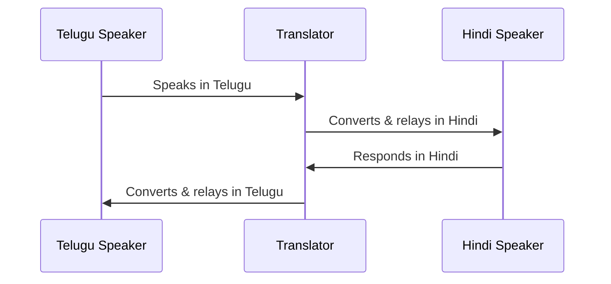
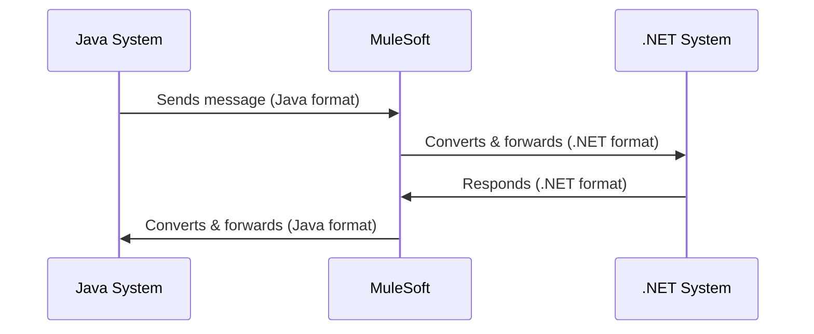
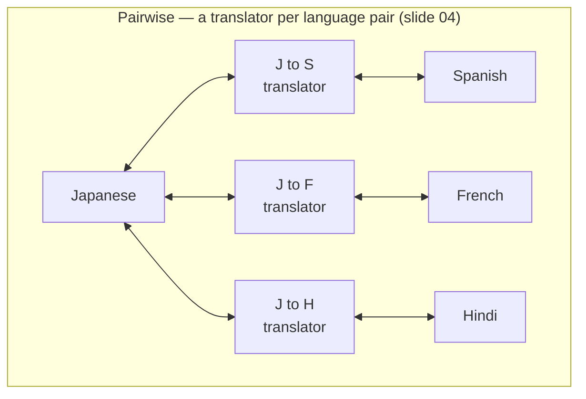
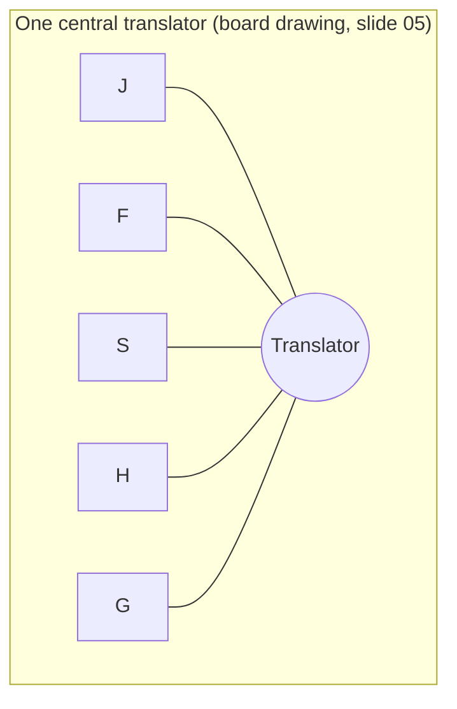
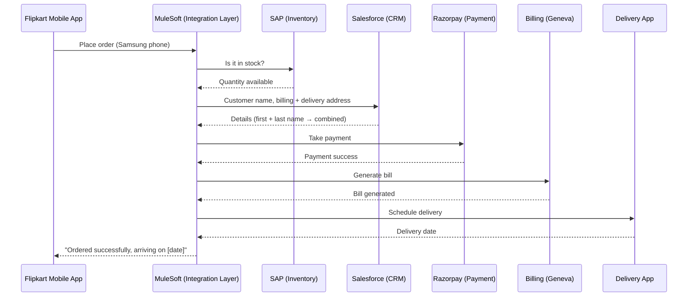
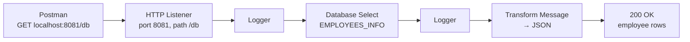

# Day 01 — Detailed Notes: What Is MuleSoft & Why Learn It

> **Watch alongside:** this is the orientation (demo) day — only one short Studio demo, but it sets up the mental models the rest of the course builds on: what "integration" means, why tools exist for it, and why MuleSoft specifically is worth the time.

> **Video-verified:** written from the cleaned transcript and the class recording (28 Oct 2024). Slide images: [slides/day01](../slides/day01/).

---

## 1. The Core Problem: Systems Don't Speak the Same Language

- Every large organization (an **enterprise** — Flipkart, Amazon, Reliance, a bank) runs on **many different systems** — Salesforce, SAP, Jira, Bitbucket, payment and delivery systems, and so on.
- Each system is "famous for" its own purpose, so an enterprise has to use several.
- They don't understand each other's "language," so they can't communicate directly.

```mermaid
flowchart LR
    A[Salesforce<br/>CRM] -.can't talk to.-> B[SAP<br/>Inventory]
    B -.can't talk to.-> C[Payment<br/>Razorpay]
    C -.can't talk to.-> D[Billing /<br/>Delivery]
```

**MuleSoft is an integration platform which integrates enterprise applications seamlessly** (the slide's definition). It lets these systems communicate and exchange data, instead of hand-writing the connection code in Java or .NET.

> 💡 **Why does speed matter so much?** The instructor's framing: "time to market." Integration that takes a week in Java/.NET might take 1–2 days in MuleSoft. Businesses that don't use such tools fall behind competitors and lose business.

---

## 2. The Translator Analogy (memorize this — it's the mental model for everything)

**Scenario:** a Telugu speaker and a Hindi speaker want to talk. Neither understands the other's language. The slide puts a "T to H translator" between them.

```mermaid
sequenceDiagram
    participant T as Telugu Speaker
    participant Tr as Translator
    participant H as Hindi Speaker

    T->>Tr: Speaks in Telugu
    Tr->>H: Converts & relays in Hindi
    H->>Tr: Responds in Hindi
    Tr->>T: Converts & relays in Telugu
```

The translator does exactly two things:
1. **Establishes communication** between two parties who otherwise couldn't talk.
2. **Facilitates the exchange of messages**, converting both ways.

**This is precisely MuleSoft's job**, between software systems instead of people:

```mermaid
sequenceDiagram
    participant J as Java System
    participant M as MuleSoft
    participant N as .NET System

    J->>M: Sends message (Java format)
    M->>N: Converts & forwards (.NET format)
    N->>M: Responds (.NET format)
    M->>J: Converts & forwards (Java format)
```

### Scaling the analogy: an international conference
- A climate conference in India; delegates from Japan, France and Spain; the Indians speak only Hindi.
- The slide's "complex example" gives the Japanese delegate **a separate translator for every pair** (J to S, J to F, J to H).
- A German delegate is also mentioned (the audio is garbled here) — more pairs again.

```mermaid
flowchart TB
    subgraph PW["Pairwise — a translator per language pair (slide 04)"]
    J1[Japanese] <--> T1[J to S<br/>translator] <--> S1[Spanish]
    J1 <--> T2[J to F<br/>translator] <--> F1[French]
    J1 <--> T3[J to H<br/>translator] <--> H1[Hindi]
    end
```

The instructor then drew **one translator in the middle**, connected to every language — "the job has become very easy":

```mermaid
flowchart TB
    subgraph HUB["One central translator (board drawing, slide 05)"]
    Hub((Translator))
    J2[J] --- Hub
    F2[F] --- Hub
    S2[S] --- Hub
    H2[H] --- Hub
    G2[G] --- Hub
    end
```

The same holds for an enterprise: connecting its many applications through one integration platform is easier. This central-hub idea returns on Day 04 as **ESB architecture**.

---

## 3. Technical Walkthrough: Placing a Flipkart Order

The concrete version of the analogy. Slide 06 shows the applications (Inventory Mgmt, CRM (Salesforce), Delivery App, Billing (Geneva), Payment (Razorpay)) around a **MuleSoft integration**: Source → IM connector → SF connector → Transformation → Enrichment → P connector → B connector → D connector.

```mermaid
sequenceDiagram
    participant App as Flipkart Mobile App
    participant Mule as MuleSoft (Integration Layer)
    participant SAP as SAP (Inventory)
    participant SF as Salesforce (CRM)
    participant Pay as Razorpay (Payment)
    participant Bill as Billing (Geneva)
    participant Ship as Delivery App

    App->>Mule: Place order (Samsung phone)
    Mule->>SAP: Is it in stock?
    SAP-->>Mule: Quantity available
    Mule->>SF: Customer name, billing + delivery address
    SF-->>Mule: Details (first + last name → combined)
    Mule->>Pay: Take payment
    Pay-->>Mule: Payment success
    Mule->>Bill: Generate bill
    Bill-->>Mule: Bill generated
    Mule->>Ship: Schedule delivery
    Ship-->>Mule: Delivery date
    Mule-->>App: "Ordered successfully, arriving on [date]"
```

Notice what MuleSoft is doing across this sequence:
- **Format conversion**: SAP doesn't understand the mobile app's request, so MuleSoft converts it; SAP's response is in SAP's format, so it is converted again for the next system.
- **Connectors**: an SAP connector and a Salesforce connector are dragged in and configured with username, password and other details.
- **Orchestration** (written on the board): stock is checked *before* payment. If it is out of stock, the customer is told immediately and is never charged.
- **Enrichment/transformation**: Salesforce returns first name "Mahesh" and last name "Reddy" separately; billing and delivery need them combined.
- A customer may have several saved addresses (Hyderabad, Vizag) — the right one is selected from the CRM.

**Why is Flipkart called an "enterprise"?** Because it depends on *many* applications (inventory, CRM, payment, billing, delivery) to complete one order. **MuleSoft integrating them is why it's called an Enterprise Application Integration (EAI) tool** ("EAI tool" is written on the slide).

**Where the name comes from:** the mule — MuleSoft handles the repetitive "donkey work"; you do the rest.

---

## 4. Common Integration Project Requirements — the 80/20 Principle

- The instructor's principle: **~80% of integration requirements repeat across projects**; ~20% are new in each.
- For the new 20% (say an SAP connector you've never used): read the documentation, build a small **POC**, then start — even seniors and leads do this.
- Nobody learns all **300+ connectors** up front.

| Category (slide 10) | Examples |
|---|---|
| REST services | Create and consume |
| SOAP services | Consume |
| File-based | File, FTP, SFTP |
| Databases | Oracle DB, MySQL DB, Microsoft SQL DB |
| Messaging | ActiveMQ, Anypoint MQ, VM, Kafka |
| Other systems | Salesforce, Jira, AWS S3, SAP |

- A student asked about publish/subscribe: it is covered with ActiveMQ.
- The student's example (Salesforce order activated → MuleSoft subscribes → fetches order → SAP) depends on the requirement and the architect; real-time sync is usually asynchronous.

---

## 5. Why MuleSoft Specifically? (not just "an" integration tool)

| Reason (slides 11–12) | Detail |
|---|---|
| **Industry leader per the Gartner report** | The yearly report rates vendors on business, customers, complex/simple projects, cloud/on-prem support; MuleSoft named leader "at least 9 to 10 times." |
| **Salesforce acquired it (Mar 2018, 6.5 billion USD / 40,000+ crores)** | Salesforce (~28% of CRM, per the instructor) needs to integrate with every other enterprise app, and pushes MuleSoft to its customers. |
| **Ahead of competitors** | Slide names TIBCO BW, Boomi, IIB, Apache Camel. Edge: 300+ ready connectors; quick to adopt trends such as AI. |
| **Full API lifecycle management** | Design → Implement → Secure → Deploy → Monitor, each with a MuleSoft sub-tool; others need third-party tools for some steps (more cost, another tool to learn). |
| **Reasonable pricing for companies** | Compared with other tools. |
| **Cloud and on-premise solution** | Banks/financial institutions keep their own servers; MuleSoft supports both. |
| **Learn faster and easier** | Salesforce: 4–6 months. MuleSoft courses: 35–40 sessions (this one ~55). ~80% drag-and-drop. |
| **Jobs in demand, salaries higher** | Instructor's network: ~₹10–15 lakh at 3–5 years (an observation, not a guarantee). |

---

## 6. The Demo: Database → JSON in Minutes

To show "learn faster and easier," the instructor built a small app in Anypoint Studio (the full build is on Day 05).

```mermaid
flowchart LR
    P["Postman<br/>GET localhost:8081/db"] --> L[HTTP Listener<br/>port 8081, path /db]
    L --> G1[Logger]
    G1 --> S["Database Select<br/>EMPLOYEES_INFO"]
    S --> G2[Logger]
    G2 --> T[Transform Message<br/>→ JSON]
    T --> R["200 OK<br/>employee rows"]
```

- New project **mule-db-demo**; Listener config on port **8081**, saved with Ctrl+S.
- **Add Modules → Database**, dragged into the project — the Database connector.
- **Database Config** (MySQL connection): **Configure → Add recommended libraries** adds the JDBC driver; then host (localhost), port, user, password, database.
- **Test Connection** → successful (the database must be running).
- **Loggers** around the Select — for debugging in real-time/production.
- **Select** on the `EMPLOYEES_INFO` table (the query was checked in MySQL Workbench).
- **Transform Message** converts the result to JSON with a small script.
- Console shows **DEPLOYED**; Postman `GET http://localhost:8081/db` returns the employee data.
- The point: the same DB connection, Salesforce connection and transformation would be hundreds of lines in Java/.NET.

---

## 7. Career Framing (useful context, not just trivia)

- You don't need Java to work in MuleSoft — it's mostly drag-and-drop; **DataWeave** (a transformation language, taught from scratch) covers the 10–25% of scripting.
- Java or Python **is an advantage** (bigger packages), not a requirement. In the instructor's projects a Java need came up once, handled by another team.
- **Career gaps** are broadly accepted outside a few strict companies (TCS was mentioned, ~2 years) — focus on the other 80%.
- **Roles:** of 100 jobs, ~3–4 admin and ~95 development (of which ~5–10 support). The course focuses on the **developer** track — more openings, higher salary.
- **Testing → development** is a good move; testing and corporate experience gives an edge.
- **Freshers / non-IT:** opportunities exist, fewer than for experienced people, and it takes time.

---

## 8. Trainer, Training Approach and Materials

- **Trainer (slide 08):** Mahesh Reddy — 7+ years in IT (close to 8), trained 100+ students, 200+ interviews taken, cleared **MCD Level 1, MCD Level 2 and MCIA** (3 of the 4 major certifications).
- **Approach (slide 09):** presentation + whiteboard; **LPP model — Learn, Practice, Practice**; trainer 33.33%, your practice with assignments 66.66%.
- **Schedule:** 7:30–9:00 am, Monday–Thursday (drawn over the slide's "Mon to Fri"); recordings provided.
- **Materials:** 10–12 hours of recorded interview-prep content; Q&A PDFs (one question, one short answer); a ~1-hour resume session; mock interviews with feedback (come prepared).
- Interview documents are shared after the midway point, once the concepts are learned.
- **Certification:** the course prepares you to clear MCD Level 1.

---

## Quick Recap

- **Integration** = connecting systems that don't natively understand each other. **MuleSoft** does it like a translator: establish communication + convert/exchange messages.
- One central integration layer beats pairwise connections as systems grow — this resurfaces as **ESB** on Day 4.
- The Flipkart order shows connectors, transformation, enrichment and **orchestration** (stock before payment) — hence **EAI tool**.
- MuleSoft's edge: Gartner leadership, Salesforce's 2018 acquisition, 300+ connectors, full API lifecycle, pricing, cloud + on-prem, and a fast learning curve.
- The demo — Listener → Logger → Select → Logger → Transform Message → JSON — took minutes.
