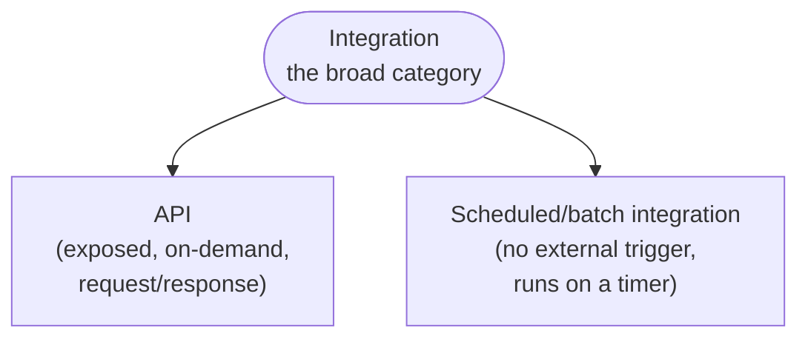
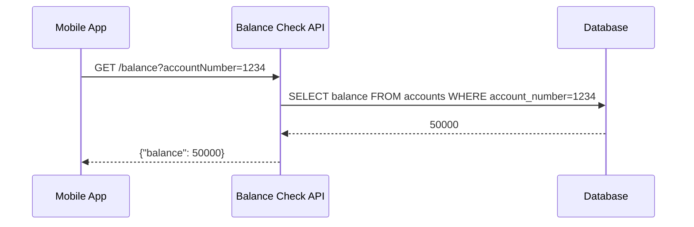
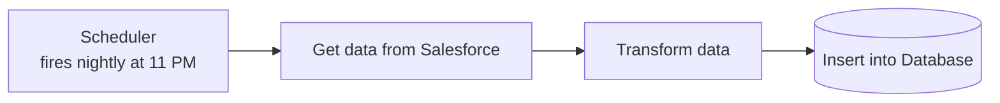
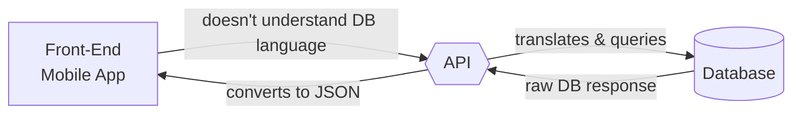
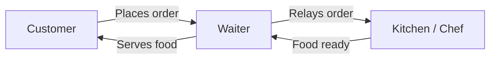
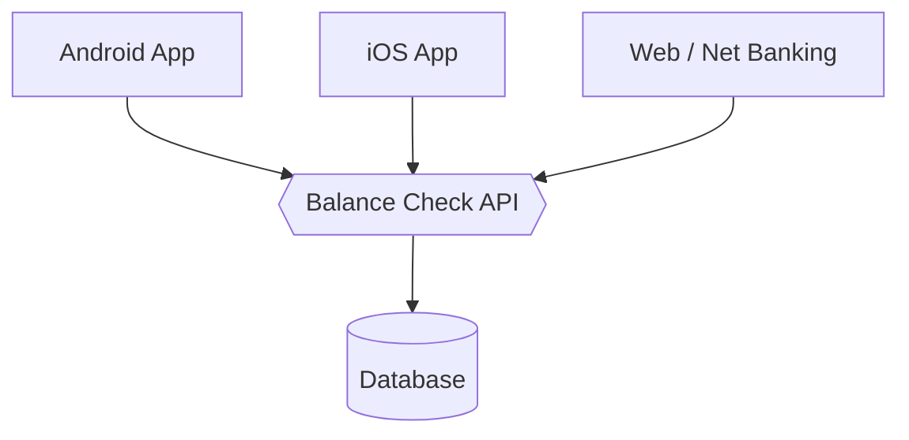
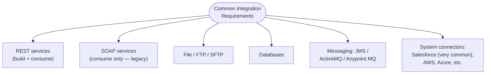
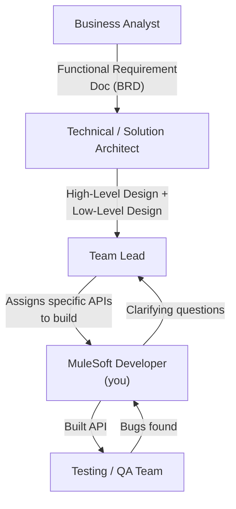

# Day 02 — Detailed Notes: Prerequisites, API vs. Integration, the Developer's Role

> **Watch alongside:** this day draws the line between two words that get used almost interchangeably in casual conversation — "API" and "integration" — and then zooms out to show where a MuleSoft developer actually sits inside a real project team.

---

## 1. API vs. Integration — the Precise Relationship

- **Integration** is the umbrella term: *any* program connecting two or more systems to move/transform data.
- **API** is a specific *shape* of integration: it's exposed and waits to be called on-demand, returning a response.
- The other common shape is a **scheduled job**: nothing calls it — it just runs on a timer (e.g. nightly) and does its work silently in the background.

### Example A — a REST API (on-demand)

Someone actively asks for something, right now, and gets an immediate answer.

### Example B — a scheduled integration (no on-demand trigger)

Nobody is waiting on a response — it just quietly keeps two systems in sync on a schedule. **This is still "integration," but it is not an API.**

> 🧠 **Interview framing:** *"An API is a kind of integration, but not all integration is an API."* Both are built the same way in MuleSoft (mostly drag-and-drop, with DataWeave for the transformation logic) — the difference is purely about **whether something is exposed to be called on-demand, or just runs autonomously**.

---

## 2. API — The Precise Definition

**API = Application Programming Interface** — literally a piece of code (mostly auto-generated XML, since MuleSoft is low-code) that lets two or more systems communicate and exchange data.

### Why can't front-end and back-end just talk directly?
1. **They don't speak the same language** — front-end (React/JavaScript) and back-end (often Java-based databases/services) use different data shapes and protocols.
2. **Security** — exposing a raw database directly to the internet is a massive risk (a hacker could query it directly). The API acts as a **controlled, validated layer** in between.

### The Restaurant Analogy (a second, equally useful mental model)

- **Customer** = front-end (mobile/web app)
- **Kitchen** = back-end (database/systems)
- **Waiter** = API — mediates, neither side talks to the other directly.

This maps onto *any* front-end: mobile app, iOS app, or a desktop net-banking site can all hit the **same** API, which is language-independent — it accepts a request in whatever format its design specifies and returns a response in whatever format its design specifies, regardless of which client called it.

> 💡 **Why this matters:** without the API layer, you'd need a separate direct-to-database integration built for *each* client type (Android-specific, iOS-specific, web-specific) — tripling the work. One well-designed API serves all of them.

---

## 3. Common Integration Project Requirements (the "80% rule")

The instructor's repeated framing across the whole course: **~80% of real integration projects use the same handful of building blocks.** Master these deeply instead of spreading thin across all 300+ connectors:

- **REST**: built new, all the time — the dominant API style today.
- **SOAP**: almost never *built* new — mostly just *consumed*, because it's what older/legacy systems still expose.
- **Files/FTP/SFTP**: extremely common — moving a file from one server to another, transforming it along the way.
- **Messaging (JMS-family)**: for decoupled, asynchronous communication — a producer publishes a message without needing the consumer to be immediately available.
- **Salesforce**: singled out specifically because it's a very frequent interview topic, given MuleSoft's ownership relationship with Salesforce.

> 🧠 **Practical implication for a new connector you've never used:** the instructor's own approach — read the official documentation, run a small POC (proof of concept), and only then start real implementation. Nobody, even with years of experience, has touched more than 10-15 connectors in depth — the skill is *learning a new one quickly*, not having memorized all 300+.

---

## 4. Where a MuleSoft Developer Sits in a Real Project

**A developer's actual day-to-day workflow:**
1. Receive an assigned API (e.g. from a lead who split a 150-API project across several developers).
2. Read the **High-Level Design (HLD)**, **Low-Level Design (LLD)**, and **BRD (Business Requirements Document)** to understand exactly what request/response shape is expected.
3. Ask clarifying questions to the lead/architect/BA if anything is ambiguous — **do not guess** on request/response shape, security, or field requirements.
4. **Design** the API (RAML) if not already designed, or use an already-designed spec.
5. **Implement** it in Anypoint Studio — this includes writing MUnit tests (unit testing is explicitly the developer's own responsibility, not a separate team's).
6. **Deploy** and support the QA/testing team as they validate it, fixing any bugs raised.
7. Participate in daily Agile **scrum calls** — status, blockers — communication is treated as equally important to raw technical skill.

**Task estimation** (e.g. "easy API = 3-5 days, medium = 5-7 days, complex = 7-10+ days") is typically a **lead/architect** responsibility, not something a developer calculates alone — though a developer's input on actual implementation difficulty feeds into that estimate.

---

## Quick Recap

- **API ⊂ Integration**: every API is an integration, but scheduled/batch jobs are integrations too, without being APIs.
- The **front-end/back-end/API** and **restaurant** analogies both describe the same core idea: a mediator layer that translates and secures communication between parties who can't (or shouldn't) talk directly.
- Focus learning on the **80% common requirements** (REST, files, DB, messaging, Salesforce) rather than trying to cover all 300+ connectors — depth over breadth.
- A developer's real job is downstream of BA/Architect/Lead decisions: read the design docs, clarify, implement, unit-test, support QA — not to independently invent requirements.
