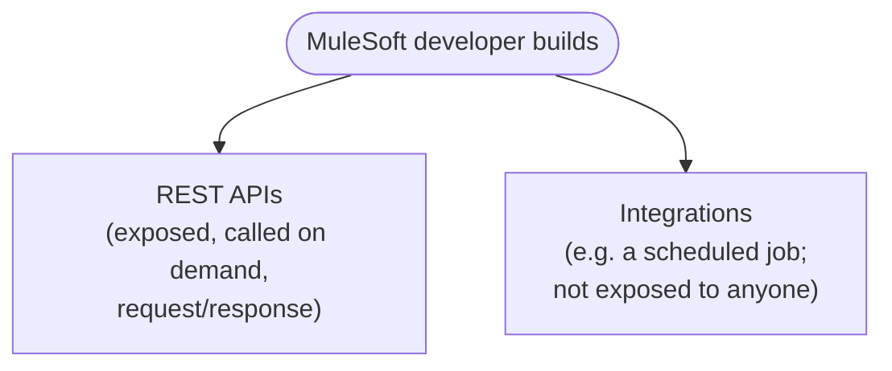
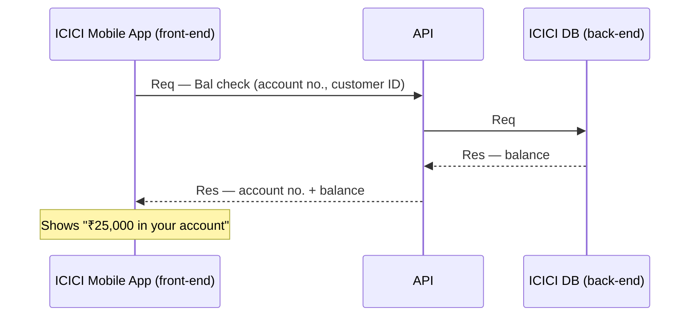
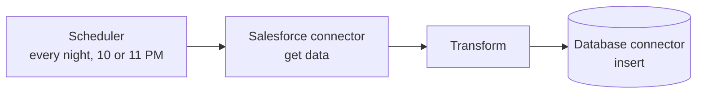
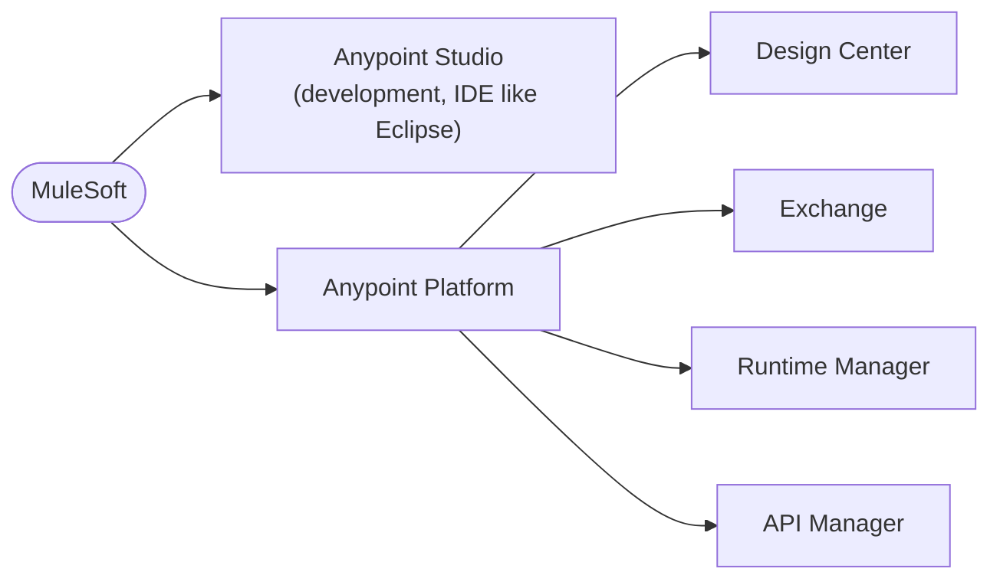
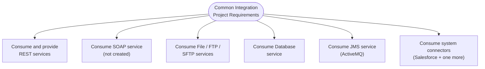
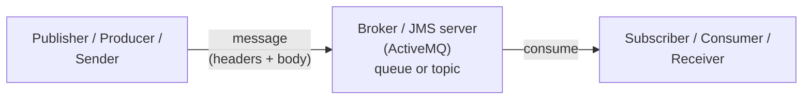
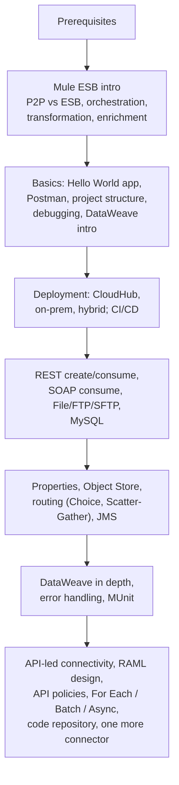
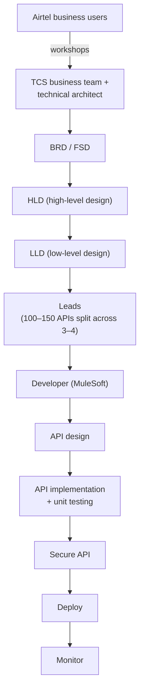

# Day 02 — Detailed Notes: Prerequisites, API vs. Integration, the Developer's Role

> **Watch alongside:** this day draws the line between two words that get used almost interchangeably — "API" and "integration" — then walks the whole syllabus and zooms out to show where a MuleSoft developer sits inside a real project team.

> **Video-verified:** written from the cleaned transcript and the class recording (29 Oct 2024). Slide images: [slides/day02](../slides/day02/).

---

## 1. API vs. Integration — the Precise Relationship

```mermaid
flowchart TB
    M([MuleSoft developer builds]) --> B["REST APIs<br/>(exposed, called on demand,<br/>request/response)"]
    M --> C["Integrations<br/>(e.g. a scheduled job;<br/>not exposed to anyone)"]
```

- **Integration** is the broad term: connecting two or more systems to move/transform data. "The API is also part of integration."
- **API** is the kind that is exposed: a front-end sends a request and gets a response.
- The other kind is a **scheduled job**: nothing calls it — it runs every night and does its work in the background.
- Both are built the same way in MuleSoft: mostly drag-and-drop, with 10–20% of the time spent writing transformations.

### Example A — an API: ICICI balance check (board drawing)

```mermaid
sequenceDiagram
    participant MA as ICICI Mobile App (front-end)
    participant API as API
    participant DB as ICICI DB (back-end)

    MA->>API: Req — Bal check (account no., customer ID)
    API->>DB: Req
    DB-->>API: Res — balance
    API-->>MA: Res — account no. + balance
    Note over MA: Shows "₹25,000 in your account"
```

### Why not connect the front-end straight to the database?
1. **Different technologies** — the front-end is built with React/JavaScript, the back-end with something else (e.g., Java); they can't communicate with each other.
2. **Security** — hackers could hit the database directly and steal the data. A layer in between is very important.

### Example B — an integration: nightly Salesforce → database (board drawing: S → S → T → D)

```mermaid
flowchart LR
    S[Scheduler<br/>every night, 10 or 11 PM] --> SF[Salesforce connector<br/>get data]
    SF --> T[Transform]
    T --> DB[(Database connector<br/>insert)]
```
Nobody calls it and nobody waits for a response — "a regular job is going on." **It is an integration, but not an API.**

> 🧠 **Interview framing:** *"An API is a kind of integration, but not all integration is an API."* The difference is whether it is exposed to be called on demand, or just runs on its own.

---

## 2. Prerequisites, Tools and Practice Setup

**Prerequisites (slide), taught from scratch over 3–4 sessions:** monolithic applications · microservices architecture · APIs, web services, REST and SOAP · API life cycle · different environments in real time (dev, testing, pre-prod, prod, DR) · JSON, CSV, XML · HTTP (requests, success/error responses).

```mermaid
flowchart LR
    MS([MuleSoft]) --> AS["Anypoint Studio<br/>(development, IDE like Eclipse)"]
    MS --> AP[Anypoint Platform]
    AP --> DC[Design Center]
    AP --> EX[Exchange]
    AP --> RM[Runtime Manager]
    AP --> AM[API Manager]
```

| Software to practise (slide) | Use |
|---|---|
| Anypoint Studio | IDE similar to Eclipse; development has lifetime access |
| Active Anypoint Platform account | Lifecycle management; if it expires, create a new account with another email |
| Mule Runtime | Practising on-premises |
| Advanced REST Client (Postman) | Testing APIs |
| Notepad++ | Editing |
| FTP server | File/FTP sessions |
| MySQL Database + Workbench | Database sessions |
| ActiveMQ server | JMS sessions |

- **System configuration (slide):** 8 GB RAM or above (16 GB ideal), Windows 10 or above, 2 GHz processor.
- If Studio runs slowly, fix the configuration once — a slow machine slows your practice.
- No charges are expected for practice.

---

## 3. Common Integration Project Requirements (the "80% rule")

The instructor's repeated framing: **~80% of projects use the same handful of requirements** — focus on these 5–6 to cover 75–80% of a project.

```mermaid
flowchart TB
    Req([Common Integration<br/>Project Requirements]) --> R1["Consume and provide<br/>REST services"]
    Req --> R2["Consume SOAP service<br/>(not created)"]
    Req --> R3["Consume File / FTP /<br/>SFTP services"]
    Req --> R4["Consume Database<br/>service"]
    Req --> R5["Consume JMS service<br/>(ActiveMQ)"]
    Req --> R6["Consume system connectors<br/>(Salesforce + one more)"]
```

- **REST**: what consumers ask for most — both provided and consumed.
- **SOAP**: existing systems already expose it; we only consume it. Rare, but asked in interviews.
- **Files/FTP/SFTP**: moving a file from an FTP/SFTP server to another system, transforming it. An FTP server will be installed.
- **JMS**: queuing services with the ActiveMQ broker — decoupled, asynchronous.
- **Salesforce**: the focus connector because it's asked a lot in interviews; one more (maybe AWS) will be added for this batch.

### JMS preview (drawings shown in class; the audio is lost)

```mermaid
flowchart LR
    P["Publisher / Producer /<br/>Sender"] -->|"message<br/>(headers + body)"| B["Broker / JMS server<br/>(ActiveMQ)<br/>queue or topic"]
    B -->|consume| C["Subscriber / Consumer /<br/>Receiver"]
```
- **Queue**: a pipeline of messages, one-to-one. **Topic**: one message (e.g., a new employee) goes to finance/payroll, HR, marketing.
- Operations: publish, consume, On New Message, publish-consume (synchronous).
- Acknowledgement modes: auto, manual, immediate, dups_ok; DLQ.
- Brokers: ActiveMQ, RabbitMQ, IBM MQ; Anypoint MQ needs an extra licence.

> 🧠 **A connector you've never used:** the instructor's MongoDB example — read the official documentation, tell the team you'll do a POC, spend a few hours, then implement. In his whole career he used only 10–15 of the 300+ connectors; even Salesforce's ~100 operations come down to 3–4 used majorly.

---

## 4. The Course Content in One Picture

```mermaid
flowchart TB
    Pre[Prerequisites] --> M1["Mule ESB intro<br/>P2P vs ESB, orchestration,<br/>transformation, enrichment"]
    M1 --> M2["Basics: Hello World app,<br/>Postman, project structure,<br/>debugging, DataWeave intro"]
    M2 --> M3["Deployment: CloudHub,<br/>on-prem, hybrid; CI/CD"]
    M3 --> M4["REST create/consume,<br/>SOAP consume, File/FTP/SFTP,<br/>MySQL"]
    M4 --> M5["Properties, Object Store,<br/>routing (Choice, Scatter-Gather), JMS"]
    M5 --> M6["DataWeave in depth,<br/>error handling, MUnit"]
    M6 --> M7["API-led connectivity, RAML design,<br/>API policies, For Each / Batch / Async,<br/>code repository, one more connector"]
```

- **Properties**: each environment (Dev, testing, UAT, prod, pre-prod, DR) has its own servers — e.g., its own database. "Very, very important."
- **Object Store**: database = permanent storage; Object Store = temporary storage.
- **MUnit**: built with the recording option or manually; **unit testing is the developer's job**.
- **RAML design** is the first lifecycle step — like an architect's blueprint for a house — done in Design Center.
- **Policies**: Basic Auth, Client ID Enforcement, OAuth, Rate Limiting, Spike Control + 2–3 more (API Manager's policy list was shown).
- **Code repository**: Studio generates XML in the background; Bitbucket/GitHub/GitLab keep it safe if Studio crashes.
- **Certification**: MCD Level 1 (about 200 USD) is the developer target; MCIA/MCPA are architect level.

---

## 5. Where a MuleSoft Developer Sits in a Real Project

The board example: **TCS** (service company) delivering a MuleSoft project for **Airtel** (client).

```mermaid
flowchart TB
    U["Airtel business users"] -->|workshops| BT["TCS business team +<br/>technical architect"]
    BT --> BRD["BRD / FSD"]
    BRD --> HLD["HLD (high-level design)"]
    HLD --> LLD["LLD (low-level design)"]
    LLD --> L["Leads<br/>(100–150 APIs split across 3–4)"]
    L --> D["Developer (MuleSoft)"]
    D --> S1[API design] --> S2["API implementation<br/>+ unit testing"] --> S3[Secure API] --> S4[Deploy] --> S5[Monitor]
```

**A developer's actual workflow:**
1. Receive your slice from the lead (the drawing: 5 developers + 1 tester; 10 APIs, ~2 each).
2. Read the **BRD**, **HLD** and **LLD** (the role slide also names the **TDD — Technical Design Document**) for the request, response and error response.
3. Ask the **lead/architect** about technical doubts and the **business analyst** about business ones.
4. **Design → implement (with MUnit unit tests) → secure with policies → deploy → monitor.**
5. Fix bugs raised by the testing/BA teams; deploy to the environments (Dev → QA → UAT → Prod) through pipelines.
6. Join the daily Agile **scrum calls** — status, blockers. Communication matters as much as technical skill.

- **Dependencies:** if your API uses Salesforce and a database, you depend on those teams for their details.
- **Task estimation** (working days): easy 3–5, medium 5–7, complex 7–10 (or 10–12). The **technical architect and lead** calculate it; it depends on the organisation.
- **Front-end:** not your job — **Postman** stands in for it while you test your API.
- **Why the developer role is easier:** the documents are already prepared; you follow them and ask the right questions.

---

## Quick Recap

- MuleSoft developers build **REST APIs and integrations**; an API is the exposed, request/response kind, while a nightly scheduler job is integration but not an API.
- The API layer exists because the front-end and back-end use **different technologies**, and for **security**.
- Focus on the **80% common requirements** (REST, SOAP consume, files, DB, JMS, Salesforce) — depth over breadth.
- Practice set-up: Studio, a platform account, Mule Runtime, Postman, Notepad++, an FTP server, MySQL, ActiveMQ; 8 GB+ RAM.
- A developer's job is downstream of BA/architect/lead work: read the design docs, clarify, implement with unit tests, secure, deploy, monitor — and practise every demo many times.
