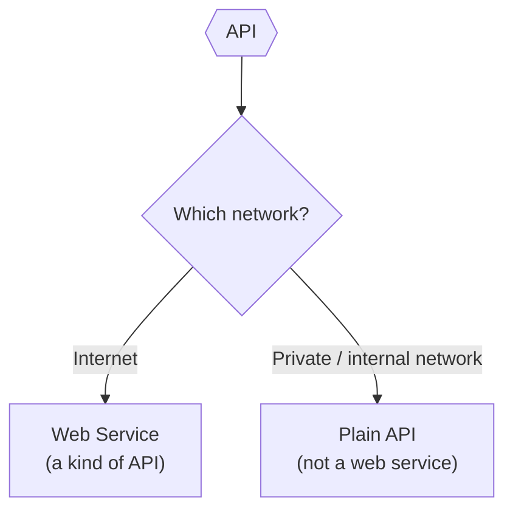
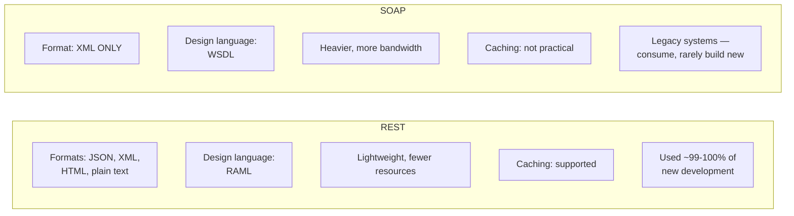
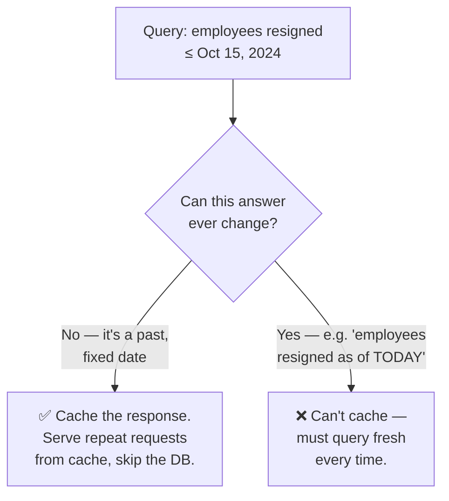
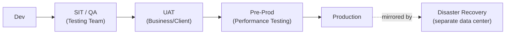
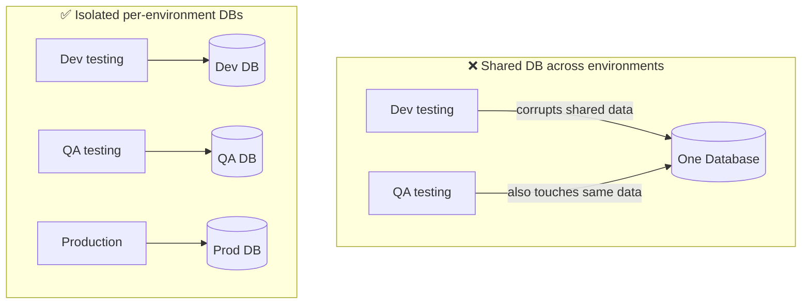

# Day 03 — Detailed Notes: APIs, Web Services, REST vs SOAP, Environments

> **Watch alongside:** two genuinely high-value, frequently-interview-tested distinctions live in this session — the API/web-service relationship, and REST vs. SOAP — plus a practical tour of why real companies run 3-6 separate environments instead of just "dev and prod."

---

## 1. API vs. Web Service — The One-Sentence Rule

> **All web services are APIs. Not all APIs are web services.**

The deciding factor is purely **which network carries the request**:



- Think of the network as a **vehicle** — you need *some* way to physically carry the request from caller to API. If that vehicle is the public internet, you've built a web service. If it's a private/internal enterprise network, it's "just" an API, not exposed publicly.
- **Practical consequence:** an API that's *only* ever called from within a company's own internal network never technically needs to be internet-facing — but the moment any external caller (a partner, a public mobile app) needs to reach it, it becomes a web service and needs internet-facing protocols (HTTP/HTTPS) and appropriate security.

---

## 2. The Restaurant Analogy, Extended

Recall from Day 02: Customer → Waiter (API) → Kitchen. Multiple different "customers" (Android app, iOS app, web browser) can all place the *same kind* of order through the *same* waiter — the waiter doesn't care what language/device the customer used, only that the order eventually gets to the kitchen and a response comes back.

```mermaid
sequenceDiagram
    participant And as Android App
    participant iOS as iOS App
    participant Web as Web Browser
    participant API as Balance Check API
    participant DB as Database

    And->>API: Check balance (account 1234)
    API->>DB: Query
    DB-->>API: 25000
    API-->>And: {"balance": 25000}

    iOS->>API: Check balance (account 1234)
    API->>DB: Query
    DB-->>API: 25000
    API-->>iOS: {"balance": 25000}
```

This is the payoff of building an API in the first place: **one** implementation serves **every** client type, regardless of the language each client itself is written in.

---

## 3. REST vs. SOAP — Full Comparison



### Why JSON usually wins over XML (concrete size comparison)
The same data, e.g. an account number:
```json
{"accountNumber": "12345"}
```
vs. XML:
```xml
<accountNumber>12345</accountNumber>
```
XML's opening/closing tags make the *same information* physically larger on the wire. At scale (a document with 10,000 words vs. 1,00,000 words), this size difference translates directly into slower transfer and processing — which is why REST/JSON, being lighter, is the default choice for anything performance-sensitive.

### Caching — a concrete worked example
**Scenario:** "Get all employees who resigned on or before October 15th, 2024."



- Since the cutoff date (Oct 15) is in the past and fixed, the answer to this exact query **can never change** — running it against the database 20 times a day is wasted work. Cache it once, serve the cached copy repeatedly.
- **REST supports this pattern well; SOAP's architecture makes it largely impractical** — one more reason REST dominates modern API design.
- This same *"is the data actually going to change?"* question resurfaces later in the course as the motivating idea behind **Object Store caching** (mentioned as a teaser on Day 02, covered in later sessions) — same underlying principle, different mechanism.

### When SOAP still shows up
- **Legacy systems** built before REST became dominant often still expose only SOAP endpoints.
- **Very high-security scenarios** — SOAP's stricter, more rigid contract (WSDL) can suit environments demanding very tight guarantees.
- **Practical implication for this course:** you'll learn to **consume** SOAP services (since real projects sometimes need to call an existing legacy SOAP service) but will almost never be asked to **build** a brand-new one.

---

## 4. Real-World Environments — Why So Many?



| Environment | Who uses it | What they're checking |
|---|---|---|
| **Dev** | Developer | Does my code even work at a basic functional level? |
| **SIT / QA / Testing** | Dedicated testers | Rigorous edge-case testing — wrong data types, missing fields, unexpected error paths — with its *own* isolated database/Salesforce/etc. so it never interferes with other teams |
| **UAT** | Business team / actual client | Does this genuinely satisfy the *business* requirement, not just "does it technically run"? Sign-off happens here. |
| **Pre-Prod (Performance)** | Dedicated performance testers (tools: JMeter, LoadRunner) | Can the system handle expected real-world load (e.g. X requests/hour)? Drives decisions on scaling/memory/CPU sizing. |
| **Production** | Everyone (real users) | The live system. Deployments happen in **non-business hours**, by a dedicated deployment team, with formal approvals. |
| **Disaster Recovery (DR)** | Nobody, until disaster strikes | A geographically separate, synced replica — if the primary data center goes down (e.g. due to a regional outage), traffic fails over here instead of the business losing days of revenue. |

### Why isolate QA's database from Dev's database from Prod's database?

If Dev and QA shared one database, a developer's rough local testing could corrupt data the QA team is relying on for a completely unrelated test case — hence the discipline of giving each environment (that a company can afford to run) its own dedicated backend systems.

### Why not every company has all 6?
It's purely a **cost/requirement trade-off**. Running 6 fully separate environments (each with its own app servers, databases, Salesforce sandboxes, etc.) is expensive. Most real companies run a pragmatic subset — commonly **Dev → Test → Prod** — while highly regulated or massive-scale organizations (banks, in particular, per the Disaster Recovery example) invest in the full set including DR, because the cost of *not* having it (extended outage → massive customer/business loss) is far higher than the infrastructure cost.

---

## Quick Recap

- **API vs. web service** = purely a network question (internet → web service; private network → plain API). All web services are APIs; not all APIs are web services.
- **REST** (JSON/XML/HTML, RAML-designed, lightweight, cacheable) is the default for ~99% of new development. **SOAP** (XML-only, WSDL-designed, heavier, not practically cacheable) is legacy-consumption-only territory.
- **Caching only works when the answer genuinely can't change** — a query with a fixed, past cutoff date is a textbook example; the same instinct resurfaces later as Object Store caching.
- Environments (Dev/SIT/UAT/Pre-Prod/Prod/DR) exist to isolate development, rigorous testing, business validation, performance validation, live traffic, and disaster resilience from each other — each ideally with its own dedicated backend systems, though the exact number a company runs depends on budget and regulatory/scale requirements.
