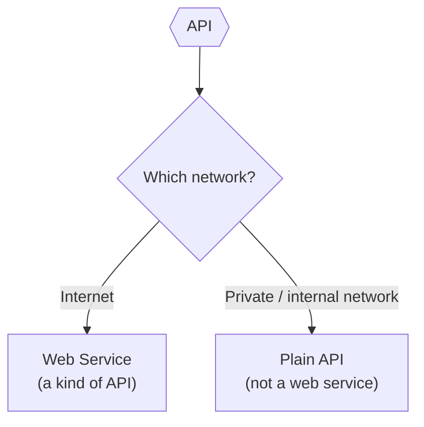
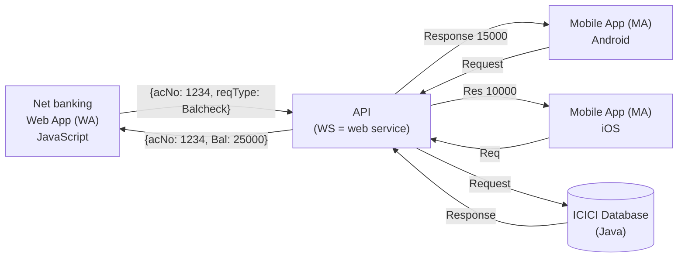
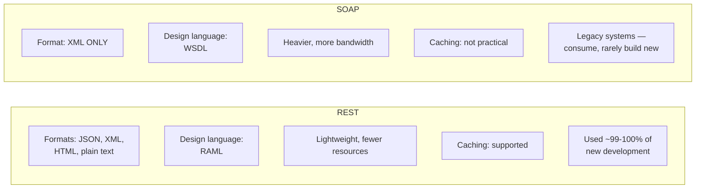
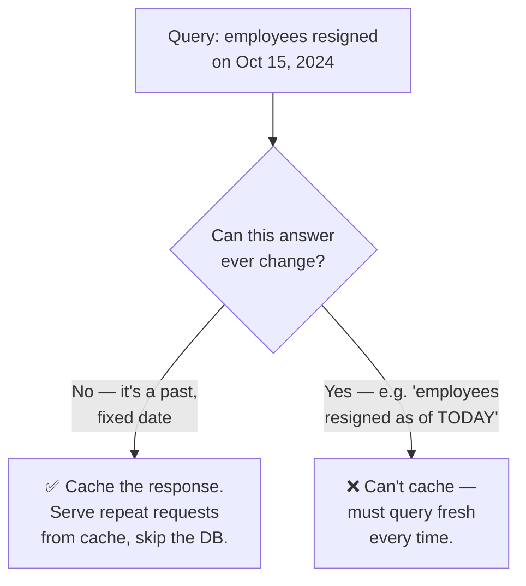
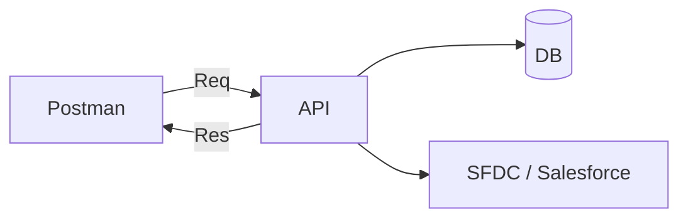
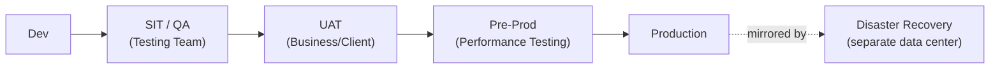
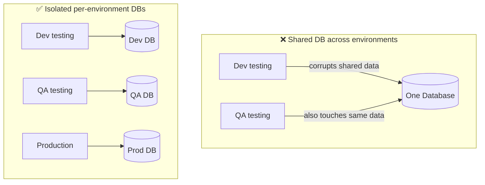

# Day 03 — Detailed Notes: APIs, Web Services, REST vs SOAP, Environments

> **Watch alongside:** two genuinely high-value, frequently-interview-tested distinctions live in this session — the API/web-service relationship, and REST vs. SOAP — plus a practical tour of why real companies run 3-6 separate environments instead of just "dev and prod."

> **Video-verified:** slide text and the values in the instructor's on-screen drawings below were checked against the class recording (14 slides, recorded 30 Oct 2024).

---

## 1. API vs. Web Service — The One-Sentence Rule

> **All web services are APIs. Not all APIs are web services.**

The slide definitions, word for word:

| Term | Slide definition |
|---|---|
| **API** | "API stands for Application Programming Interface. API is a piece of code that helps two or more different systems to communicate and exchange data with each other." |
| **Web Service** | "Web Service is a piece of code that helps two different systems to communicate and exchange data with each other **over internet**." Types: **REST** and **SOAP**. |

The deciding factor is purely **which network carries the request**:


```mermaid
flowchart TB
    API{{API}} --> Q{Which network?}
    Q -->|Internet| WS["Web Service<br/>(a kind of API)"]
    Q -->|Private / internal network| PA["Plain API<br/>(not a web service)"]
```

- Think of the network as a **vehicle** — you need *some* way to physically carry the request from caller to API.
  - If that vehicle is the public internet, you've built a web service.
  - If it's a private/internal enterprise network, it's "just" an API, not exposed publicly.
- **Practical consequence:** an API that's *only* ever called from within a company's own internal network never technically needs to be internet-facing — but the moment any external caller (a partner, a public mobile app) needs to reach it, it becomes a web service and needs internet-facing protocols (HTTP/HTTPS) and appropriate security.

---

## 2. The Restaurant Analogy, Extended

Recall from Day 02: Customer → Waiter (API) → Kitchen. Multiple different "customers" (Android app, iOS app, web browser) can all place the *same kind* of order through the *same* waiter — the waiter doesn't care what language/device the customer used, only that the order eventually gets to the kitchen and a response comes back.

The instructor drew this as **"Technical Example — ICICI Bank"**. These are the exact values on screen:


```mermaid
flowchart LR
    WA["Net banking<br/>Web App (WA)<br/>JavaScript"] -->|"{acNo: 1234, reqType: Balcheck}"| API
    API -->|"{acNo: 1234, Bal: 25000}"| WA
    AND["Mobile App (MA)<br/>Android"] -->|Request| API
    API -->|"Response 15000"| AND
    IOS["Mobile App (MA)<br/>iOS"] -->|Req| API
    API -->|"Res 10000"| IOS
    API["API<br/>(WS = web service)"] -->|Request| DB[("ICICI Database<br/>(Java)")]
    DB -->|Response| API
```

- **Request (JSON):** `{"acNo": 1234, "reqType": "Balcheck"}`
- **Response (JSON):** `{"acNo": 1234, "Bal": 25000}`
- The other two balances (15,000 and 10,000) just stand for other customers using different apps. The point is that the same API answers all of them.
- Each front-end is built in a different technology (JavaScript web app, Android, iOS), and so is the back-end (Java). Only the API in the middle has to understand both sides.
- An earlier, simpler version of this drawing used `{reqType: Balance check, AcNo: 123}` → `{Balance: 50000, AcNo: 123}` and was labelled **"All web services are APIs / All APIs are not web services"**.

This is the payoff of building an API in the first place: **one** implementation serves **every** client type, regardless of the language each client itself is written in.

---

## 3. REST vs. SOAP — Full Comparison

### What the slides say

| REST Web Service (slides 7–8) | SOAP Web Service (slides 9–10) |
|---|---|
| REST stands for **Representational State Transfer** | SOAP stands for **Simple Object Access Protocol** |
| REST follows **HTTP** transfer protocol | SOAP follows **HTTP, SMTP, and UDP** transfer protocols |
| REST accepts **JSON, XML, HTML, Plain Text** as message format | SOAP accepts **only XML** as a message format |
| Design REST using **RAML** – Restful API Modeling Language | Design SOAP service using **WSDL** – Web Service Description Language |
| RAML contains Resource details, Request & Response schema, Examples, Security Schemes, Error responses | WSDL contains Resource details, Request & Response schema, Examples, Security Schemes |
| REST requires **fewer resources** | SOAP requires **more bandwidth** |
| **Cache can be achieved** with REST | **Cache is not possible** with SOAP |
| We develop REST services **majority of the times** | We develop SOAP services **very rarely** |

**Slide 11 — REST vs SOAP (REST's advantages):** less complex and easy to use · easy to learn · light weight · easily scalable · caching possible · accepts multiple message formats — JSON, XML, plain text, etc.

On the SOAP slide the instructor sketched: request in **XML** → SOAP service → response in **XML**.


```mermaid
flowchart LR
    subgraph REST
    R1[Formats: JSON, XML,<br/>HTML, plain text]
    R2["Design language:<br/>RAML"]
    R3[Lightweight, fewer resources]
    R4[Caching: supported]
    R5["Used ~99-100% of<br/>new development"]
    end
    subgraph SOAP
    S1[Format: XML ONLY]
    S2["Design language:<br/>WSDL"]
    S3[Heavier, more bandwidth]
    S4[Caching: not practical]
    S5["Legacy systems —<br/>consume, rarely build new"]
    end
```

### Why JSON usually wins over XML (concrete size comparison)
The instructor wrote the same request both ways on the REST slide, labelling the JSON **"Light weight"** and the XML **"Heavy"**:
```json
{
  "acNo": "12345",
  "reqType": "balanceCheck"
}
```
vs. XML:
```xml
<custData>
  <acNo>12345</acNo>
  <reqType>balancecheck</reqType>
</custData>
```
XML's opening/closing tags make the *same information* physically larger on the wire. At scale (a document with 10,000 words vs. 1,00,000 words), this size difference translates directly into slower transfer and processing — which is why REST/JSON, being lighter, is the default choice for anything performance-sensitive.

### Caching — a concrete worked example
**Scenario:**
- "Get all employees who resigned **on** October 15th, 2024." The class query was `SELECT * FROM employees WHERE resignation date = 15 Oct`.
- It returned 5 employees (105, 106, 108, 109, 112), and the same request came 20 times a day.
- The year is spoken as "2004" in the audio, but the recording is dated 30 Oct 2024, which confirms 2024.


```mermaid
flowchart TB
    Q["Query: employees resigned<br/>on Oct 15, 2024"] --> A{"Can this answer<br/>ever change?"}
    A -->|"No — it's a past,<br/>fixed date"| Cache["✅ Cache the response.<br/>Serve repeat requests<br/>from cache, skip the DB."]
    A -->|"Yes — e.g. 'employees<br/>resigned as of TODAY'"| NoCache["❌ Can't cache —<br/>must query fresh<br/>every time."]
```

- Since the date (Oct 15) is in the past and fixed, the answer to this exact query **can never change** — running it against the database 20 times a day is wasted work. Cache it once, serve the cached copy repeatedly.
- **REST supports this pattern well; SOAP's architecture makes it largely impractical** — one more reason REST dominates modern API design.
- This same *"is the data actually going to change?"* question resurfaces later in the course as the motivating idea behind **Object Store caching** (mentioned as a teaser on Day 02, covered in later sessions) — same underlying principle, different mechanism.

### When SOAP still shows up
- **Legacy systems** built before REST became dominant often still expose only SOAP endpoints.
- **Very high-security scenarios** — SOAP's stricter, more rigid contract (WSDL) can suit environments demanding very tight guarantees.
- **Practical implication for this course:** you'll learn to **consume** SOAP services (since real projects sometimes need to call an existing legacy SOAP service) but will almost never be asked to **build** a brand-new one.

---

## 4. Real-World Environments — Why So Many?

**Slide 13 — "Real Time Environments"**, word for word:

- **Development** – For development purpose
- **SIT** – System Integration Testing – QA team
- **UAT** – User Acceptance Testing – Users
- **Preprod** – Performance Testing – QA team
- **Prod** – Live access – Available to actual users
- **DR** – Disaster Recovery – When unexpected incidents happen – Available to actual users

- The instructor's sketch on this slide: a request comes into the **API**, which calls a **DB** and **SFDC** (Salesforce) and returns the response.
- The developer tests it with **Postman**.
- Separate features (**f1**, **f2**) are tested in their own environment.


```mermaid
flowchart LR
    PM[Postman] -->|Req| API
    API --> DB[(DB)]
    API --> SFDC[SFDC / Salesforce]
    API -->|Res| PM
```


```mermaid
flowchart LR
    Dev[Dev] --> SIT["SIT / QA<br/>(Testing Team)"]
    SIT --> UAT["UAT<br/>(Business/Client)"]
    UAT --> PreProd["Pre-Prod<br/>(Performance Testing)"]
    PreProd --> Prod[Production]
    Prod -.mirrored by.-> DR["Disaster Recovery<br/>(separate data center)"]
```

| Environment | Who uses it | What they're checking |
|---|---|---|
| **Dev** | Developer | Does my code even work at a basic functional level? |
| **SIT / QA / Testing** | Dedicated testers | Rigorous edge-case testing — wrong data types, missing fields, unexpected error paths — with its *own* isolated database/Salesforce/etc. so it never interferes with other teams |
| **UAT** | Business team / actual client | Does this genuinely satisfy the *business* requirement, not just "does it technically run"? Sign-off happens here. |
| **Pre-Prod (Performance)** | Performance testing — the slide says "QA team" (tools such as JMeter and LoadRunner are named on Day 04) | Can the system handle expected real-world load (e.g. X requests/hour)? Drives decisions on scaling/memory/CPU sizing. |
| **Production** | Everyone (real users) | The live system. Deployments happen in **non-business hours**, by a dedicated deployment team, with formal approvals. |
| **Disaster Recovery (DR)** | Actual users — only when unexpected incidents happen | A geographically separate, synced replica — if the primary data center goes down, traffic fails over here instead of the business losing days of revenue. Class example (sketched as a **"Mumbai Data Center"** of servers): ICICI's data centre is in Mumbai; if it took 4 days to recover, customers couldn't be served for 4 days, so a replica runs in another city (e.g. Hyderabad). |

### Why isolate QA's database from Dev's database from Prod's database?

```mermaid
flowchart TB
    subgraph "❌ Shared DB across environments"
    D1[Dev testing] -->|corrupts shared data| SharedDB[(One Database)]
    Q1[QA testing] -->|also touches same data| SharedDB
    end
    subgraph "✅ Isolated per-environment DBs"
    D2[Dev testing] --> DevDB[(Dev DB)]
    Q2[QA testing] --> QADB[(QA DB)]
    P2[Production] --> ProdDB[(Prod DB)]
    end
```
If Dev and QA shared one database, a developer's rough local testing could corrupt data the QA team is relying on for a completely unrelated test case — hence the discipline of giving each environment (that a company can afford to run) its own dedicated backend systems.

### Why not every company has all 6?
- It's purely a **cost/requirement trade-off**.
- Running 6 fully separate environments (each with its own app servers, databases, Salesforce sandboxes, etc.) is expensive.
- Most real companies run a pragmatic subset — commonly **Dev → Test → Prod** — while highly regulated or massive-scale organizations (banks, in particular, per the Disaster Recovery example) invest in the full set including DR, because the cost of *not* having it (extended outage → massive customer/business loss) is far higher than the infrastructure cost.

---

## Quick Recap

- **API vs. web service** = purely a network question (internet → web service; private network → plain API). All web services are APIs; not all APIs are web services.
- **REST** (HTTP; JSON/XML/HTML/plain text; RAML-designed; lightweight; cacheable) is the default for ~99% of new development. **SOAP** (HTTP/SMTP/UDP; XML-only; WSDL-designed; more bandwidth; "cache is not possible") is legacy-consumption-only territory.
- Class balance-check example: request `{"acNo":1234,"reqType":"Balcheck"}` → response `{"acNo":1234,"Bal":25000}`, with one API (a web service) serving the net banking, Android and iOS front-ends.
- **Caching only works when the answer genuinely can't change** — a query with a fixed, past cutoff date is a textbook example; the same instinct resurfaces later as Object Store caching.
- Environments (Dev/SIT/UAT/Pre-Prod/Prod/DR) exist to isolate development, rigorous testing, business validation, performance validation, live traffic, and disaster resilience from each other — each ideally with its own dedicated backend systems, though the exact number a company runs depends on budget and regulatory/scale requirements.
