# Day 04 — Detailed Notes: API Lifecycle, ESB, Monolithic vs Microservices, API-Led Connectivity

> **Watch alongside:** the densest conceptual day so far — four ideas that all connect: the API lifecycle (the *steps* of building an API), ESB (the *architecture* that replaced point-to-point chaos), monolithic vs. microservices (the *general* industry pattern), and API-Led Connectivity (MuleSoft's *specific* recipe for applying microservices thinking to APIs).

---

## 1. The API Lifecycle — 6 Steps, Mapped to House Construction

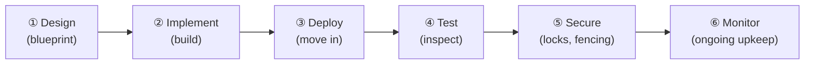

| Step | House analogy | API equivalent | Anypoint tool |
|---|---|---|---|
| **Design** | Architect draws a blueprint, checks municipal (GHMC) rules | Define request/response schema, examples, security requirements — the **API specification / contract** | **Design Center** (using RAML) |
| **Implement** | Construction workers build to spec | Actual development — connectors, transformations, orchestration | **Anypoint Studio** |
| **Deploy** | Move in | Push the built app to a runtime (cloud or on-prem) | **Runtime Manager** |
| **Test** | Inspect the finished house | QA validates functionality (Postman/SoapUI); separately, performance testers load-test (JMeter/LoadRunner) | External tools + Postman |
| **Secure** | Install locks, fencing, alarm | Apply auth/rate-limiting/etc. policies | **API Manager** |
| **Monitor** | Ongoing maintenance | Track requests, failures, response times | **Runtime Manager** / **Anypoint Monitoring** |

> 💡 **Why MuleSoft's "full lifecycle" claim matters commercially:** every single step above has a **native MuleSoft tool**. A competing platform that's weak in, say, API security or monitoring forces you to license and integrate a **third-party tool** for that step — extra cost, extra integration work, extra vendor relationships. MuleSoft's pitch is "one platform, every step."

### A subtlety on ordering: why does "Secure" come *after* "Test"?
In the lecture, a student asked why security isn't just baked in during development. The answer: **developer testing** (quick sanity checks — "does this even respond?") is different from **formal security testing**, which is its own detailed discipline requiring the app to already be deployed to a proper environment. So practically: build → do quick functional checks → deploy → let QA test thoroughly → *then* apply and validate formal security policies → monitor in production. The six steps are a clean mental model, but real projects loop and overlap them somewhat.

---

## 2. Point-to-Point Integration — Why It Collapses Under Scale

**The setup:** before ESB architecture existed, if System A needed to talk to System B, you built a direct integration between exactly those two. Need A to also talk to C? Build another direct integration. And so on.

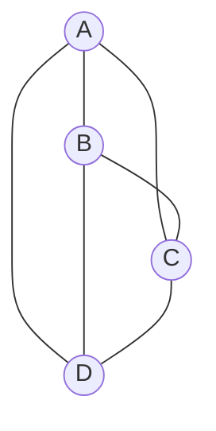

With just 4 systems, that's already 6 direct connections. The growth is **combinatorial** — for *n* systems, potential point-to-point integrations grow roughly as *n(n-1)/2*. The instructor cites a real example: **~4,000 APIs in a single large organization** — imagine that complexity without a central architecture.

### The two compounding disadvantages
1. **Adding one new system** can require building integrations to *every* existing system it needs to talk to — not just one new connection, but potentially many.
2. **Changing one system** can force changes across **every** integration touching it — because each point-to-point link was built assuming that system's exact old format/behavior.

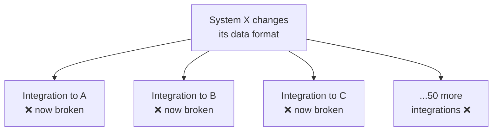

At real enterprise scale (hundreds of systems), this maintainability burden becomes the dominant cost of running IT — which is exactly the problem ESB architecture was invented to solve.

---

## 3. ESB (Enterprise Service Bus) — The Fix

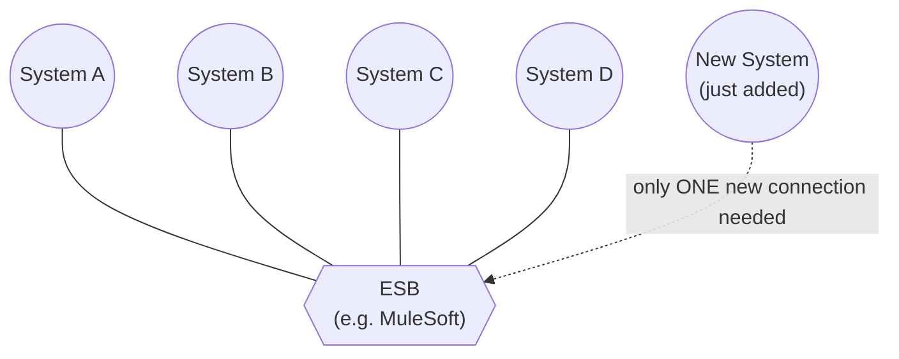

- Every system connects **once**, to the central bus, instead of pairwise to every other system it needs to reach.
- Adding a new system now costs **one** new connection to the bus, not *n* new pairwise connections.
- A change inside one system only requires updating **that system's one connection** to the bus, not every downstream integration — the bus can absorb/translate the change.
- **"MuleSoft Developer" and "Mule ESB Developer"** are the same job title in practice — MuleSoft *is* an ESB tool.

### When is an ESB actually worth it?
> If you only have **2 systems** to connect, building a full ESB architecture is overkill — plain point-to-point is simpler and cheaper. ESB earns its complexity once you have **many** systems that all need to talk to each other, which is the normal state for any real enterprise.

### The 3 capabilities that qualify a tool as "ESB"
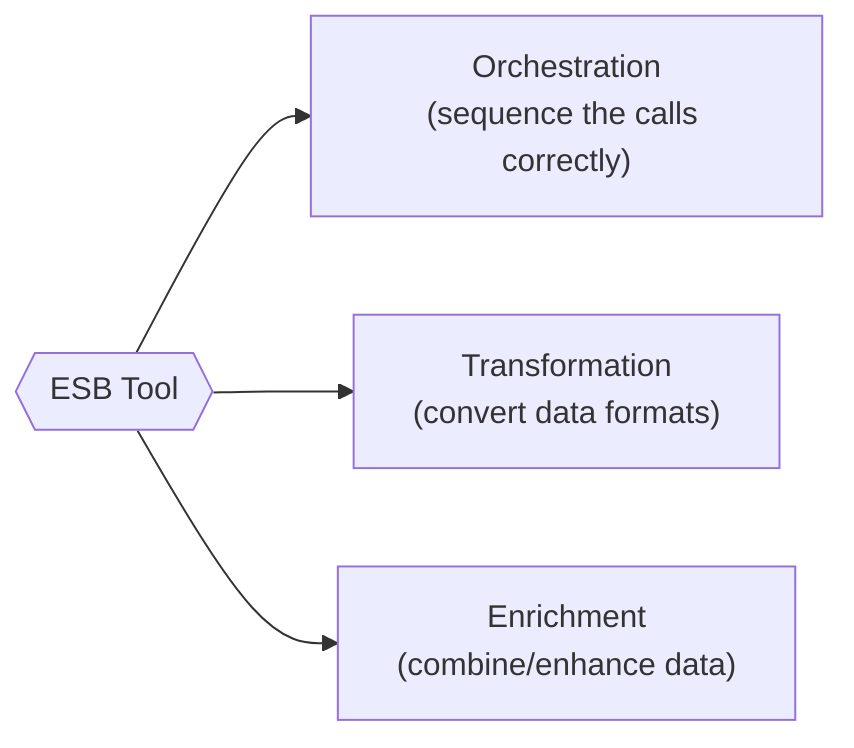

1. **Orchestration** — like a music conductor: decide *when* and *in what order* to call each system (check inventory → then charge payment → then bill → then ship). Get the order wrong (e.g. charge before confirming stock) and you create real business problems.
2. **Transformation** — converting data shape/format between systems (JSON ↔ XML, Java ↔ JSON, etc.) — this is the same concept introduced in the Day 01 Flipkart example.
3. **Enrichment** — a *specific kind* of transformation: combining or enhancing data rather than just reshaping it (e.g. `firstName` + `lastName` → `fullName`).

MuleSoft provides native support for all three, which is precisely why it qualifies as, and is marketed as, an ESB tool.

---

## 4. Monolithic vs. Microservices

### Monolithic: everything in one application
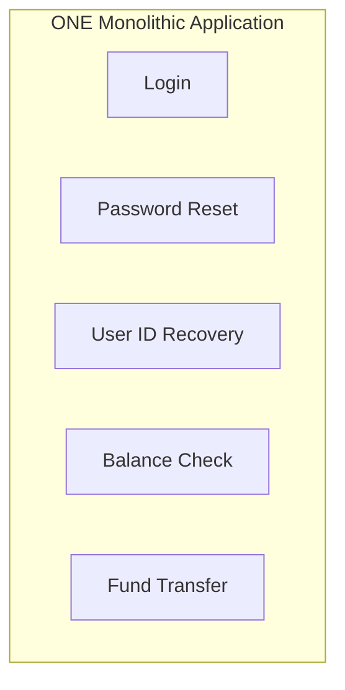

| Advantages | Disadvantages |
|---|---|
| Simple to develop, test, deploy (one thing) | Complexity **and response time both increase** as features pile up (like opening a 2-lakh-word document vs. a 10,000-word one — it's just heavier) |
| | **Any** small change (e.g. fixing password-reset logic) forces a **full redeploy** — causing downtime for completely unrelated features too |
| | **Not reliable** — one broken piece can take the *entire* application down |

### Microservices: each capability is its own application
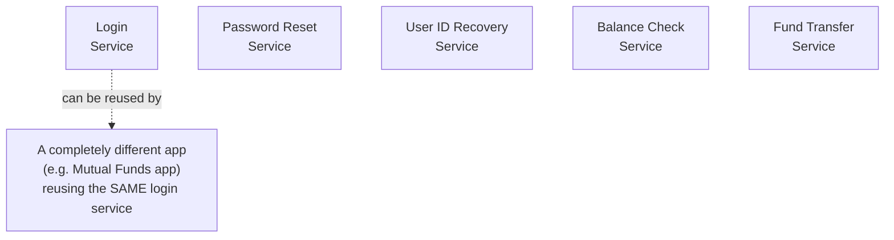

| Advantages | Disadvantages |
|---|---|
| **Lower complexity** per service — easier to reason about | **More inter-service communication** needed — network calls where a monolith would've had an in-process function call |
| **Reusable** — e.g. one login service reused across multiple front-end apps | A response-format change in one service can still **ripple** to whatever consumes it |
| **Faster long-term development** (though *slower initially*, since more services must be stood up) | **More resource usage** (CPU/memory per service) → higher cost, since MuleSoft licenses by **vCore** |
| **Independently scalable** — scale only the hot service (e.g. "shipment status" during a sale), not everything | |
| **More reliable** — one broken service ≠ everything down | |

### The scalability example, worked through
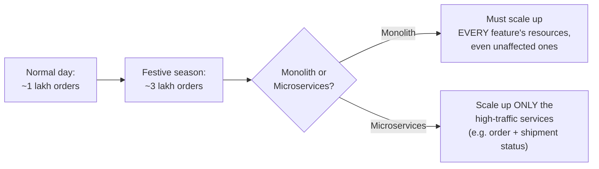
The car-capacity analogy used in the lecture: a car rated for 1,000kg can be *forced* to carry 3,000kg, but it will fail. Scaling infrastructure works the same way — once load exceeds what current resources can handle, the system starts failing, and you must proactively add capacity (servers/CPU/memory) — the microservices advantage is that you can add capacity **surgically**, only where the actual bottleneck is.

> Auto-scaling exists as a **premium MuleSoft feature** — without it, this capacity increase during a festive sale is a manual operational task, not automatic.

### Reality check: it's not all-or-nothing
Real organizations often run a **hybrid** — grouping 2-3 related business capabilities into one application rather than a separate app per tiny feature, balancing microservices' benefits against the real resource-cost disadvantage. **This architectural call belongs to a Solution Architect**, not an individual developer — but a developer should understand *why* the call was made, since it shows up in interviews as a scenario question.

---

## 5. API-Led Connectivity — MuleSoft's Microservices Recipe, Specifically for APIs

This is MuleSoft's named best-practice pattern (not a mandatory rule) for applying microservices thinking specifically to API architecture.

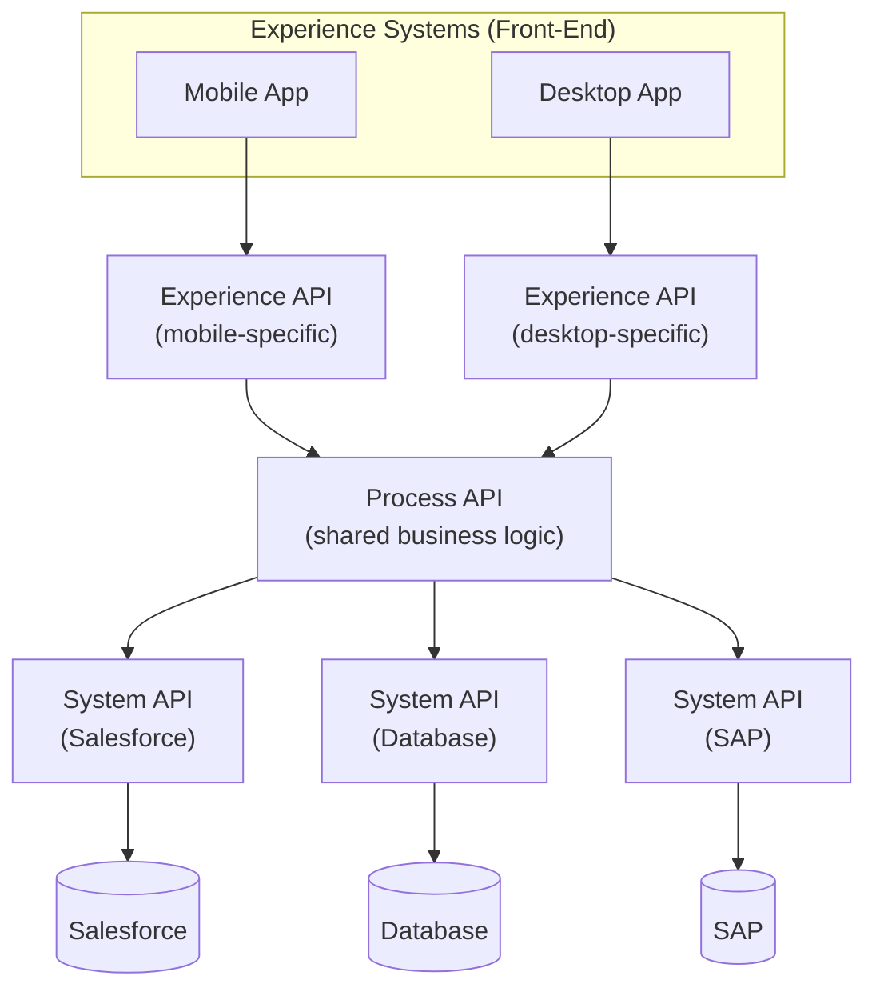

| Layer | Job | Reused by |
|---|---|---|
| **Experience API** | Tailored to *one specific consumer* — shapes/filters/secures data exactly how that consumer needs it | Not reused across different consumer types — mobile and desktop typically get *separate* Experience APIs, because they may need different data volume, shape, or security |
| **Process API** | Contains the actual **business logic** — orchestrates calls to one or more System APIs, applies transformation/enrichment | Reused across multiple Experience APIs (mobile and desktop can share the same Process API) |
| **System API** | One per back-end system — its *only* job is fetching/sending data for that system, with no business logic | Reused across multiple Process APIs that need that system's data |

### Worked example: Flipkart order history (mobile vs. web)
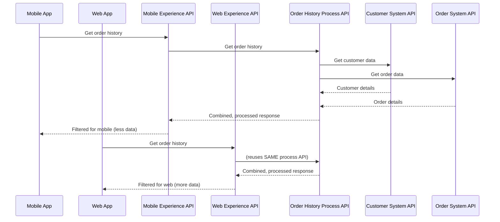
Notice: **the Process API and System APIs are built once and reused** — only the Experience layer differs per consumer. This is the concrete payoff of the pattern.

### It's a best practice, not a mandate — when to skip the Process layer
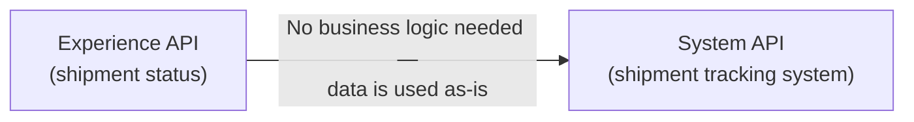
If a Process API would do nothing but blindly pass data through unchanged, it's just wasted resources and an extra hop. An architect can legitimately skip straight from Experience to System API when there's no real orchestration/transformation need — **but this is a judgment call made deliberately, based on requirements**, not a default to reach for.

### A common misconception addressed directly in the lecture
> *"Since these layers are all inside our own enterprise, do we still need security between them?"* — **Yes.** Internal-network communication is not automatically safe. The lecture specifically cites banking/RBI compliance requirements as a reason internal API-to-API calls still need proper security — "it's internal" is not a security exemption, especially in regulated industries.

### Advantages & Disadvantages (same as microservices generally, applied to APIs)
| Advantages | Disadvantages |
|---|---|
| Reusable Process/System layers | More APIs to build initially (slower start) |
| Independently scalable per layer/service | More resource usage/cost |
| Faster long-term time-to-market | More inter-service communication to manage |
| A layer's *internal* logic can change freely without affecting others, **as long as its response contract stays the same** | A layer's *response contract* changing still ripples to whatever consumes it |

---

## Quick Recap

- **API Lifecycle**: Design → Implement → Deploy → Test → Secure → Monitor — MuleSoft has a native tool for every step, which is a real competitive differentiator.
- **Point-to-point integration** collapses under scale because connections grow combinatorially and any system's change ripples everywhere it's directly connected. **ESB** fixes this with a central bus — one connection per system, not one per pair.
- **ESB = Orchestration + Transformation + Enrichment**, all natively provided by MuleSoft.
- **Monolithic** = simple but fragile and hard to scale surgically. **Microservices** = more overhead, but reusable, independently scalable, and more reliable. Real orgs often land on a pragmatic hybrid.
- **API-Led Connectivity** = MuleSoft's 3-layer (Experience → Process → System) recipe for applying microservices thinking to API design specifically — a best practice to apply based on actual reuse/complexity needs, not a rule to follow blindly, and never an excuse to skip security just because traffic stays "internal."
