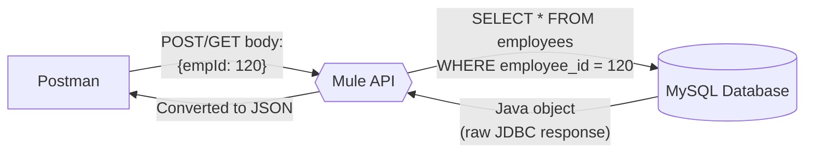
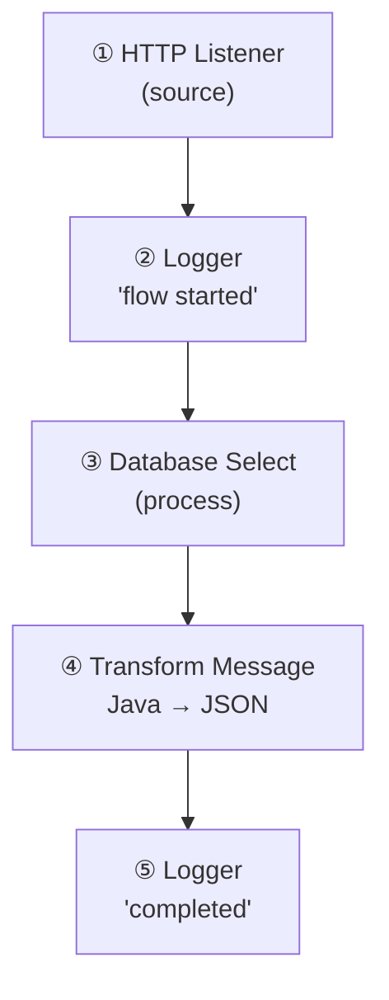
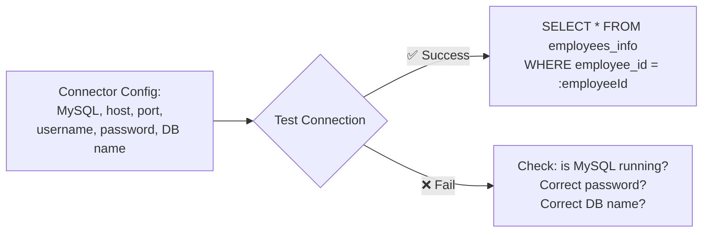
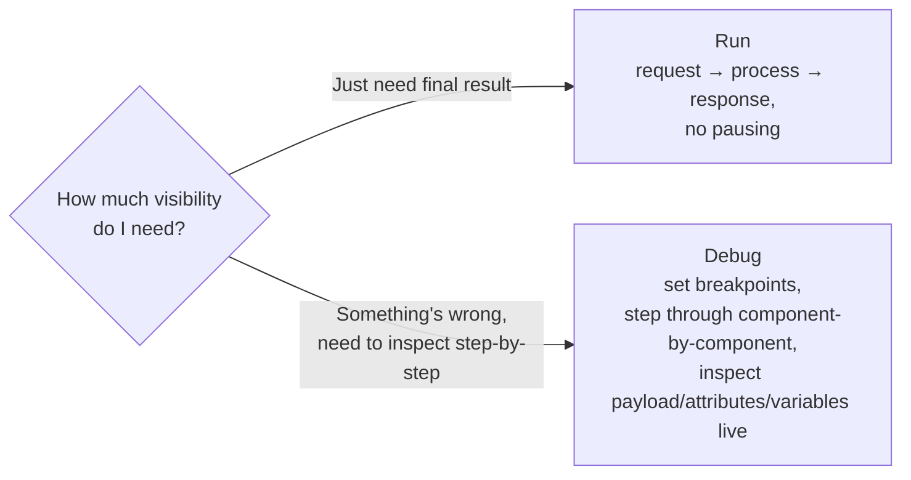
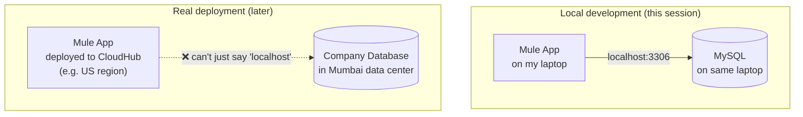

# Day 05 — Detailed Notes: First Hands-On Mule Application

> **Watch alongside:** the first time you actually touch Anypoint Studio. Build this exact flow yourself while watching — typing along, not just observing, is what makes the next few "how does HTTP become a Mule Event" sessions click.

---

## 1. The Requirement, Precisely

**Input:** an `employeeId` (sent via Postman). **Output:** that employee's full details (name, salary, designation, status), as JSON.



There is deliberately **no real front-end** at this stage — Postman stands in for it, which is completely normal during development (a recurring theme: APIs are built and tested long before any real front-end exists).

---

## 2. Building the Flow, Step by Step



### ① HTTP Listener — the entry point
Configuring a **Connector Configuration** (a reusable connection definition):
| Setting | Value used | Why |
|---|---|---|
| Protocol | HTTP | (not HTTPS at this stage — that's a later topic) |
| Host | `localhost` (or `0.0.0.0`) | Deploying to your own machine for now — in real deployments this would be an actual server IP |
| Port | `8081` | **Must be a port nothing else is currently using** — `3306` was avoided since MySQL was already listening there |
| Path | `/empdetails` | Combined with host+port, forms the full URL: `http://localhost:8081/empdetails` |

> 🧠 **Port analogy from the lecture:** a port is like a house number on a street — it must uniquely identify *one* active resident (application) at a time. Two applications can't share an active port, the same way two houses can't share one address while both are occupied.

### ② Logger — "why bother, nothing depends on it?"
A Logger produces no functional output for the consumer — but it's how you'll **see what's happening once deployed to a real server**, where you can't attach a debugger and step through live traffic. The instructor's habit: place loggers at meaningful checkpoints (start of flow, after a risky step like a DB call, end of flow) so that when something goes wrong in production, the logs alone tell you *how far the request got* before failing.

### ③ Database Connector — SELECT operation

- The **JDBC driver** (via "Add Recommended Library") is what actually lets Mule talk to MySQL specifically — different databases (Oracle, MS SQL Server) need their own equivalent drivers.
- **Best practice demonstrated:** bind the employee ID **dynamically** (`payload.employeeId`, referenced via a bound parameter) rather than hard-coding a literal ID into the query string — this is what makes the same flow work for *any* incoming employee ID, not just one hardcoded test value.

### ④ Transform Message — Java → JSON
The raw JDBC response comes back in **Java format** by default — not directly usable/meaningful to an external JSON-speaking consumer. A minimal Transform Message just declares the output type:
```dataweave
%dw 2.0
output application/json
---
payload
```
This is the simplest possible DataWeave script — no reshaping logic, just a format declaration. More complex transformations come in later sessions.

---

## 3. Debugging Issues Actually Encountered (learn from these directly)

| Symptom | Root cause | Fix |
|---|---|---|
| `Access denied for user 'root'` | Wrong password typed in the connector config (a literal typo — `22` instead of `23`) | Double-check the password matches *exactly* what was set when the MySQL user was created |
| `Could not obtain connection from data source` | The MySQL **service itself** wasn't running (checked via `services.msc` on Windows) | Start the database service before testing the connector — "installed" ≠ "running" |
| Listener won't deploy / port conflict | Chosen port already actively used by another process (e.g. MySQL itself on 3306) | Pick a genuinely free port |

> 💡 **General debugging instinct modeled here:** when a connection fails, systematically check — is the service actually *running*? Are the credentials *exactly* right (case-sensitive, no typos)? Is the port actually *free*? This same checklist applies to almost any connector, not just Database.

---

## 4. Run vs. Debug — When to Use Which



- **Run** is your default for "does this work end-to-end?"
- **Debug** becomes essential the moment something *doesn't* work as expected, or when a flow has enough components (10-15+, per the instructor) that guessing where the problem is becomes impractical without stepping through.
- The **Mule Debugger tab** (in the bottom panel) is where you inspect the Mule Event's internal state at each breakpoint — this is the exact tool used extensively in `day07.md`'s payload/attributes/variables deep dive.

---

## 5. Local Dev vs. Real Deployment — Why `localhost` Isn't Always The Answer



When both pieces live on your own machine, `localhost` trivially "just works." The moment the Mule app and the database live on **different servers** — possibly different regions/networks entirely — that convenience disappears, and real network connectivity (firewall rules, port openings, sometimes VPNs/proxies) must be established, usually coordinated with a **network team**.

**A concrete diagnostic tool mentioned:** `telnet <server-ip> <port>` from a command line — an empty/blank response after connecting means the network path is open; a "not connected" style error means it isn't, and you'd escalate to the network team to open it (this maps directly onto the same on-premises/VPC/firewall concepts covered in the April batch's `apr21.md`, for anyone cross-referencing that course).

---

## Quick Recap

- Minimal working API = **Listener (source) → Logger → Database Select (dynamic query param) → Transform Message (Java→JSON) → response** — build this exact flow yourself, don't just watch.
- Debugging discipline: check service is *running*, credentials are *exact*, port is *free* — in that order, for almost any connectivity failure.
- **Run** for normal testing; **Debug** (with breakpoints + the Mule Debugger tab) once you need to see exactly what's happening at each step.
- `localhost` is a local-development convenience that disappears the moment app and database live on separate real servers — real deployments need actual network connectivity, which is a shared responsibility with a network/DevOps team, not something a developer solves alone.
