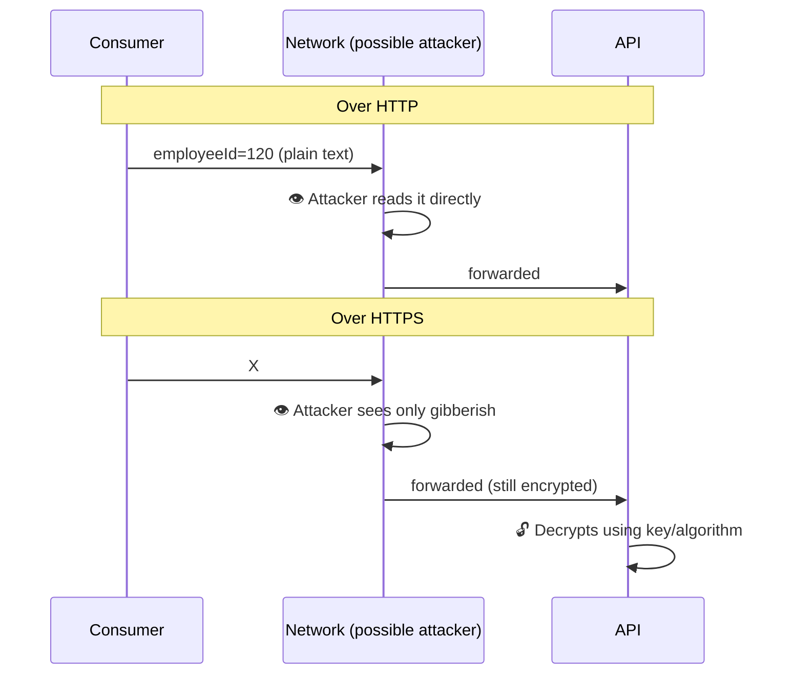
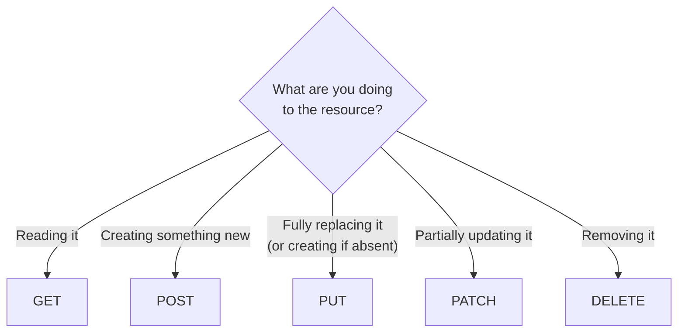
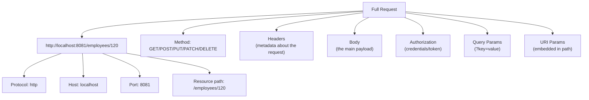
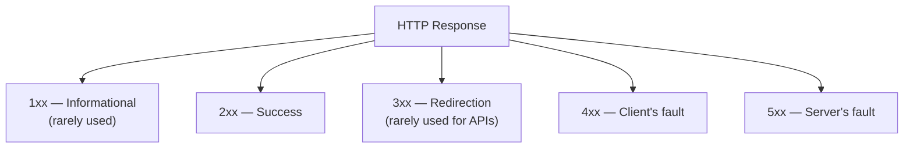
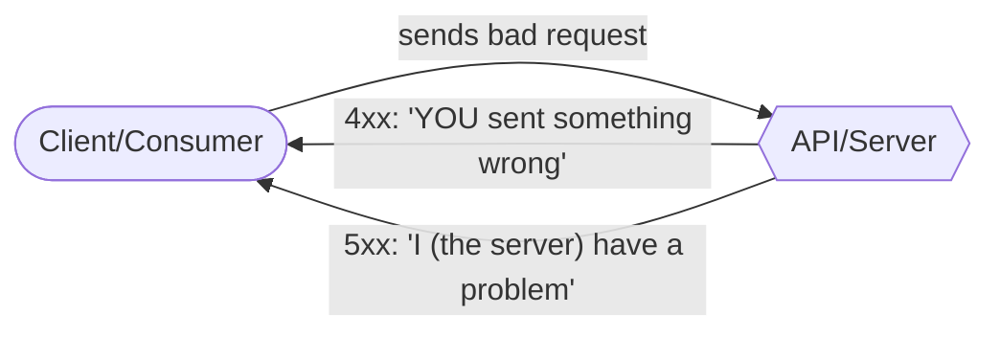
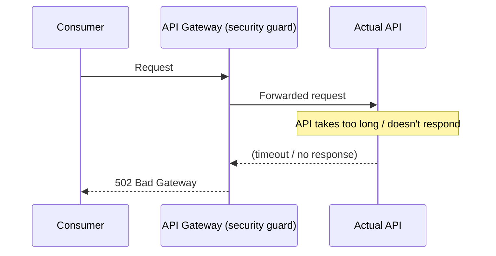
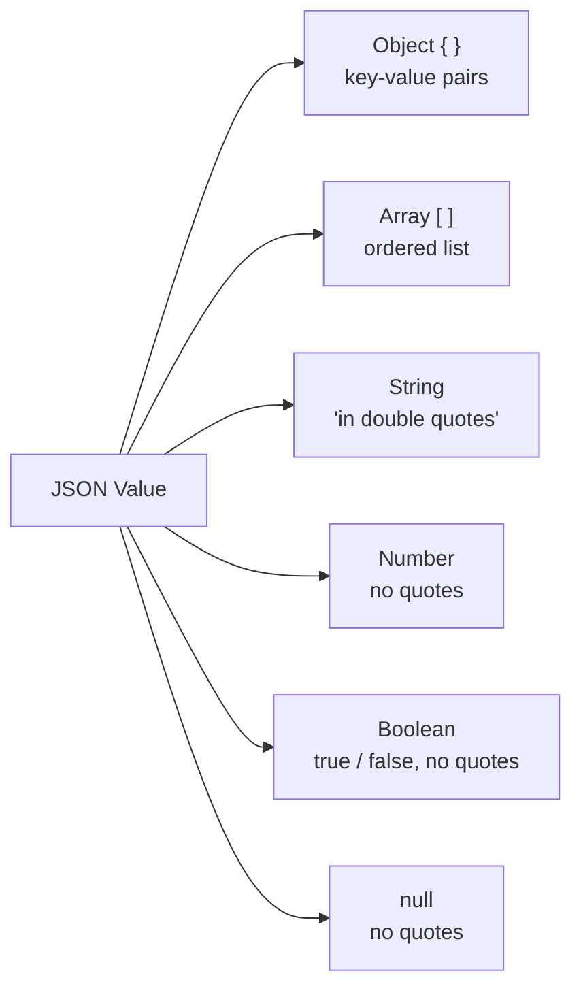
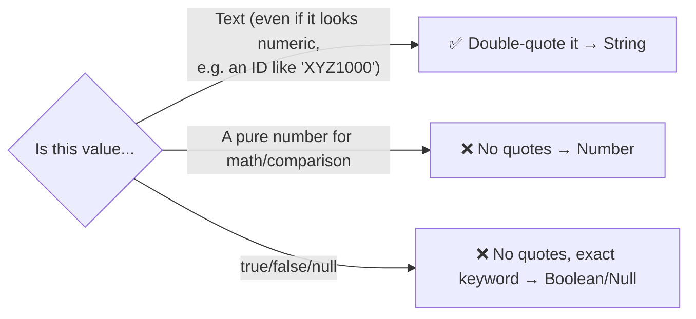

# Day 06 — Detailed Notes: HTTP Deep Dive (Methods, Request Anatomy, Response Codes, JSON)

> **Watch alongside:** dense reference material — the kind of thing you look up constantly early on, then eventually just know. This file is built to be a fast lookup table as much as a narrative read.

---

## 1. HTTP vs. HTTPS — What Encryption Actually Protects



- HTTPS encrypts the message **only in transit** — the moment it arrives at the API, it's decrypted back to plain data for processing. It does **not** provide any protection *after* that point (e.g. if the API itself stores it insecurely).
- **When it matters most:** any sensitive data — credit card numbers, passwords, personal identifiers. The lecture's example: sending an `employeeId` in plain HTTP is low-risk (not very sensitive); sending a **credit card number** the same way is a real problem — that's the difference that should drive the HTTP-vs-HTTPS decision.

---

## 2. HTTP Methods — Precise Decision Table



| Method | Precise behavior | Worked example |
|---|---|---|
| **GET** | Fetch existing data, no side effects | `GET /employees/120` → returns employee 120's details |
| **POST** | Create a brand-new resource | `POST /employees` with a full employee payload → creates a new record |
| **PUT** | **Full replace** — if the resource exists, every field is overwritten with what you send; if it doesn't exist, PUT **creates** it (this dual behavior is the defining trait of PUT) | `PUT /employees/102` with a complete new record → 102's entire record is replaced |
| **PATCH** | **Partial update** — only the fields you send are changed; everything else is left untouched | `PATCH /employees/102` with just `{"phone": "..."}"` → only the phone number changes |
| **DELETE** | Remove the resource | `DELETE /employees/102` → record 102 is gone |

> ⚠️ **These are conventions, not compiler-enforced rules.** Nothing technically stops you from using GET to create a resource — but every consumer, tool, and interviewer *expects* the convention to be followed, and deviating causes real confusion (e.g. caching proxies may assume GET has no side effects and cache it — breaking a GET-that-secretly-writes-data in surprising ways).

### GET + body — a specific gotcha demonstrated live
The lecture explicitly showed sending a body on a GET request and having Mule **accept it anyway**, since the flow hadn't restricted the listener's allowed methods. **The convention says don't send a body on GET** (use query/URI params instead) — but nothing in Mule's default listener configuration technically prevents it. Restricting *which* methods a given resource accepts is itself a design-time decision, defined in the API specification.

---

## 3. Anatomy of an HTTP Request



| Part | What it's for | Mandatory? |
|---|---|---|
| **Protocol** | HTTP or HTTPS | Fixed by how the API was built |
| **Host + Port** | Where the server is, which app on that server | Fixed by deployment |
| **Resource Path** | Which resource/endpoint | Fixed by API design |
| **Method** | The action (see table above) | Depends on what the API's design allows for that resource |
| **Body** | The actual data payload (JSON, XML, etc.) | Design-time choice — some fields mandatory, some optional |
| **Headers** | Metadata about the request (content type, source system, etc.) | Design-time choice — some mandatory, some optional |
| **Authorization** | Security credentials — can alternatively be sent via a header, depending on design preference | Depends on whether the API is secured |
| **Query Params** | Optional filters/sort/pagination — see `day10.md` | Almost always optional by nature |
| **URI Params** | Identifies a specific resource, embedded in the path | Effectively mandatory when present, since the path structure requires it |

> 🧠 **Key mental model:** *nothing* about which headers/params are mandatory vs. optional is automatic — it's entirely a decision made when the API is **designed** (in RAML), and only enforced if that design explicitly marks something `required: true`.

---

## 4. HTTP Response Status Codes — The Complete Picture



### Who's at fault — the single most useful framing


### 2xx — Success
| Code | Meaning | When |
|---|---|---|
| **200** | OK | The general-purpose "it worked" response — most common by far |
| **201** | Created | Specifically after successfully creating a new resource (typically paired with POST) |
| **204** | No Content | Request succeeded, but there's genuinely nothing to return (e.g. a search that legitimately matched zero records) |

> The instructor's candid note: in real practice, teams are inconsistent about strictly using 201-for-POST vs. just always returning 200 — "there's no hard rule forcing it," similar to a traffic rule that's advisable but not universally enforced.

### 4xx — Client Errors
| Code | Meaning | Example |
|---|---|---|
| **400** | Bad Request | Missing a mandatory field, or wrong data type (sent a string where a number was expected) |
| **401** | Unauthorized | Missing, wrong, or absent security credentials |
| **403** | Forbidden | Credentials are valid, but this specific caller isn't permitted to access *this particular* resource (e.g. has access to Resource 1 but tries Resource 2) |
| **404** | Not Found | Wrong URL/resource path, or a resource ID that doesn't exist |
| **405** | Method Not Allowed | API only accepts GET for this resource, caller sent POST |
| **415** | Unsupported Media Type | API only accepts JSON, caller sent XML (or vice versa) |

### 5xx — Server Errors
| Code | Meaning | Example |
|---|---|---|
| **500** | Internal Server Error | Generic catch-all — e.g. the database is down |
| **501** | Not Implemented | The request hits a function the server genuinely doesn't support |
| **502** | Bad Gateway | An **API Gateway** in front of the API didn't get a timely response *from* the API behind it |
| **503** | Service Unavailable | The API itself is down |
| **504** | Gateway Timeout | Similar to 502 — an upstream server failed to respond in time |

### The Gateway diagram (502 vs. 503 vs. 504, made concrete)

The **API Gateway** analogy used: a security guard at the entrance to a house — checks credentials first, then passes the (already-validated) request through to the actual resident (API). If the resident never answers the door in time, the guard reports back a gateway-level failure (502/504) rather than the resident's own answer.

---

## 5. JSON Format — Every Data Type, Precisely



### A fully worked example, annotated
```json
{
  "name": "Mahesh",
  "designation": "Software Engineer",
  "salary": 100000,
  "hobbies": ["reading books", "watching movies", "learning new things"],
  "resigned": false,
  "joinDate": "2024-10-25",
  "address": null
}
```

| Field | Type | Why |
|---|---|---|
| `"name": "Mahesh"` | String | Double-quoted → string, even though it *looks* like a simple word |
| `"salary": 100000` | Number | No quotes → treated as a numeric value, not text |
| `"hobbies": [...]` | Array | Multiple similar values — cleaner than inventing `hobby1`, `hobby2`, `hobby3` keys |
| `"resigned": false` | Boolean | Must be bare `true`/`false` — writing `"false"` (quoted) makes it a *string*, not a real boolean, which breaks any logic checking it as a condition |
| `"joinDate": "2024-10-25"` | String (!) | **JSON has no native date type** — dates are always strings; any date logic (parsing, comparing, formatting) has to happen inside DataWeave once the value is in Mule |
| `"address": null` | Null | Bare `null`, not `"null"` (which would be a 4-character string, not an absence-of-value) |

### The quoting rule, as a single decision


---

## Quick Recap

- **HTTPS encrypts only in transit** — it protects data while traveling across a network, not before or after.
- **Method choice (GET/POST/PUT/PATCH/DELETE)** is a convention describing *intent*, not a technically enforced restriction — Mule will happily do whatever you configure it to, regardless of REST convention.
- **4xx = the caller's fault. 5xx = the server's fault.** Memorize 400/401/403/404/405/415 and 500/502/503/504 specifically — these are the ones that come up constantly, both in real debugging and in interviews.
- **JSON's 5 real types**: string (quoted), number (unquoted), boolean (bare `true`/`false`), null (bare `null`), plus the two structural containers object `{}` and array `[]`. **There is no date type** — dates are always strings, handled via DataWeave logic later.
