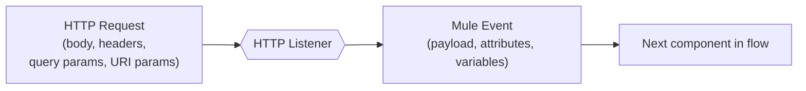
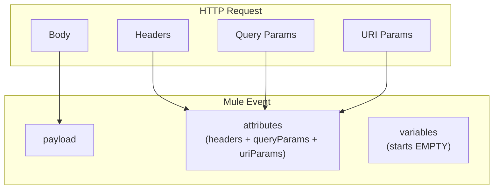
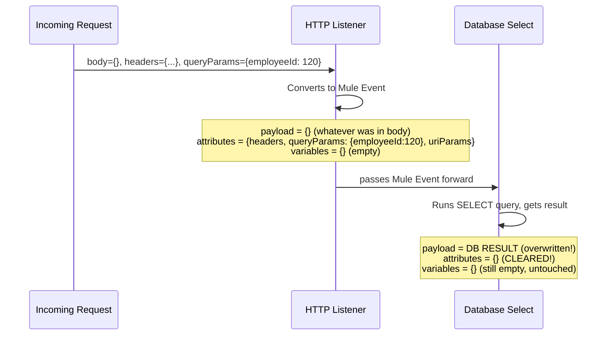
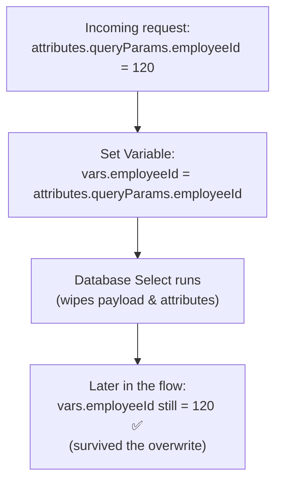
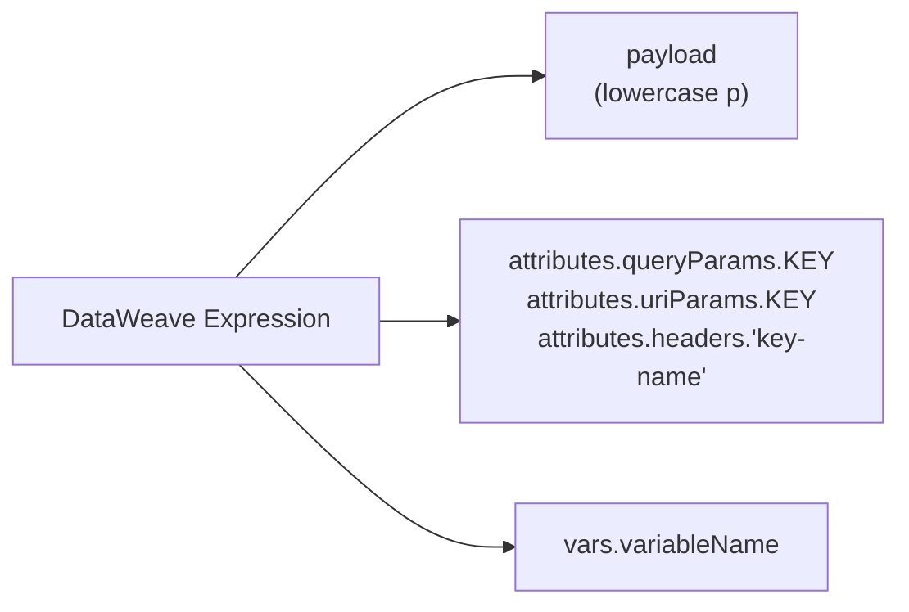
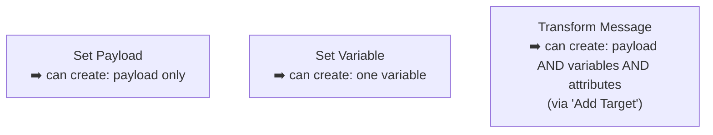
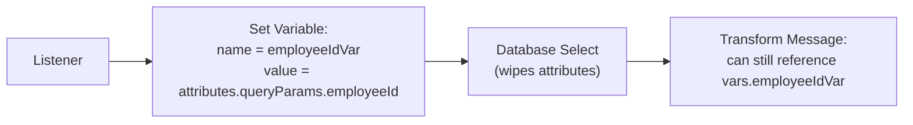
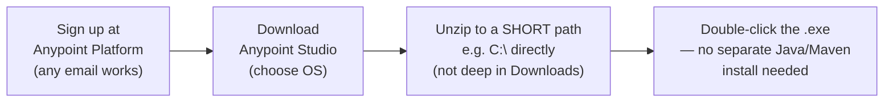
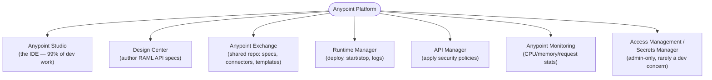
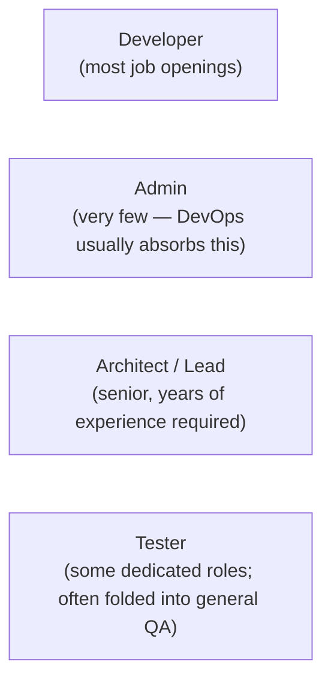

# Day 07 — Detailed Notes: The Mule Event Model + Anypoint Platform Setup

> **Watch alongside:** this is arguably the single most important mental model in the entire course. Nearly every confusing bug a beginner hits ("why did my data disappear?") traces back to not understanding this session. Take it slowly.

---

## 1. From HTTP Request to Mule Event

The **HTTP Listener's job** is exactly this conversion: take the raw wire-format HTTP request and translate it into Mule's own internal representation — the **Mule Event** — then hand it to the next processor in the flow.

### The precise mapping (memorize this table — it's certification material)

| HTTP Request part | Mule Event part |
|---|---|
| Body | `payload` |
| Headers, Query Params, URI Params | `attributes` (all three live inside here, as sub-fields) |
| *(nothing — always starts empty)* | `variables` |
| *(only if an error occurs)* | error/exception info |

- `payload` + `attributes`, together, are sometimes called the **"message."**
- `variables` is fundamentally different from the other two: **nothing from the outside world ever lands here automatically.** It only ever contains what *you* explicitly put there, inside the flow.

---

## 2. ⚠️ The Overwrite Problem — Why This Matters So Much

Here's the trap that catches almost every beginner: **any component that produces its own output (like a Database connector) overwrites `payload`, and clears `attributes`.**

**The consequence:** by the time you're past the Database component, the original `employeeId` you read from `attributes.queryParams` is **gone** — unless you explicitly saved it somewhere safe *before* the Database component ran.

### Why `variables` exist — the entire reason for their design

> 🧠 **The rule to internalize:** if you'll need a piece of data *after* a component that produces its own output (Database, HTTP Request, any connector call), **save it to a variable first.** Variables are Mule's answer to "how do I keep something around across an overwrite?"

---

## 3. Accessing Data — The Exact Syntax (case-sensitive!)

| What | Syntax | Common mistake |
|---|---|---|
| The payload itself | `payload` | Typing `Payload` (capital P) — MuleSoft requires exact lowercase |
| A specific field in the payload | `payload.employeeId` | Wrong casing on the field name |
| A query parameter | `attributes.queryParams.employeeId` | Typing `queryparam` instead of `queryParams` (exact casing) |
| A URI parameter | `attributes.uriParams.employeeId` | Same casing trap |
| A header | `attributes.headers.'content-type'` | Forgetting headers often need quoting due to hyphens |
| A variable | `vars.employeeId` | Forgetting the `vars.` prefix entirely |

**How to practice this safely:** use the **Mule Debugger's "x+y" (evaluate expression)** button while stepped into a breakpoint — type any expression and it evaluates live against the *actual* current state of the Mule Event, which is the fastest way to learn the exact syntax without guessing blind.

---

## 4. Set Payload vs. Set Variable vs. Transform Message

| Component | What it can produce | When to use |
|---|---|---|
| **Set Payload** | Only `payload` | Simple, single-value payload assignment |
| **Set Variable** | Only one `variable` | Simple, single-value variable assignment — e.g. saving a query param before it gets wiped |
| **Transform Message** | `payload`, multiple `variables`, and even `attributes` | Anything involving real DataWeave transformation logic, or when you need to set more than one thing at once |

> The instructor's personal habit: **default to Transform Message** even for simple cases, since it's strictly more capable — but understand that Set Payload/Set Variable exist as lighter-weight, single-purpose alternatives that some teams prefer for clarity (a component literally named "Set Variable" self-documents its intent better than a generic Transform Message).

### Concrete demonstrated pattern: preserving a query param before a DB call

This is the exact fix for the overwrite problem shown in Section 2 — copy what you need into a variable *before* the component that will destroy it.

### A variable's lifetime
A variable persists for the **rest of the flow** it was created in, until either:
- It's explicitly removed via a **Remove Variable** component, or
- The flow simply ends.

Unlike `payload`/`attributes`, which get silently clobbered by the *next* data-producing component, a variable is stable until you deliberately change or remove it.

---

## 5. Setting Up Anypoint Platform + Studio

- Trial account access is typically limited (~30 days) — expect to eventually need a fresh account/email if practicing over a longer stretch.
- Modern Anypoint Studio versions embed everything required (Java runtime, Maven) — the "install Java separately" friction from older versions is gone.

---

## 6. Anypoint Platform — The Module Map

| Module | One-line purpose | Who mainly uses it |
|---|---|---|
| **Anypoint Studio** | Build/develop/test Mule applications | Developer (daily) |
| **Design Center** | Write the RAML API specification | Developer/Architect |
| **Anypoint Exchange** | Central shared repository — like a company SharePoint, but for MuleSoft artifacts (API specs, connectors, examples) | Whole team |
| **Runtime Manager** | Deploy an app; start/stop/restart it; view basic logs | Developer/DevOps |
| **API Manager** | Attach security policies (auth, rate limiting, SLA tiers) to a deployed API | Developer/Architect |
| **Anypoint Monitoring** | Deeper operational dashboards | Architect/Lead/Ops |
| **Access Management / Secrets Manager** | User/role/environment administration, certificate storage | Admin/DevOps (rarely a developer's job day-to-day) |

---

## 7. Team Roles, Revisited

This reinforces the Day 02 framing: the developer track is both the largest and the most accessible entry point, which is why the course (and this note series) stays squarely focused on developer-level skills.

---

## Quick Recap

- **Mule Event = payload + attributes + variables** (+ error info when an error occurs). `payload` ← HTTP body. `attributes` ← headers/queryParams/uriParams. `variables` always starts empty.
- **Any data-producing component (like Database) overwrites `payload` and clears `attributes`** — this is the #1 source of "where did my data go?" confusion for beginners.
- **The fix is always the same:** if you need something later, save it into a `variable` *before* the component that would destroy it.
- **Set Payload** creates only payload; **Set Variable** creates only a variable; **Transform Message** can create all three (payload, variables, attributes) and is the most flexible.
- Anypoint Platform's modules map cleanly onto the API Lifecycle from Day 04: Design Center (Design) → Anypoint Studio (Implement) → Runtime Manager (Deploy) → API Manager (Secure) → Anypoint Monitoring (Monitor).
