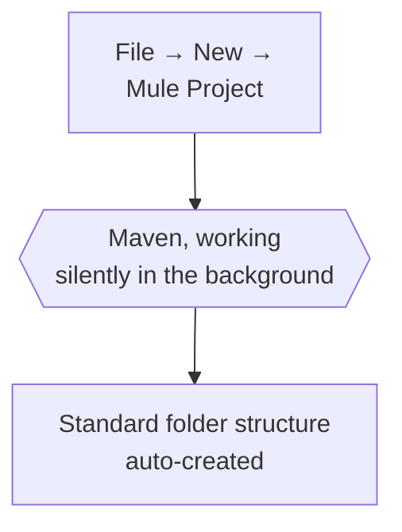
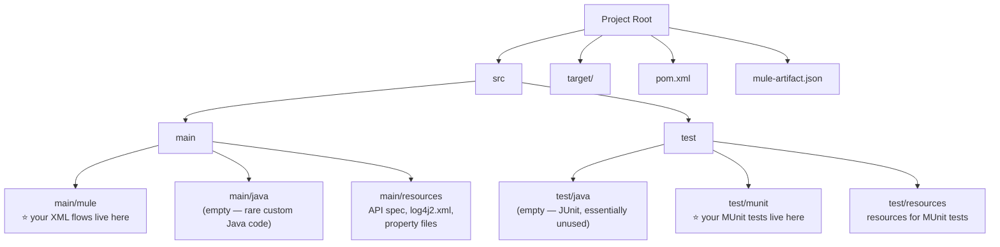
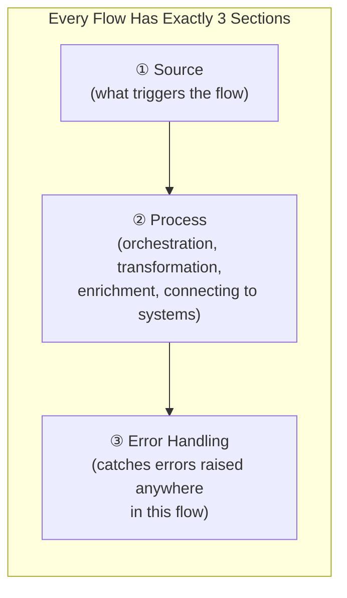
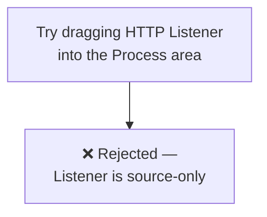
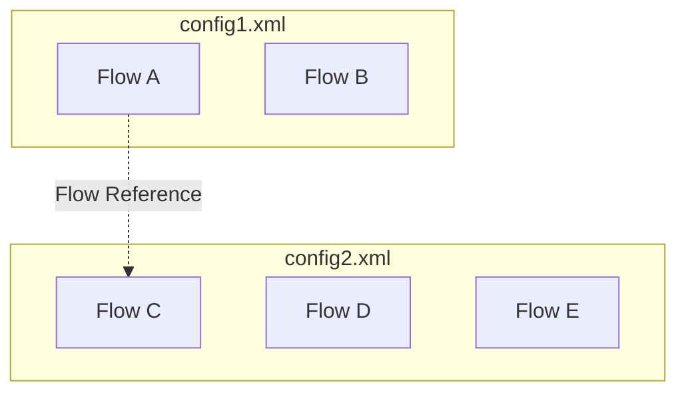
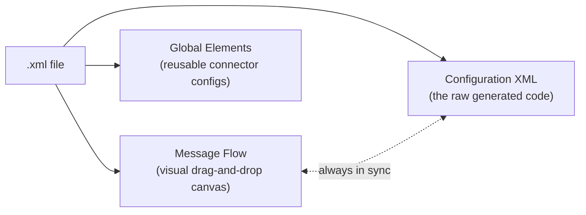
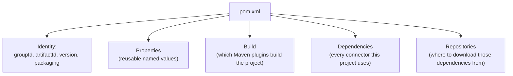
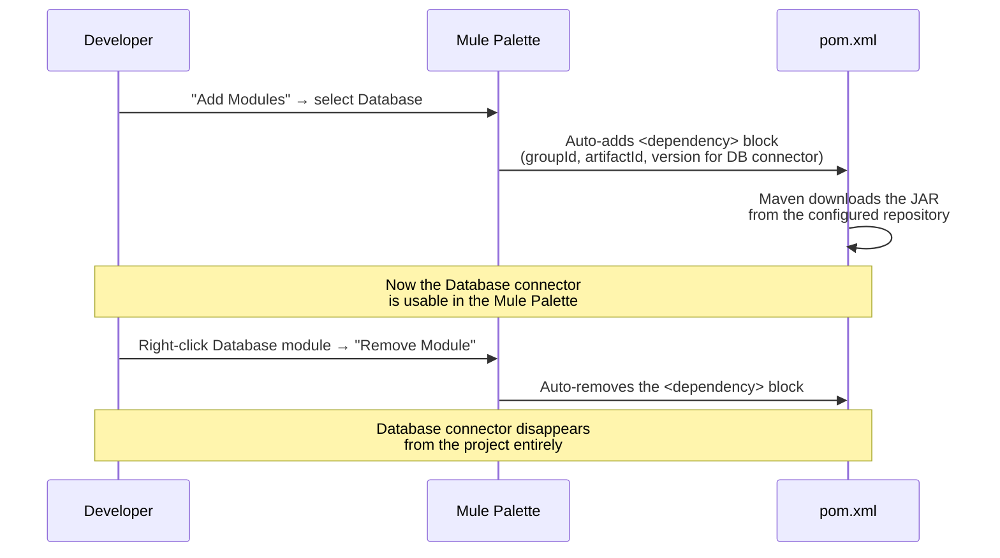

# Day 08 — Detailed Notes: Mule 4 Project Structure & Maven

> **Watch alongside:** the goal here isn't to memorize every folder — it's to stop feeling like Anypoint Studio is "magic." Every file that appears when you create a new project has a specific, explainable reason for existing. Once that clicks, working in unfamiliar projects (at a new job, say) becomes much less intimidating.

---

## 1. Why Does This Structure Exist At All?

Anypoint Studio is built on Java, and uses **Maven** — a standard Java project-management/build tool — under the hood. The moment you create a new Mule project, **Maven auto-generates a conventional folder structure**, without you doing anything manually.

**This is the single most important fact about Mule 4 projects: they ARE Maven projects.** Everything else in this session follows from that one fact.

---

## 2. The Complete Folder Map

| Path | What's really in it | How often you touch it |
|---|---|---|
| **`src/main/mule`** | Your actual XML configuration files, each containing one or more **flows** — this is where your real orchestration/transformation logic lives | **Constantly** — this is the project |
| **`src/main/java`** | Empty by default; only used for custom Java code when no MuleSoft connector exists for something | Almost never (rare requirement, usually handled by a dedicated Java dev if it comes up) |
| **`src/main/resources`** | The imported `api/` folder (your RAML spec), `log4j2.xml` (logging config), and — importantly — **property files** for per-environment config | Regularly, once you're doing multi-environment deployments |
| **`src/test/java`** | JUnit-style Java tests | Essentially never, for a Mule developer |
| **`src/test/munit`** | Your **MUnit** test suites — Mule's own unit-testing framework | Regularly — MUnit is explicitly the developer's own responsibility |
| **`src/test/resources`** | Resources your MUnit tests need to run | Alongside MUnit work |
| **`pom.xml`** | The Maven "Project Object Model" — project identity + every dependency | Frequently referenced, occasionally hand-edited |
| **`target/`** | Where the built deployable JAR ends up | Rarely browsed manually — it's a build output |
| **`mule-artifact.json`** | Declares which Mule **runtime version** (e.g. 4.4.0) this project targets | Rarely touched directly |

> 💡 **Clearing up a common confusion:** "Mule 4.x developer" in job postings refers to the **Mule runtime/server version**, not the Anypoint Studio IDE version. You could be running Studio 7.12 while your project targets Mule runtime 4.4.0 — they're two independent version numbers that just happen to both show up in the UI.

---

## 3. Anatomy of a Flow: Source, Process, Error Handling

**A structural rule enforced by Studio itself:** source-only components (like the **HTTP Listener**) physically **cannot be dragged into the Process section** — Mule's palette knows the difference and blocks the drop. This isn't a style guideline; it's enforced by the tool.

---

## 4. One XML File, Multiple Flows — and Multiple XML Files, Too

- There's **no rule limiting one XML file to one flow** — a single file can hold many flows.
- There's **no rule limiting a project to one XML file** — real projects routinely have multiple XML files, organized by purpose.
- **Flow Reference** components let one flow call into another — including a flow defined in a **completely different XML file** in the same project. This is how you keep a large project organized into logically separated files while still letting flows cooperate.

---

## 5. The 3 Tabs of Every XML File — Same Content, 3 Views

| Tab | What you see | Live sync proof from the lecture |
|---|---|---|
| **Message Flow** | The visual canvas — drag, drop, connect components | Deleting a flow visually here removes the corresponding block in Configuration XML instantly |
| **Configuration XML** | The literal generated XML/code | Every drag-drop action appears here immediately — this *is* what actually gets deployed |
| **Global Elements** | Reusable configs (HTTP Listener connector config, Database connector config, etc.) | A config created here can be referenced by **multiple flows, even across different XML files** |

> 🧠 **Why "Global Elements" matters practically:** define your HTTP Listener connector configuration *once* as a global element, then reuse it across every flow/file that needs a listener on the same host/port — instead of redefining the same connection details repeatedly.

---

## 6. `pom.xml` — The Project's Single Source of Truth

### Identity fields
| Field | Meaning | Convention |
|---|---|---|
| **groupId** | Unique identifier for your *organization* | Reversed domain name, e.g. `com.flipkart` for Flipkart |
| **artifactId** | Unique identifier for *this specific project* | Usually matches the project's name |
| **version** | This project's version number | e.g. `1.0.0` |
| **packaging** | Tells Maven what *kind* of artifact this is | Set to indicate a Mule application |

### The dependency mechanism, proven live in the lecture

This is not two independent steps — **adding/removing a module in the palette and the corresponding `<dependency>` entry in `pom.xml` are directly, automatically linked.** You rarely need to hand-edit `pom.xml`'s dependency section yourself; the UI does it for you, but knowing *why* it changed removes the "magic" feeling.

### Repositories — where the actual files come from
`pom.xml`'s `<repositories>` section lists remote locations (Anypoint Exchange's repository, MuleSoft's own release repository) that Maven reaches out to, following a predictable folder structure (`groupId` → project name → version), to actually fetch the connector JAR files referenced in `<dependencies>`.

---

## Quick Recap

- **A Mule 4 project is fundamentally a Maven project** — that single fact explains the entire generated folder structure.
- `src/main/mule` = your real logic (potentially many XML files, each with potentially many flows). `src/main/resources` = API spec + environment config. `src/test/munit` = your unit tests.
- Every flow has exactly 3 sections — **Source → Process → Error Handling** — and Studio structurally enforces that source-only components (like Listener) can't be misplaced into Process.
- The 3 tabs of an XML file (**Message Flow, Configuration XML, Global Elements**) are three views of the *same* underlying content, always in sync.
- **`pom.xml` is the project's single source of truth** for identity and dependencies — adding/removing a connector via the palette directly and automatically edits this file; you're rarely editing it by hand, but you should understand what's happening when the palette does it for you.
