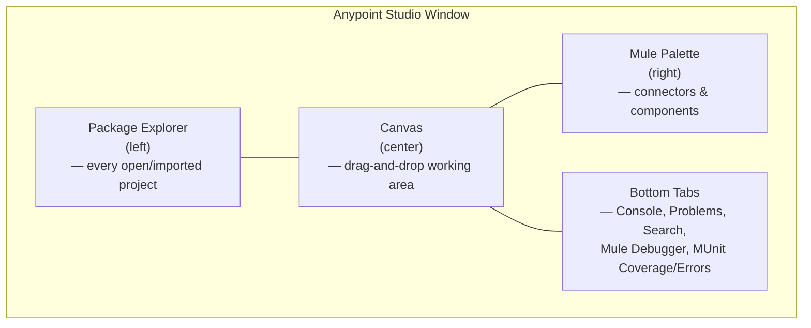
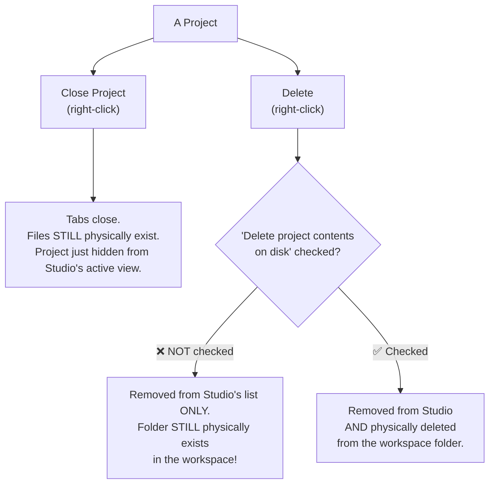
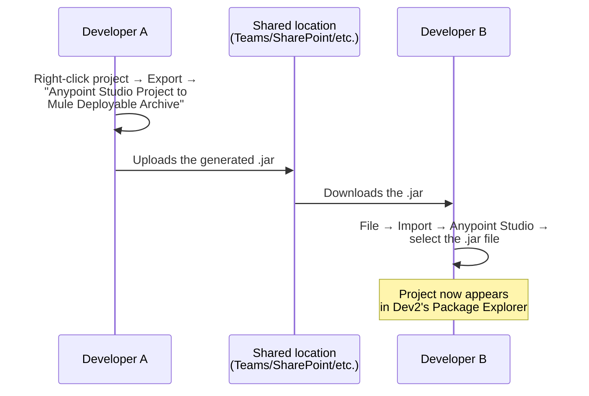
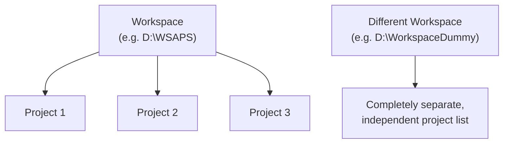
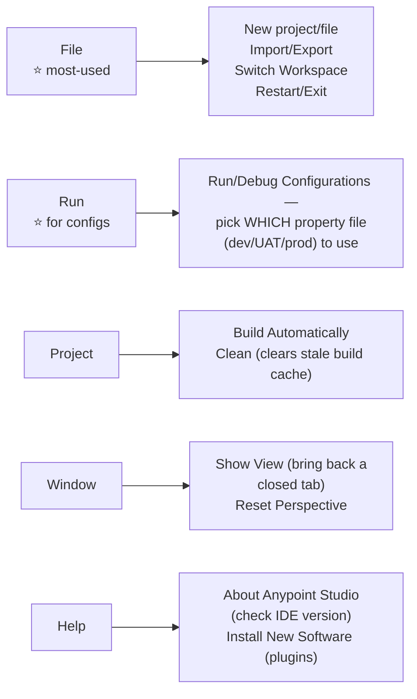
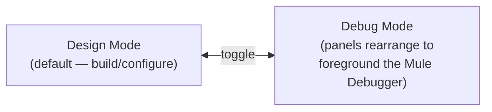

# Day 09 — Detailed Notes: Anypoint Studio UI Tour & Project Management

> **Watch alongside:** less conceptual, more "muscle memory" — the instructor's explicit advice is to deliberately practice every operation here once (open, close, delete, export, import, switch workspace) rather than discover them awkwardly for the first time mid-project, under time pressure, later.

---

## 1. The Studio Layout, Mapped

| Area | What lives here | When you'll look at it |
|---|---|---|
| **Package Explorer** | Every project currently open or imported, alphabetically sorted | Constantly — your project navigator |
| **Canvas** | The active file's visual flow (or XML/global-elements view) | Constantly — where you actually build |
| **Mule Palette** | All connectors/components available to the current project; "Add Modules" brings in more | Whenever adding a new connector/component |
| **Console** | Deployment logs, and step-by-step logs during Run/Debug | Every time you deploy or test — this is where Logger output actually appears |
| **Problems** | Detected issues across all open projects | When something looks broken and you're not sure why |
| **Search** | Project-wide search results | Searching a large multi-file project for a specific reference (e.g. "where is this queue name used?") |
| **Mule Debugger** | Step controls (Next/Resume) + "x+y" expression evaluator | Every time you're debugging — this is the tool used throughout `day07.md`'s payload/attributes/variables work |
| **MUnit Coverage / Errors** | % of components covered by tests; test failures | Once you're writing MUnit tests |

> 💡 **Tabs are freely rearrangeable** — drag any bottom tab to reposition it (e.g. the instructor moves the Mule Debugger to get a bigger panel while debugging). If the layout ever gets scrambled: **Window → Perspective → Reset Perspective** restores the defaults.

---

## 2. Project Lifecycle Operations — What Actually Happens on Disk

This is the part that trips people up: **"closing" and "deleting" a project in Studio don't behave the way you might assume relative to the files on disk.**

### The gotcha demonstrated live
If you delete a project **without** checking "Delete project contents on disk," and later try to create a **new** project with the **same name**, Studio will refuse — because a folder with that name **still physically exists** in the workspace, even though Studio's project list no longer shows it. The fix demonstrated: manually navigate to the workspace folder (via **right-click project → Show In → System Explorer**) and delete the leftover folder directly, or always check that box when you genuinely want a project gone.

### Close Unrelated Projects — a focus tool
Right-click any project → **"Close Unrelated Projects"** closes every *other* currently-open project at once, leaving only the one you're focused on. Useful when many projects have accumulated open tabs and you want a clean workspace without manually closing each one.

---

## 3. Export / Import — Sharing Projects as JAR Files

- A **JAR file** is the "machine-readable" form of your human-readable XML project — the same underlying concept as a deployable build artifact anywhere else in software.
- This export/import cycle is a genuine, demonstrated way to hand a project to a colleague without a shared code repository — though in real teams this is normally superseded by **Bitbucket/Git** (covered in the April batch course's `apr26.md`/`apr27.md`, for anyone cross-referencing).

---

## 4. Workspace — The Container, Not a Project

- A **workspace** is just the folder where Studio physically stores every project you create/import while pointed at it — it is *not* itself a project.
- **File → Switch Workspace** restarts Studio pointed at a **different** folder entirely — a completely independent set of projects, as if you'd installed a second, isolated copy of Studio.
- **Practical use cases for multiple workspaces:** isolating unrelated client work, or recovering cleanly if a workspace/project ever becomes corrupted (start fresh in a new workspace rather than fighting a broken one).

---

## 5. Menu Bar — What Developers Actually Use

| Menu | Real-world use | Frequency |
|---|---|---|
| **File** | New/Import/Export/Switch Workspace/Restart | Very frequent |
| **Edit** | Cut/Copy/Paste/Select All | Rare — usually done via right-click or keyboard shortcuts instead |
| **Source** | Format (auto-tidy XML) | Rare |
| **Navigate** | — | Essentially unused day-to-day |
| **Search** | Project-wide search | Occasional, genuinely useful on large projects |
| **Project** | Build Automatically (default: on), Clean | Occasional — Clean is the "when something's acting weirdly stale, wipe the cache" fix |
| **Run** | Run/Debug **Configurations** specifically | Needed once you're managing multiple environments/property files, not for a plain default run |
| **Window** | Show View, Reset Perspective | Whenever the layout gets messed up or a tab vanishes |
| **Help** | About (version check), Install New Software (plugins, e.g. EGit for Bitbucket/Git integration) | Occasional |

> 🧠 **A subtle but important distinction:** a plain **Run** just uses default settings. **Run Configuration** (via the Run menu, not the plain Run button) is where you'd specify something like "use the UAT property file for this particular run" — this becomes essential once a project has per-environment property files (covered conceptually in `day08.md`'s `src/main/resources` discussion).

---

## 6. Design Mode vs. Debug Mode

Debug mode isn't a different tool — it's the **same Studio window, rearranged** to prioritize the debugging panels (Mule Debugger front-and-center) since that's what you need visible while stepping through a breakpoint session. Toggle manually via a switch in the canvas's top-right, or it happens automatically when you launch a debug session.

---

## Quick Recap

- **Package Explorer** (projects) + **Canvas** (working area) + **Mule Palette** (components) + **bottom tabs** (Console/Debugger/Search/etc.) is the whole Studio layout — everything else is a variation on these four zones.
- **Closing** a project ≠ deleting it — files remain. **Deleting** without checking "delete contents on disk" leaves a stale folder behind that can silently block creating a new project with the same name later.
- **Export → JAR → Import** is a legitimate (if now largely superseded by Git) way to hand a project to someone else.
- A **workspace** is just a folder container for projects — switching workspaces gives you a totally independent project list, useful for isolation or recovering from corruption.
- Of the whole menu bar, **File, Run (specifically Run/Debug *Configurations*), Project (Clean), Window (Reset Perspective), and Help (Install New Software)** are what you'll actually reach for regularly — the rest (Edit, Source, Navigate) is largely superseded by right-click actions and keyboard shortcuts.
