# Day 10 — Detailed Notes: URI Params vs. Query Params, Pagination, Strict Validation

> **Watch alongside:** the instructor calls this out directly — "even people with 3-6 years of experience still confuse URI params and query params." This file exists to make sure you're not one of them. It's also a rare, refreshingly honest look at the gap between documented best practice and real-world practice.

---

## 1. The One-Rule Distinction

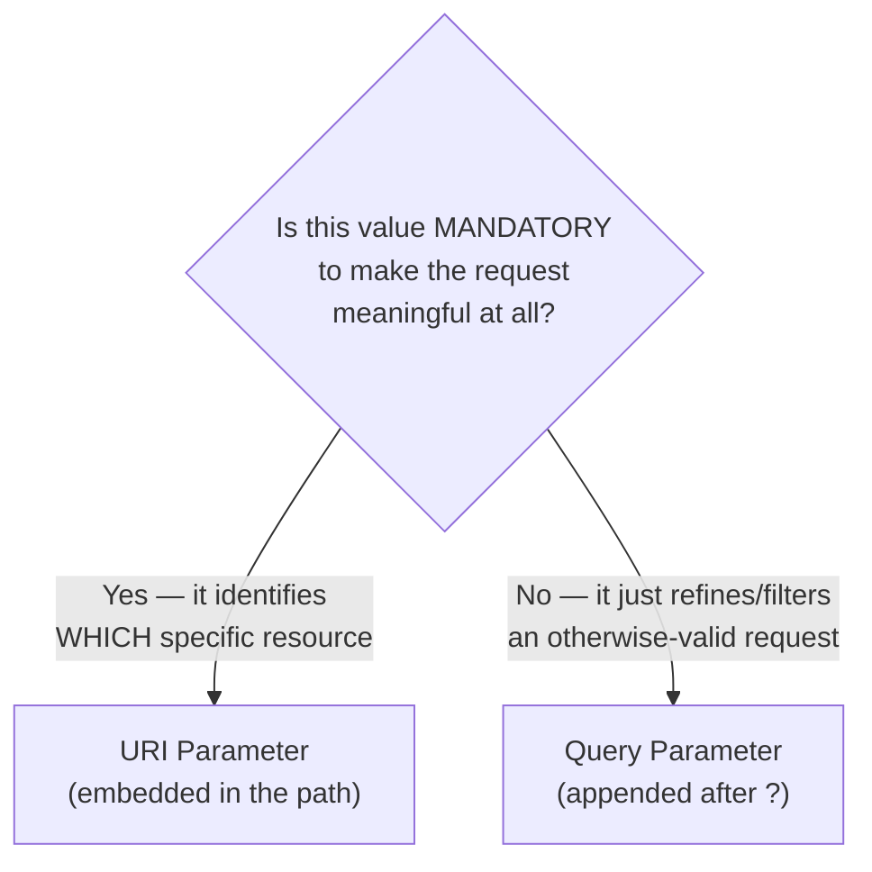

> **"Get employee details" with no ID at all doesn't make sense** — the ID is mandatory, so it's a URI parameter. **"Get all employees"** filtered by `status=active` still makes perfect sense **without** the filter (it would just return everyone) — so `status` is optional, hence a query parameter.

---

## 2. URI Parameters ("Path Parameters")

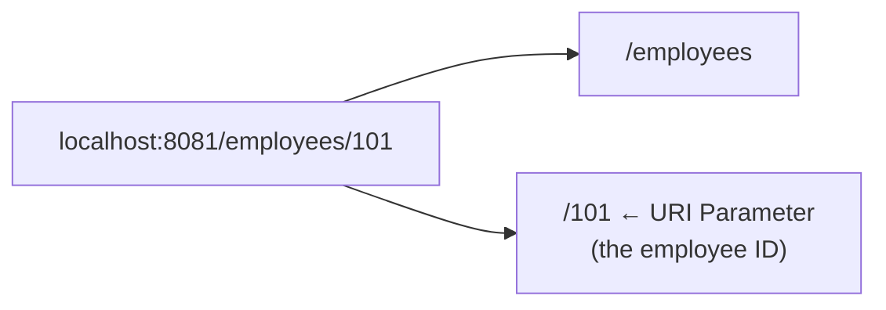

- **URI = Unique Resource Identifier.** The value uniquely picks out *one specific* resource instance.
- **Real-world analogy used:** an employee ID, or a bank account number — many people might share a name ("Mahesh"), but an ID/account number is guaranteed unique to exactly one record.
- **Access in Mule:** `attributes.uriParams.employeeId`
- **Multiple URI params are fine:** e.g. `/departments/{deptId}/employees/{empId}` — nesting is common when a resource is naturally scoped under a parent.
- **Defined where:** either directly on the Listener path configuration, or — more commonly in real projects — as part of the **RAML API specification** during the Design phase.

---

## 3. Query Parameters — The 3 Canonical Uses

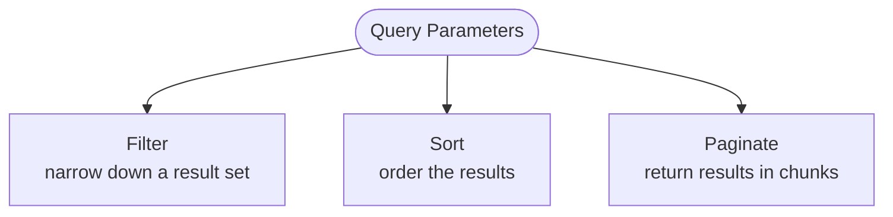

### Filter — worked example
```
GET /employees?status=inactive
```
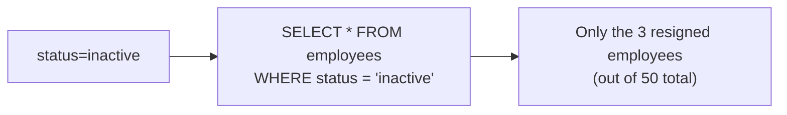
`attributes.queryParams.status` is read inside Mule and dropped directly into the WHERE clause of the underlying query (via a bound parameter, as shown in `day05.md`'s dynamic query pattern).

### Sort — worked example
```
GET /employees?status=active&orderBySalary=asc
```
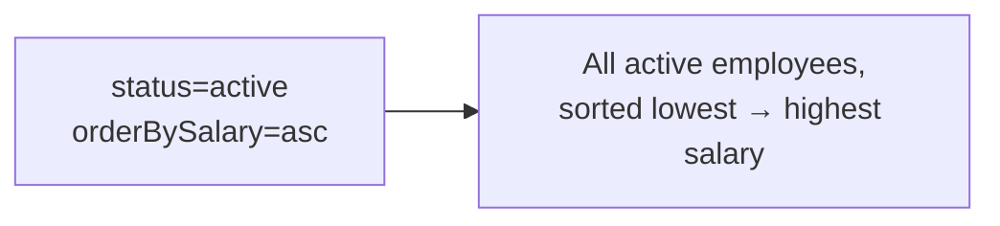
Sorting and filtering commonly combine in the same request — the query parameters are independent flags that each add their own clause to the underlying query logic.

### Paginate — the offset/limit mechanism, fully worked
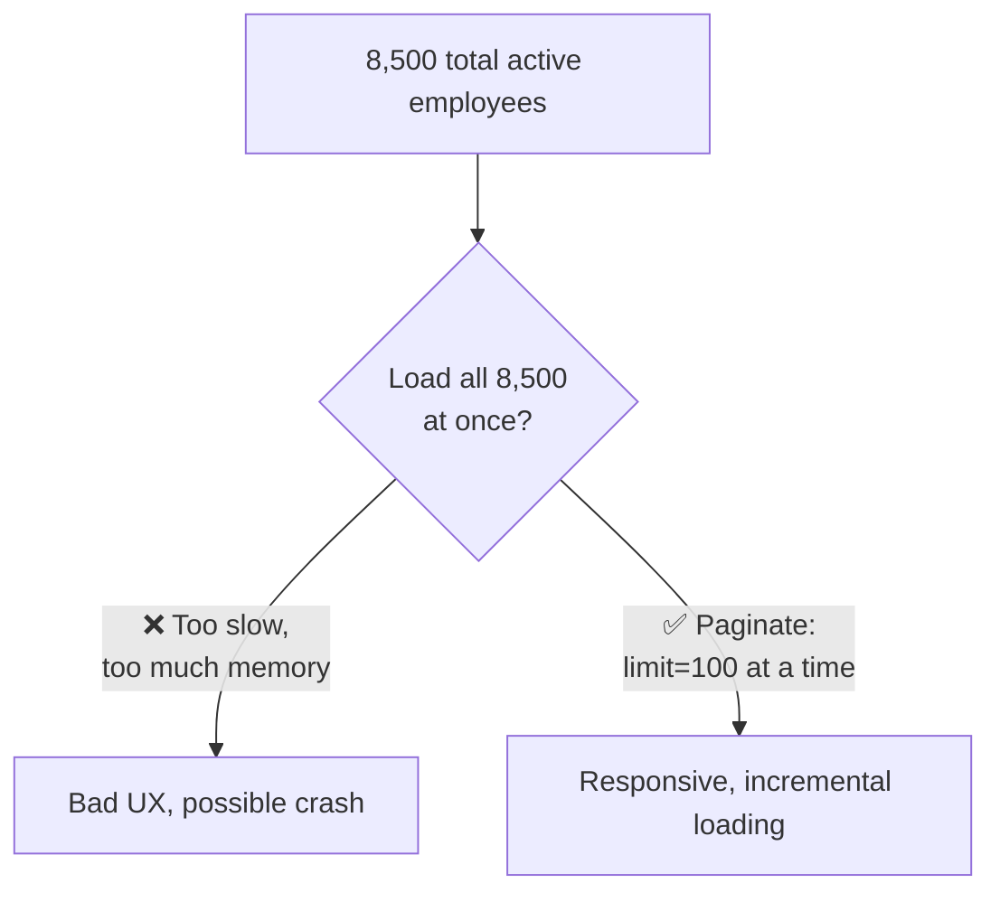

| Page | `offset` | `limit` | Records returned |
|---|---|---|---|
| 1 | 0 | 100 | 1–100 |
| 2 | 100 | 100 | 101–200 |
| 3 | 200 | 100 | 201–300 |
| N | (N-1)×100 | 100 | ... |

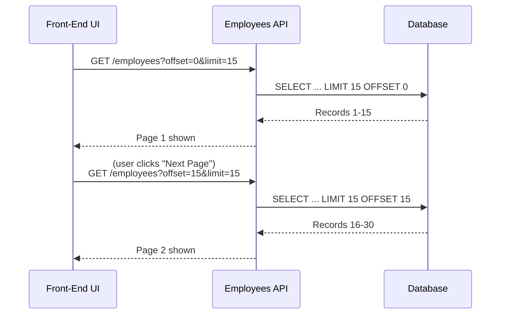

- **How the specific chunk size (15? 100?) gets decided:** not arbitrarily — real teams run **performance testing** to find the size that balances page-load speed against how many round-trips a user has to make. The instructor's framing: sending 25 records might take 75ms, sending 75 might be too slow — this is an empirical tuning decision, not a guess.
- **Business context changes what "acceptable latency" even means:**
  - **Customer-facing, revenue-sensitive** (e.g. Flipkart product search): users abandon within seconds — pagination/response speed has real, measurable business cost.
  - **Internal/back-office** (e.g. an HR report of all resignations this month): a 5-second wait is completely fine — nobody is going to leave for a competitor over it.
  - **The lesson:** *how* you design pagination (and performance more generally) should be informed by *who's actually waiting* and *what it costs the business if they wait longer*, not a one-size-fits-all rule.

---

## 4. Strict Validation — The Misconception That Trips Up Even Experienced Developers

### The misconception
> "I defined exactly 5 query parameters in my RAML spec, so the API will automatically reject anything else."

**This is false by default.** Unless you explicitly enable enforcement, MuleSoft will happily accept **more** than what you declared.

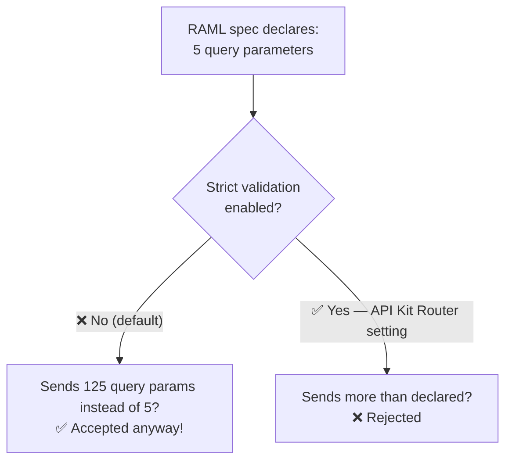

### The actual fix: API Kit Router settings
After importing a RAML spec into Studio, the generated **API Kit Router** configuration exposes two explicit toggles:
- **"Query Parameters Strict Validation"**
- **"Headers Strict Validation"**

Enabling these makes the router **reject** any request containing parameters/headers beyond exactly what the spec declares.

### Why this is a genuine security concern, not just pedantry
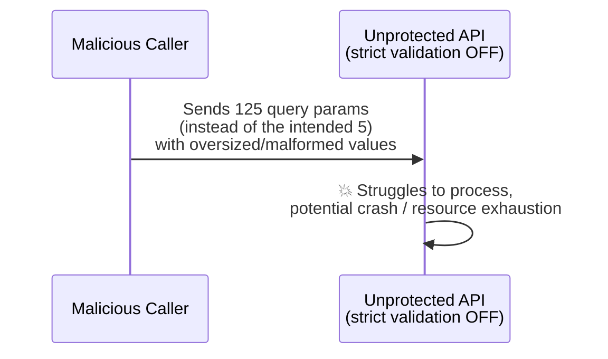
Without strict validation, nothing technically prevents a malicious caller from flooding an endpoint with far more parameters than intended, potentially degrading or crashing the application. **URI parameters don't need this setting** — since they're baked directly into the URL's fixed structure, there's no equivalent way to "send extra" ones the way you can with query params or headers.

---

## 5. `additionalProperties` — The Body-Level Equivalent

For the **request body** (not headers/query params), RAML's schema (`type`) definitions support:
```raml
type: object
additionalProperties: false
properties:
  employeeId: integer
  employeeName: string
```

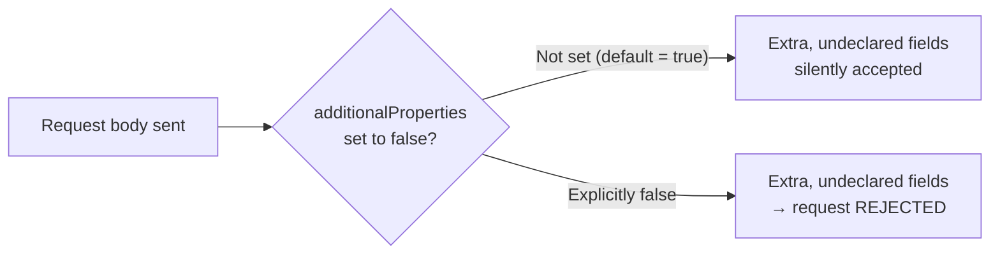

Field-level constraints stack on top of this — e.g. `minLength`/`maxLength` on a string field — but again, **only if explicitly configured**. Nothing is automatically restrictive; every guardrail here is opt-in.

---

## 6. Why Best Practices Aren't Always Followed — An Honest Take

The instructor's own candid admission: **most real organizations, including ones they've personally worked in, don't rigorously enable strict validation or field-length limits everywhere**, even though the mechanisms exist and are well understood. The traffic-rule analogy returns here: *"there's no strict, hard-and-fast rule forcing everyone to follow this — it's advisory, and human nature means not everyone follows every rule unless something forces the issue."*

### What actually correlates with stricter enforcement in practice
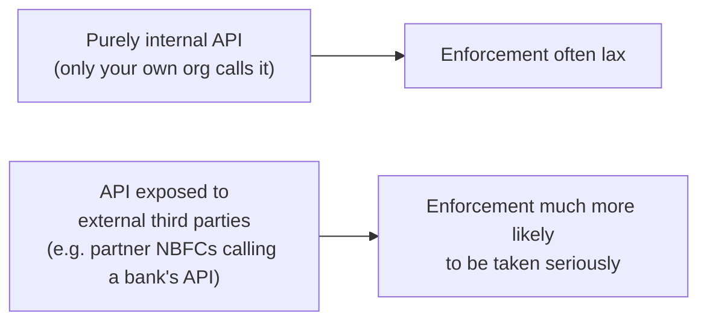

**Worked example from the lecture:** a bank's API consumed by multiple external Non-Banking Financial Companies (NBFCs) for loan processing is a scenario where strict validation genuinely matters — the API is exposed beyond the organization's own control, raising the real stakes of an uncontrolled/malicious caller. A purely internal API used only by your own team's other services carries comparatively lower (though still non-zero) risk.

> 🧠 **Interview framing:** you should be able to (a) correctly explain URI vs. query params, (b) explain that RAML declarations alone don't enforce anything at runtime, and (c) name the specific mechanisms (API Kit Router strict validation, `additionalProperties: false`) that actually do enforce it — this combination is exactly what separates a candidate who's only read about REST from one who's actually built and secured a real API.

---

## Quick Recap

- **URI parameter** = mandatory, identifies exactly *which* resource. **Query parameter** = optional, refines *how* you want an otherwise-valid request answered (filtered/sorted/paginated).
- **Pagination via `offset`/`limit`** trades one big slow response for many small fast ones — the right chunk size is an empirical, performance-tested decision, and how much latency is acceptable depends entirely on who's waiting and what it costs the business.
- **Declaring parameters/headers in RAML does NOT automatically reject anything extra** — that requires explicitly enabling **API Kit Router's strict validation** settings (query params, headers) and, for the body, `additionalProperties: false`.
- In practice, strict enforcement correlates with how **externally exposed** an API is — but the mechanisms exist and are worth knowing regardless of whether a given team actually turns them on.
