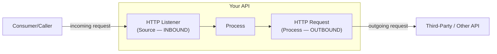
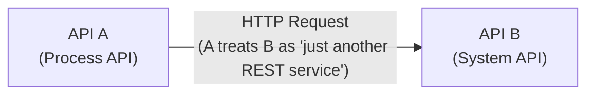
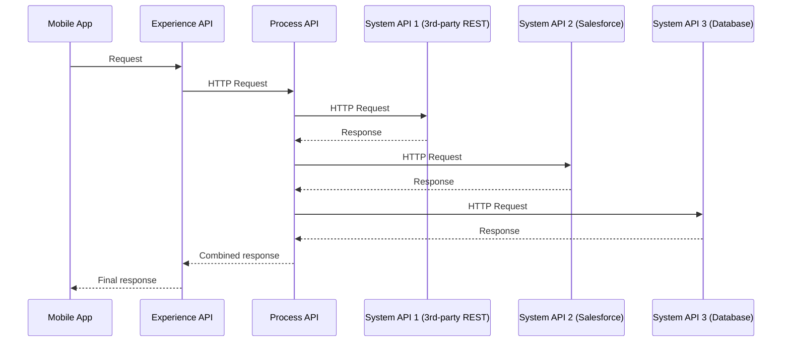
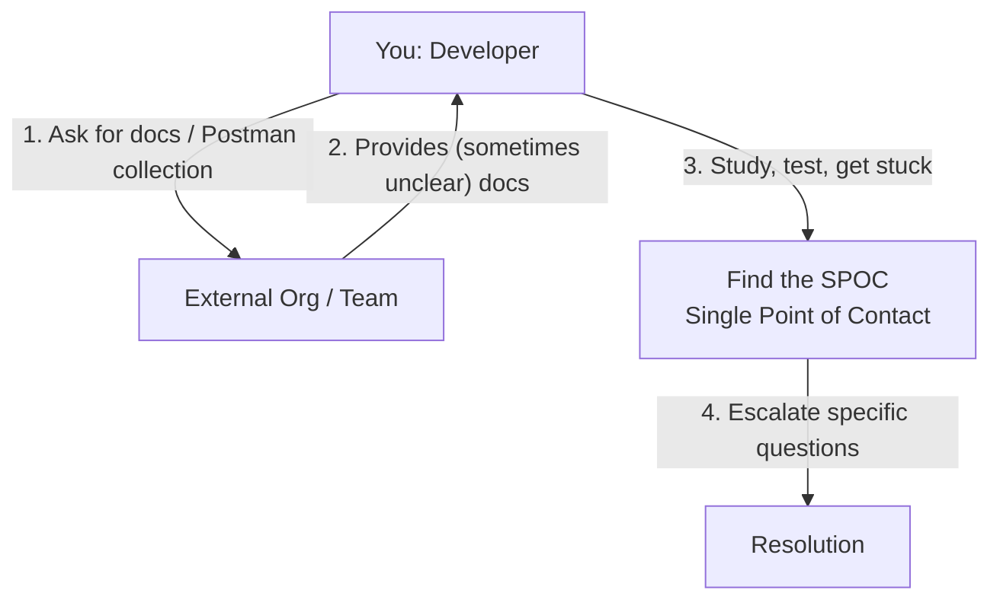
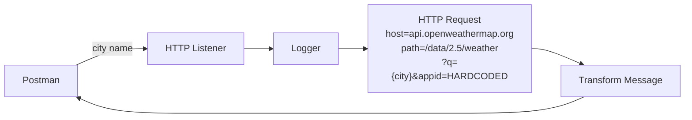
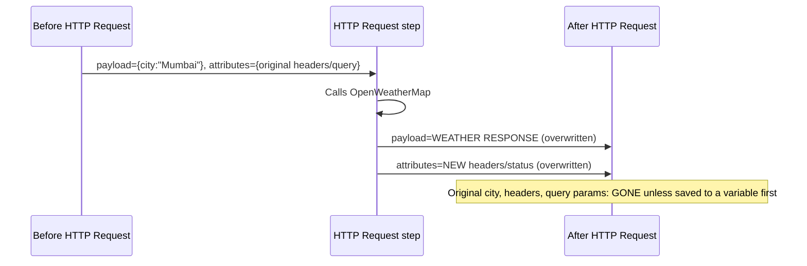
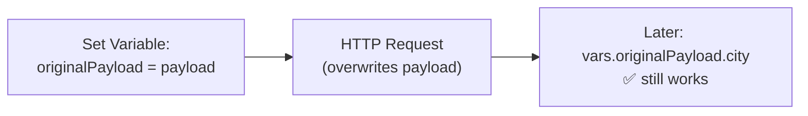

# Day 11 — Detailed Notes: The HTTP Request Connector (Consuming Third-Party REST Services)

> **Watch alongside:** this is the day the course flips from "exposing your own API" to "calling someone else's" — arguably the single most universally-used skill in real MuleSoft work, since virtually every integration needs to call at least one outside system.

---

## 1. Listener vs. Request — Two Halves of the Same Coin

| | Listener | Request |
|---|---|---|
| Direction | **Inbound** — accepts requests | **Outbound** — makes requests |
| Section | Source only (structurally enforced) | Process only (structurally enforced) |
| Job | Expose your own API | Consume someone else's REST service |
| Use frequency | Once per API | *"Used by a MuleSoft developer every day"* |

**The key mental correction this session makes**: two APIs never *directly* talk to each other. What looks like "API A calls API B" is really: **API A's flow contains an HTTP Request step that treats API B as just another REST service to consume** — mechanically identical to consuming a public third-party API like OpenWeatherMap.

---

## 2. Where HTTP Request Sits in API-Led Connectivity

Every arrow between layers in API-Led Connectivity (Day 04) is an **HTTP Request**, since every layer is a REST API. This is stated directly as true **~99.9% of the time**.

**Terminology that comes with this** — same request, different names depending on who's asking:

| Role | Also called |
|---|---|
| Whoever sends the request | Consumer, Client, Source |
| Whoever answers the request | Producer, Service Provider |

---

## 3. Real-World Friction: Consuming Someone Else's API

- **A well-behaved external API gives you a Postman collection** — test it directly before writing any Mule code.
- **Real documentation is often incomplete or unclear** — even senior engineers struggle with it sometimes. The fix isn't guessing; it's finding the right **SPOC** and escalating.
- **400 Bad Request is the client's fault; the API owner should tell you exactly what was wrong** (wrong type, missing field) so you can self-correct.

---

## 4. Hands-On Build: OpenWeatherMap Integration

- **Host/port resolution, demystified**: `api.openweathermap.org` is a human-friendly alias — behind it is an actual IP + port, exactly the same host+port model already used for `localhost` throughout the course.
- **Query parameters**: `q` is bound **dynamically** to `payload.city`; `appid` is **hardcoded**, deliberately — it's genuinely constant across every request, so dynamic binding would add complexity for zero benefit.
- **A real syntax bug demonstrated live**: a number typed into a query-param field got auto-converted to expression ("fx") mode, which then required **double-quoting** — *"no matter how the number is sent, it should be in double quotes"* inside an expression context. A red dot doesn't always mean "error" — check the Configuration XML tab to be sure.

---

## 5. The Overwrite Problem, Once More — Now for HTTP Request

**Universal rule, restated directly**: *"whenever there is a connector, [payload and attributes get overwritten] — variables are not overwritten unless you change them."* This is true for **every** connector — Database (Day 07), HTTP Request (here), and (as Day 12 will show) Salesforce too.

**The fix — save what you'll need, before the call**:

---

## Quick Recap
- **Listener = inbound/exposing. Request = outbound/consuming.** Both are structurally locked to their sections by Studio itself.
- **Every layer boundary in API-Led Connectivity is an HTTP Request call**, since Experience/Process/System are all REST APIs.
- **Consuming a real third-party API is genuinely messy** — get their Postman collection, read docs carefully, find a SPOC when stuck. This is normal, not a sign you're doing something wrong.
- **HTTP Request overwrites payload and attributes exactly like Database does** — the same "save to a variable first" pattern from Day 07 applies identically.
