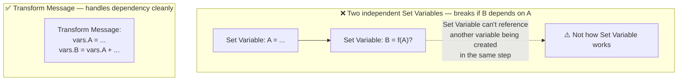
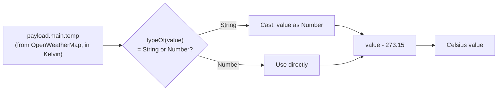
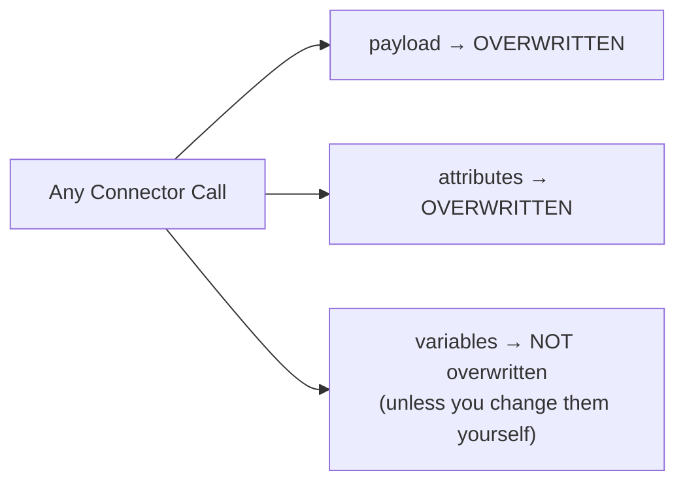
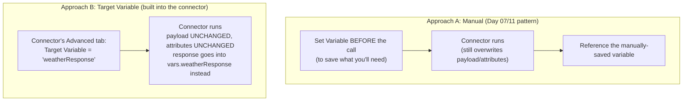
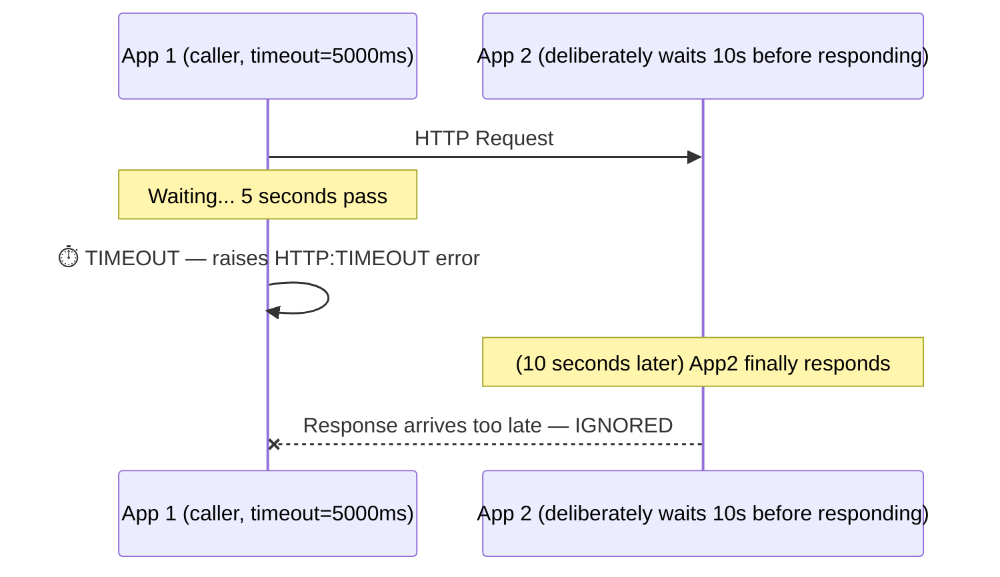
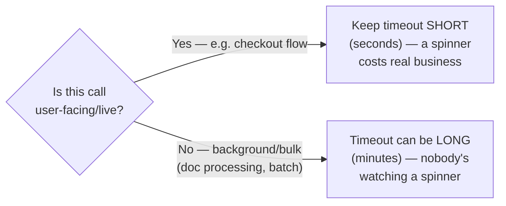

# Day 12 — Detailed Notes: Shaping Responses, DataWeave Playground, Target Variable, Response Timeout

> **Watch alongside:** this is where the weather API demo actually becomes *useful* — reshaping a messy third-party response into a clean one — and where two genuinely important "best practice" connector settings (Target Variable, Response Timeout) get their full explanation.

---

## 1. Transform Message vs. Chained Set Variables — the Dependency Problem

The concrete reason to prefer Transform Message over chaining Set Variable components: **when one value you're creating depends on another value you're also creating**, Transform Message expresses that naturally in one place; two separate Set Variable components cannot cleanly reference each other's in-progress output.

---

## 2. Kelvin → Celsius: A Full Worked DataWeave Debugging Example

- **Don't assume the formula — look it up.** *"I don't know now, so what do I do? Google."* This is presented as completely normal, expected professional behavior.
- **Don't assume the type either.** Use `typeOf(value)` to check whether a value pulled from JSON is actually a String or a Number before doing arithmetic on it — DataWeave doesn't always coerce silently, and relying on it to do so is fragile.
- **The DataWeave Playground** (a separate, standalone MuleSoft website) is the fast way to iterate on an expression like this — paste sample JSON, write the expression, see the result instantly, without redeploying a whole Mule project.

---

## 3. "Propagation" — the Formal Name for the Overwrite Rule

This is the exact same rule from Day 07/11, now given its formal name: **propagation**. It applies uniformly to *any* connector — Database, HTTP Request, Salesforce, everything.

---

## 4. Target Variable — a Cleaner, Built-In Alternative to Manual Preservation

- **Where it lives**: any connector's **Advanced** tab (demonstrated on HTTP Request; the same field exists on Database, Salesforce, etc. — it's a generic connector feature, not HTTP-specific).
- **What changes when you use it**: the connector's response is redirected into the **named variable you specify** — `payload` and `attributes` are left **completely untouched**, not just recoverable-after-the-fact. This is strictly cleaner than the manual pattern, since nothing is lost in either direction.
- **Proven live, not just described**: setting a Target Variable *without* updating the downstream Transform Message mapping causes a real, predicted failure (`null minus a number`) — proving the response genuinely stopped landing in `payload`. Fixing the mapping to read `vars.weatherResponse` instead resolves it.
- **Naming discipline matters**: an unclear Target Variable name makes it hard to trace where a value came from later — name it after the connector/system it represents.

---

## 5. Response Timeout — Full Mechanics, With a Two-App Proof

- **Default: 10,000ms (10 seconds).** Exceeding it raises an `HTTP:TIMEOUT` error automatically.
- **Configurable at two levels**: the shared **Connector Configuration** (applies to every operation using it) and the individual **operation** (overrides just that one call) — the same dual-level pattern as Reconnection Strategy (Day 13).
- **The two-app proof, built live**: App 2 is rigged with a DataWeave `wait` function to deliberately delay 10 seconds. App 1 calls it with a 5-second timeout. Result: App 1 times out at 5 seconds and never sees App 2's eventual (valid but late) response — it's simply discarded.

### The Real Production Story
> *"We deployed 8 applications... a specific use case: we consume a third-party API that takes 120 seconds... people are accepting it, because it's happening in the background."*

**The key judgment**: response timeout isn't just a technical safety net — it's a **business decision** about how long a real human is willing to wait, weighed against how long the actual dependency genuinely needs.

---

## Quick Recap
- **Transform Message beats chained Set Variables specifically when one value depends on another.**
- **Always verify type with `typeOf` before arithmetic**; cast explicitly with `as Number` rather than assuming coercion.
- **"Propagation"** = the formal name for payload/attributes-overwritten, variables-preserved.
- **Target Variable** (any connector's Advanced tab) is a cleaner alternative to manual pre-call variable-saving — it redirects the response entirely, leaving payload/attributes untouched.
- **Response Timeout** defaults to 10s, configurable at connector or operation level — the "right" value is a UX/business judgment, not a technical constant.
