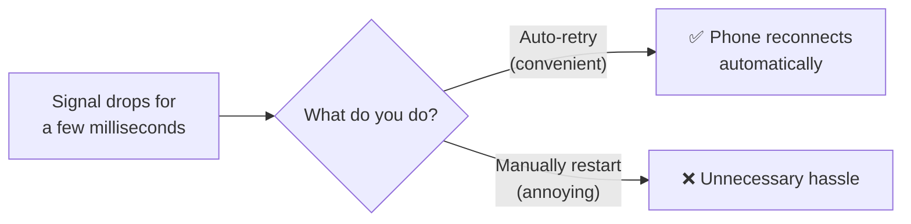
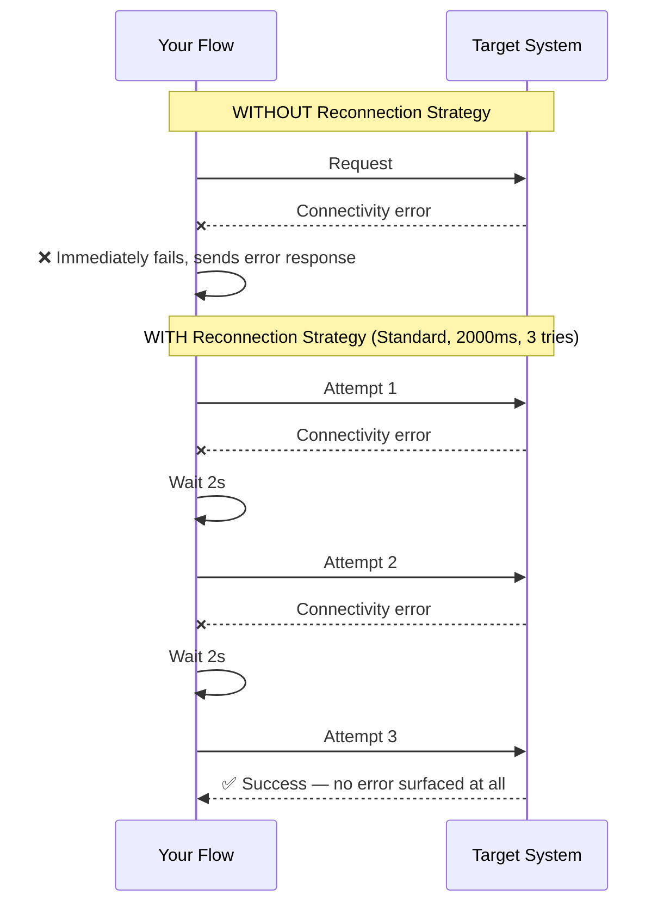
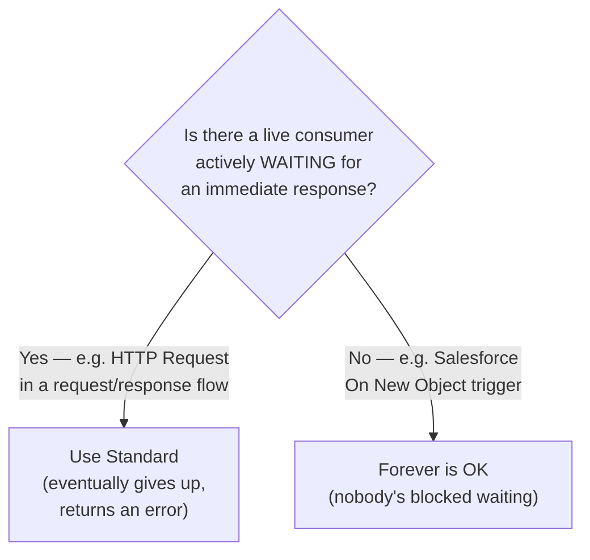
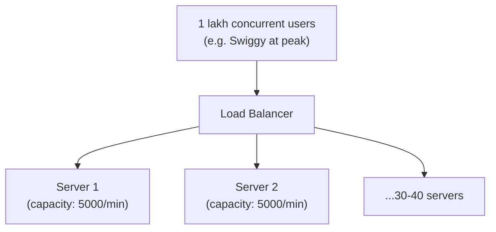
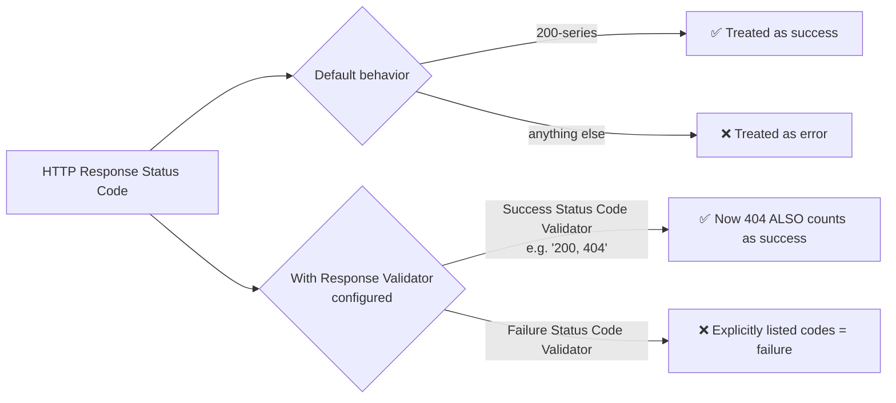
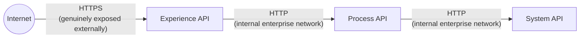

# Day 13 — Detailed Notes: Reconnection Strategy & Response Validator

> **Watch alongside:** two connector "best practices" that show up on every senior developer's checklist — handling flaky networks gracefully, and knowing you can (rarely, deliberately) redefine what "success" even means.

---

## 1. Reconnection Strategy — The Mobile-Signal Analogy, Fully Mapped

Applied to an HTTP Request call: a **brief, intermittent** connectivity blip (milliseconds) is fundamentally different from a **real outage** (half an hour, unrecoverable by retrying). Reconnection Strategy exists specifically for the first case.

### Without vs. With Reconnection Strategy

**The honest tradeoff, quantified**: if the underlying call would normally take 150ms but needs 2 retries, the *total* elapsed time becomes ~4+ seconds. This is a deliberate cost accepted in exchange for resilience — not free.

### The Three Modes

| Mode | Behavior | When to use |
|---|---|---|
| **None** | No retry (default) | When you explicitly don't want this behavior |
| **Standard** | Retry N times, fixed interval (industry-common default: 2000ms × 3) | **Synchronous request/response** — a live caller is waiting, so you must eventually give up and answer them |
| **Forever** | Retry indefinitely, no cap | **Source-level, event-driven connectors only** — e.g. Salesforce's "On New Object" trigger, where nothing is actively waiting on an immediate response |

**This is a universal, connector-agnostic concept** — the exact same setting, with the same three modes, exists on Database, Salesforce, and HTTP Request connectors alike, configurable at the shared Connector Configuration level or per individual operation.

---

## 2. How Real Production Traffic Actually Works (a useful mental model correction)

- Real APIs have finite capacity; requests beyond it get rejected, not queued forever.
- **Multiple servers exist for reliability, not just capacity**: *"if I put it in one API/server, and there is an issue and it is down, then the whole application will be stopped."*
- **Correcting a natural beginner assumption**: solo Postman testing (one request, wait for response, send next) is nothing like real production traffic, which is highly concurrent — each request's reconnection/retry logic is evaluated independently, per-instance.

---

## 3. Response Validator — Redefining "Success"

- **Default, unconfigured behavior**: 200-series = success, everything else = error. This is what every prior session has relied on implicitly.
- **The override mechanism**: on the Request operation's Response tab, **Success Status Code Validator** / **Failure Status Code Validator** let you explicitly redefine this — with range syntax like `400..499`.
- **Proven live**: configuring Success = `200, 404` and then sending a request that triggers a real 404 from OpenWeatherMap — confirmed, via the debugger, that the flow proceeds past the HTTP Request step as if it succeeded.
- **How rarely this should be used, stated directly**: *"it rarely comes, but in such situations... you should use this option."* A genuine escape hatch for unusual business needs (e.g. "not found" being an expected, valid outcome for some specific workflow) — not a casual override.

---

## 4. HTTPS — Where It Actually Matters in a Layered Architecture

**The direct conclusion**: typically, only the **outermost, internet-facing layer** (Experience API) genuinely needs HTTPS. Layer-to-layer traffic behind it, within your own organization's private network, is commonly plain HTTP — though (as covered on Day 04) "internal" is never automatically "unregulated" in industries like banking.

---

## Quick Recap
- **Reconnection Strategy** absorbs brief network glitches automatically — **Standard** for synchronous calls with a waiting caller, **Forever** only for event-driven source connectors with nobody actively blocked.
- **This concept is universal across connectors** — same three modes, same dual configuration levels, regardless of which connector.
- **Response Validator** lets you redefine what counts as success/failure beyond the 200-series default — a rare, deliberate override, not a default habit.
- **HTTPS belongs at the internet-facing edge of your architecture** — internal layer-to-layer calls typically stay plain HTTP.
