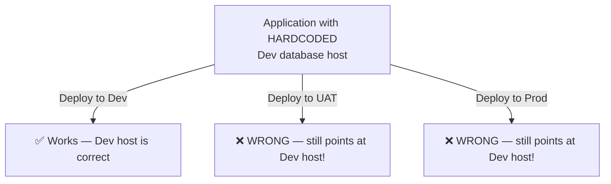
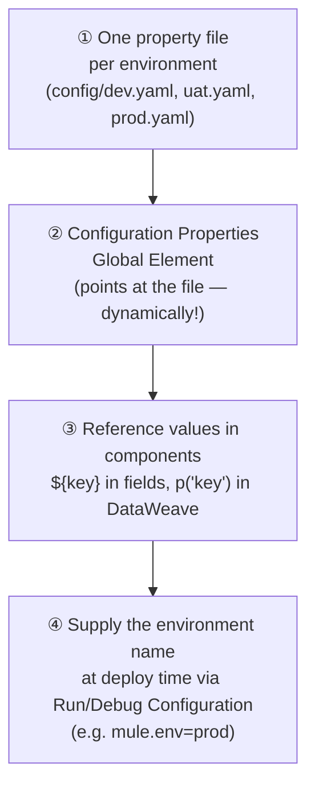
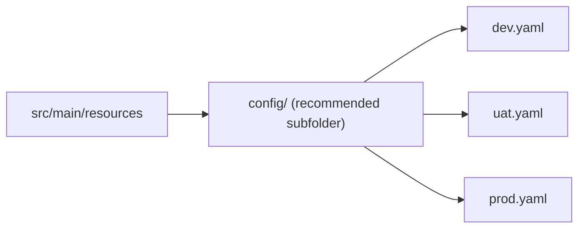
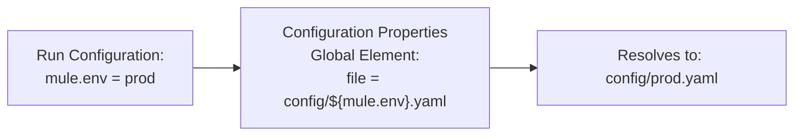
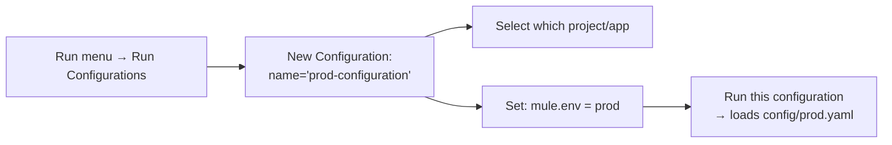
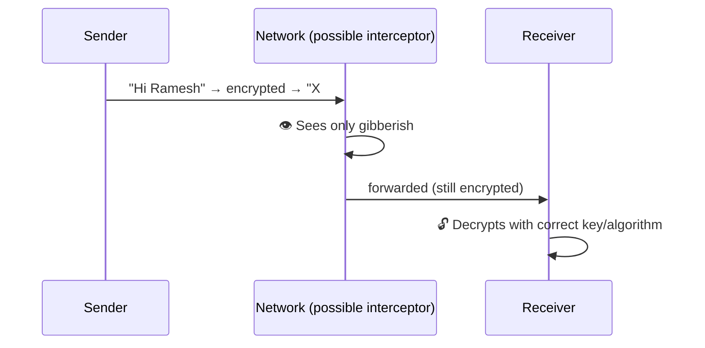
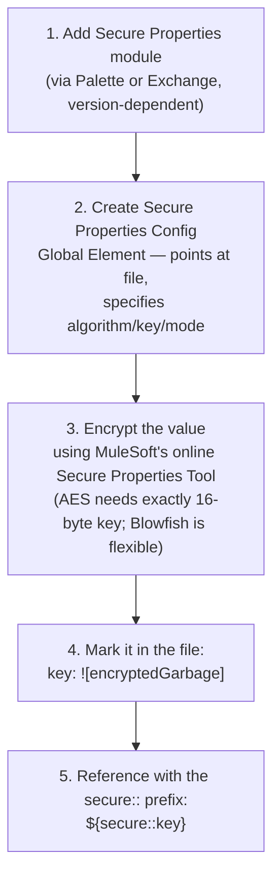

# Day 14 — Detailed Notes: Property Files, Environment Externalization, Run Configurations, Secure Properties

> **Watch alongside:** the instructor flags this directly as *more* important for real work than for interviews — this is the mechanism that makes "the same code deploys correctly to Dev, UAT, and Prod" actually true, rather than aspirational.

---

## 1. The Core Problem — Why Hardcoding Breaks Across Environments

**The fix**: externalize every environment-specific value (hosts, ports, credentials, API keys) into a separate property file **per environment**, and make the application load the *right* one dynamically at deploy time — never hardcoded.

---

## 2. The 4-Step Pattern, as a Repeatable Flow

### Step 1 — Files, organized

- **Key insight**: the **key names** (e.g. `host`) are identical across all three files — only the **values** differ. Your application code references the key the same way regardless of environment.
- `.yaml` and `.properties` are **functionally identical** — a pure team/architect style convention, zero technical performance difference.

### Step 2 & 4 — The Dynamic File Path (the actual magic)

This is the crux of the whole session: the Configuration Properties element's file path **itself contains a variable** (`${mule.env}`), and that variable's actual value is supplied **only at deploy time**, via a **Run Configuration** or **Debug Configuration** (Run menu → Run Configurations) — never by hand-editing the file reference for each deployment.

### Step 3 — Two Different Syntaxes, By Context
| Context | Syntax | Example |
|---|---|---|
| Plain connector config field | `${key}` | Listener host field: `${host}` |
| Inside a DataWeave expression | `p('key')` | Inside Transform Message: `p('host')` |

> Honestly flagged as a fact to just memorize, without a deeper justification offered: *"I don't have any rule as to why we should do this."*

---

## 3. Deploying With the Right Environment — Run Configurations, Fully Shown

- **A real, live debugging sequence, worth remembering**: switching configurations initially failed — traced first to a stale resource path, then to a genuine `404 City Not Found` from a wrong test value — both diagnosed the same way as every prior session: **use the Mule Debugger, don't guess.**
- **A practical gotcha**: the toolbar's plain Run/Debug buttons use **whichever configuration was most recently active** — not always "the first one." Be deliberate about which configuration is currently selected before using the quick shortcut.

---

## 4. Encryption & Secure Properties — Protecting Sensitive Values

### The WhatsApp Analogy

**Encryption = converting readable data into unreadable data**, reversible only with the correct key/algorithm. Symmetric (same key both ways) vs. asymmetric (different keys) is mentioned but explicitly deprioritized — *"we don't have to be experts on this."*

### The Practical, Hands-On Mechanism

**Two real, live mistakes demonstrated (both authentic, not staged)**:
1. **Proven live that the Secure Properties module genuinely matters**: removing it makes the Secure Properties Config option disappear entirely from Global Elements.
2. **A forgotten `secure::` prefix**: leaving a plain `${key}` reference where `${secure::key}` was needed caused the connector to use the raw, still-encrypted garbage value directly — a very easy, realistic mistake to make and a good habit to double-check.

**Practical scope note**: most real projects only need this for a handful of values (3-4) — passwords, API secrets. A bulk/file-based approach exists for many secure values at once but is explicitly deprioritized here as rarely needed.

---

## Quick Recap
- **Never hardcode environment-specific values.** Externalize to one property file per environment, with identical keys and different values.
- **The dynamic file path is the actual mechanism** — `config/${mule.env}.yaml`, with `mule.env` supplied only at deploy time via a Run/Debug Configuration.
- **`${key}` in config fields, `p('key')` in DataWeave** — two different syntaxes for the same underlying property lookup.
- **Sensitive values must be encrypted** (AES needs a 16-byte key; Blowfish is more flexible), marked with `![...]`, and referenced with the `secure::` prefix — forgetting that prefix is a real, easy mistake worth checking for explicitly.
