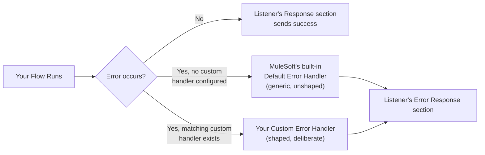
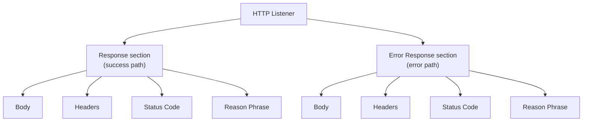
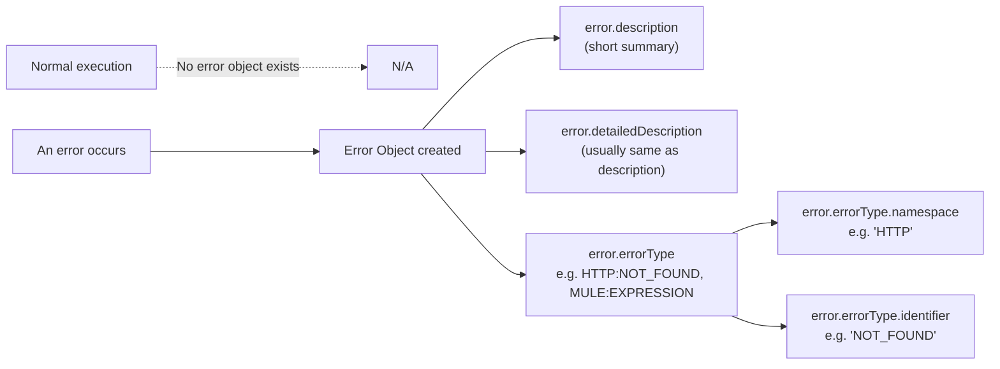
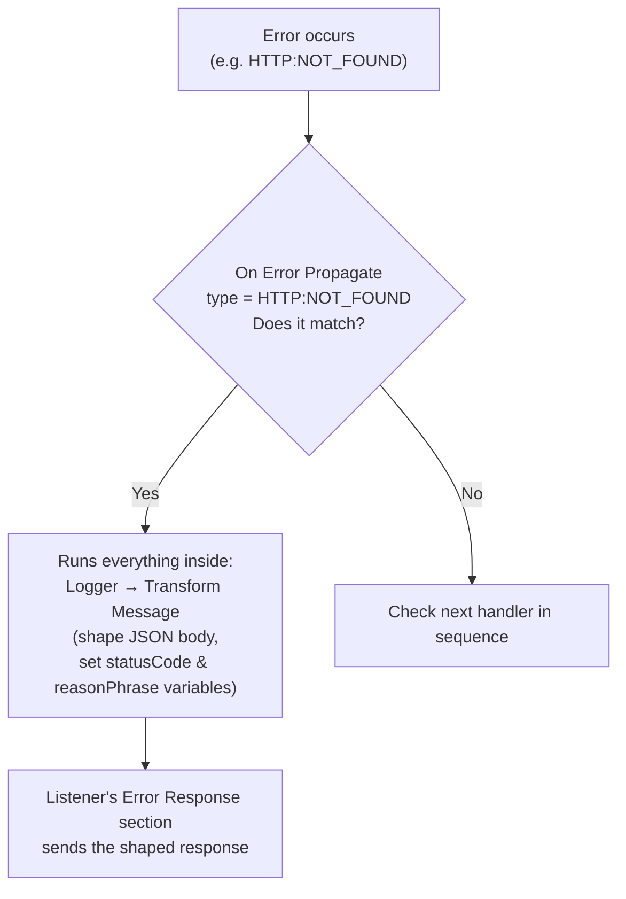
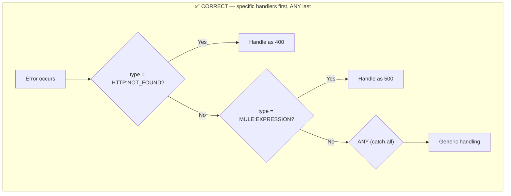
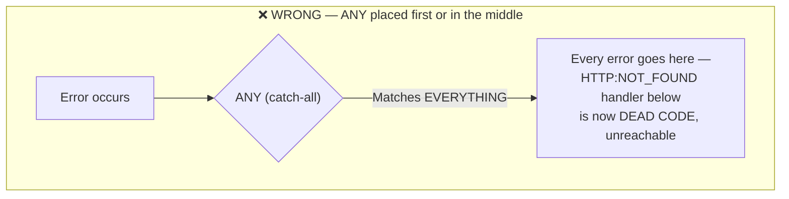
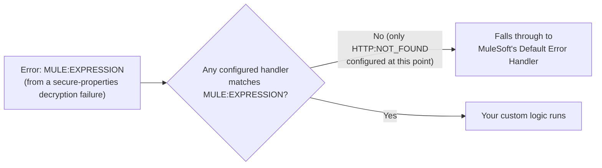

# Day 15 — Detailed Notes: Error Handling — The Error Object, On Error Propagate, and the "ANY Must Be Last" Rule

> **Watch alongside:** the single most consequential *ordering* rule in the entire course lives here — get it backwards, and every specific error handler you write silently becomes dead code.

---

## 1. Default vs. Custom Error Handling

Everything worked in prior sessions **despite no explicit error handling** — because the default handler was silently doing *something*. This session replaces that generic fallback with deliberate, shaped responses.

---

## 2. The Listener's Two Parallel Sections

Both sections have the **exact same four sub-fields** — which one gets used is determined purely by whether the flow completed successfully or hit an error. If unconfigured, the system fills in sensible defaults automatically.

---

## 3. The Error Object — Only Exists When Something Actually Breaks

**`errorType` is the field used for matching** in error-handling logic — it's what a handler's `type` filter checks against.

**A live, honest example of a confusing bug**: a leftover mapping mistake (`null - 273.15`) from an earlier session produced `MULE:EXPRESSION` instead of the intended `HTTP:NOT_FOUND` demo — a real reminder to check the *actual* error object rather than assuming which error you're looking at.

---

## 4. On Error Propagate — Building a Real Custom Handler

**The deliberate design judgment, not a mechanical rule**: deciding whether a given failure is "the client's fault" (4xx) or "the server's fault" (5xx) is a call the team makes, not something derived automatically. Example: a `404` from a wrong city name was deliberately mapped to `400` in the custom response (client sent bad data), even though the underlying third-party response was itself a 404.

---

## 5. ⭐ The Critical Rule: ANY Must Always Be LAST

This is the single most consequential ordering rule demonstrated in this whole session — worth its own dedicated diagram.

**Why this happens, precisely**: MuleSoft checks error handlers **in sequence, top to bottom, stopping at the first match**. Since `ANY` matches literally every possible error type, placing it anywhere except dead last means it intercepts everything before any more-specific handler ever gets a chance — silently turning your carefully-built specific handlers into unreachable code, with no warning.

**Proven live, twice**, specifically because the instructor considers this non-obvious enough to risk getting backwards on a first pass — demonstrating both the failure mode (ANY misplaced) and the fix (ANY correctly last, with a specific `HTTP:NOT_FOUND` case still correctly reaching its own dedicated handler).

---

## 6. A Live Proof of "Unmatched Falls Through to Default"

This was demonstrated as a genuine, unplanned moment (an authorization test expected to produce `HTTP:UNAUTHORIZED` instead produced `MULE:EXPRESSION` from a decryption issue) — concrete, live proof that errors not matching *any* configured handler (and with no `ANY` catch-all yet in place) genuinely do fall through to MuleSoft's built-in default behavior, rather than crashing or silently disappearing.

---

## Quick Recap
- **Default error handling exists automatically** — custom handling replaces it with deliberate, business-meaningful responses.
- **The Error Object** (`description`, `detailedDescription`, `errorType` + its `namespace`/`identifier`) only exists once an error actually occurs — inspect it live via the debugger.
- **On Error Propagate** matches a specific type, runs your logic (log → shape response → set status/reason variables), and routes to the Listener's Error Response section.
- **Deciding 4xx vs. 5xx for a given failure is a team judgment call**, not a mechanical rule.
- **`ANY` must always be the last handler in sequence** — matching stops at the first hit, so `ANY` placed earlier silently swallows every error and makes every subsequent specific handler permanently unreachable. This is the single rule in this session worth double-checking in any real project.
