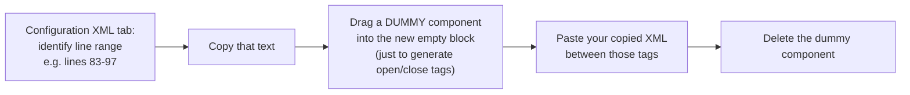
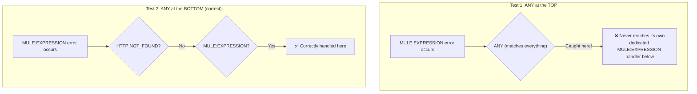
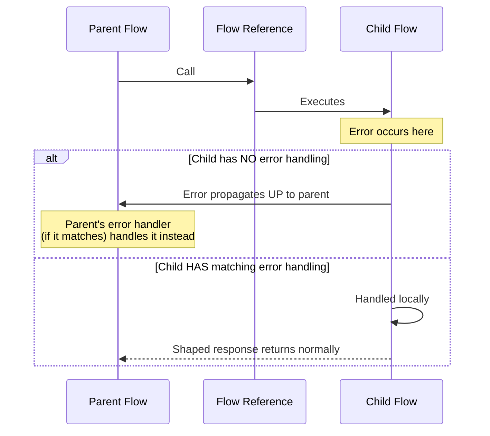
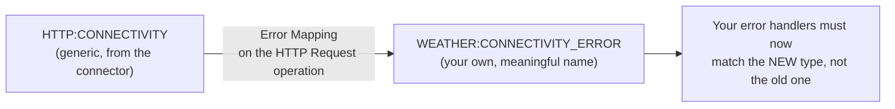
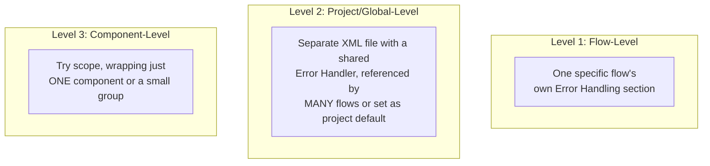
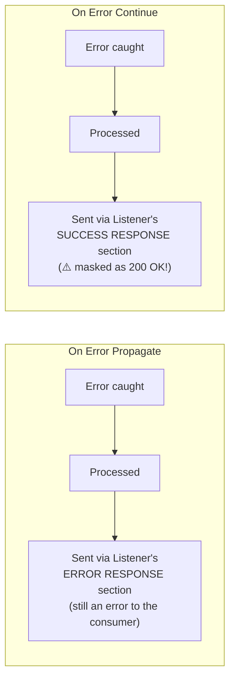
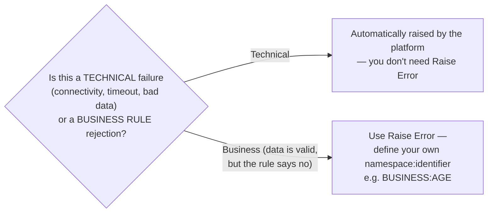
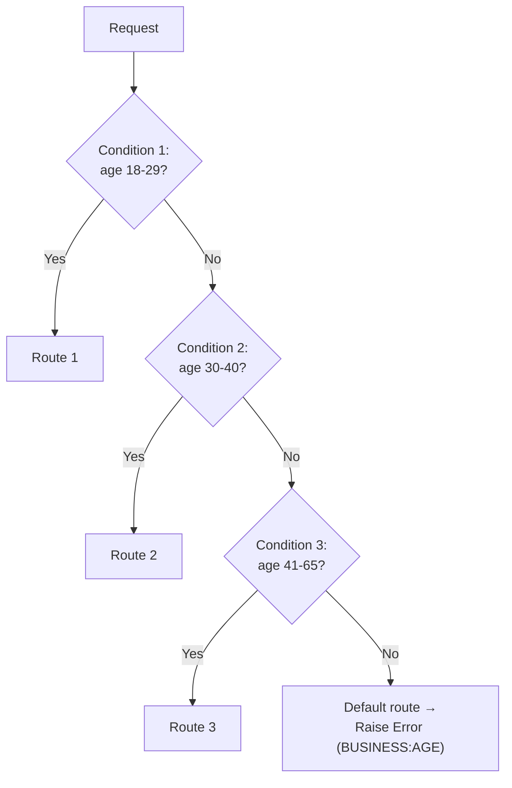

# Day 16 — Detailed Notes: Error Mapping, Three Levels of Error Handling, On Error Continue, Raise Error, Choice

> **Watch alongside:** the practical continuation of Day 15's error handling — this is where the "ANY must be last" rule gets proven a second time (deliberately), and where you learn the three distinct *scopes* at which error handling can live.

---

## 1. A Real Studio Technique: Copy-Paste via Raw XML

This is a genuinely useful, real-world technique for reusing already-built logic (like a Logger + Transform Message combo) without manually rebuilding it. Accept Studio's offer to regenerate a duplicate `Doc:Id` when prompted — this connects directly to Day 08's MUnit lesson: match by `Doc:Name`, not `Doc:Id`, precisely because IDs regenerate like this.

---

## 2. ANY Must Be Last — Proven a Second Time, By Design

The instructor deliberately re-demonstrates this — moving ANY via XML cut/paste, testing, then moving it back — specifically because getting this backwards is easy and consequential. Two independent tests: ANY-first swallows a specific error that has its own handler; ANY-last lets that same error reach its dedicated handler, while a genuinely *unmatched* error (`HTTP:CONNECTIVITY`, untested elsewhere) correctly falls through to ANY.

---

## 3. On Error Propagate Across Parent/Child Flows (Flow Reference)

**Calling flow = parent. Called flow = child** — regardless of how many flows are chained. Error propagation always travels back toward the ultimate source (the Listener) unless intercepted by a matching handler along the way.

---

## 4. Error Mapping — Renaming a Generic Error Into Your Own

A rare but real technique: once mapped, a handler still configured to match `HTTP:CONNECTIVITY` **no longer catches the error** — it genuinely *is* the new custom type by the time it's raised. Proven live.

---

## 5. Three Levels of Error Handling

- **Flow-level**: what's been built so far — dragged directly into one flow. Proven live: an empty flow's Error Handling section genuinely has no XML tags at all until you populate it.
- **Project-level**: build a shared `Error Handler` scope in its own XML file, then either (a) reference it explicitly from a specific flow, or (b) set it as the project's **Default Error Handler** via a Configuration element — applying it automatically to every flow that doesn't override it.
- **Component-level**: **Try scope** — for when only one component (or a few) needs isolated error handling distinct from the rest of the flow. Build via drag-and-drop, or select components first and **right-click → "Wrap In."**

---

## 6. On Error Continue vs. On Error Propagate — The Real Distinction

**Proven live**: with On Error Continue, a genuine `HTTP:CONNECTIVITY` failure still results in an actual **200 OK** response.

**The honest, important caveat**: *"do we use this [as a blanket flow-level strategy]? We don't... we use it [10-20% of the time], and only with a Try scope"* around specific risky components — e.g. inside a For Each loop or Scatter-Gather, so one item's failure doesn't abort processing of the rest. **Never** a way to hide real failures from the consumer at the whole-flow level.

---

## 7. Raise Error — Business Rules, Not Technical Failures

**Worked example**: a loan application with age 68, when the business rule requires 18-65. Technically valid data, every system working fine — just a case the business rejects. `Raise Error` creates a genuine Error Object with your custom `errorType` and `description`, inspectable exactly like any automatically-generated one.

---

## 8. Choice Router — Same "Sequential, First-Match-Wins" Idiom as Error Handling

Conditions are checked **in sequence, stopping at the first match** — exactly the same evaluation pattern as error-type matching. A mandatory **default** branch (here, wired to Raise Error) catches anything not matched by an explicit condition.

---

## Quick Recap
- **XML copy-paste is a real, practical Studio technique** for reusing logic without rebuilding it.
- **ANY-must-be-last was proven twice**, deliberately — this ordering mistake is easy enough to warrant a second demonstration.
- **Error Mapping** renames a generic connector error into your own custom type — rare but real.
- **Three levels of error handling: Flow, Project/Global, Component (Try scope)** — each solving a different scope problem.
- **On Error Propagate keeps failures visible; On Error Continue masks them as success** — the latter is a narrow tool for specific loop/parallel scenarios, never a blanket strategy.
- **Raise Error is for business-rule rejections; Choice router uses the same sequential-matching idiom as error handling.**
