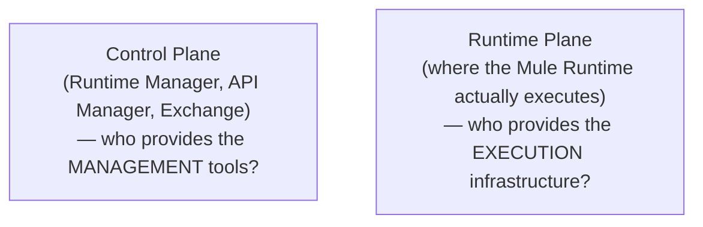
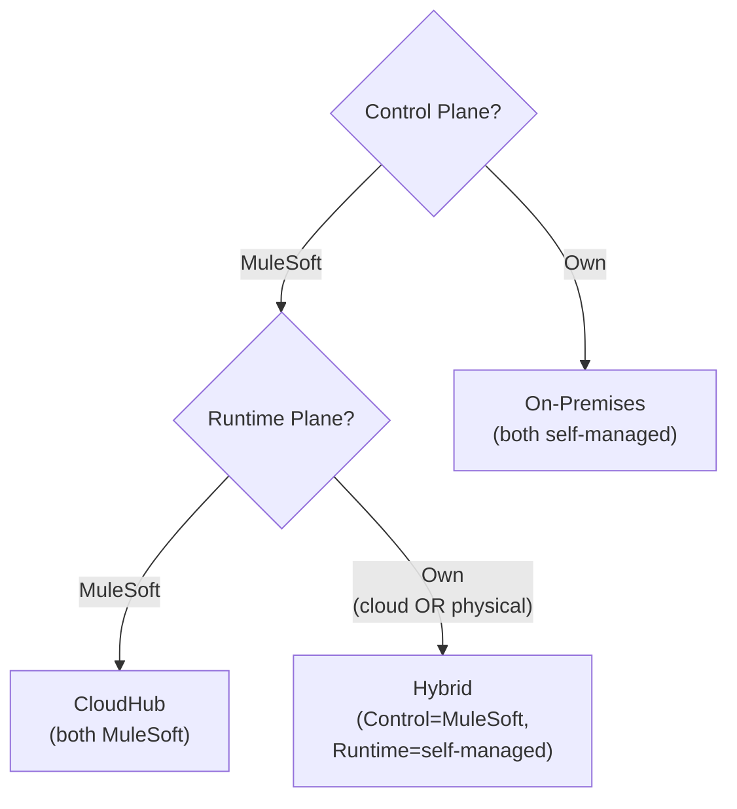
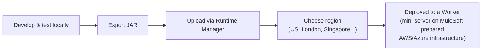
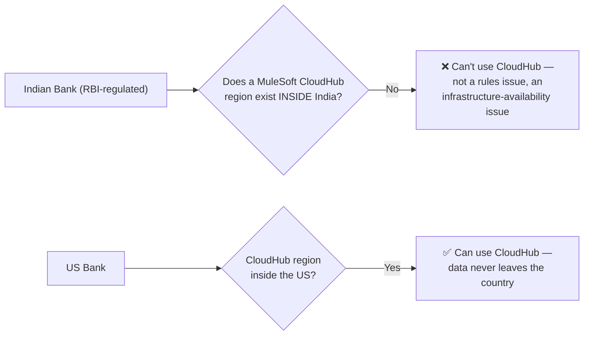
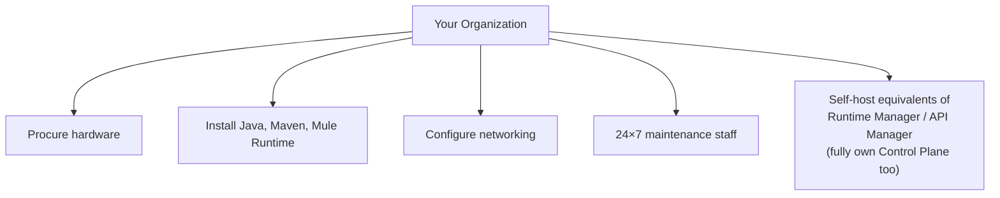
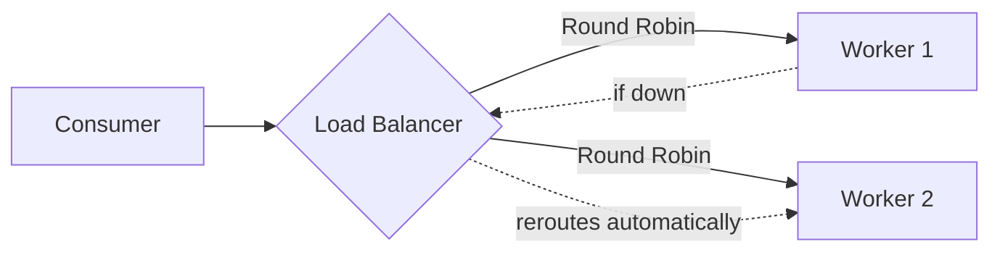
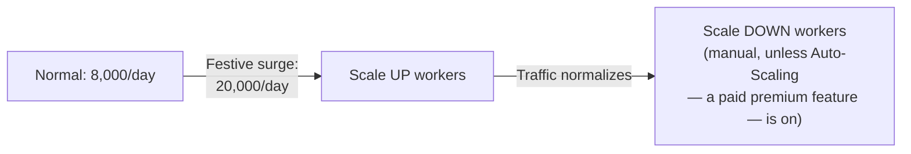

# Day 17 — Detailed Notes: Deployment Strategies — Control Plane, Runtime Plane, and Choosing Between CloudHub/On-Prem/Hybrid/RTF

> **Watch alongside:** the two-factor model (Control Plane × Runtime Plane) presented here is the single cleanest mental model for a question that confuses people even after years of real MuleSoft experience: "wait, are we on-premises or hybrid?"

---

## 1. The Two Factors That Actually Decide Deployment Strategy

Both are answered independently as either **"MuleSoft"** or **"our own organization"** — the combination of the two answers determines the strategy.

**The single most-confused distinction, resolved directly**: an organization using its **own private AWS/Azure cloud** for the runtime — not CloudHub — is still **Hybrid**, not CloudHub, because the deciding factor is *who manages the Mule Runtime*, not whether the underlying hardware happens to be physical or cloud-hosted.

---

## 2. CloudHub — Full Picture

**Why region matters — the recurring compliance thread from Day 04**:

The constraint isn't "cloud is forbidden" — it's "no compliant *CloudHub* region exists in that specific country," which is a genuinely different, more precise fact than the common oversimplification.

---

## 3. On-Premises — Full Ownership, Full Burden

Who uses it: highly regulated industries (banking, healthcare) — the ICICI Bank example, driven by both data-residency rules and highly sensitive data (account numbers, credit card numbers).

A useful nuance: "on-premises" doesn't require *owning* a building — renting dedicated space/servers in a third-party data center (with the office-lease analogy: paying rent, getting shared cleaning/coffee/meeting-room services, but full control of your own space) still counts, as long as **you** manage the actual infrastructure.

---

## 4. Load Balancing and Scaling

**Why multiple workers — reliability, NOT speed**:
> *"Processing speed doesn't improve, actually — there is only one [real] reason: high availability."*

| | Shared Load Balancer | Dedicated Load Balancer |
|---|---|---|
| Who uses it | Multiple companies, same CloudHub environment | Your organization exclusively |
| Cost | Included | Premium |
| HTTP/HTTPS ports | 8081 / 8082 | 8091 / 8092 |

Worker count directly drives licensing cost (vCore-based) — sizing is a genuine architectural/business decision, informed by performance testing, not a default to over-provision "just in case."

---

## 5. The Honest Career-Framing Close

> *"Even I didn't get any option to work on complete on-premises till now... you have 3 years of experience, done 2 projects, both CloudHub — do you have any other deployment strategy experience? No, not at all. That can also happen. You can clearly tell that in the interview as well... don't bluff."*

Narrow real-world exposure to deployment strategies is normal and should be stated honestly in interviews, not papered over.

---

## Quick Recap
- **Two independent factors — Control Plane and Runtime Plane — each either MuleSoft-provided or self-managed — produce four strategies**: CloudHub (both MuleSoft), On-Premises (both self), Hybrid (Control=MuleSoft, Runtime=self, cloud or physical), RTF (self-managed but containerized/auto-patched).
- **A private cloud runtime is still Hybrid, not CloudHub** — the deciding factor is who manages the runtime, not whether it's physical or cloud hardware.
- **Multiple workers exist for reliability, not raw speed.** Scaling is a real architectural decision tied to cost (vCore-based licensing) and performance testing.
- **Honest, narrow real-world experience is fine to admit in interviews** — overclaiming is explicitly discouraged.
