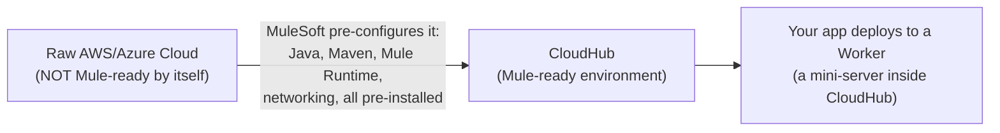
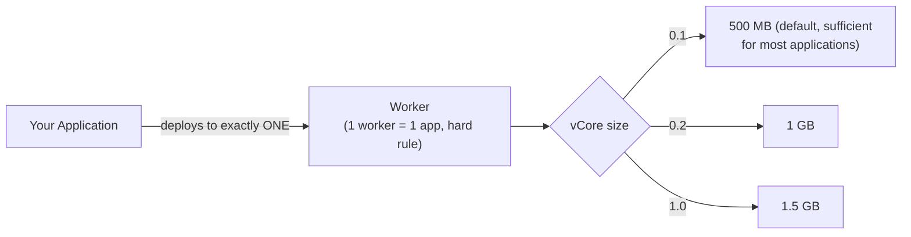
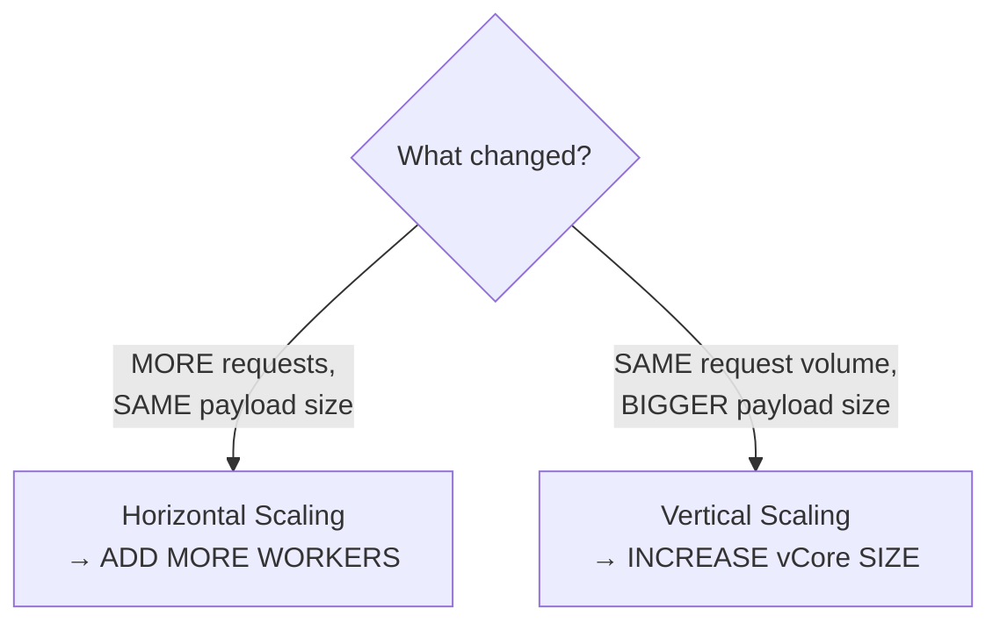
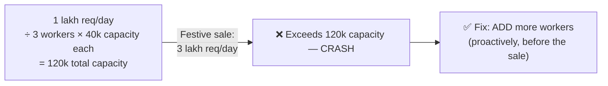
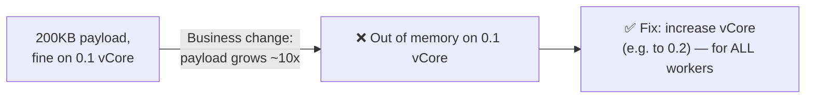
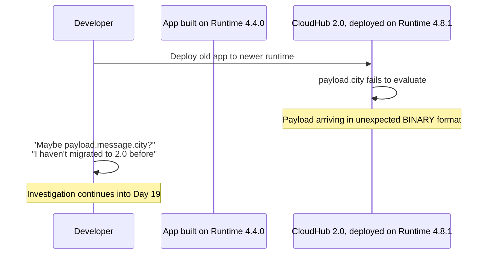
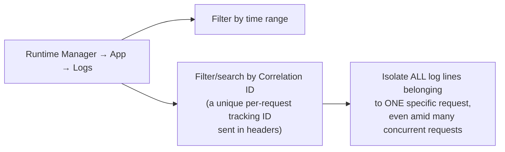

# Day 18 — Detailed Notes: CloudHub Deep Dive — Worker, vCore, Horizontal/Vertical Scaling

> **Watch alongside:** this session pairs theory with a genuinely messy, real, unresolved-within-the-session bug (a payload arriving in binary format after a runtime version jump) — worth watching specifically to see what real troubleshooting looks like, not just the clean end-state.

---

## 1. CloudHub = Integration Platform as a Service

You can't deploy a Mule app directly to raw AWS — MuleSoft's entire value-add is doing that preparation work for you, so deployment is just "log in and upload a JAR."

---

## 2. Worker and vCore — The Actual Units

**The phone-memory analogy for why sizing matters**: 2GB of phone memory handles 10-15 apps fine; 25-30 apps causes lag/failure. An under-provisioned worker behaves the same way under real request load — not a slowdown, a crash.

**Real cost anchor**: enterprise vCore licensing runs roughly $25,000/vCore over 2-3 years, with a realistic minimum around ₹70-80 lakhs — explicitly framed as enterprise-scale pricing, not something small organizations take on lightly.

---

## 3. Horizontal vs. Vertical Scaling — Fully Distinguished

### Horizontal — Worked Example With Real Numbers

Real ceiling: max 8 workers per application in practice — going beyond that is described as genuinely rare.

### Vertical — Worked Example, With a Critical Uniformity Rule

**A critical, proven-live constraint**: vCore size cannot be mixed across an application's own worker pool — *"if you give 0.2, you have to apply it to ALL of them."* Since Round Robin distributes requests indiscriminately across all workers, every worker must handle the full expected payload range uniformly, or some requests will randomly fail depending on which worker they land on.

---

## 4. A Real, Live, Unresolved Bug — Worth Studying As-Is

This bug is genuinely **not resolved within this session** — and that's presented as valuable precisely because it's authentic. The direct lesson drawn from it: *"it's always a good practice — first develop and test locally... after going [to a shared environment], the application will be deployed for 15-20 minutes, and it will fail — double time will be wasted."* (Day 19 resolves it: an outdated HTTP connector dependency version needed upgrading via `pom.xml`.)

---

## 5. CloudHub 1.0 vs. 2.0 — Terminology Map

| Concept | 1.0 | 2.0 |
|---|---|---|
| Compute unit | Worker | **Replica** |
| Sizing unit | vCore | **Replica Size** |
| Isolation | (implicit) | **Shared Space** vs. **Private Space** (hotel room analogy: shared room vs. dedicated room) |
| Fractional sizing | 0.1 minimum | Smaller fractions (e.g. 0.05) with *more* memory per fraction than 1.0's equivalent |

---

## 6. Logs and Correlation ID

Log retention on trial/default tiers: 30 days OR 100MB, whichever comes first — real organizations needing longer retention typically add a separate dedicated logging system.

---

## Quick Recap
- **Worker = 1 mini-server, exactly 1 app** (hard rule). **vCore = the memory/sizing unit** — 0.1 (500MB) handles most real applications.
- **Horizontal scaling (more workers)** = more requests, same size. **Vertical scaling (bigger vCore)** = same volume, bigger payloads — and vCore size must be uniform across all of an app's workers.
- **A real, unresolved version-compatibility bug was demonstrated live** — reinforcing "always test locally before deploying to a shared/higher environment."
- **CloudHub 2.0 renames Worker→Replica, vCore→Replica Size**, with generally better fractional sizing.
- **Correlation IDs are the real tool for isolating one request's logs** in a busy, concurrent log stream.
