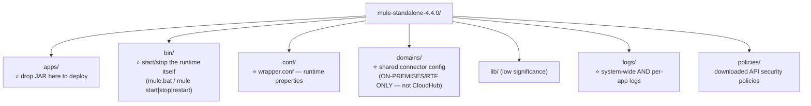
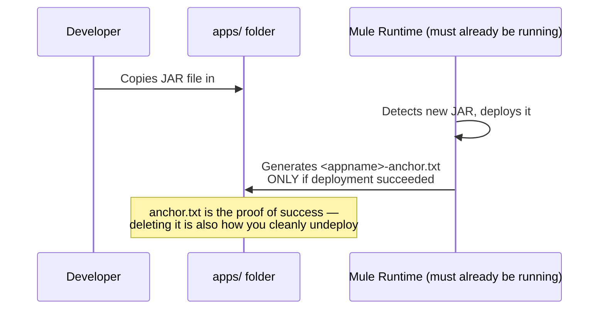
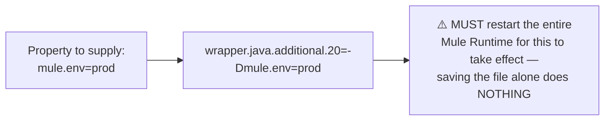
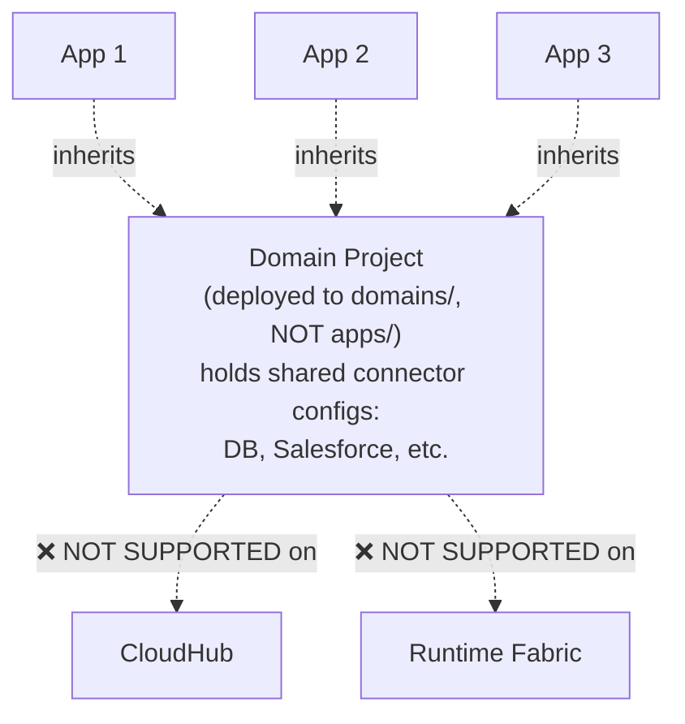
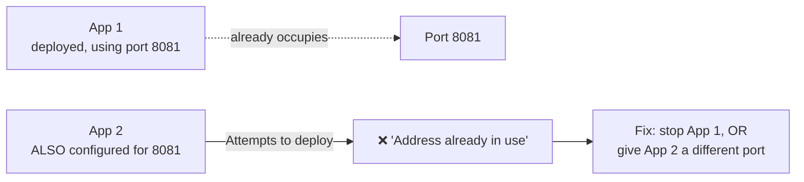
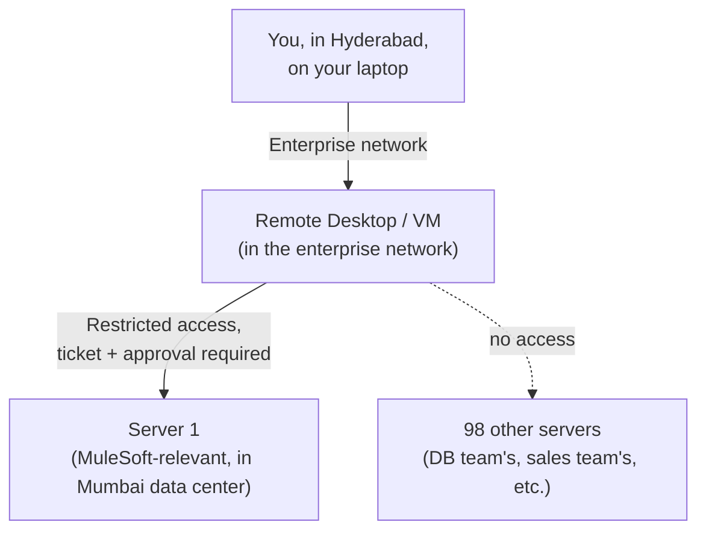

# Day 19 — Detailed Notes: On-Premises Deployment — Mule Runtime Standalone, Folder Structure, Domain Projects

> **Watch alongside:** this is the most "hands dirty" session in the deployment arc — real port conflicts, a real config-file numbering bug, and the exact folder-by-folder anatomy of a standalone Mule Runtime installation.

---

## 1. The Mule Runtime Folder Structure — Full Map

---

## 2. Deploying: Drop a JAR, Watch for `anchor.txt`

**Precondition, proven live**: the runtime must already be started (`bin/mule.bat` or `mule start`) — dropping a JAR into `apps/` before the runtime is running does nothing.

---

## 3. `conf/wrapper.conf` — Runtime Properties, With Two Real Live Bugs

**Bug #1 — duplicate index numbers, demonstrated live**: two properties both accidentally assigned index `18` → the runtime silently gets confused about which value to use. **Fix**: scan for the highest used index, assign genuinely unique numbers going forward (or jump to a clearly-unused range like 50/51 if unsure).

**Bug #2 — a comment that wasn't actually a comment**: a `#` intended to comment out a line didn't take effect as expected — caught only through careful, methodical re-reading of the raw file. A small, realistic plain-text-config mistake.

**The critical operational rule, demonstrated repeatedly**: `wrapper.conf` changes require a full **stop → start** of the Mule Runtime — not a redeploy, not a save. This trips people up because it's the *one* config mechanism in the whole course that doesn't auto-apply.

---

## 4. Domain Projects — Shared Connector Config, On-Premises Only

**The motivating problem, with real numbers**: 5 applications, 10 total connectors across them, 6 of those genuinely shared/duplicated. If a shared DB password changes, do you edit it in 5 places or 1?

**The fix**: build a **Domain Project** (`File → New → New Domain Project`) holding the shared connector configs once; every real application inherits from it (the family-inheritance analogy: *"like inheritance — we get certain characteristics from our parents"*). Change the password once, in the domain project, and it propagates to every application referencing it.

**Why this is exclusively on-premises/RTF-incompatible**: CloudHub and RTF isolate each application into its own self-contained deployment unit — *"it's like taking an isolated container... where will it get [the shared config] from the domain? There is no scope for getting it."* Domain Projects depend on a shared runtime folder structure that CloudHub's and RTF's isolation models structurally don't have.

---

## 5. A Real Port Conflict, Debugged Live

Same house-number analogy from Day 05/06, now shown causing a real, live collision on a standalone runtime capable of hosting multiple applications — unlike CloudHub's strict one-app-per-Worker isolation, which structurally prevents this exact conflict.

---

## 6. How Real On-Premises Access Actually Works

- **Access is deliberately narrow**: out of 100 data-center servers, a MuleSoft developer might have access to just 1-2 specifically relevant ones — everything else belongs to other teams.
- **Getting access requires a ticket and approval process** — normal, expected friction, not unusual bureaucracy.
- **You typically don't work directly on your own laptop against production-adjacent infrastructure** — you connect through a remote desktop/VM sitting inside the enterprise's own secured network.

---

## Quick Recap
- **On-premises deployment = drop a JAR into `apps/`**, with `anchor.txt`'s presence/absence as the definitive success signal.
- **Runtime properties live in `conf/wrapper.conf`**, using `wrapper.java.additional.<N>=-D<key>=<value>` — every change needs a full runtime restart, and duplicate index numbers cause silent, confusing failures (demonstrated live).
- **Domain Projects share connector config across multiple apps** — genuinely useful, but exclusively an on-premises/hardware-runtime capability, unsupported on CloudHub or RTF.
- **Port conflicts are a real, live risk** on a standalone runtime hosting multiple apps, unlike CloudHub's per-app isolation.
- **Real on-premises access is narrow and mediated** — remote desktops, ticket-based approvals, and access limited strictly to what's relevant to your role.
