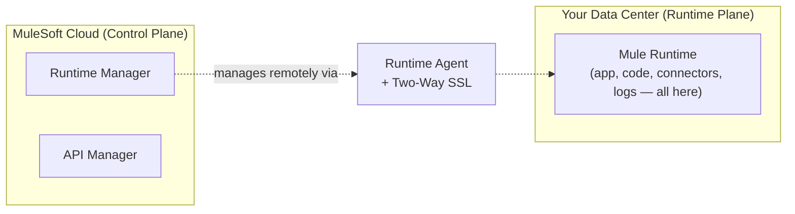
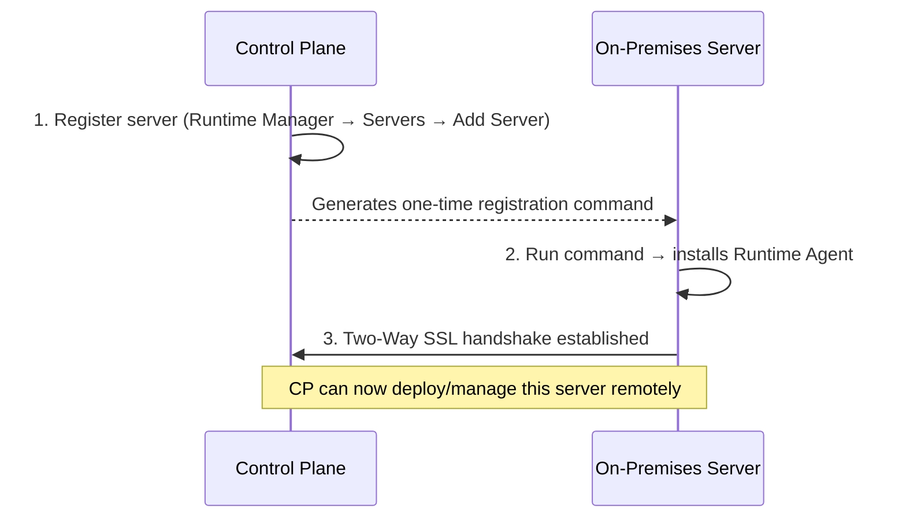
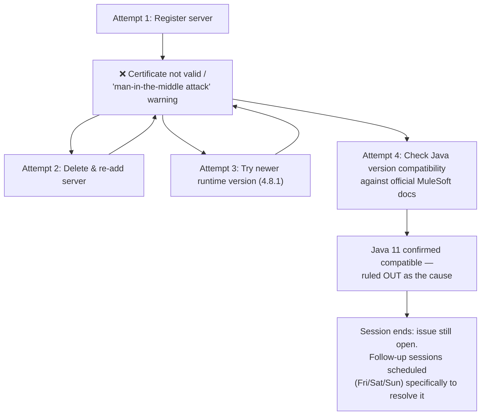
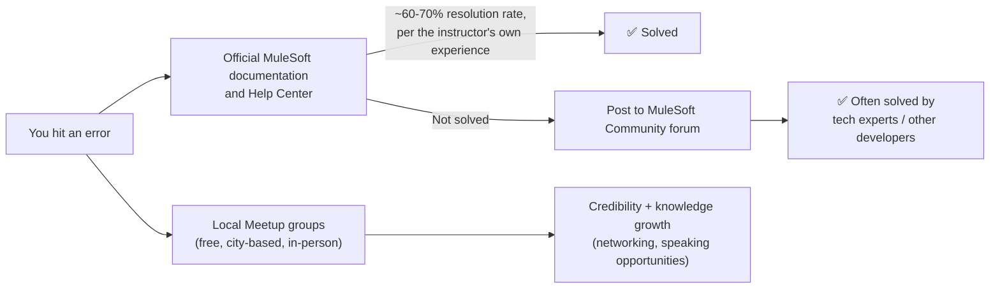
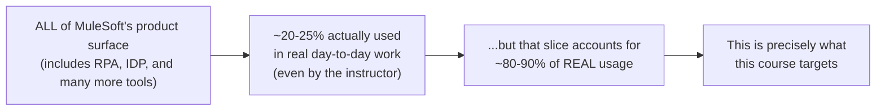
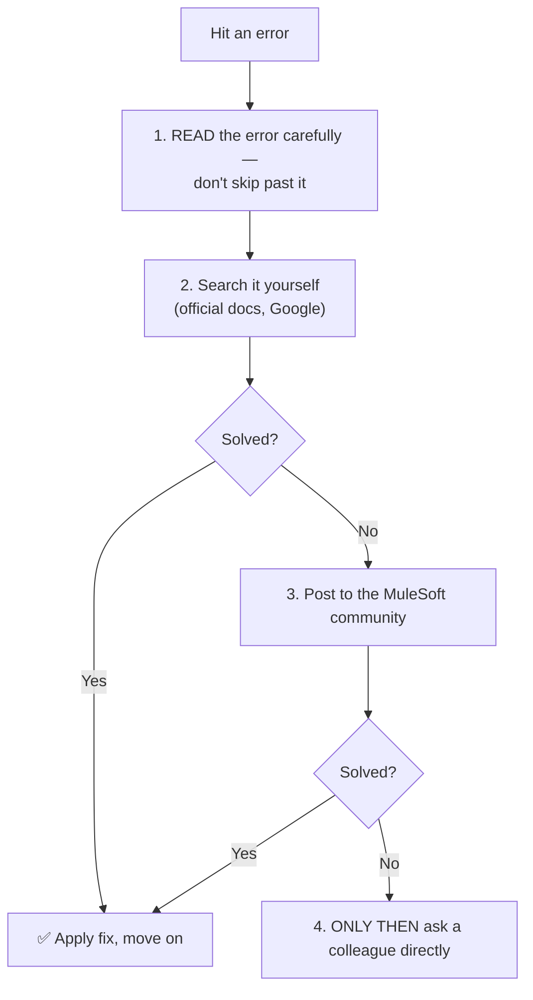

# Day 20 — Detailed Notes: Hybrid Deployment, Real Live Troubleshooting, and a Career-Wide Troubleshooting Philosophy

> **Watch alongside:** this session is valuable less for the mechanics (which mirror CloudHub/On-Premises) and more for what it models: a genuinely unresolved live bug, honestly narrated, plus an explicit, ordered philosophy for how to actually get unstuck in a real job.

---

## 1. Hybrid, Precisely Mapped

**The core payoff over pure On-Premises (Day 19)**: *"in normal on-premises way, we have to directly log in and do everything... [in Hybrid] we can do it from the control plane"* — you keep your own infrastructure, but manage it (start/stop/deploy/logs) through MuleSoft's own cloud dashboard instead of always needing a direct server login.

---

## 2. The 3-Step Connection Process

**Two-Way SSL**, explained via the same WhatsApp encryption analogy used since Day 14: mutual authentication so neither side blindly trusts the other.

---

## 3. A Real, Live, Honestly-Unresolved Bug — Worth Studying As-Is

**Why this is worth preserving, not skipping**: *"I haven't faced this error before — this is the first time."* This is a direct, honest, live demonstration that real MuleSoft work includes genuine multi-day troubleshooting with no immediately obvious fix — and that **methodically checking official documentation** (confirming Java 8/11/17 compatibility with Mule Runtime 4.8, rather than guessing) is the correct instinct when stuck, exactly as modeled here.

---

## 4. The MuleSoft Community — A Genuine, Free Resource

Meetup groups are run by volunteer **Meetup Leaders** (a role MuleSoft formally recognizes) — free to join, attend, and participate in, and a genuine channel for both learning and career visibility.

---

## 5. The Honest Scope Reframe

A candid, direct admission: even a working professional's genuine command of "MuleSoft" covers a real minority of the company's total tooling. The course's deliberate strategy — echoing Day 01/02's "learn less, get more" — targets exactly the high-frequency slice, not comprehensive coverage.

---

## 6. The Troubleshooting Order — An Explicit, Reasoned Career Habit

**The reasoning given directly, not just the sequence**: *"dependency will increase every time — you'll be dependent on them... within one to two years, you will be able to reduce your dependence on others [if you follow this]."* Jumping straight to a colleague before attempting self-resolution is framed as a habit that actively slows long-term professional growth — a deliberate, stated career investment, not just etiquette or self-reliance for its own sake.

---

## Quick Recap
- **Hybrid = MuleSoft-managed Control Plane + your own Runtime Plane**, connected via a Runtime Agent and Two-Way SSL — the payoff is managing your own infrastructure through MuleSoft's cloud tooling.
- **A genuine, live, unresolved bug was shown** specifically to model real troubleshooting — checking official documentation methodically, rather than guessing, even when the fix isn't found by session's end.
- **The MuleSoft Community (docs, Help Center, Meetup groups) is a real, free, and effective resource** — ~60-70% real-world issue resolution rate cited directly from the instructor's own experience.
- **Even expert-level MuleSoft knowledge covers only ~20-25% of the full product** — but that slice is deliberately the ~80-90%-of-real-usage slice this course targets.
- **The disciplined order — read, self-search, community, then colleague** — is presented as a genuine career-accelerating habit, since skipping straight to a colleague builds dependency instead of independent competence.
