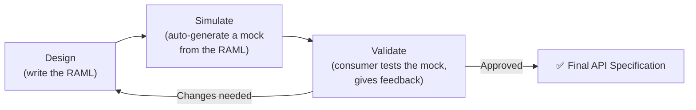
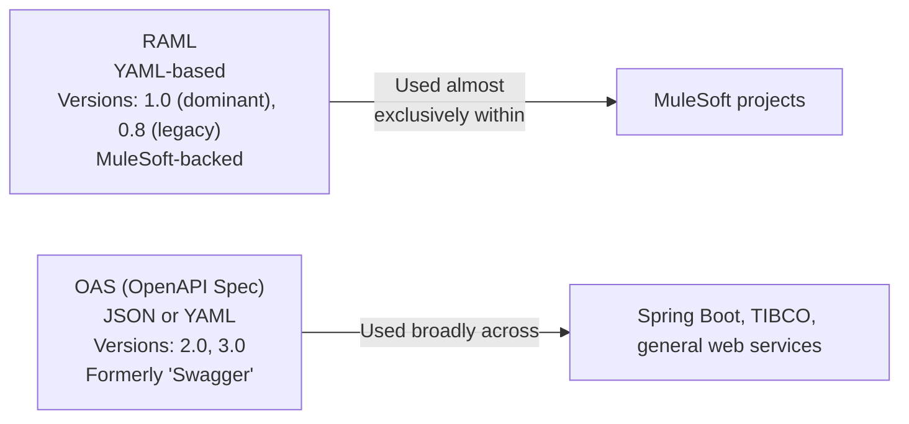
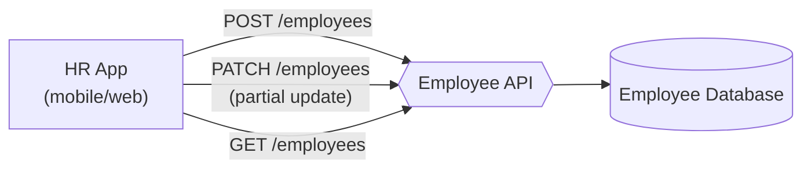
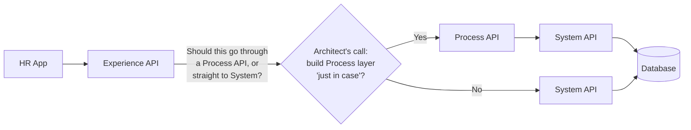
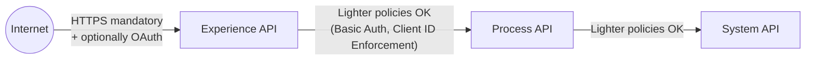

# Day 21 — Detailed Notes: API Lifecycle Revisited, RAML Basics, and the Employee Use Case

> **Watch alongside:** this is the pivot point where the course stops talking about API design in the abstract and starts building a real, complete API spec — the Employee use case introduced here is what gets actually built in RAML over the next several sessions.

---

## 1. The Design Phase Has Its Own Internal Cycle

This is the concrete mechanism behind the "blueprint before construction" analogy used since Day 04 — a mock lets consumers test the *shape* of an API before any real backend logic exists, catching design problems while they're still cheap to fix.

---

## 2. RAML vs. OAS — The Practical Difference

**The Xerox analogy for real-world terminology**: teams casually ask *"is RAML ready?"* even though the technically correct phrase is *"is the API specification ready?"* — exactly like asking for "a Xerox" instead of "a photocopy." Know both; use whichever your team actually says.

---

## 3. The Employee Use Case — Fully Specified

| Operation | Method | Why |
|---|---|---|
| Create | POST | New resource |
| Update (partial — e.g. promotion changes only salary+designation) | **PATCH** | Only some fields change, not the whole record |
| Fetch | GET | Retrieval |

**One resource (`employees`), three methods** — since POST/PATCH/GET alone already disambiguate intent, there's no need for separate `add`/`update`/`fetch` sub-resources.

---

## 4. API-Led Connectivity Applied — With a Real Cost Attached to the Design Decision

**The concrete cost, stated directly**: *"for a simple requirement, I have to spend 0.3 vCore [with an extra layer] instead of 0.1... more services, more vCore, more licensing cost."* This turns Day 04's abstract "should I skip Process?" question into a genuine, quantified trade-off — building "for future extensibility" has a real, ongoing dollar cost, not just development time.

**Confirming this IS microservices, concretely**: employee create/update/fetch is a small, meaningful, reusable business service — separated cleanly from unrelated domains (customers, vendors), each getting their own purpose-built API set.

---

## 5. Security Scales With Real Exposure, Per Layer

The Experience API — the only genuinely internet-facing layer — gets the heaviest security attention. Internal layer-to-layer traffic can reasonably use lighter policies, though (per Day 04) "internal" is never automatically "exempt" in regulated industries.

---

## 6. A Direct Professional Expectation, Worth Remembering
Even if you personally only build the System API layer of a project, you're expected to understand the **whole** end-to-end flow — *"whenever you wanted to go out of your project and explain your project... you should understand the total function[ality]"* — this matters specifically for interviews and cross-team conversations, where "I only know my own piece" is treated as an incomplete answer.

---

## Quick Recap
- **Design has its own Design→Simulate→Validate cycle**, producing the final API Specification as output.
- **RAML 1.0 (YAML-based, MuleSoft-backed) dominates real MuleSoft work**; OAS is the broader industry standard elsewhere — honestly admitting no OAS experience is a fine interview answer.
- **The Employee use case (Create/Update/Fetch → POST/PATCH/GET on one `employees` resource)** is the running example for the rest of this arc.
- **Skipping or building the Process layer is a real cost trade-off**, quantified directly in vCore/licensing terms — not a purely theoretical architecture debate.
- **Security policy intensity scales with actual exposure per layer**, always a deliberate architect decision.
