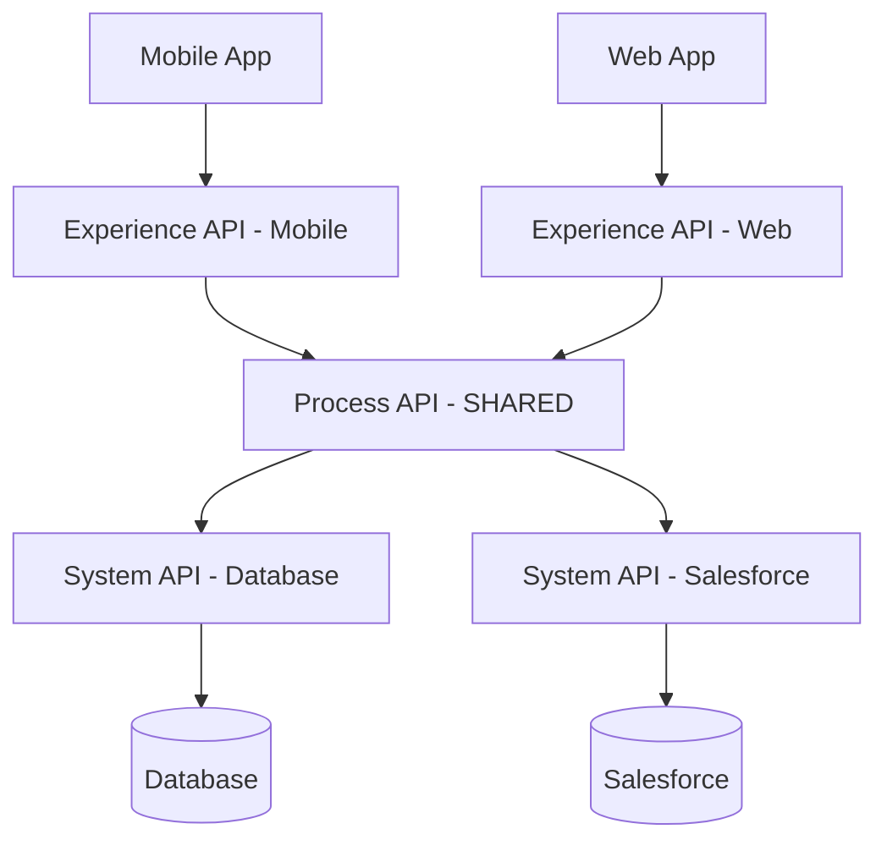
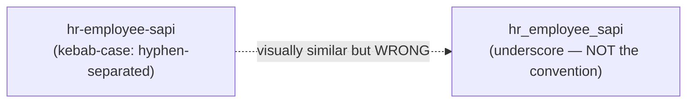
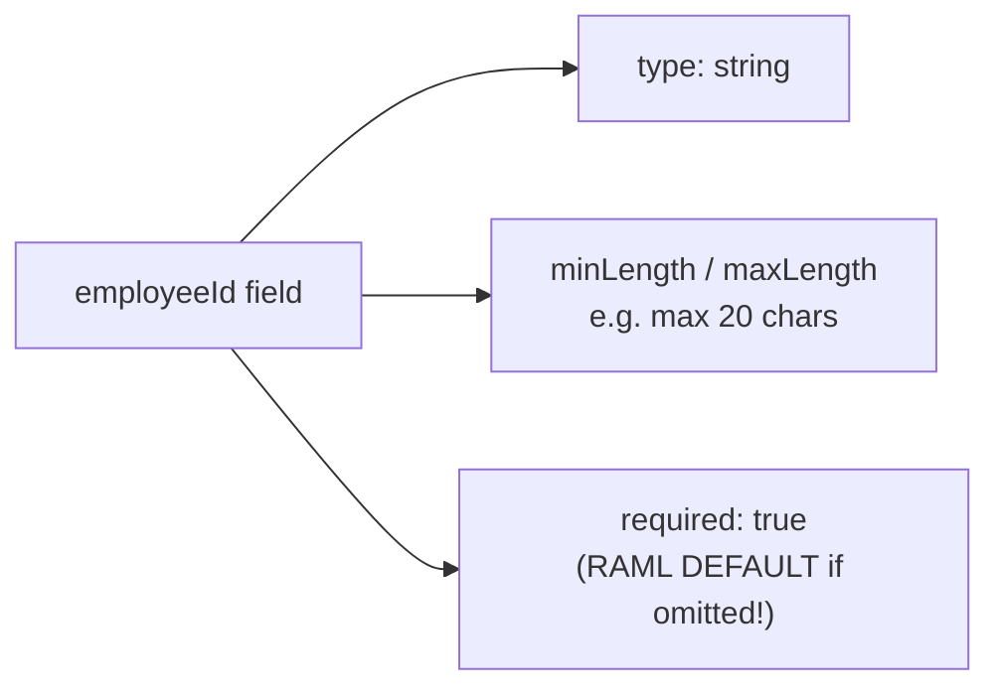
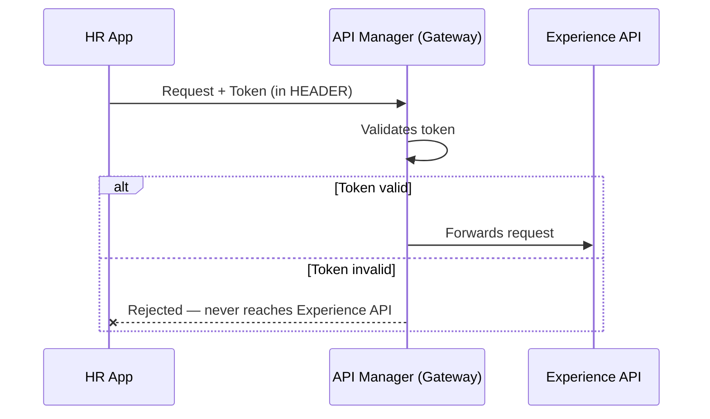
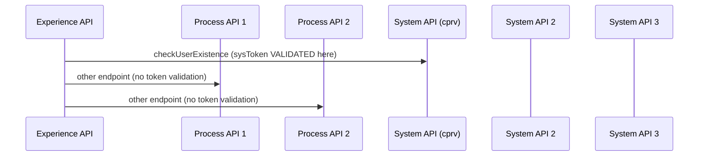
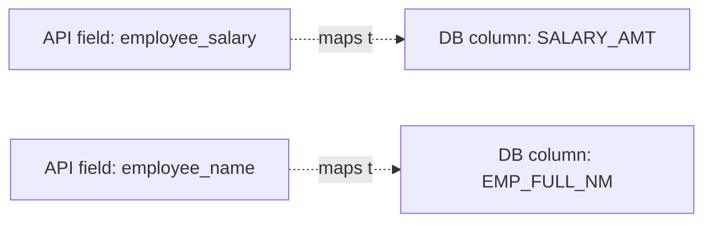

# Day 22 — Detailed Notes: Multiple Consumers, Naming Conventions, JSON Debugging, Schema Depth, Real Documentation

> **Watch alongside:** the most practically dense session in this arc — a real JSON-debugging technique (spotting smart quotes from PowerPoint), a precise RAML default fact worth memorizing exactly, and a fully worked example of why sequence diagrams matter that isn't just theory.

---

## 1. Counting APIs for Multiple Consumers and Systems



**2 consumers + 2 backend systems = 5 total APIs** (2 Experience + 1 shared Process + 2 System). The Process layer's business logic is identical either way; only the Experience layer differs — because *"web application requires more data — there is more space for presentation."*

**A realistic extension worth remembering**: consumers of your API aren't only external front-ends — another **department within your own company** (finance, marketing) can just as legitimately call your API, without changing any of the underlying design principles.

---

## 2. Naming Conventions — Kebab-Case, and Real-World Variation



Real-world naming varies by organization (`-sapi` suffix, or other patterns) — the actual lesson is to **follow your specific team's existing convention**, not assume a single universal standard exists.

---

## 3. JSON Debugging By Eye — A Genuinely Practical Skill

```mermaid
flowchart TB
    Copy["Copied JSON from PowerPoint/Word"] --> Smart["⚠️ Straight quotes ' \" '<br/>silently become<br/>'smart quotes' ' “ ” '"]
    Smart --> Break["Looks IDENTICAL to the eye,<br/>but breaks JSON parsing"]
    Break --> Fix["Fix: retype the quotes manually,<br/>or paste into Postman/a validator<br/>to catch the error"]
```

**The motivating constraint**: some companies restrict using external validator websites for security reasons — so you need to be able to **spot errors by careful, repeated manual reading**, not just rely on a tool.

A second real bug demonstrated live: a stray trailing comma causing an "expecting EOF" parse error — found only through methodical, repeated re-reading (*"if you have read this 4-5 times, you will understand it easily"*).

---

## 4. Schema Depth — The Per-Field Checklist



**A precise, easy-to-mix-up default fact, worth memorizing exactly**:

| RAML construct | Default behavior if unspecified |
|---|---|
| A field's `required` | **`true`** (mandatory by default) |
| `additionalProperties` (Day 10) | **`true`** (extra fields silently accepted by default) |

These two defaults point in **opposite directions** — one is restrictive-by-default, the other permissive-by-default — a genuine, precise interview-trap-worthy fact.

**Who decides mandatory vs. optional**: the business team, in the initial requirements discussion — documented and confirmed upfront, not inferred by the developer.

---

## 5. Tokens and Correlation IDs Belong in Headers, Not the Body



**The convention, not a hard rule**: *"can I send a token in the body? It's not a mistake, I can — but it doesn't look nice."* Exactly the same "technically works, violates convention" pattern as HTTP methods/bodies throughout the course. The real architecture is more layered than "consumer → API" — a gateway validates security **before** your own implementation ever sees the request.

---

## 6. Why Sequence Diagrams Matter — A Fully Worked, Concrete Example



**The exact, worked question this diagram answers**: *"should I implement this sysToken for only one [endpoint], or the rest three? Validation is only for one, cprv — that's it."* Without a sequence diagram, a developer might assume all 4 endpoints uniformly need identical token-handling logic. The diagram reveals the *actual*, more targeted requirement — a concrete, real illustration of documentation solving a problem code review alone wouldn't catch.

---

## 7. Field-Mapping Sheets — When Names Don't Match



When field names *don't* cleanly match (the realistic case, not the exception), a **mapping sheet** — built collaboratively, often requiring a direct call with the business/data team — is the practical artifact that resolves the ambiguity.

---

## Quick Recap
- **API count for N consumers × M systems = N Experience + 1 shared Process (if reusable) + M System APIs.**
- **JSON debugging by eye is a real skill** — watch for smart quotes from copy-pasted slides, and trailing commas — read multiple times, don't rely solely on external tools.
- **`required` defaults to `true`; `additionalProperties` defaults to `true` (permissive)** — two opposite-direction defaults worth keeping precisely straight.
- **Tokens/correlation IDs belong in headers** — a convention, and a gateway validates them before your own API implementation runs.
- **Sequence diagrams and mapping sheets solve real ambiguity** that isn't otherwise visible from individual API specs alone — demonstrated with a concrete, worked `sysToken` example.
