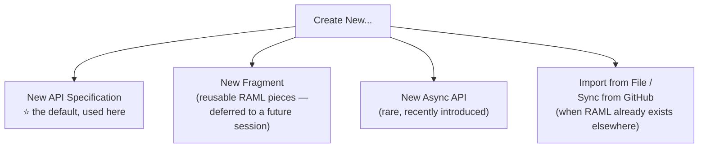
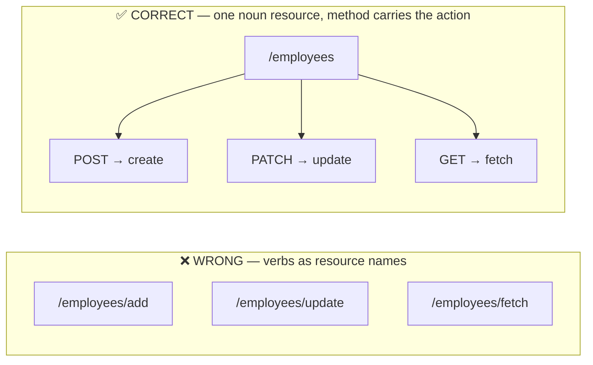
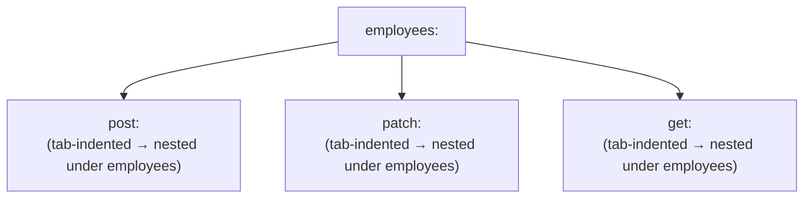
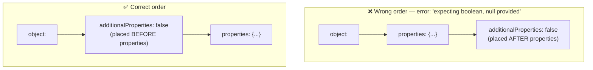
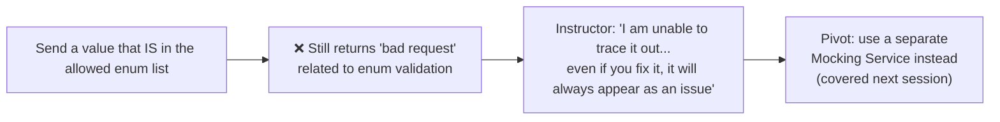
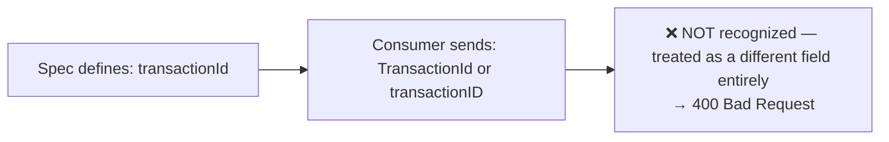
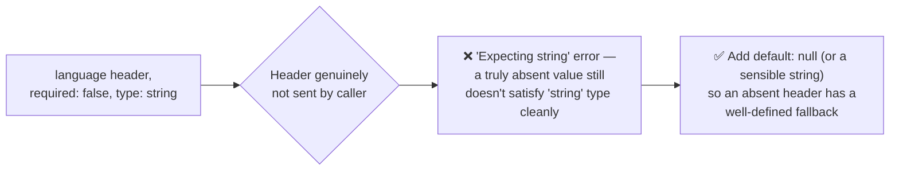
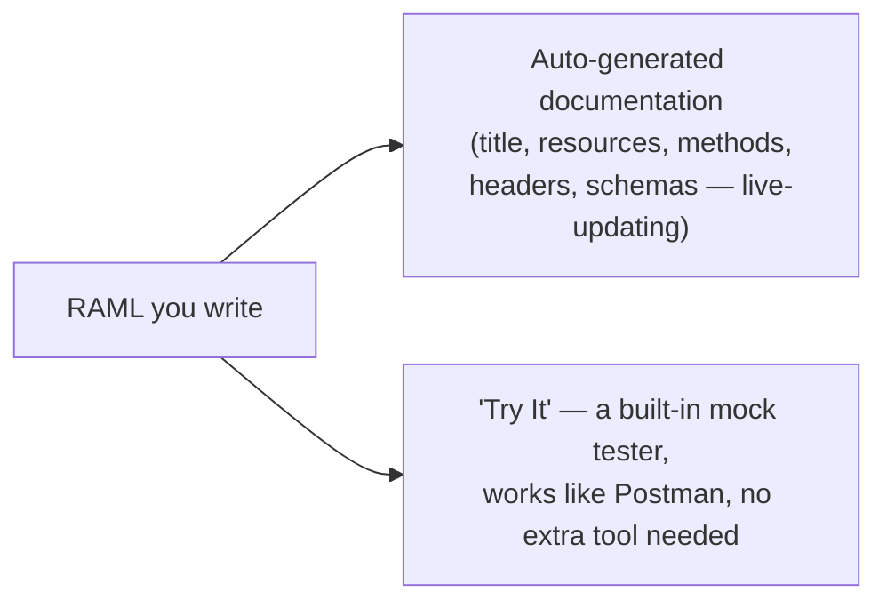

# Day 23 — Detailed Notes: Hands-On RAML — Building the Employee API Spec, Live

> **Watch alongside:** the first genuinely complete, real RAML file gets built here, line by line — including two real, live bugs (an `additionalProperties` ordering mistake, and an unresolved "Try It" enum validation bug) that are worth watching precisely because they're authentic, not staged.

---

## 1. Design Center's Four Project Types

---

## 2. The Critical Naming Rule: Nouns, Plural, No Verbs

**The reasoning, precisely**: *"employee is not noun... it should be plural. The action point should not be there"* — the HTTP method already communicates the action; the resource name should describe *what thing* is being acted upon.

**Honest real-world caveat**: *"unless there is a very strict architect... they say they will keep it as they like"* — this convention is well-established but not universally enforced in practice.

---

## 3. RAML Is Indentation-Sensitive (YAML-Based)

A misaligned tab silently changes what's nested under what — exactly the same YAML mechanics from Day 14's property files, now applied to RAML. **Copy-paste-then-edit** is a genuinely efficient, real authoring technique for near-identical blocks (demonstrated directly for the `origin`/`language` headers).

---

## 4. Two Real, Live Bugs — Worth Studying As-Is

### Bug #1: `additionalProperties` Placement Order

A small, genuinely easy structural mistake — found live through direct, careful experimentation, not by guessing.

### Bug #2: "Try It" Enum Validation — Honestly Unresolved

**The honest, direct lesson**: built-in vendor tooling doesn't always behave perfectly — a real developer's response is finding an **alternative verification path**, not getting stuck waiting for one tool to cooperate.

---

## 5. Field-Name Case Sensitivity — A Precise, Easy Trap

*"Even if they send it in capital T... that won't work — you have to throw a bad request."* Exact casing match is required.

---

## 6. `default` — Solving the "Optional String" Gotcha

A genuinely subtle RAML behavior — an optional field still needs a defined fallback to behave cleanly when actually omitted.

---

## 7. Documentation and "Try It" Are Auto-Generated, Free

Zero separate documentation-writing effort — this is one of RAML's most concrete, immediate productivity payoffs.

---

## 8. The Closing Motivation: Why Modularize Next

> *"How many lines of code is there now? 300 and plus... if there is something called reusability — headers is repeated three times — if I write it once and refer to it, it will be easy."*

This directly foreshadows RAML's **Traits** (header-level reuse) and **Resource Types** (method-level reuse) — the exact mechanisms already covered in depth in the April-batch course's `apr25.md`, now about to be applied concretely to this real, growing spec.

---

## Quick Recap
- **Resources should be nouns, plural, no action verbs** — the method carries the action — though enforcement varies by organization.
- **RAML is indentation-sensitive**; copy-paste-then-edit is a real, efficient authoring habit for near-identical blocks.
- **Two real live bugs were worked through honestly**: an `additionalProperties` ordering mistake (resolved), and a "Try It" enum validation bug (not resolved within the session — pivoted to a different verification approach instead).
- **Field names must match exactly, case-sensitively.** **Optional string fields need an explicit `default`** to behave cleanly when actually omitted.
- **Documentation and mock testing are free, automatic byproducts of writing RAML** — a concrete, immediate payoff for doing Design properly.
