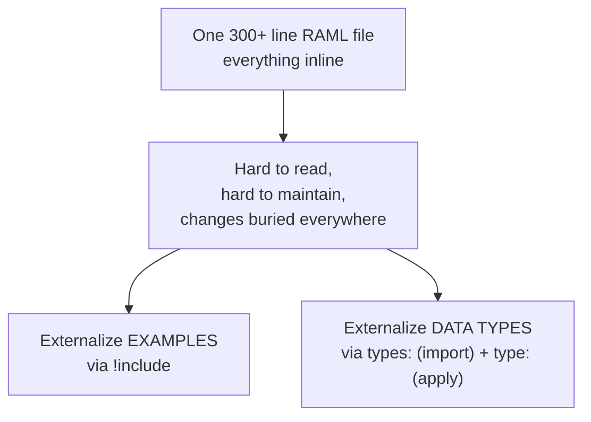
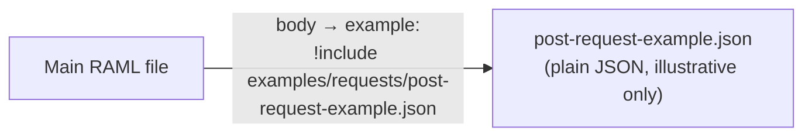
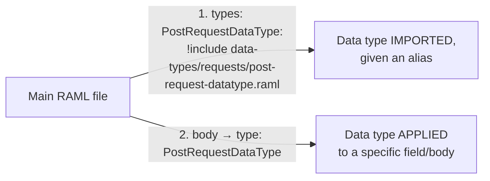
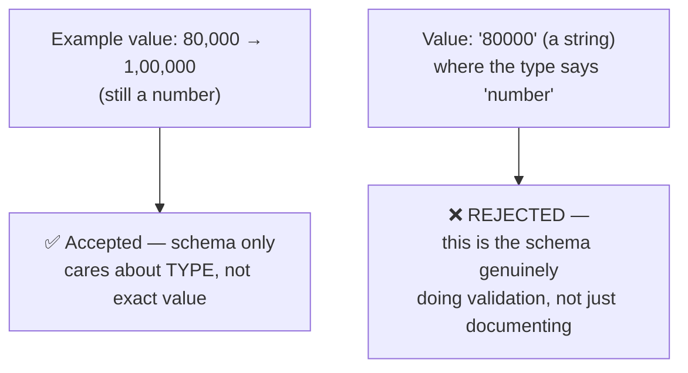
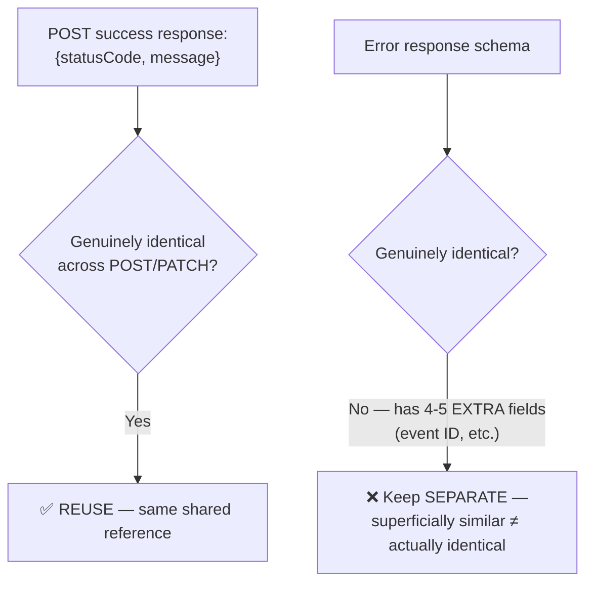
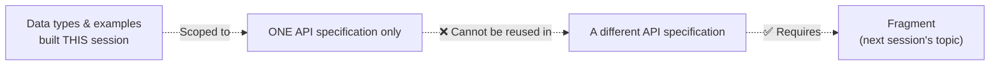
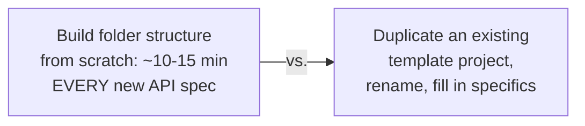

# Day 24 — Detailed Notes: RAML Best Practices — Externalizing Examples and Data Types

> **Watch alongside:** this is where a 300-line, hard-to-navigate RAML file becomes a genuinely maintainable, modular structure — the mechanics here (examples vs. data types using different reference syntax) are worth building yourself, not just reading about.

---

## 1. The Core Problem and the Two Different Fixes



**These are genuinely different mechanisms, not the same technique twice** — this is the single most important distinction of the session.

---

## 2. Externalizing Examples



```
examples/
├── requests/post-request-example.json
├── responses/post-response-example.json
└── error-responses/{400,500}-error-example.json
```

Reference obtained via **right-click → Copy Path** (avoiding manual typing errors) — then wired in with `!include`.

---

## 3. Externalizing Data Types — A Genuinely Different Mechanism



**Why this two-step process exists, and why it matters more than examples**: a data type is the **actual validation/enforcement layer**, not just illustrative text.



---

## 4. Reuse Should Be Deliberate, Not Automatic — A Real Worked Judgment Call



**The generalized principle, stated directly, worth internalizing beyond RAML**: *"we should not develop blindly — is there any possibility of reusability? ... it is better to reuse it. That's the way a developer should think."* But reuse only after **verifying** genuine sameness — not because two things merely look similar.

---

## 5. The Scope Boundary — Setting Up Day 25



---

## 6. Templates — A Real, Practical Time-Saver



The entire organization following the same duplicated template also produces **structural consistency** across every project, not just individual time savings.

---

## Quick Recap
- **Examples use `!include` (illustrative only). Data types use `types:`/`type:` (actual enforcement)** — genuinely different mechanisms for genuinely different purposes.
- **A data type's real job is validation**, proven directly by a type-mismatch getting correctly rejected.
- **Reuse decisions require verification, not assumption** — success responses were reused because genuinely identical; error responses were kept separate because closer inspection revealed real differences.
- **Everything built here is scoped to one API spec** — cross-spec reuse needs Fragment (Day 25).
- **Templates eliminate repeated scaffolding work** and enforce organization-wide structural consistency.
