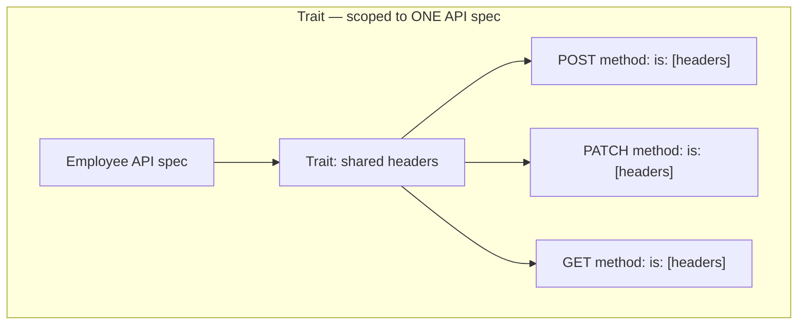
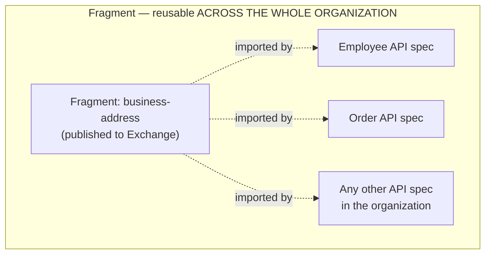
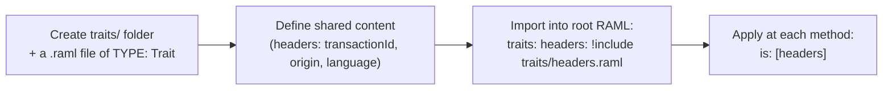
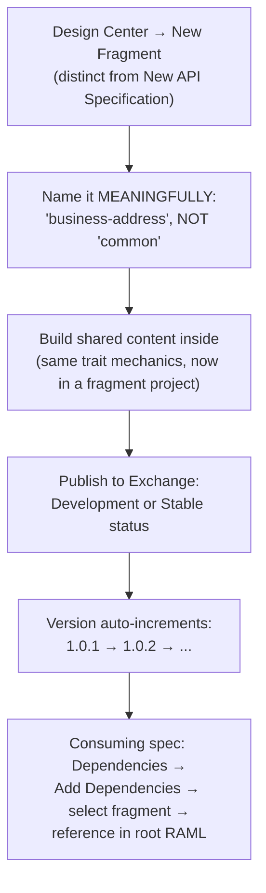
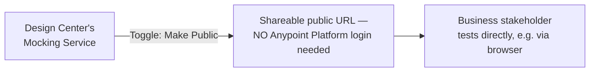
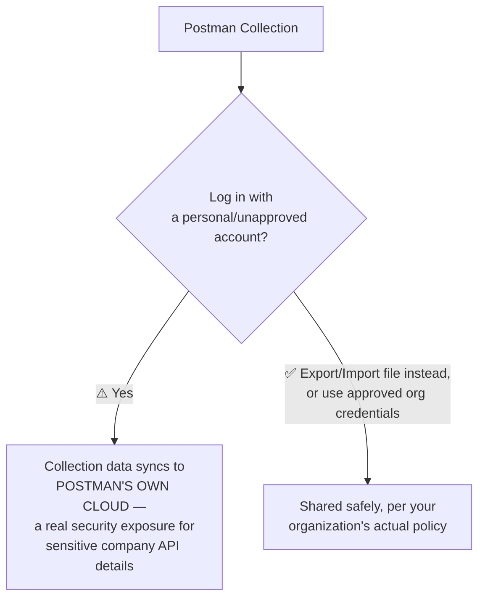
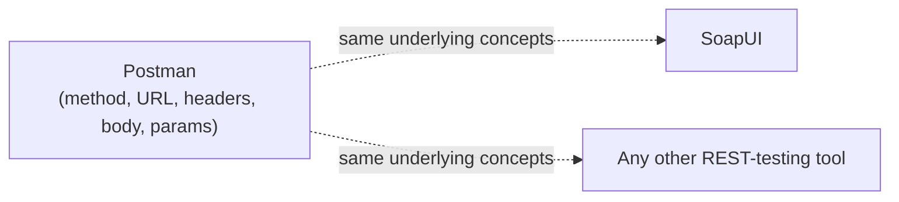

# Day 25 — Detailed Notes: Traits vs. Fragments — The Scope Boundary That Matters Most

> **Watch alongside:** the single fact worth extracting from this entire session, if nothing else: **Trait = reuse within one spec. Fragment = reuse across the whole organization.** Everything else in this session builds around that one distinction.

---

## 1. The Core Distinction, Visualized

---

## 2. Building a Trait — Full Mechanics

**The three concrete benefits, precisely**: readability, reduced redundancy, and **consistency** — *"adding one header is enough — we don't need to add three headers [separately]."* Change the trait once; every method using `is: [headers]` picks it up automatically.

---

## 3. Building and Publishing a Fragment — Full Mechanics

**The naming principle, worth remembering exactly**: `business-address` was chosen deliberately over a generic name like `common`, specifically to distinguish **business-context headers** (origin, language) from **technical/tracking headers** (transactionId, correlationId) — *"every name we give should be a little meaningful and thoughtful."*

**A real, easy-to-miss maintenance gotcha**: *"if we change there [in the fragment], we have to change here too [in the consumer's reference]"* — updating a shared fragment does **not** automatically propagate to every consumer; each consuming spec must explicitly pull in the new version.

---

## 4. Sharing With Non-Technical Stakeholders — Two Real Mechanisms

**A direct, real security caution worth remembering**: never assume it's fine to log into Postman with sensitive company API details on a personal or unapproved account — **confirm your team's actual policy first.**

---

## 5. The Closing, Reassuring Point on Tools

*"Once you know one thing, it's very easy to understand the other thing... there are differences, but nothing else [major]."* Postman's dominance (90-95% of real organizations, per the instructor) is a matter of popularity and practice, not because the underlying skill is uniquely tool-locked.

---

## Quick Recap
- **Trait = reuse within one API spec. Fragment = reuse across the entire organization** — the single most important fact of this session.
- **Fragments should be named deliberately and meaningfully** — distinguishing genuinely different categories of shared content, not lumped under a vague "common" label.
- **Updating a shared Fragment requires every consumer to explicitly re-pull the new version** — no automatic propagation.
- **Mocking services can be made public**, bridging technical and non-technical stakeholders without requiring platform access.
- **Postman's cloud-sync is a real security consideration** for sensitive data — export/import or approved credentials are the safer path.
- **REST-testing skills transfer across tools** — the specific tool matters less than the underlying request/response mental model.
