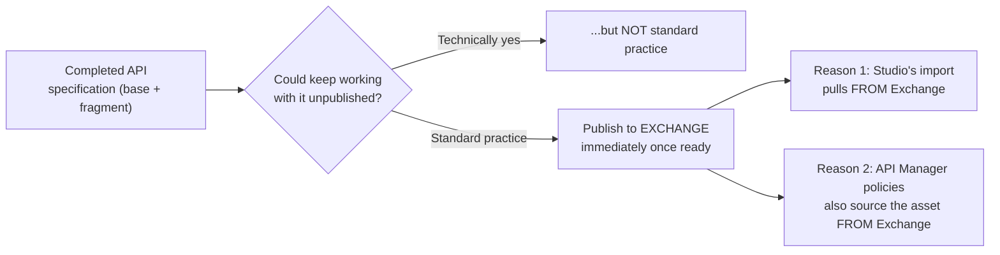
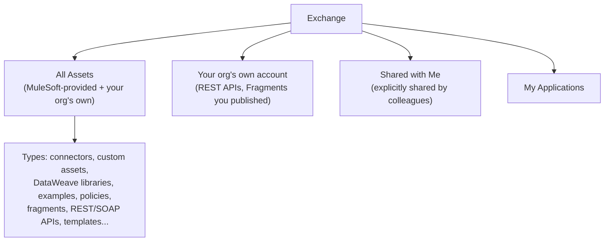
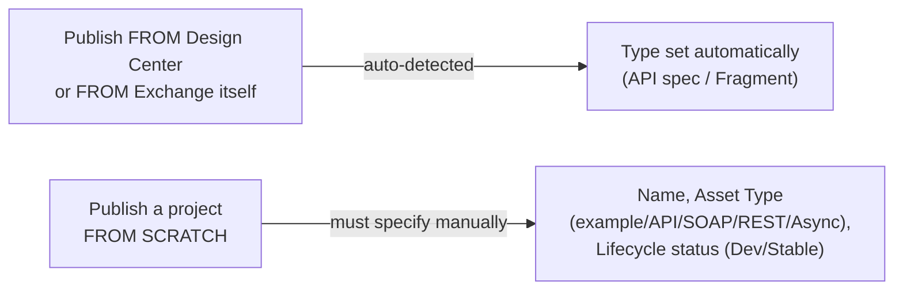
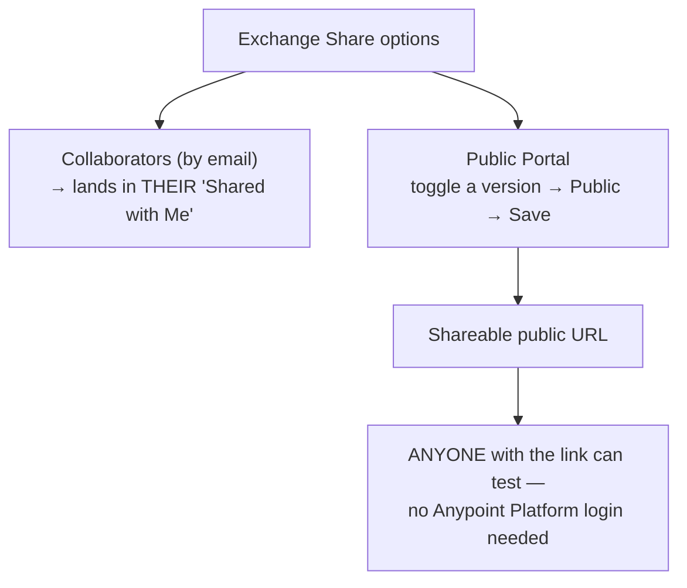
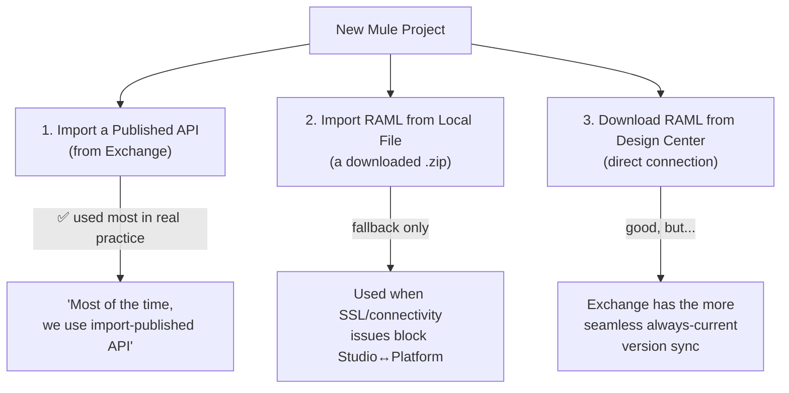
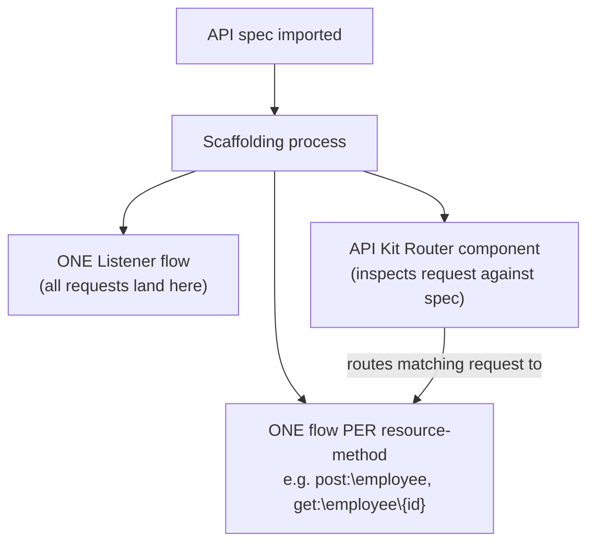
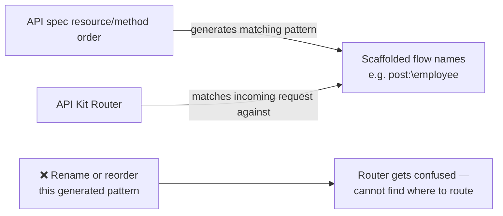
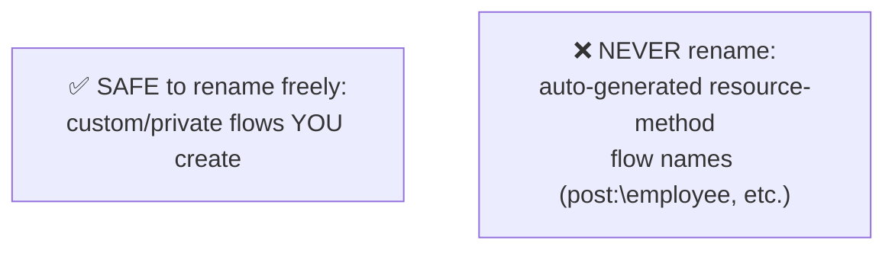
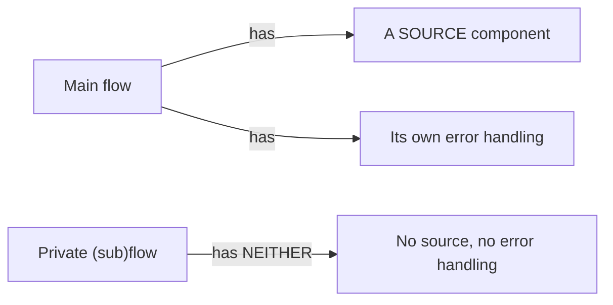
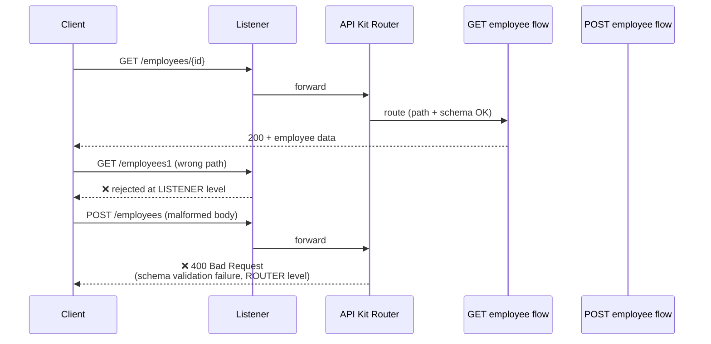

# Day 26 — Detailed Notes: Publishing to Exchange and Importing a Published API

> **Watch alongside:** this session's payoff is the "golden rule" in section 4 — the API Kit Router matches on auto-generated flow names, and breaking that naming pattern silently breaks routing. Everything before it (Exchange, asset types, import options) is setup for understanding *why* that pattern exists and where it comes from.

---

## 1. Why Publish to Exchange At All

Exchange is *"a central repository where all MuleSoft assets will be saved and published"* — other Anypoint Platform modules, not just developers, depend on it being there.

---

## 2. Exchange's Asset Model

**Type assignment on publish**:

---

## 3. Sharing an API Spec for Testing — Two Mechanisms

A live demo removes a comma from a test request through the public portal and gets a correct **"Invalid schema"** error back — proving schema validation is genuinely live through the public URL, not a static mock.

**Default internal visibility, stated directly**: once published normally, *"it will be accessible to all the developers who are part of that organization"* — no extra sharing step needed internally.

---

## 4. Creating the Project and Importing — Three Options Compared

**Live import steps**: `+` next to dependencies → From Exchange → Add Account → select **organization/SSO domain** (ask colleagues if you lack Access Management visibility) → sign in → select published version (`1.0.0`) → import.

---

## 5. Scaffolding — What It Actually Generates

**Honesty note**: a badly broken spec fails scaffolding visibly (red error), but a spec with subtler structural issues can scaffold "successfully" without visible failure — clean scaffolding is not proof of correctness; test the flows regardless.

---

## 6. The Golden Rule of Flow Naming

> *"If I change this, the API Kit Router will be confused and it will not understand where to send it... post or application should be in the same order as this order... same goes for every resource, every flow."*

**What's safe vs. not**:

**Extending a live production API** (adding a 4th resource to 3 already-live ones): go back to Design Center → add resource + data types/examples → republish (version bumps) → re-pull in Studio. Same golden rule applies: *"we should not touch anything for this order or combination."*

**How the router actually knows where to send requests**: its auto-generated router configuration's **API Definition** field points straight at the imported spec (fragment included) — the router validates the full data type/schema, not just the URL path.

**Main flow vs. private flow, precisely**:

The generated **API Console flow** (also a main flow, used for a lightweight built-in test GUI) is typically deleted in real projects — *"not required 90% of the time."*

---

## 7. Live Debug-Mode Test

**Postman efficiency tip**: copy a full working header block (Ctrl+A, Ctrl+C) and paste into a new request's Headers tab via **Bulk Edit (Ctrl+B)** instead of retyping.

**How the 400 error response gets its shape**: the generated error handling sets an `httpStatus` variable and a `payload` automatically — corresponding to the **Error Responses Mapping** section of the Listener config, mapping error types to status codes/payload shapes (built in an earlier session, now seen live end-to-end).

---

## Quick Recap
- **Publishing to Exchange is standard practice**, not optional — Studio import and API Manager policies both depend on it.
- **Exchange organizes many asset types** with type auto-detected on publish from Design Center/Exchange, manual when publishing from scratch.
- **Public Portal** shares a fully-testable API outside the org with zero login required.
- **"Import a Published API" (from Exchange) is what's actually used in real practice** — the other two options are fallbacks.
- **Scaffolding generates a listener + router + one flow per resource-method** using an exact naming pattern the router depends on.
- **Never rename or reorder the auto-generated resource-method flow names** — custom flows you create yourself remain freely renameable.
- **The API Kit Router does real schema validation**, demonstrated live via a correctly-routed GET and a correctly-rejected malformed POST (400).
