# Day 27 — Detailed Notes: Full Implementation Build-Out, Database Connector, and a Live Token Q&A

> **Watch alongside:** this is the session where the project actually becomes real — a thin routing layer (from Day 26's scaffolding) gets real business logic wired behind it: folders for organization, a reused error handler, and Insert/Update/Select database operations, all externalized through property files. The live copy-paste bugs here (duplicate flow names, blank SQL query) are worth reproducing yourself — they're the exact mistakes this workflow is prone to.

---

## 1. Organizing the Project

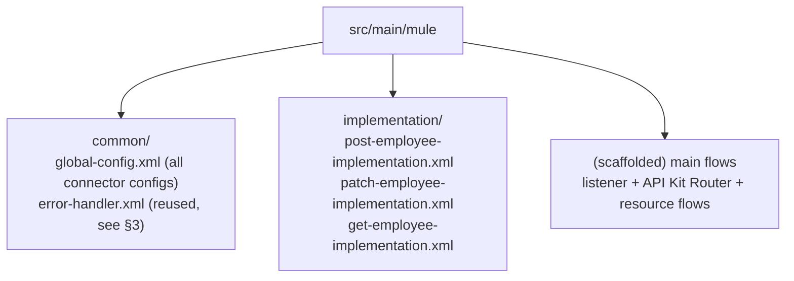

**Stated explicitly as convention, not platform rule**: *"there is no rule... we kept it so that there would be some clarity."* The motivating problem: with 10 resources, unorganized flows in one place become impossible to navigate.

---

## 2. Building Global Config — and a Recurring Studio Glitch

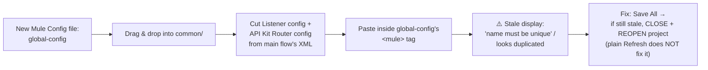

**Why centralize globally at all**: *"if we want to create something new, where should we create it? We should create it globally... if we do it somewhere else, everything will scatter."*

---

## 3. Reusing an Existing Error Handler by Copy-Paste

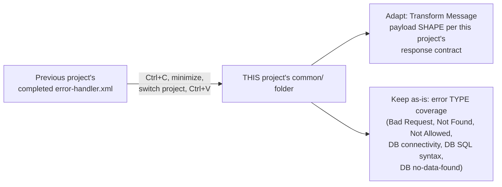

*"I don't want to waste time... I will copy and paste the Error Handler we made for this project."* Once wired in, the now-redundant inline error handler is deleted from the main flow's own XML.

---

## 4. Deleting API Console — and a Direct Routing Clarification

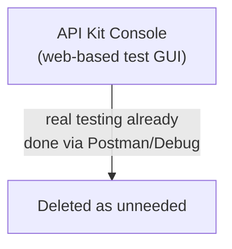

**A genuinely common point of confusion, resolved directly**: does an implementation flow need to be in the *same* XML file as the API Kit Router?

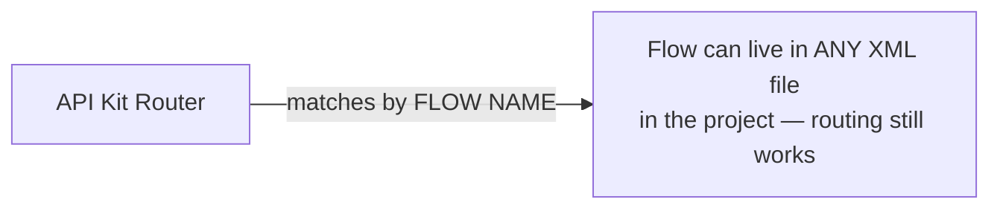

*"Even if you create another XML file and copy and paste this flow, API Kit Router can send that particular request to this particular flow. There is nothing like that [restriction]."* Routing is name-based, not file-location-based.

---

## 5. Full Implementation Build-Out (POST → PATCH → GET)

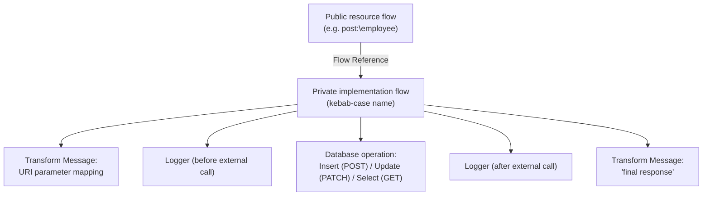

**Why isolate logic in a private flow at all**: keeps the public/scaffolded flow thin (routing only); the private flow is independently testable and navigable — *"where is better? It should be in the private flow."*

**Database operation coverage, stated as a direct usage reality**: *"there are a lot of inserts, delete, updates... almost like 90–95% of the time, we used 4-5"* operations — a small handful covers nearly all real work.

**External-call logging discipline, stated directly as best practice**: *"when it goes out [of the application]... put a logger before an external call... it is a good habit to put a logger after an external call"* — bracketing the DB call in addition to the flow-level start/end loggers already established.

### Two live, caught copy-paste bugs

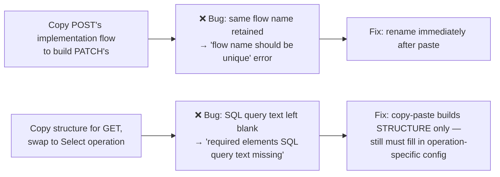

**Flow Reference naming discipline**: naming it descriptively (e.g. "Flow Reference to Patch") costs nothing functionally, but *"we will not know where this flow reference will go [without it]"* at a glance.

---

## 6. Database Connector: Naming, Property Files, Secure Properties

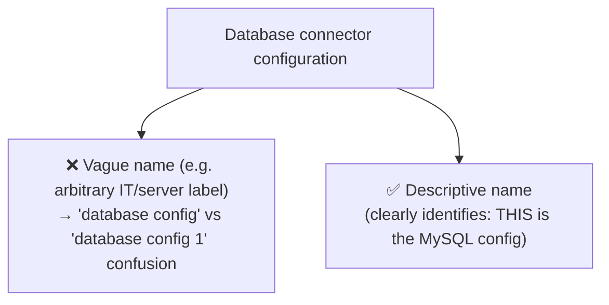

*"Is it wrong to say this is wrong?... whatever we do should be neat... even if a new person comes, it should be understood easily and quickly."*

**Externalization split, directly mirroring the earlier property-files session**:

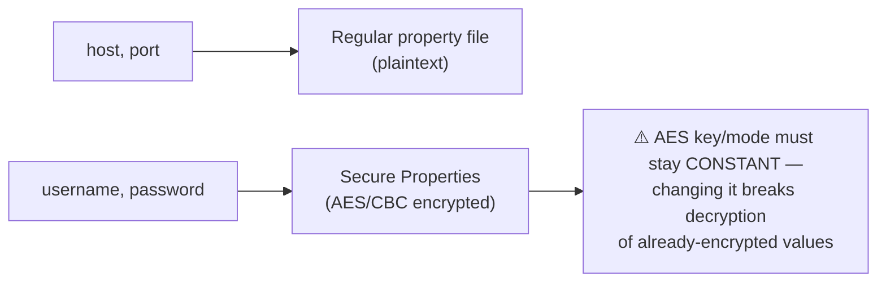

**Required driver library**: three options at connector setup — local file / Maven dependency / **Add Recommended Libraries** (used here). *"It will help to establish the connection with the database."*

**Recurring Studio glitch again**: an import-related error appeared after wiring dependencies; same fix as §2 — close and reopen the project.

---

## 7. Installing MySQL Locally — Standing in for a Real Database Team

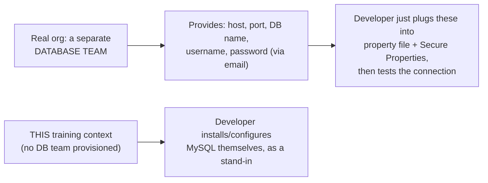

**Workbench explained by direct analogy**:

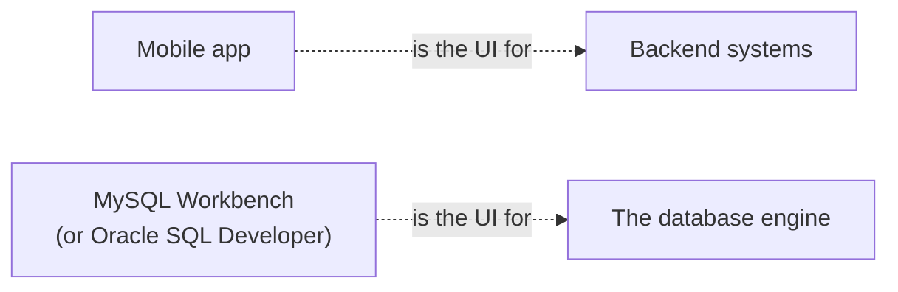

**Managing the MySQL service via `services.msc`**: start / stop / pause / set startup type (automatic vs. manual) — used directly to **live-test Reconnection Strategy** by deliberately stopping the DB service mid-session and observing configured retry attempts (e.g. 3 attempts, succeeding on the 3rd) — the same Reconnection Strategy concept from an earlier session, now demonstrated against a real interrupted connection rather than a simulated one.

**Stated next steps closing the session**: create the database + table(s), map implementation-flow queries to the real table structure, then test **POST → PATCH → GET** end-to-end, success and error scenarios each.

---

## 8. Domain Projects — Direct Recap

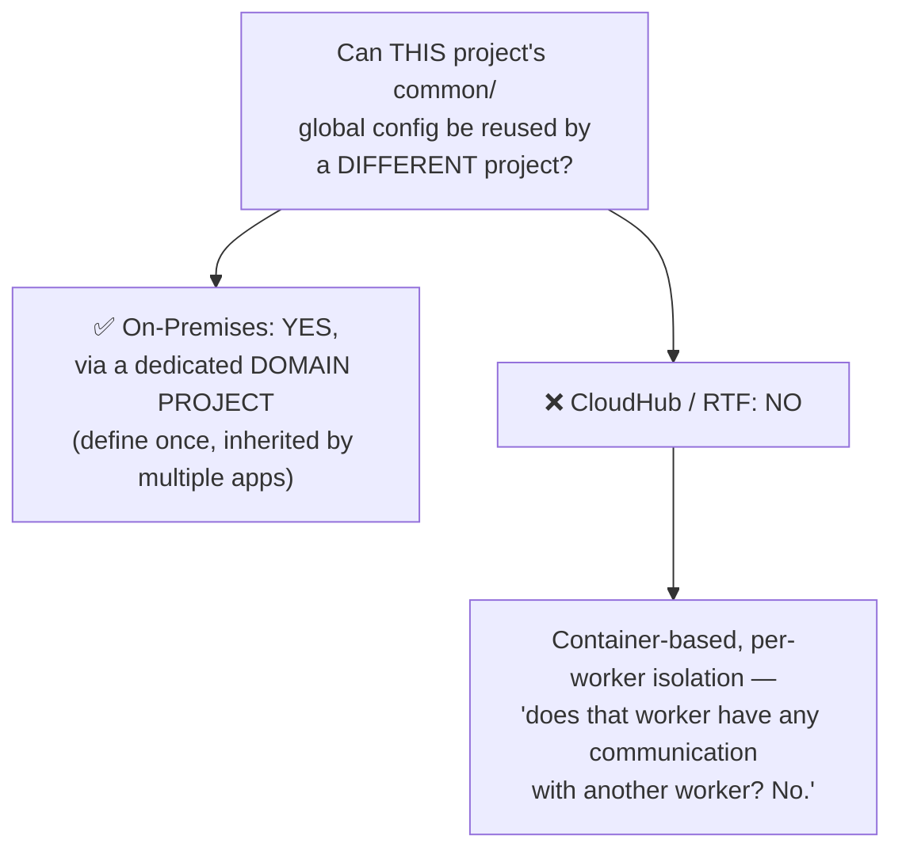

*"Because it is individual and isolated, the concept of domains... does not work in such a worker-based environment."*

---

## 9. Closing Live Q&A: OAuth "Invalid Token" Troubleshooting

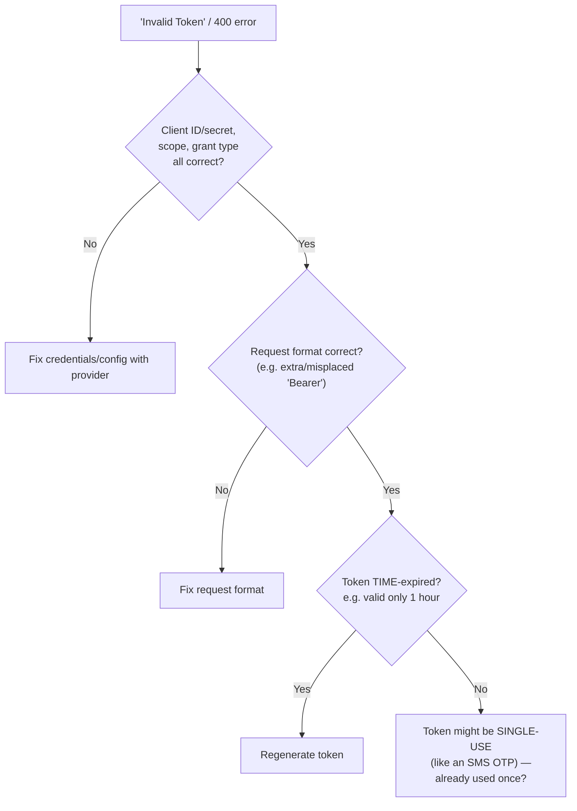

**The single-use point, given by direct analogy**: *"we have one time password. We get one time password in SMS. If you use it for the second time, will it be valid? It won't be valid."* A 400 can stem from reusing a single-use token, entirely separate from any time-based expiry — both must be checked, not assumed.

---

## Quick Recap
- **`common`/`implementation` folder split** is a clarity convention for growing projects, not a platform requirement.
- **A well-built error handler is directly reusable by copy-paste** across projects — only the response payload shape needs adapting.
- **API Kit Router routing is name-based, not file-location-based** — implementation flows can live in any XML file.
- **Insert/Update/Select cover ~90-95% of real Database connector usage.**
- **Connector naming matters as much as flow naming** — vague names reproduce the exact confusion good naming discipline exists to prevent.
- **host/port go in regular properties; username/password go in Secure Properties** — same AES/CBC mechanism from the earlier property-files session, with the same "don't change the key" warning.
- **Domain Projects solve cross-app shared config only On-Premises** — CloudHub/RTF's isolated worker model has no equivalent.
- **A 400/"Invalid Token" error has multiple distinct root causes** (bad request format, time expiry, single-use reuse) — check each systematically.
