# Day 28 — Detailed Notes: Initial Variables, JSON Logger, and Masking (Intro)

> **Watch alongside:** the single idea that unlocks this whole session is that **HTTP Request connectors overwrite `attributes`** — everything about capturing headers/URI-params/query-params/correlation-ID into *variables* immediately at flow start exists solely to survive that overwrite. Once that clicks, the four different "how to create variables" methods are just style choices; the `now()`/timezone/asynchronous-logging/masking material builds logging discipline on top of that same foundation.

---

## 1. The Attribute-Overwrite Problem — Why Initial Variables Exist At All

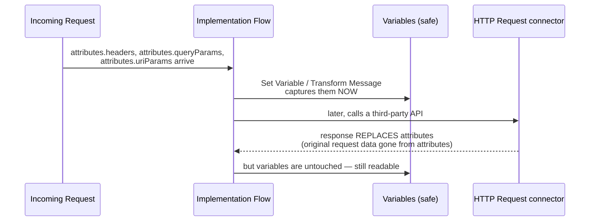

**Stated directly**: *"When we see in the HTTP request, the attributes are overwritten... variables cannot be overwritten, right? Unless we overwrite it [deliberately]. Actually, not wanted, not deliberate. That's why we create these variables here."*

---

## 2. Four Ways to Create the Same Initial Variables

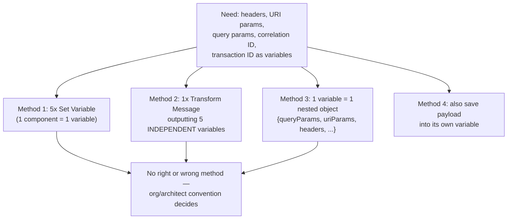

*"There is no right or wrong method. You can follow anything."* The instructor even recommends cloning an existing API from Bitbucket specifically to see which convention that project already follows — a working developer needs to read and adapt to whatever pattern is already in use.

---

## 3. The One Real Constraint: Independent vs. Dependent Variables

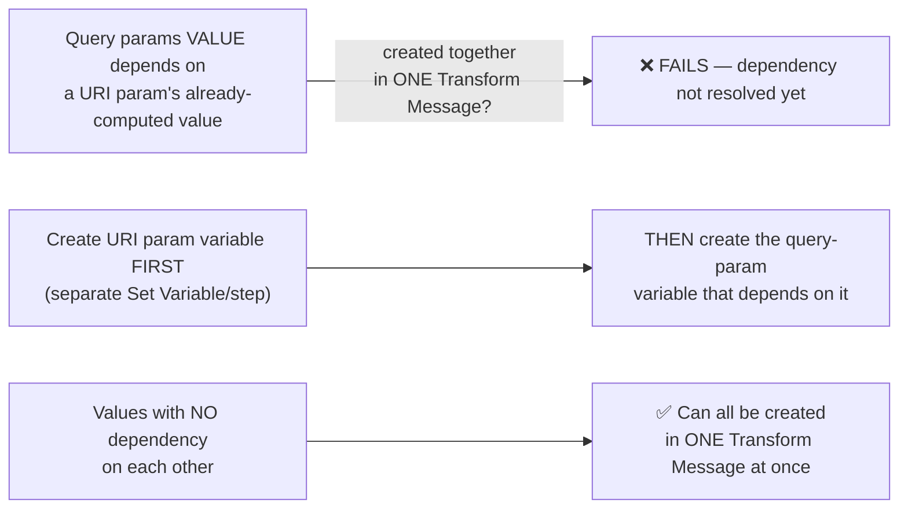

*"There is a dependency... after the URL parameter is formed, we have a dependency on it, so we have to create a set variable in the next variable... independent variables can create multiple variables in the transform message."*

---

## 4. JSON Logger — A Custom Connector, Configured Once Globally

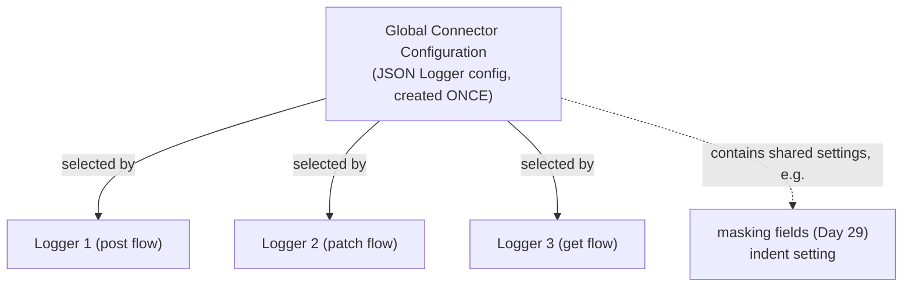

**Why not just use the plain built-in `Logger`?** *"We use JSON logger. Actually, there are some extra beneficial functionalities in it... it depends on the organization and depends on the integration architect."*

**The reuse story ties directly back to Exchange (Day 26)**: *"if we don't have JSON Loggers, it's difficult to build custom Loggers for this particular organization... you publish them in the exchange and import them from the exchange."* Exactly the same mechanism used earlier for reusable connectors/fragments.

---

## 5. `indent` — Readability vs. Transportation

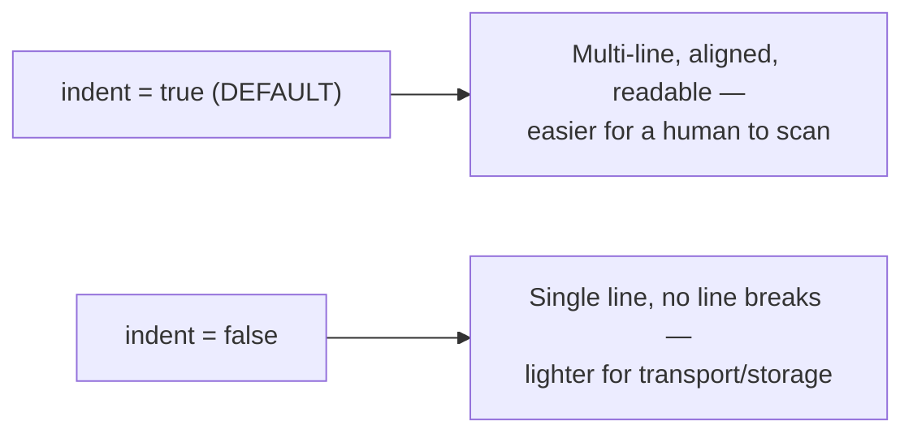

*"Visibility, readability. This readability will be good [true]. This readability will not be there [false]. But tell me if this is good for transportation... Lightweight."*

---

## 6. Log Levels — A Quick Preview (fuller treatment deferred)

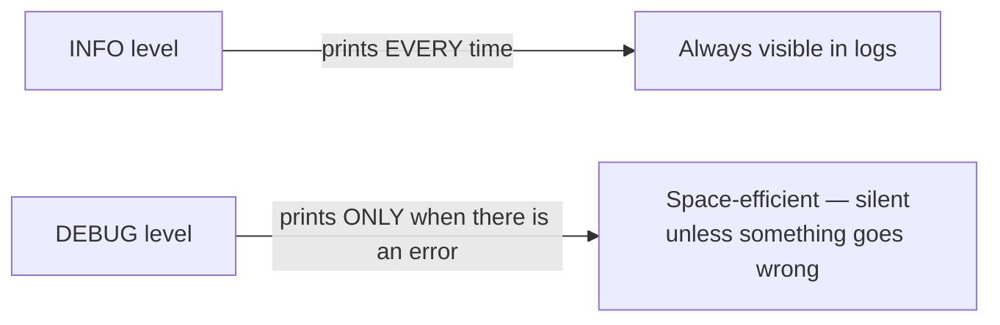

*"If you occupy too much space, the logger will not print [everything]. It will print only when there is an error."* Explicitly deferred: *"I don't want to confuse you with the functionality... we will discuss it separately."*

---

## 7. `app.name` / `flow.name` — Self-Reporting Identity

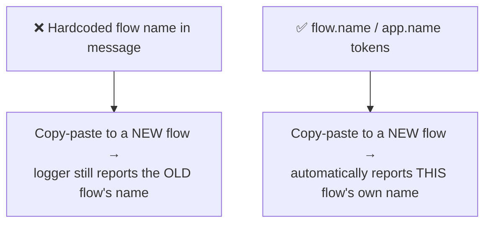

*"Since it is in our post resource flow, that particular flow name will be printed... When this travels, if it is in any flow, that flow name will be printed."* This is what makes a copy-pasted logger template safe to reuse across many flows without manual editing.

---

## 8. Trace Points and a Structured Logger Message Shape

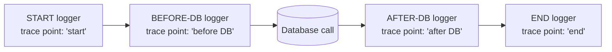

**Recommended structured fields, given directly**: application name · flow name · **source** · **destination** · **transaction ID** · **member/employee ID** — built once for the start logger, then copy-pasted and adapted (swap `start time`→`end time`, `start DB time`→`end DB time`) for the rest.

---

## 9. Measuring Elapsed Time with `now()`

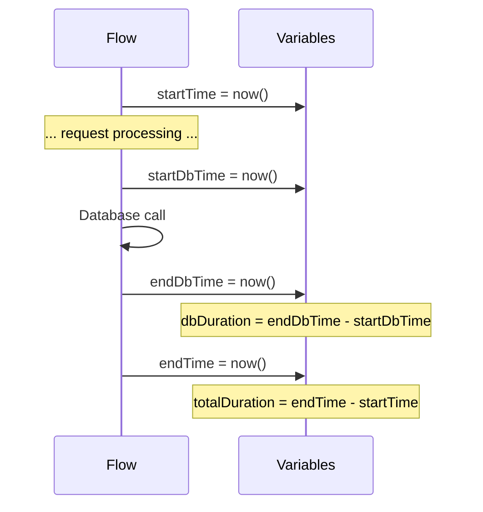

**The live timezone gotcha**: `now()` initially printed what looked like a wrong hour (*"2 am is visible here"*) — resolved as **UTC**, because *"which server will take this now? In general, where the application is deployed"* — local deployment → local timezone; CloudHub → UTC by default (*"if we want, we have to change it"*).

**Explicitly situational, not default-everywhere tooling**: *"Will you put it on everyone? There is no need to put it. But at one time, a situation like this came... If we know that this is there now, will it be useful?"*

---

## 10. Logging Is Asynchronous — It Does Not Cost Response Time

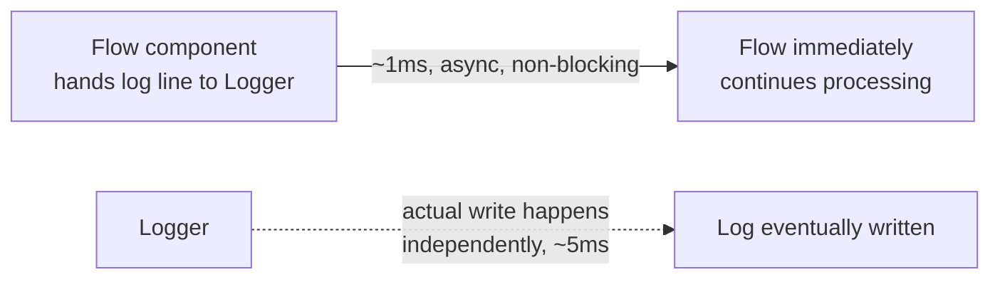

**The printer-queue analogy, given directly**: *"you have a PDF for 100 printouts... it will be printed one by one. But did I give the information that I need to the printer? Yes... Will it work if it is in the queue? Yes, it will work. Can I do my work now? Yes."* The direct reassurance: *"I don't have an impact on business during response time, right? Many people will have confusion in real time"* about exactly this point.

---

## 11. Why Production Logs Get Removed

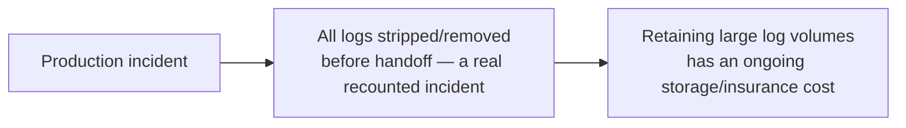

*"How do I check the logs in a production?... A production happened to us recently. In that, all the logs were reverted and sold to us."*

---

## 12. Sensitive Information and Masking — Setting Up the Problem

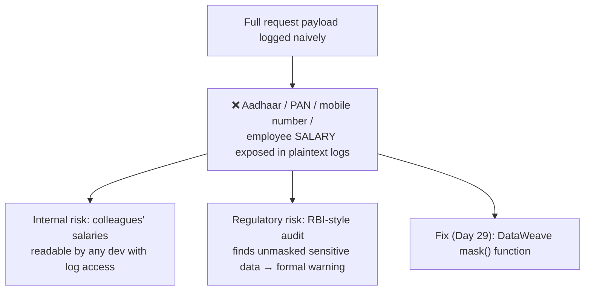

**A concrete personal example given directly**: a newly-hired colleague's exact salary was visible in a production log the developer happened to check for an unrelated reason — *"I interviewed him. He is going to join the company... I immediately went to the production and checked the log. See if I know his salary here... Is that clarity clear?"*

**The compliance framing, stated directly with a named regulator**: *"someone from banks like... Reserve Bank of India, will suddenly come for audit. They will show your logs in production... you can't deny them."* Banking specifically treats PAN, Aadhaar, card numbers, email, and phone numbers as compulsory sensitive fields — unmasked exposure draws formal audit warnings with real reputational stakes for a public listed company.

**Deliberately left as a cliffhanger**: *"There is a masking function in the data view... we will see it tomorrow."*

---

## Quick Recap
- **HTTP Request connectors overwrite `attributes`** — the entire reason initial values must be captured into **variables** immediately, since variables survive where attributes don't.
- **Four valid patterns exist** for creating those initial variables (multiple Set Variables / one multi-output Transform Message / a single nested-object variable / a payload-plus-others hybrid) — no single right answer, only the constraint that **dependent variables must be sequenced**, not created together.
- **JSON Logger is a custom connector** with a **global connector configuration**, reusable across every logger in the project — and, like other connectors, publishable to and importable from Exchange.
- **`indent`** trades human readability (default `true`) against transport/storage efficiency (`false`).
- **`app.name`/`flow.name`** make a copy-pasted logger self-report its own containing flow, instead of a stale hardcoded name.
- **Structured logger fields** (application, flow, source, destination, transaction ID, member/employee ID) plus named **trace points** (start/end/before-DB/after-DB) give end-to-end request visibility.
- **`now()` reflects the deployment server's timezone** — UTC on CloudHub by default — and paired with start/end variables is a situational tool for measuring elapsed time, including isolating DB call duration specifically.
- **Logging is asynchronous** and does not add to response time — proven by direct analogy to a print queue.
- **Sensitive data (Aadhaar, PAN, mobile, salary) must never be logged unmasked** — both an internal-trust risk and a real regulatory/audit risk — with the actual DataWeave `mask()` mechanism explicitly deferred to Day 29.
