# Day 29 — Detailed Notes: Masking Mechanics, Real Database Setup, and Service Accounts

> **Watch alongside:** this session turns yesterday's masking *cliffhanger* into working code, then pivots to something equally important — actually building the real MySQL database and wiring MuleSoft to it safely. The one rule worth internalizing hardest here: **never use a human account for machine-to-machine communication** — always a dedicated service account, because it must keep working even if the person who owns it resigns.

---

## 1. The `mask` Function — Import, Then Apply

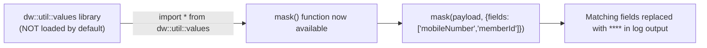

*"This mask function will be in the availability of the data [library]... we have to import the utility from the values library."* Exact syntax: `import * from dw::util::values`.

---

## 2. Masking at the Global Connector Level — One Setting, Not Fifty Calls

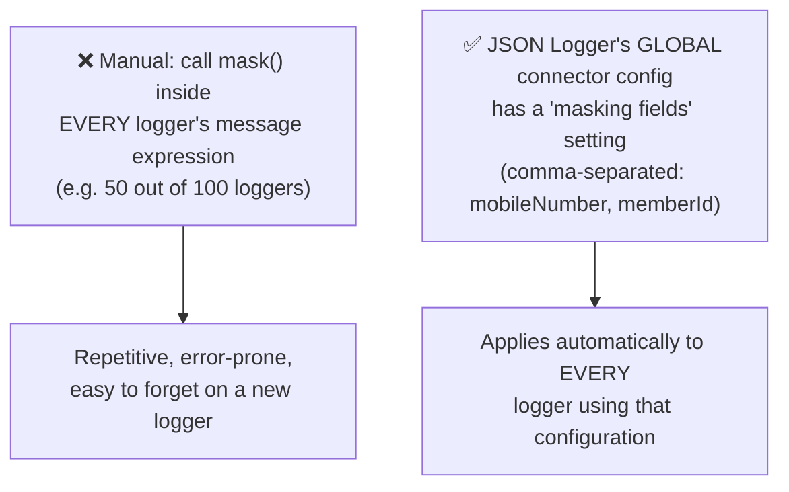

*"I am using masking around 50 times out of 100 logs. Is it better to do it 50 times or one time? One time."*

---

## 3. How to Actually Learn MuleSoft Documentation

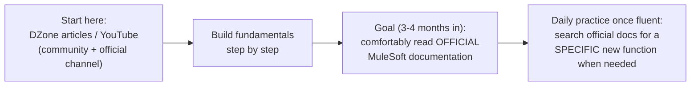

**A frank, direct admission**: *"if we read the mules of documentation in the beginning, it gives us a lot of confusion... if 100 people read it, 5% will agree [understand it]. But 95%... will not understand."*

---

## 4. Building the Real Database and Table

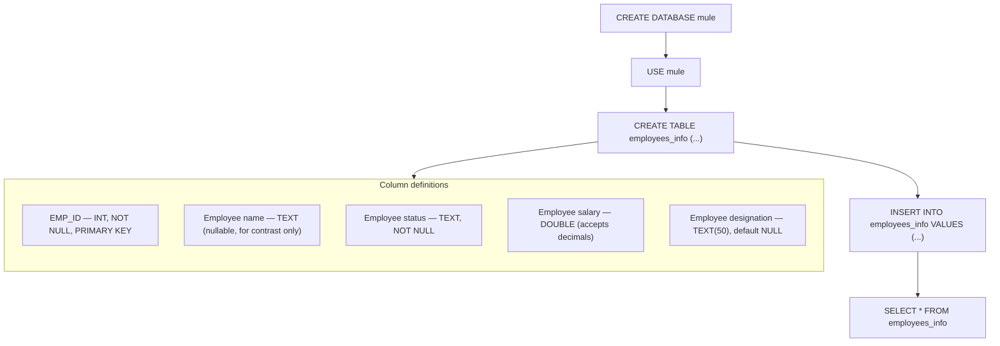

**Primary key's two guarantees, stated directly**: *"if the employee ID is not given when you insert it, it will not get inserted... if you give the same employee ID again, then it will not be inserted. It should be unique."*

**A live length-limit bug**: an employee name value exceeding the 255-character column limit throws a red error — directly illustrating why you must ask the DB team for exact column data types/lengths even without direct database access: *"you don't have access to the database... their team is handling it. Then how do you know? You have to ask him."*

---

## 5. Why a Local App Can't Reach a Remote Database

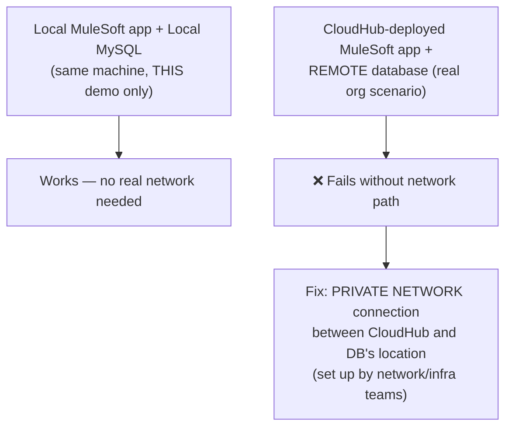

*"This is in your local, so it is not yet shared... there is no [network] connection between our system and your system... database servers are placed in a shared location. So, they give connectivity to the database location and to the cloud hub... by giving a connection through a private network."*

---

## 6. Property Files — a Real Environment-Count Mismatch

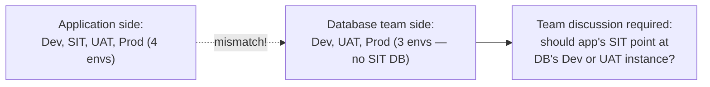

*"Don't get confused if you face such situations... before we take a decision, just discuss with other team people as well and take a final decision."* Host/port → regular property file; username/password → **Secure Properties** (same pattern as the earlier property-files session).

---

## 7. Reconnection Strategy: Standard vs. Forever, Applied to the DB

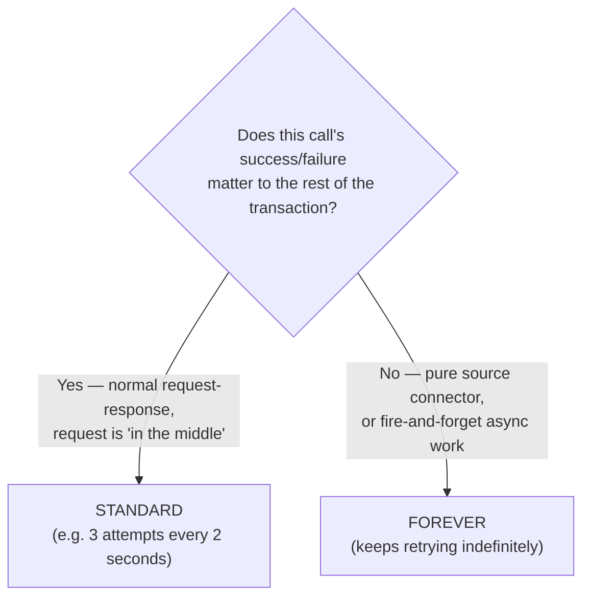

*"It is better to set standard when the transaction is in the middle or when the request is lost... when do we set forever? When there is no dependency [on the outcome]."*

---

## 8. A Live Secure-Key Mismatch Bug

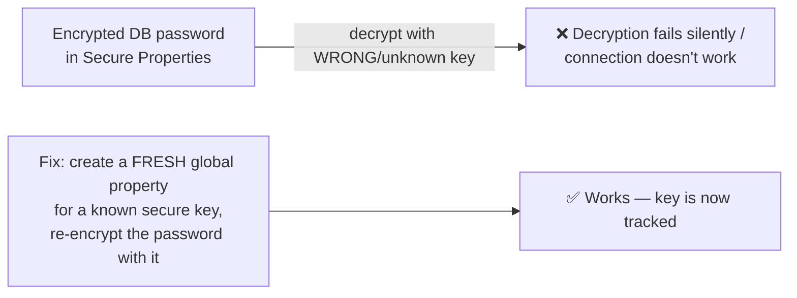

Directly reinforces the Day 27 AES-key warning: lose track of the encryption key, and previously-encrypted values become permanently unreadable — the fix here isn't recovery, it's re-encrypting with a newly-tracked key.

---

## 9. Root vs. Service Accounts — the Session's Most Important Rule

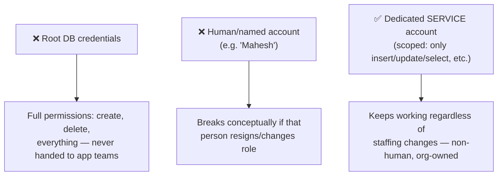

**The single most emphasized line of the session**: *"when we connect programmatically, when we communicate mission to mission, when we communicate application to application, you should never use human-related accounts. You should always use service-related users or service-related accounts."*

---

## 10. Dynamic Input Parameters in the Insert Query

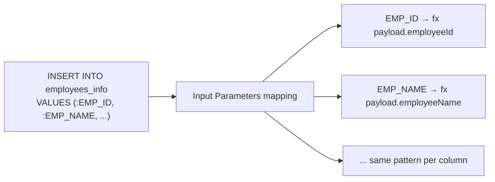

**Naming discipline, stated directly**: *"it is always a good practice to maintain the same column names"* as placeholder keys — scales cleanly even to "50 fields or 100 fields."

**Live `fx` gotcha**: `payload.employeeId` typed directly (without enabling `fx`/expression mode) fails — *"it is working only in expression mode. `Payload.` is not an expression"* by default; the `fx` toggle must be explicitly turned on.

---

## 11. Live Test: Success, Duplicate-Key Error, and DB-Down Reconnection

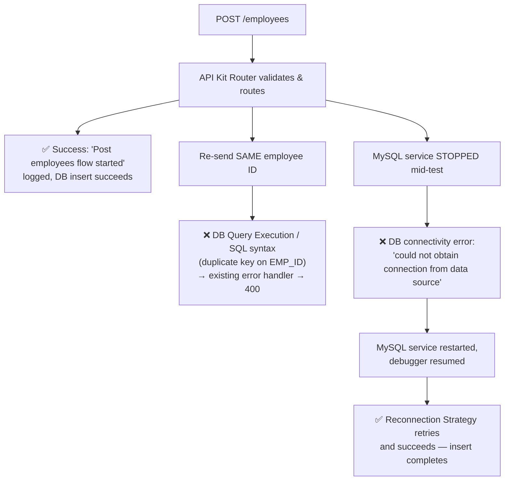

**The catch-all fallback, reiterated from Day 27's error handler design**: *"if these two types don't match, anything will come down here"* — any unmatched error type falls through to the `ANY` handler.

---

## Quick Recap
- **`mask()` lives in `dw::util::values`** — must be explicitly imported before use, same as any Studio module.
- **Masking is best configured ONCE**, at the JSON Logger's global connector configuration ("masking fields"), rather than repeated per logger.
- **Learn MuleSoft docs via DZone/YouTube first**, official documentation as a 3-4-month fluency goal, then targeted searches once fluent.
- **The real Employees database/table exist now**: `EMP_ID INT NOT NULL PRIMARY KEY`, name/status/designation as text, salary as `DOUBLE` — tested with working `INSERT`/`SELECT` and a caught length-limit error.
- **A local app only reaches a database it has real network access to** — real orgs bridge CloudHub to remote databases via **private network connections**.
- **DB config**: host/port in regular properties, username/password in **Secure Properties** — with realistic environment-count mismatches requiring cross-team resolution.
- **Reconnection Strategy**: Standard for normal request-response DB calls; Forever only when there's no dependency on the outcome.
- **Never use a human account for machine-to-machine communication** — always a dedicated service account, so it survives staffing changes.
- **Live-tested**: success path, a duplicate-primary-key SQL error (400 via the existing error handler), and a DB-connectivity failure recovered live by the Reconnection Strategy after restarting the MySQL service.
