# Day 29 — Detailed Notes: Masking Mechanics, Real Database Setup, and Service Accounts

> **Watch alongside:** this session turns yesterday's masking *cliffhanger* into working code, then pivots to something equally important — actually building the real MySQL database and wiring MuleSoft to it safely. The one rule worth internalizing hardest here: **never use a human account for machine-to-machine communication** — always a dedicated service account, because it must keep working even if the person who owns it resigns.

> **Video-verified:** checked against the class recording (16 Dec 2024). Corrected from the screen: module `dw::util::Values`, `mask field(...) with ...` syntax, the class table `EMPLOYEES_INFO` (`emp_id` …), the input parameters, the `DATABASE:NO_DATA_FOUND` deploy failure, and the 201/400/500 test results. Slide images: [slides/day29](../slides/day29/).

---

## 1. The `mask` Function — Import, Then Apply

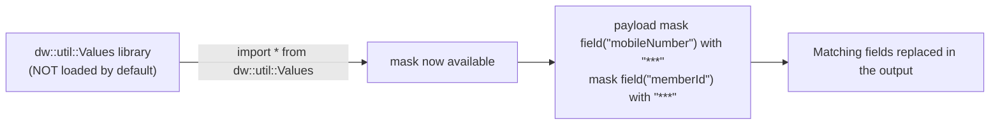
```mermaid
flowchart LR
    Lib["dw::util::Values library<br/>(NOT loaded by default)"] -->|"import * from dw::util::Values"| Avail["mask now available"]
    Avail --> Call["payload mask field(#quot;mobileNumber#quot;) with #quot;***#quot;<br/>mask field(#quot;memberId#quot;) with #quot;***#quot;"]
    Call --> Out["Matching fields replaced in the output"]
```

*"This mask function will be in the availability of the data [library]... we have to import the utility from the values library."* Exact syntax (*screen*): `import * from dw::util::Values` — capital **V**. In the Playground, without the import the output is `Unable to resolve reference of: mask`. With it:

```dataweave
%dw 2.0
import * from dw::util::Values
output application/json
---
{ "requestpayload": (payload mask field("mobileNumber") with "#####" mask field("memberId") with "#####") }
```

→ `mobileNumber` and `memberId` become `"#####"`; `message` is untouched. The reference Start Logger uses the same expression on `vars.requestPayload` with `"********"`.

---

## 2. Masking at the Global Connector Level — One Setting, Not Fifty Calls

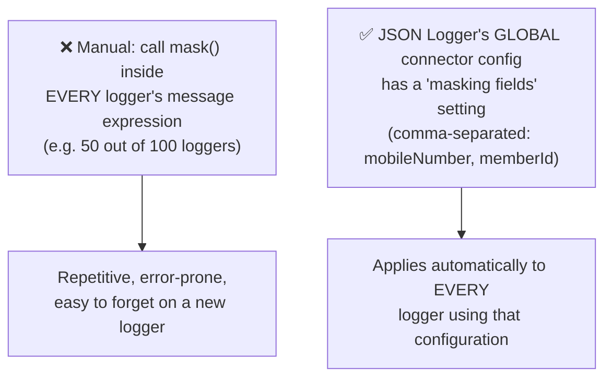
```mermaid
flowchart TB
    Manual["❌ Manual: call mask() inside\nEVERY logger's message expression\n(e.g. 50 out of 100 loggers)"] --> Cost["Repetitive, error-prone,\neasy to forget on a new logger"]
    Global["✅ JSON Logger's GLOBAL connector config\nhas a 'masking fields' setting\n(comma-separated: mobileNumber, memberId)"] --> Auto["Applies automatically to EVERY\nlogger using that configuration"]
```

*"I am using masking around 50 times out of 100 logs. Is it better to do it 50 times or one time? One time."*

> *Screen:* explained only — the class project uses the core Logger, so masking there is the `mask` expression in the message.

---

## 3. How to Actually Learn MuleSoft Documentation

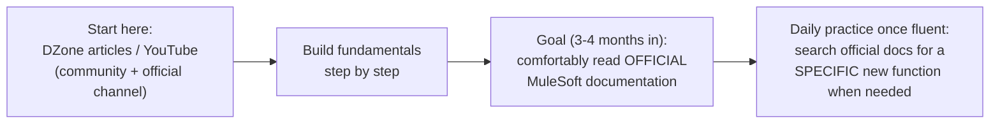
```mermaid
flowchart LR
    Start["Start here:\nDZone articles / YouTube\n(community + official channel)"] --> Build["Build fundamentals\nstep by step"]
    Build --> Goal["Goal (3-4 months in):\ncomfortably read OFFICIAL\nMuleSoft documentation"]
    Goal --> Daily["Daily practice once fluent:\nsearch official docs for a\nSPECIFIC new function when needed"]
```

**A frank, direct admission**: *"if we read the mules of documentation in the beginning, it gives us a lot of confusion... if 100 people read it, 5% will agree [understand it]. But 95%... will not understand."*

---

## 4. Building the Real Database and Table

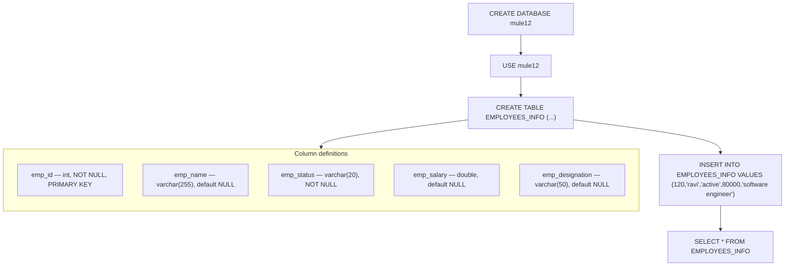
```mermaid
flowchart TB
    C1["CREATE DATABASE mule12"] --> C2["USE mule12"]
    C2 --> C3["CREATE TABLE EMPLOYEES_INFO (...)"]
    C3 --> Cols
    subgraph Cols["Column definitions"]
        direction TB
        A["emp_id — int, NOT NULL, PRIMARY KEY"]
        B["emp_name — varchar(255), default NULL"]
        C["emp_status — varchar(20), NOT NULL"]
        D["emp_salary — double, default NULL"]
        E["emp_designation — varchar(50), default NULL"]
    end
    C3 --> Insert["INSERT INTO EMPLOYEES_INFO VALUES (120,'ravi','active',80000,'software engineer')"]
    Insert --> Select["SELECT * FROM EMPLOYEES_INFO"]
```

**Primary key's two guarantees, stated directly**: *"if the employee ID is not given when you insert it, it will not get inserted... if you give the same employee ID again, then it will not be inserted. It should be unique."*

**A live length-limit bug**: an employee name value exceeding the 255-character column limit throws a red error (*screen:* `Error Code: 1406. Data too long for column 'emp_name' at row 1`; a misspelt table gives `Error Code: 1146. Table 'mule12.employee_info' doesn't exist`) — directly illustrating why you must ask the DB team for exact column data types/lengths even without direct database access: *"you don't have access to the database... their team is handling it. Then how do you know? You have to ask him."*

---

## 5. Why a Local App Can't Reach a Remote Database

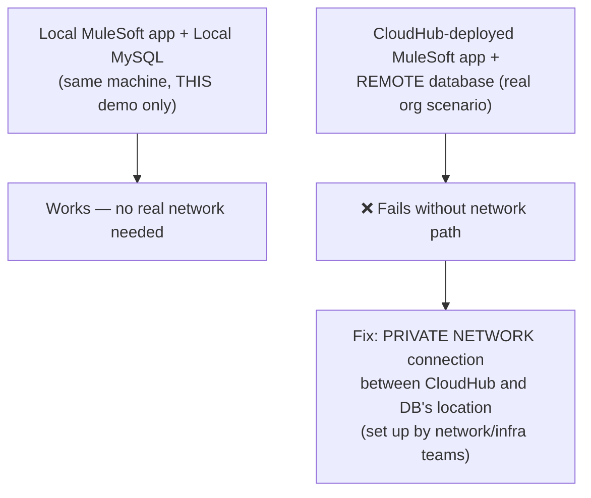
```mermaid
flowchart TB
    Local["Local MuleSoft app + Local MySQL\n(same machine, THIS demo only)"] --> Works["Works — no real network needed"]
    Cloud["CloudHub-deployed MuleSoft app +\nREMOTE database (real org scenario)"] --> Fails["❌ Fails without network path"]
    Fails --> Fix["Fix: PRIVATE NETWORK connection\nbetween CloudHub and DB's location\n(set up by network/infra teams)"]
```

*"This is in your local, so it is not yet shared... there is no [network] connection between our system and your system... database servers are placed in a shared location. So, they give connectivity to the database location and to the cloud hub... by giving a connection through a private network."*

---

## 6. Property Files — a Real Environment-Count Mismatch

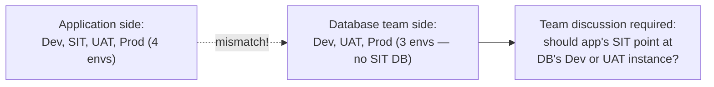
```mermaid
flowchart LR
    App["Application side:\nDev, SIT, UAT, Prod (4 envs)"] -.->|"mismatch!"| DB["Database team side:\nDev, UAT, Prod (3 envs — no SIT DB)"]
    DB --> Decide["Team discussion required:\nshould app's SIT point at\nDB's Dev or UAT instance?"]
```

*"Don't get confused if you face such situations... before we take a decision, just discuss with other team people as well and take a final decision."* Host/port → regular property file; username/password → **Secure Properties** (same pattern as the earlier property-files session).

---

## 7. Reconnection Strategy: Standard vs. Forever, Applied to the DB

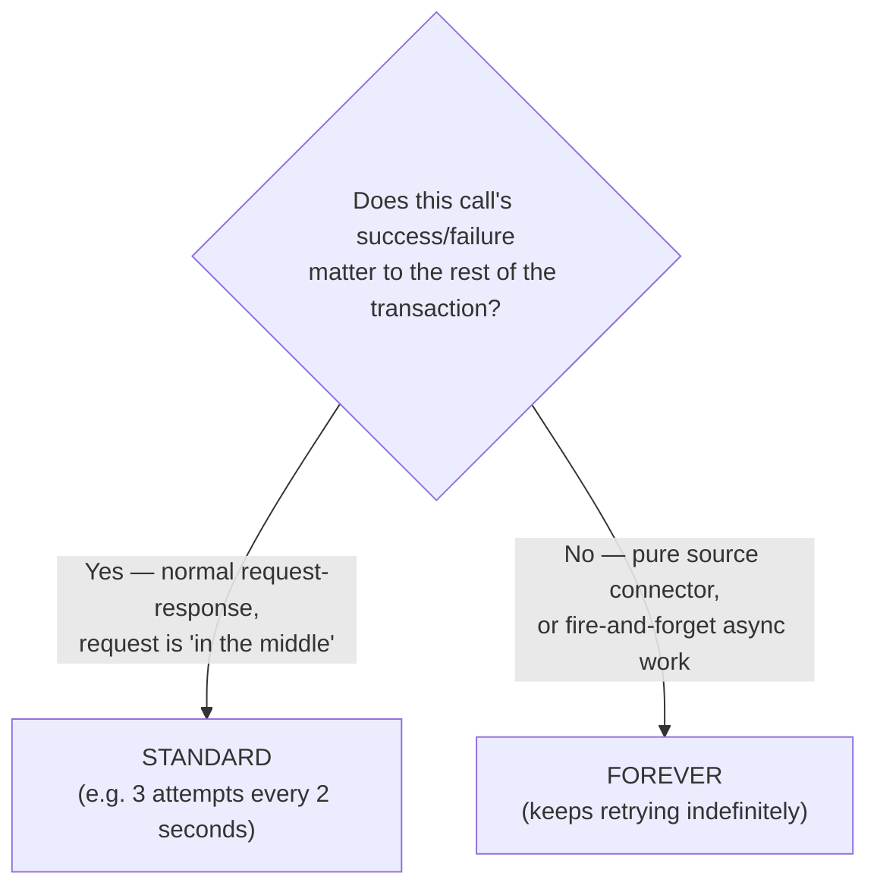
```mermaid
flowchart TB
    Q{"Does this call's success/failure\nmatter to the rest of the transaction?"}
    Q -->|"Yes — normal request-response,\nrequest is 'in the middle'"| Standard["STANDARD\n(e.g. 3 attempts every 2 seconds)"]
    Q -->|"No — pure source connector,\nor fire-and-forget async work"| Forever["FOREVER\n(keeps retrying indefinitely)"]
```

*"It is better to set standard when the transaction is in the middle or when the request is lost... when do we set forever? When there is no dependency [on the outcome]."*

---

## 8. A Live Secure-Key Mismatch Bug

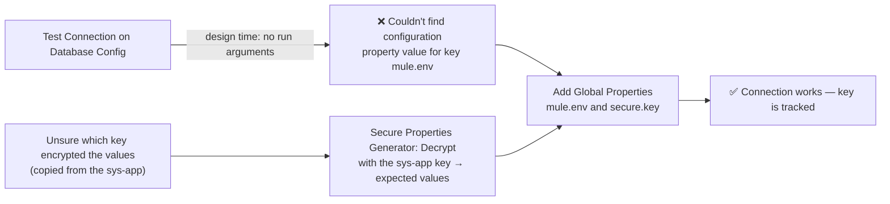
```mermaid
flowchart LR
    Test["Test Connection on Database Config"] -->|"design time: no run arguments"| Fail["❌ Couldn't find configuration<br/>property value for key mule.env"]
    Fail --> Fix["Add Global Properties<br/>mule.env and secure.key"]
    Check["Unsure which key encrypted the values<br/>(copied from the sys-app)"] --> Gen["Secure Properties Generator: Decrypt<br/>with the sys-app key → expected values"]
    Gen --> Fix
    Fix --> Works["✅ Connection works — key is tracked"]
```

*Screen:* the encrypted username/password in `dev.yaml`/`prod.yaml` were copied from the sys-app, and the instructor had to work out which key made them (*"I think I took it from the Sys app"*). Decrypting them in the Secure Properties Generator with that key returned the expected username and password, so that key became the `secure.key` global property (it can also go in Debug Configurations → Environment). Reinforces the Day 27 warning: lose track of the key and the encrypted values are unreadable. Remove these global properties before pushing code.

> **Placeholder values** (fake, not the class ones): key `DEMOKEY123456789`; yaml `username: "![Xy3dEmOuSeRnAmE1==]"`, `password: "![Pq9dEmOpAsSwOrD2==]"`; Decrypt (AES, CBC) of the username → `root`, of the password → `<mysql-root-password>`. The real screens are in the recording at 0:36 (`dev.yaml`), 51:14 and 54:55 (Decrypt results); they aren't published here.

---

## 9. Root vs. Service Accounts — the Session's Most Important Rule

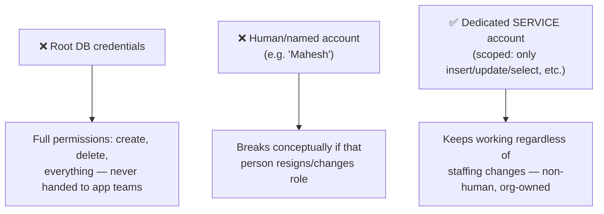
```mermaid
flowchart TB
    Root["❌ Root DB credentials"] --> Danger["Full permissions: create, delete,\neverything — never handed to app teams"]
    Named["❌ Human/named account\n(e.g. 'Mahesh')"] --> Fragile["Breaks conceptually if that\nperson resigns/changes role"]
    Service["✅ Dedicated SERVICE account\n(scoped: only insert/update/select, etc.)"] --> Durable["Keeps working regardless of\nstaffing changes — non-human, org-owned"]
```

**The single most emphasized line of the session**: *"when we connect programmatically, when we communicate mission to mission, when we communicate application to application, you should never use human-related accounts. You should always use service-related users or service-related accounts."*

---

## 10. Dynamic Input Parameters in the Insert Query

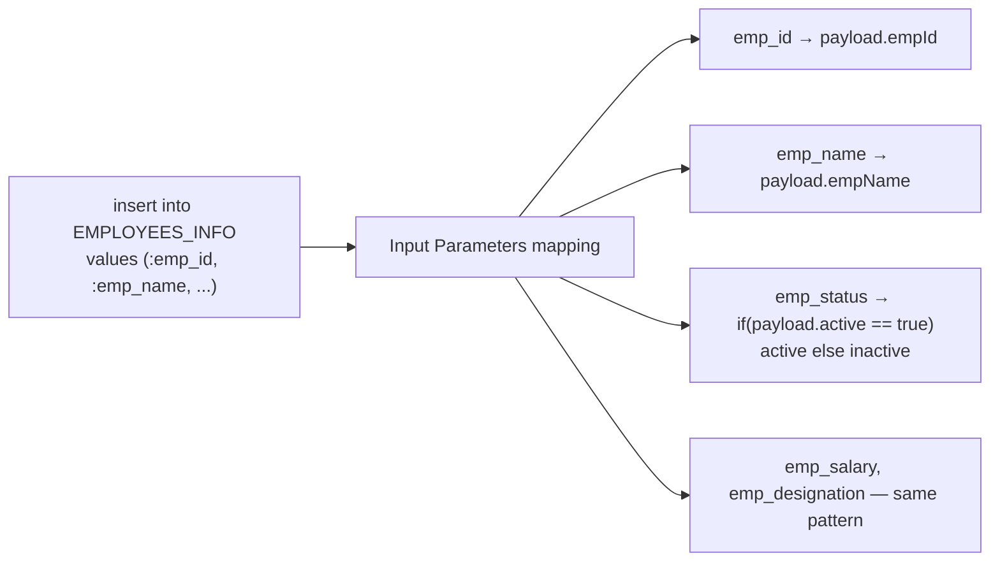
```mermaid
flowchart LR
    Query["insert into EMPLOYEES_INFO<br/>values (:emp_id, :emp_name, ...)"] --> Params["Input Parameters mapping"]
    Params --> P1["emp_id → payload.empId"]
    Params --> P2["emp_name → payload.empName"]
    Params --> P4["emp_status → if(payload.active == true)<br/>active else inactive"]
    Params --> P3["emp_salary, emp_designation — same pattern"]
```

**Naming discipline, stated directly**: *"it is always a good practice to maintain the same column names"* as placeholder keys — scales cleanly even to "50 fields or 100 fields."

*Screen — the input parameters:*

```dataweave
{
  "emp_id": payload.empId,
  "emp_name": payload.empName,
  "emp_status": if(payload.active == true) "active" else "inactive",
  "emp_salary": payload.empSalary,
  "emp_designation": payload.empDesignation
}
```

**A deploy failure before the test (screen):** the reused `common-error-handler.xml` had an On Error Propagate for `DATABASE:NO_DATA_FOUND`. Deploy failed — `Could not find ErrorType for the given identifier: 'DATABASE:NO_DATA_FOUND'`. A custom type can't be used in a handler until the app can raise it, so the block was commented out (`<!-- … -->`) for now.

**Live `fx` gotcha**: `payload.employeeId` typed directly (without enabling `fx`/expression mode) fails — *"it is working only in expression mode. `Payload.` is not an expression"* by default; the `fx` toggle must be explicitly turned on.

---

## 11. Live Test: Success, Duplicate-Key Error, and DB-Down Reconnection

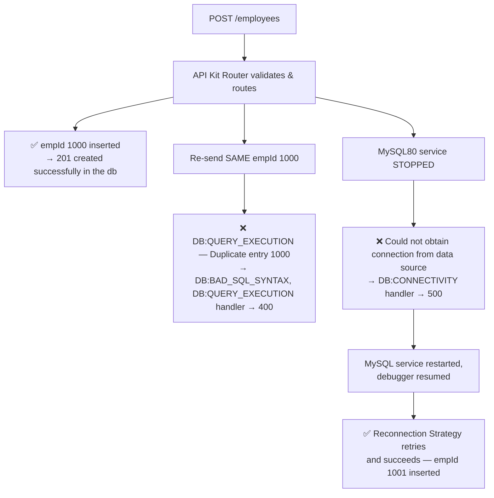
```mermaid
flowchart TB
    Req["POST /employees"] --> Router["API Kit Router validates & routes"]
    Router --> Success["✅ empId 1000 inserted<br/>→ 201 created successfully in the db"]
    Router --> Dup["Re-send SAME empId 1000"]
    Dup --> DupErr["❌ DB:QUERY_EXECUTION — Duplicate entry 1000<br/>→ DB:BAD_SQL_SYNTAX, DB:QUERY_EXECUTION handler → 400"]
    Router --> Stop["MySQL80 service STOPPED"]
    Stop --> ConnErr["❌ Could not obtain connection from data source<br/>→ DB:CONNECTIVITY handler → 500"]
    ConnErr --> Restart["MySQL service restarted,\ndebugger resumed"]
    Restart --> Retry["✅ Reconnection Strategy retries<br/>and succeeds — empId 1001 inserted"]
```

**The catch-all fallback, reiterated from Day 27's error handler design**: *"if these two types don't match, anything will come down here"* — any unmatched error type falls through to the `ANY` handler.

---

## Quick Recap
- **`mask` lives in `dw::util::Values`** (syntax `value mask field("x") with "***"`) — must be explicitly imported before use, same as any Studio module.
- **Masking is best configured ONCE**, at the JSON Logger's global connector configuration ("masking fields"), rather than repeated per logger.
- **Learn MuleSoft docs via DZone/YouTube first**, official documentation as a 3-4-month fluency goal, then targeted searches once fluent.
- **The real Employees database/table exist now**: `EMPLOYEES_INFO` with `emp_id int NOT NULL` primary key, name/status/designation as varchar, salary as `double` — tested with working `INSERT`/`SELECT` and a caught length-limit error.
- **A local app only reaches a database it has real network access to** — real orgs bridge CloudHub to remote databases via **private network connections**.
- **DB config**: host/port in regular properties, username/password in **Secure Properties** — with realistic environment-count mismatches requiring cross-team resolution.
- **Reconnection Strategy**: Standard for normal request-response DB calls; Forever only when there's no dependency on the outcome.
- **Never use a human account for machine-to-machine communication** — always a dedicated service account, so it survives staffing changes.
- **Live-tested**: success path, a duplicate-primary-key SQL error (400 via the existing error handler), and a DB-connectivity failure recovered live by the Reconnection Strategy after restarting the MySQL service.
