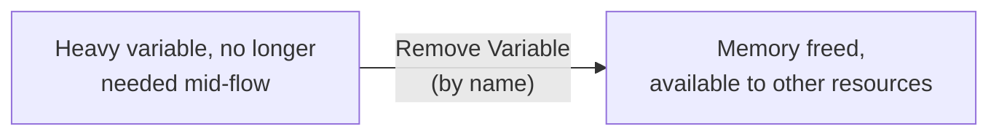
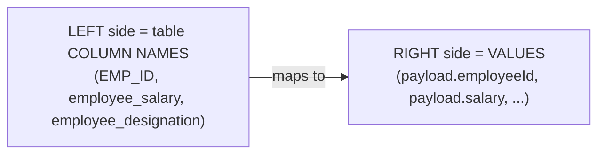
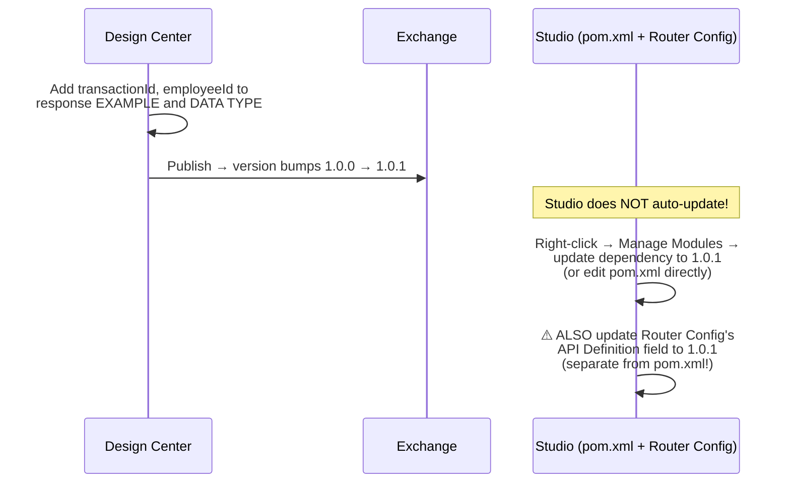
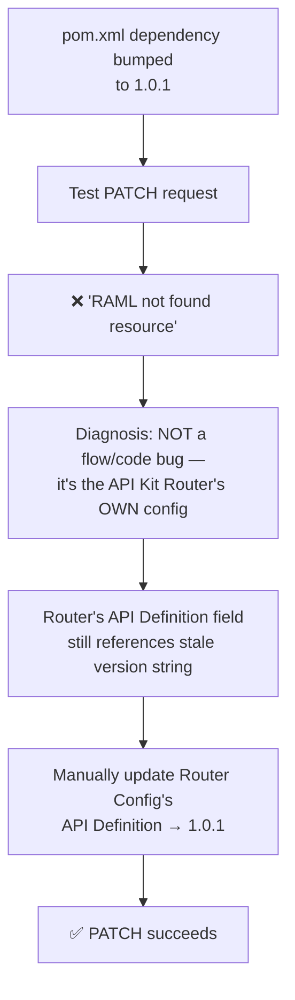
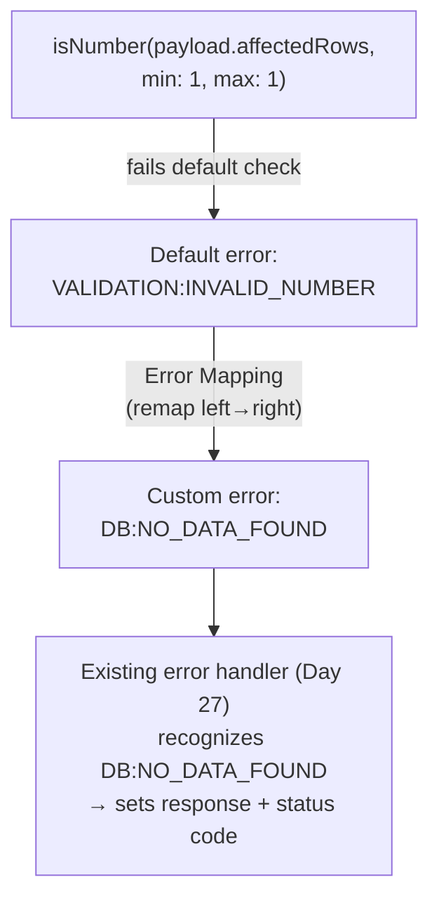
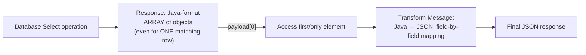
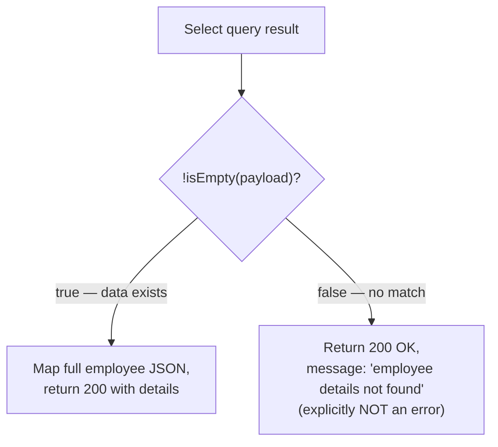
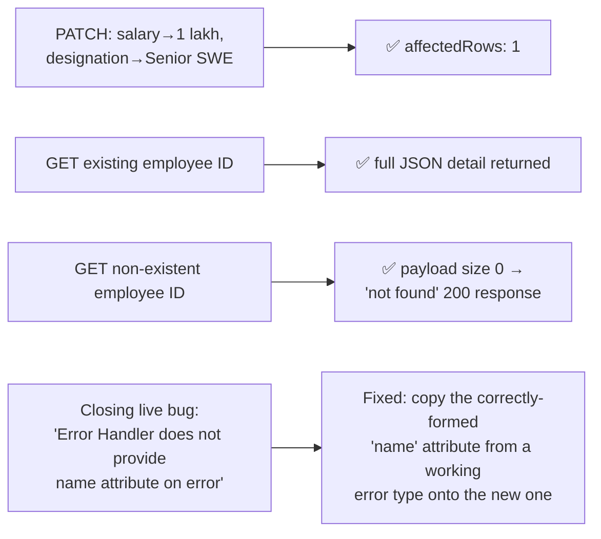

# Day 30 — Detailed Notes: PATCH/GET Build-Out, RAML Sync, and the Validation Module

> **Watch alongside:** the single most valuable moment in this session is the live router-configuration bug — after bumping the RAML spec's version and updating `pom.xml`, the API Kit Router itself *still* pointed at the old version string in its own config, causing a "resource not found" error that had nothing to do with the actual flow logic. This exact failure mode (two separate places tracking "the current API version," only one of which gets updated) is worth reproducing yourself.

---

## 1. Remove Variable — Deliberate Memory Hygiene

*"If it is small variables, that's okay. But if it is big variables, what can we do? We can use remove variable option."*

---

## 2. PATCH's Update Query — Left/Right Mapping Discipline

**Stated directly, repeatedly, because it's a common confusion**: *"left side should match with these [table columns]... right side are the values we map... many developers get confused about which side to put left and which side to put right."*

**Why not just hardcode values inline?** Valid, but less maintainable: *"it is always a good practice to maintain [column-name mapping] for neat and clean code... since it is SQL code, it needs to be neat and presentable."*

---

## 3. Keeping RAML and Implementation in Sync — The Full Cycle

**Why this matters at all, stated directly**: *"RAML thinks the response structure is like this. But when it comes to implementation, if you check here, it is different... they will get confused again."* Any consumer trusting the spec needs the implementation to actually match it.

**What re-scaffolding does NOT touch**: *"we won't overwrite all our changes? No, we won't... all the old resources already have private flows. We won't change them, they will remain the same."* Only a brand-new resource gets an empty private flow generated.

---

## 4. The Live Router-Configuration Bug

*"The issue came from the global, router configuration... how is the API definition?... this will search for 1.0.0.1. Is it here? We have already updated it with 1.0.1, right?... then change it here."* Two separate places track "current API version" — a pom.xml dependency and the router config's own field — and bumping one does not automatically bump the other.

---

## 5. Validation Module + Error Mapping = Custom Error Types

**Error Mapping's scope, stated directly**: *"error mapping is for every component... it is not for Logger. It is available for database connector, HTTP request connector, etc. It is very rarely used [elsewhere]. Error mapping is mostly available in [and used with] this validation module."*

**Exact required syntax, given directly**: *"it is similar to `HTTP:CONNECTIVITY` and `DB:CONNECTIVITY`. In the same way, it is enough if the structure is followed"* — `NAMESPACE:IDENTIFIER`, here **`DB:NO_DATA_FOUND`**, directly reusing the same custom error type already present in the Day 27 reused error handler.

**A live-caught bug — defining ≠ mapping**: deploying before actually wiring the mapping causes the error type to not exist anywhere in the application yet, so the error handler can't catch it. Both steps — define the custom type AND map a component to raise it — are required.

---

## 6. GET: Select's Array-of-Objects Response Shape

**Why an array even for one row, explained by direct analogy to a JSON body with multiple employees**: *"is this an array?... this is an object. Is this an array of objects? Yes. Each object is represented by one employee."* A Select scoped to a single ID still returns a one-element array — *"even then, it will come the same. But, only one object will come."*

---

## 7. "Not Found" Is a Success (200), Not an Error

**Stated directly, as a deliberate design choice**: *"you should not send the error response. You should send the success response... employee details not found in the database... then it will come to 200 OK."*

**`isEmpty`/`!isEmpty` vs. `sizeOf(payload) == 0` — a performance distinction, stated directly**: *"the problem with the size of payload is that the payload is very large... it will load all the data, check the size... performance wise, [isEmpty] is better."* `isEmpty` can short-circuit without loading/counting a potentially large array.

---

## 8. Live Test Summary

---

## Quick Recap
- **Remove Variable** frees memory for heavy variables no longer needed — a hygiene practice, not a blanket rule.
- **PATCH's Update query follows the same left(=columns)/right(=values) mapping discipline as POST's Insert** — a genuinely common source of confusion.
- **RAML and implementation must stay in sync**: Design Center first, publish, then update BOTH the Studio dependency (pom.xml/Manage Modules) AND the API Kit Router's own API Definition reference — these are two separate version pointers.
- **The Validation module + Error Mapping** lets a generic error (e.g. `VALIDATION:INVALID_NUMBER`) be remapped to a meaningful custom type (`DB:NO_DATA_FOUND`), following the `NAMESPACE:IDENTIFIER` structure — but defining a custom type and actually mapping a component to raise it are two separate required steps.
- **Select always returns an array of objects**, even for a single matching row — Java format, converted to JSON via Transform Message, accessed via `payload[0]`.
- **"Not found" is a 200 success response, not an error** — implemented via `!isEmpty(payload)`, which also outperforms `sizeOf(payload) == 0` on large datasets.
