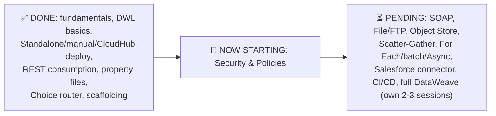
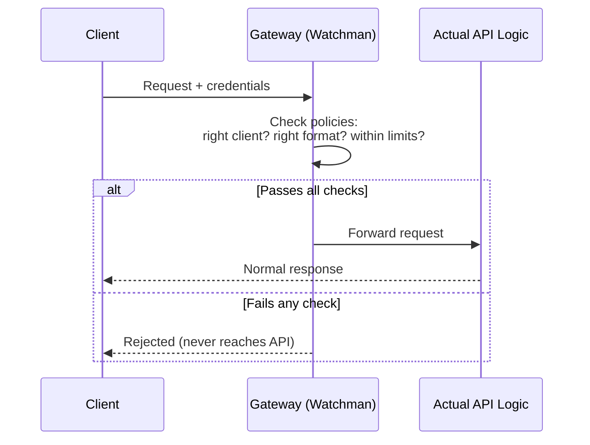
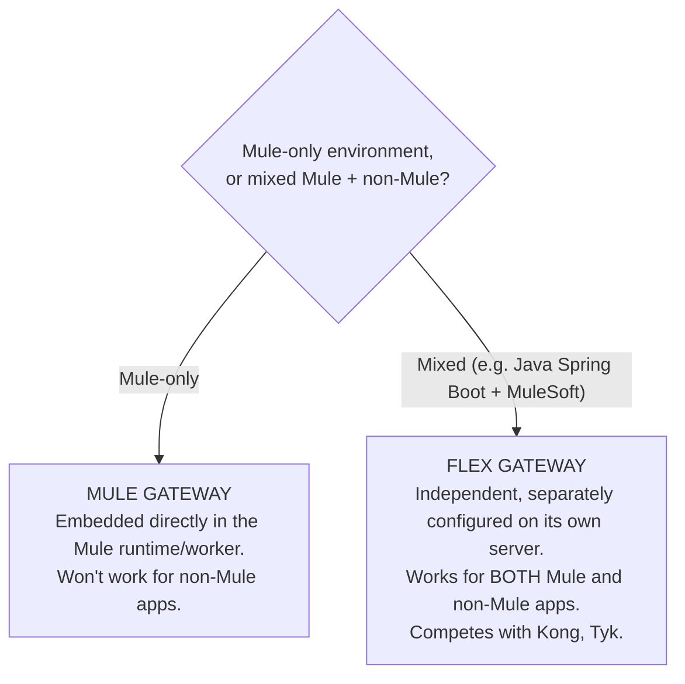
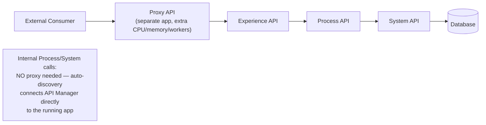
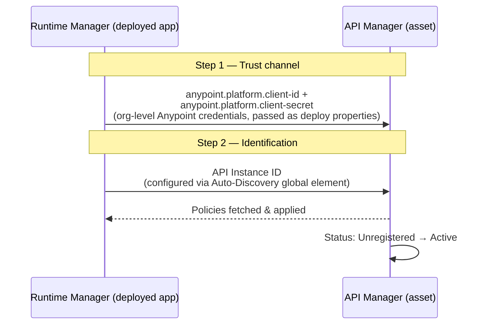
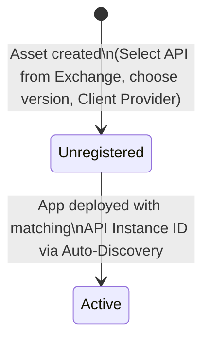
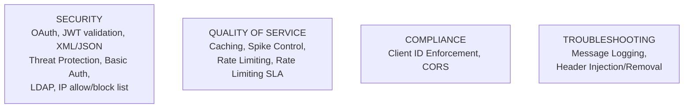
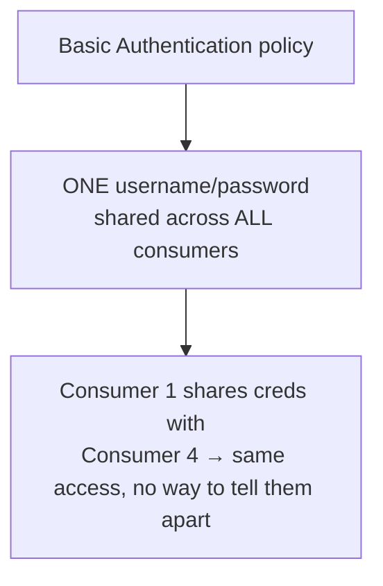
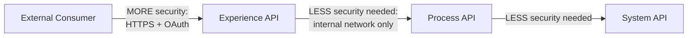

# Day 31 — Detailed Notes: API Manager, Gateways, and the Policy Layer Begins

> **Watch alongside:** the whole session pivots the course from "build the API" to "protect the API" — and the one mental model to hold onto is the **watchman analogy**: a gateway checks every request's credentials/policy compliance *before* it's allowed anywhere near your actual flow logic. Everything else — Flex vs. Mule Gateway, proxy vs. no-proxy, API Instance ID/auto-discovery — is just detail on top of that one idea.

---

## 1. Course Progress Audit — 40+ Hours In

*"When I checked yesterday, we crossed 40 hours of content already."*

---

## 2. The Gateway — The Watchman Analogy

*"A gateway service works like a security guard. Did the request come from the right client or not? If we have any policies on this, will all these policies follow or not?... after checking all these... it will send it to our API processing."*

---

## 3. Flex Gateway vs. Mule Gateway

*"API Gateway is embedded in our Mule runtime and connects directly to an existing Mule application... [Mule Gateway] is embedded in Mule Runtime itself."* vs. Flex Gateway: *"it provides flex gateway for both mule and non-mule applications."*

**The evaluation reality, stated directly**: *"they compare all the independent gateway services like Kong, Tic, Flex gateway... 80-85% of MuleSoft related applications and 10% of them are out [non-Mule]... it depends on the person who is deciding for that particular project."*

---

## 4. Proxy vs. No-Proxy — Mapped to API-Led Layers

**The cost/benefit stated directly**: *"two applications are deployed... this one needs CPU memory workers, and that one needs CPU memory workers"* — but for the externally-exposed Experience layer specifically, *"I don't want to expose that experience directly... unnecessarily you should not spend the resources"* on proxying layers that are never exposed outside anyway.

---

## 5. How API Manager and Runtime Manager Actually Communicate

**A candid admission this genuinely confuses even experienced developers**: *"this is also a confusion in the 4-5 years of experience of working in the company... there is no such clear idea"* — the instructor's own simplified version: *"communication between the runtime manager and the API manager will be happening through client ID and client secret. And if I want to discover that application from the runtime manager, I will use the API instance ID... with the help of auto-discovery."*

---

## 6. Creating an API Manager Asset — Status Lifecycle

*"This particular API is connected to the main API and the status is active or not. It is still in unregistered. The status will change when we deploy the application."*

---

## 7. The Policy Catalog

**Two real interview anecdotes, given directly**: an 18-19-year-old candidate only knew rate limiting/OAuth (and couldn't go deep on OAuth); a **~7-year MuleSoft veteran** only knew Client ID Enforcement, and not in depth either. *"Not to degrade them... we are learning better and we are in a better position than them... increasing our confidence."*

---

## 8. Basic Authentication — the Shared-Credential Weakness

*"Does this also look a bit like a compromised security? If you share it with other people, they can also access it... because it is generic, there will be a scope for us to get an issue."*

---

## 9. Security Escalates With Exposure — API-Led Layers

*"Is there sophisticated security [on Basic Auth]? No. Then does the experience API need more security or less secure policies? More security... less security is enough [for Process/System] because it is within the network."*

**Regulatory reinforcement, directly named**: *"Reserve Bank of India governs the banks... every quarter or half year, an audit is held... if you don't follow these rules, we will cancel your license"* — the same RBI-audit theme from Day 28's masking discussion, now applied to security-policy compliance.

---

## Quick Recap
- **40+ hours of content complete**; SOAP, File/FTP, Object Store, Scatter-Gather, For Each/batch/Async, Salesforce, CI/CD, and full DataWeave (its own 2-3 sessions) remain ahead — plus a parallel interview-prep track (resume session, certification, practice dumps).
- **A gateway is a watchman**: checks credentials/policy compliance before a request ever reaches the actual API logic.
- **Flex Gateway** (independent, mixed Mule/non-Mule, competes with Kong/Tyk) vs. **Mule Gateway** (embedded in the Mule runtime, Mule-only) — pick based on whether the environment is mixed-technology or Mule-only.
- **Proxy deployment costs real extra infrastructure** — worth it for externally-exposed Experience APIs, generally skippable for internal Process/System APIs.
- **API Manager ↔ Runtime Manager communication** = Client ID/Client Secret (trust channel) + API Instance ID via Auto-Discovery (identification) — a point that confuses even multi-year professionals.
- **A new API Manager asset starts Unregistered**, becoming **Active** only once a deployed app connects via auto-discovery.
- **Policies span four categories** (Security, QoS, Compliance, Troubleshooting) — real interview anecdotes show shallow policy knowledge is common even among experienced candidates, making depth here a genuine differentiator.
- **Basic Authentication's core flaw is one shared credential for all consumers**; more broadly, **security should scale with exposure** — Experience APIs need strong policies (OAuth), internal Process/System APIs need less, though regulated industries may mandate baselines regardless.
