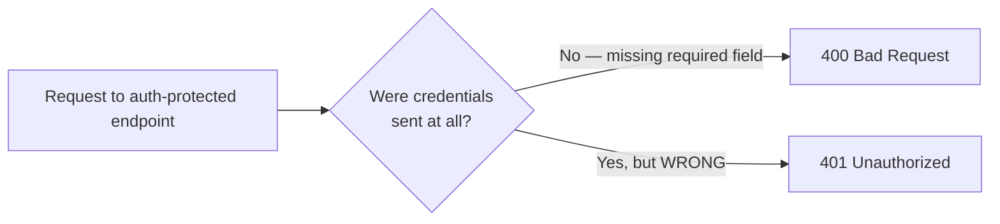
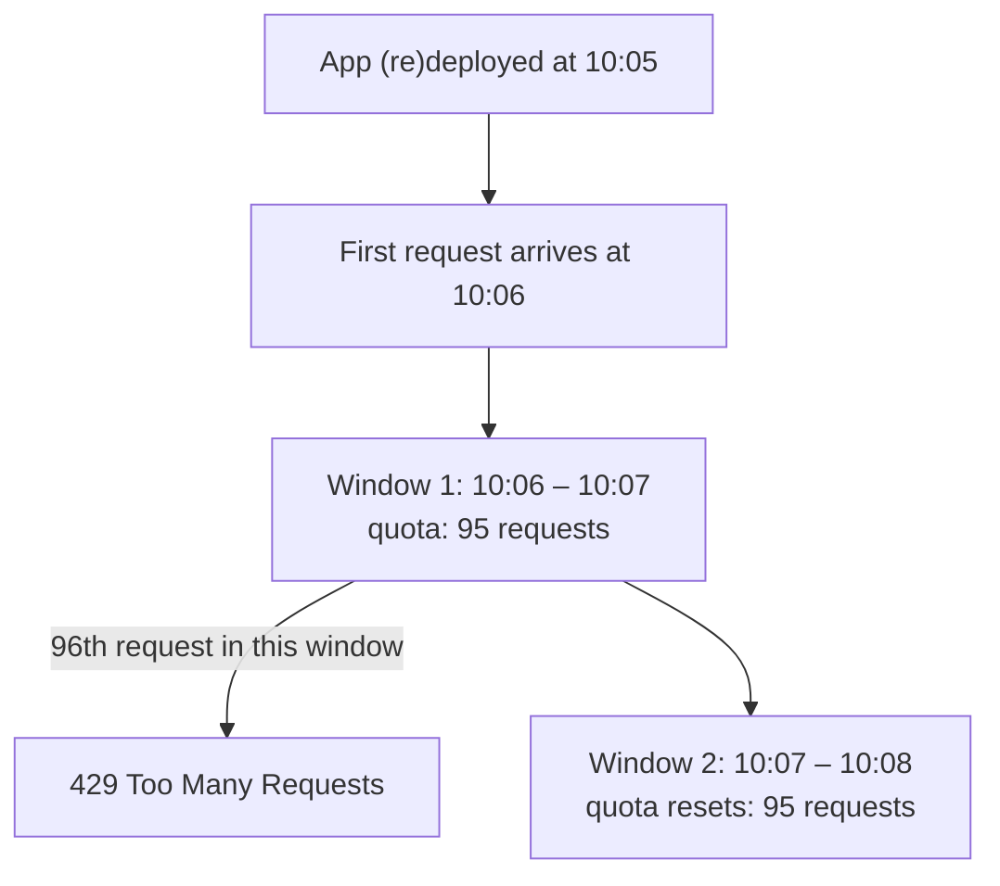
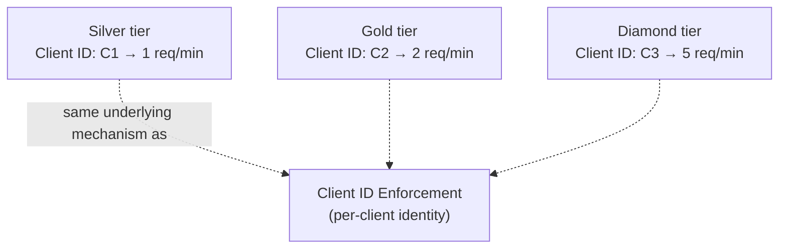
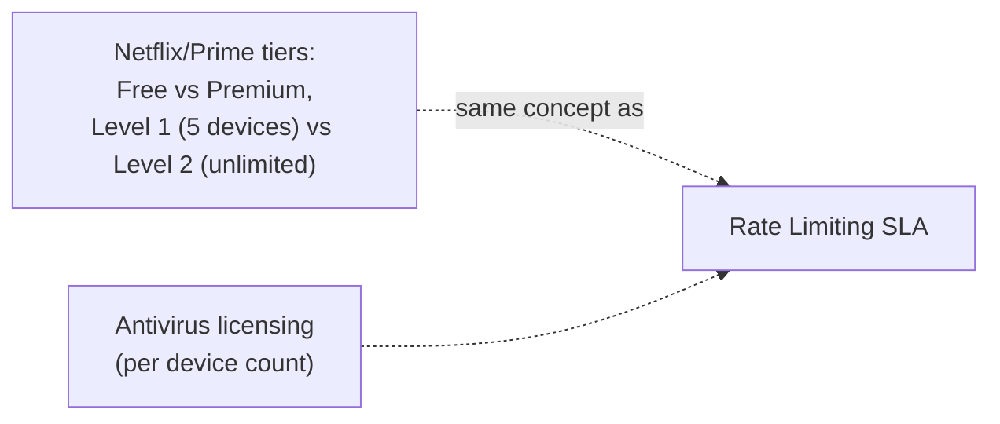
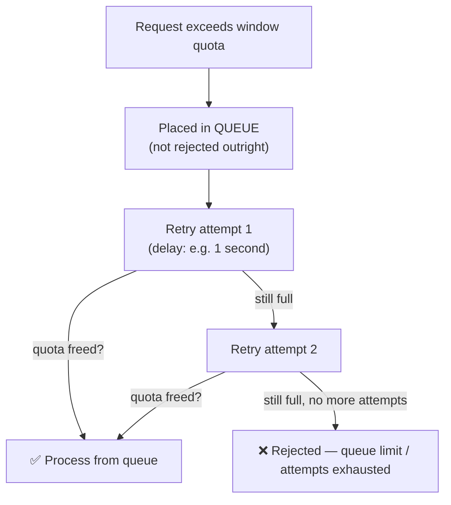
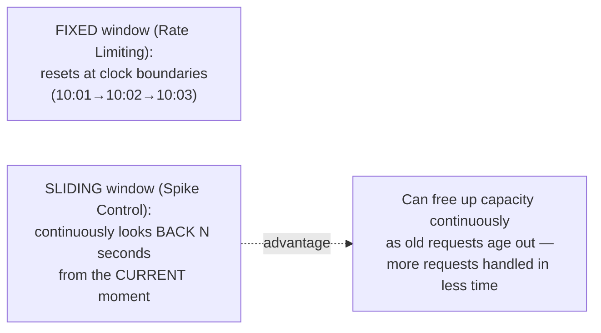
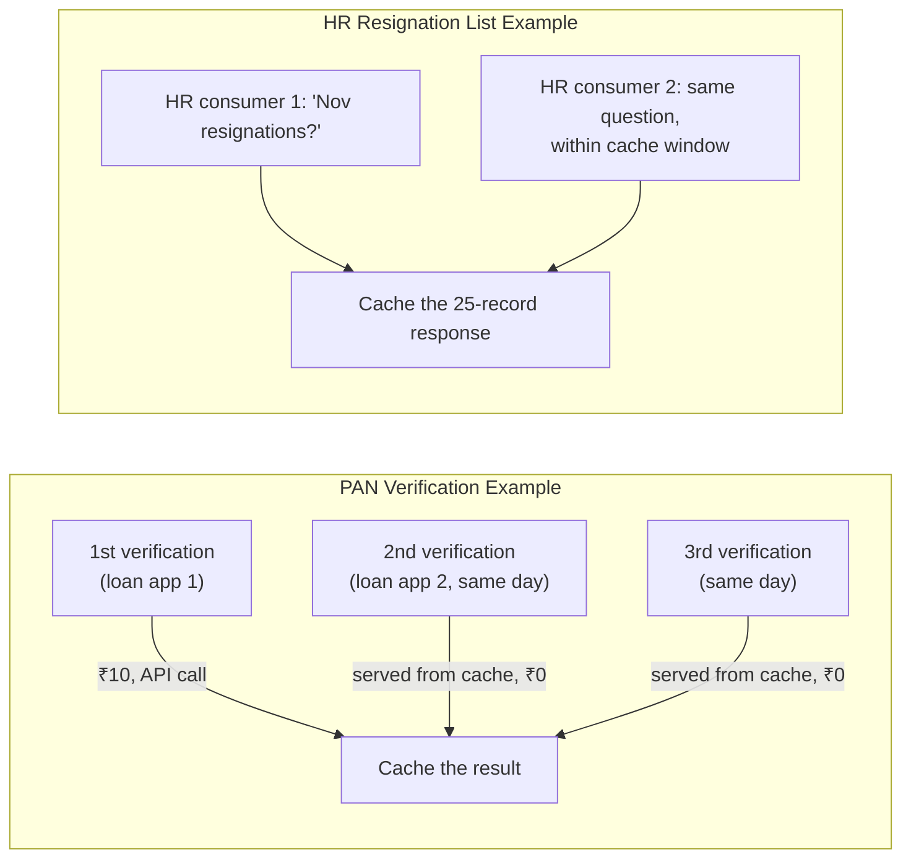
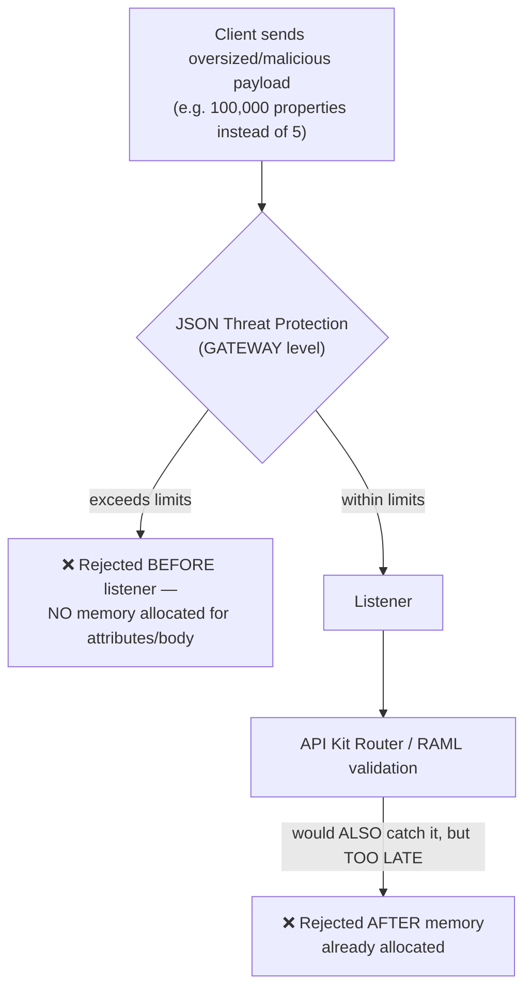
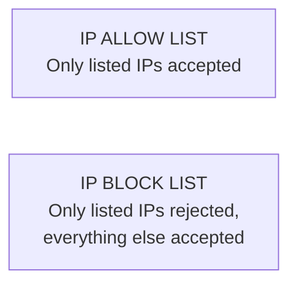
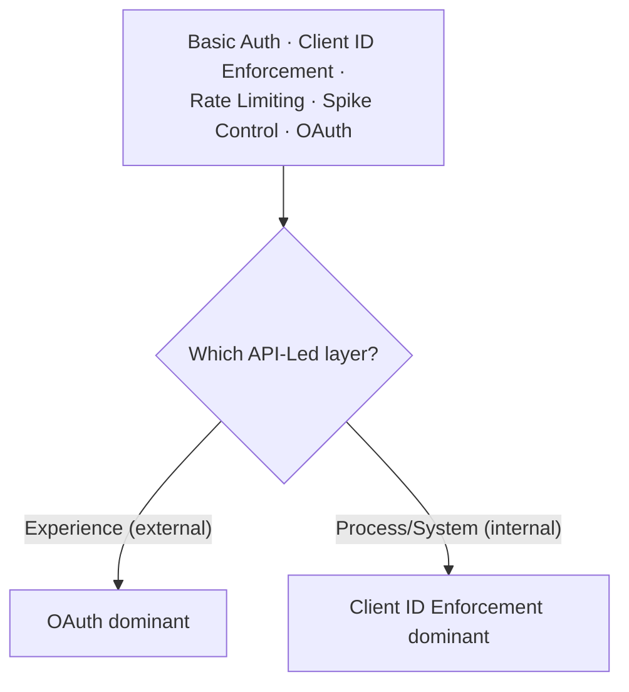

# Day 32 — Detailed Notes: Rate Limiting, Spike Control, Caching, and JSON Threat Protection

> **Watch alongside:** the one distinction to lock in before anything else is **Rate Limiting rejects outright; Spike Control queues and retries**. Everything else in this session — fixed vs. sliding window, SLA tiers, caching duration, gateway-level vs. RAML-level validation — is a variation or elaboration on top of that single fork.

---

## 1. 401 vs. 400 — A Quick Diagnostic

*"The user didn't send the username and password at all. 400 is a bad request... the user gave the wrong username and password... then also 401 will be unauthorized."*

---

## 2. Rate Limiting — Fixed Window Algorithm

**The window's start time is NOT a clean clock boundary — it's the first request after deploy/restart**, called out as a near-universal point of confusion: *"99.99% for people... redeployed the application at 10.05. But the first request came at 10.06. Then, the first time the rate limiting number will be taken, the time will be 10.06."*

**Scope is per-APPLICATION, not per-consumer**: *"is it 95 for each of them or 95 for all?... because we are handling our application in the application, so only 95 will handle our application."*

**429's meaning, stated directly**: *"Rate Limiting is a policy, it is a contract between the consumers and us. We will not be able to process more than this. That's why 400 series."*

---

## 3. Rate Limiting SLA — Per-Consumer Tiers

**The precise difference vs. plain Rate Limiting, stated directly**: *"Rate Limiting policy is for the entire API... calculate the total number of requests received from the total consumers... and reject irrespective of the consumer... here the limit is specific to each consumer or each client."*

**Honest personal caveat**: *"if you ask me, I have never implemented rate limiting SLA in my total experience. But if you go for an interview, you will get all these questions."*

---

## 4. Real-World Correlations

*"We might be applying somewhere [these concepts already]. But finally, we don't know that terminology... here, it is called rate limiting policy."*

---

## 5. Spike Control — Sliding Window + Queue

**The core Rate-Limiting-vs-Spike-Control distinction**: *"if it doesn't happen [get accepted immediately], this spike control policy shouldn't reject us... that request will be placed in the queue... after the window is opened, it will try to process the message from the queue."*

**Why short time frames are mandatory here, tied to the request-reply pattern**: *"the user experience should not go that far in the request-reply pattern... if it takes more time than that, obviously the timeout is over and we reject it."* A 30-minute queue wait is explicitly called out as bad design: *"is this policy right or wrong? It is wrong."*

---

## 6. HTTP Caching Policy — Two Worked Examples

**Cache duration is a deliberate trade-off**: *"how many days do we have to save?... let's say we give 15 days... will the cache memory also get disturbed? That's why we keep it like that for 1-2 days."*

**The general applicability rule**: *"whenever there is a possibility of retrieving frequently non-changing data, in such a situation, can I use this HTTP caching?"* — Yes.

---

## 7. JSON Threat Protection — Gateway-Level, Before the Request Even Enters

**The precise, stated advantage of gateway-level enforcement over RAML-level validation**: *"the listener will come inside and get validation from API Kit Rotor... did it enter into the API or not? It entered. But what if it does here? Before the API enters. So, it should enter in the gateway itself... this is more secure."*

**Restrictable dimensions, listed directly**: min/max string length, max object property count, max nesting/container depth.

---

## 8. IP Allow List / Block List

---

## 9. What's Genuinely Used in the Real World

*"8-9 policies are commonly used regularly in this market. Especially, most commonly used are basic auth, client ID, rate limit, spike control and OAuth."*

---

## Quick Recap
- **401 = wrong credentials sent; 400 = required credentials missing entirely.**
- **Rate Limiting**: fixed window, per-application scope, hard reject at 429 — window clock starts from the first request after deploy/restart, not a clean boundary.
- **Rate Limiting SLA**: per-consumer tiered limits (silver/gold/diamond) via SLA tiers tagged to Client IDs — something plain Rate Limiting can't express.
- **Spike Control**: queues instead of rejecting, using a **sliding** (not fixed) window — but must use short time frames/few retries to respect request-reply expectations.
- **HTTP Caching**: for frequently-requested, slowly-changing data — cache duration balances reuse value against memory pressure.
- **JSON Threat Protection**: enforced at the **gateway**, before the request enters the application at all — strictly more secure than equivalent RAML-level validation.
- **IP Allow/Block List**: inclusive or exclusive IP-based restriction.
- **Most-used in practice**: Basic Auth, Client ID Enforcement, Rate Limiting, Spike Control, OAuth — OAuth for Experience, Client ID Enforcement for internal Process/System.
