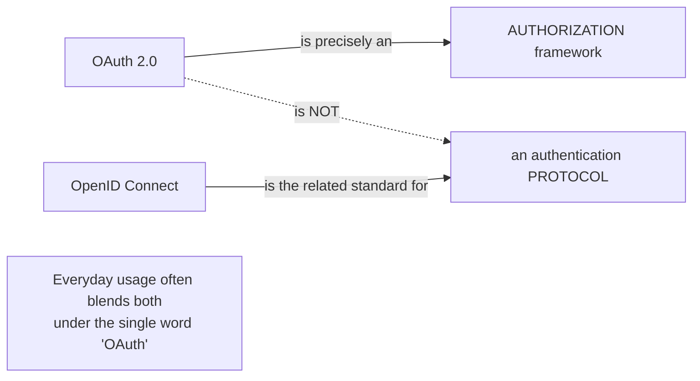
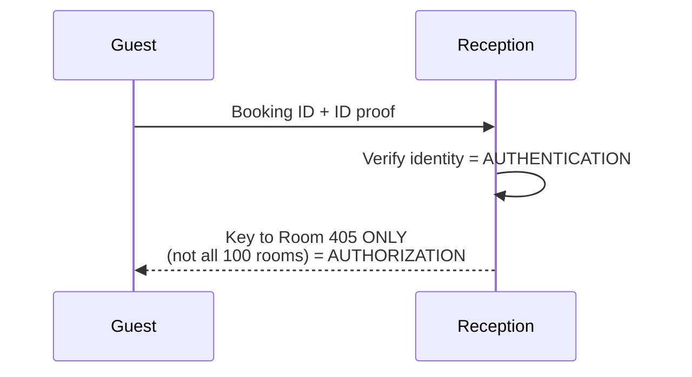
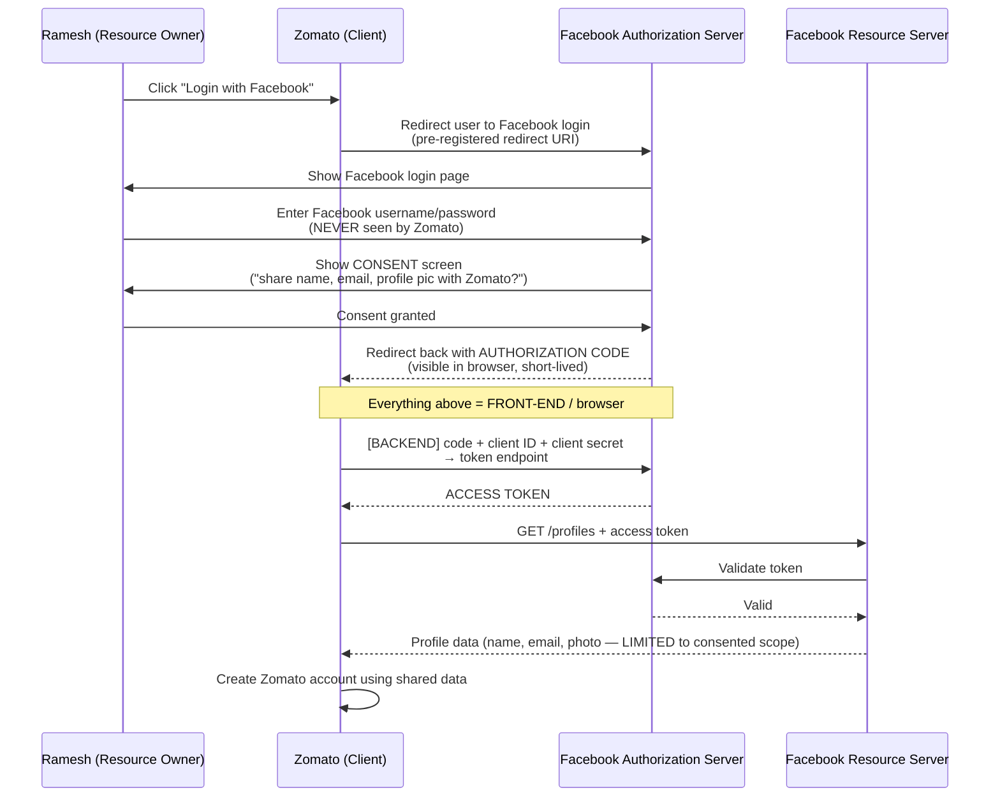
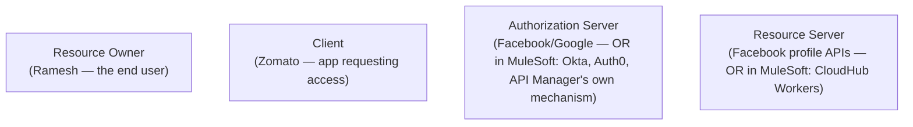
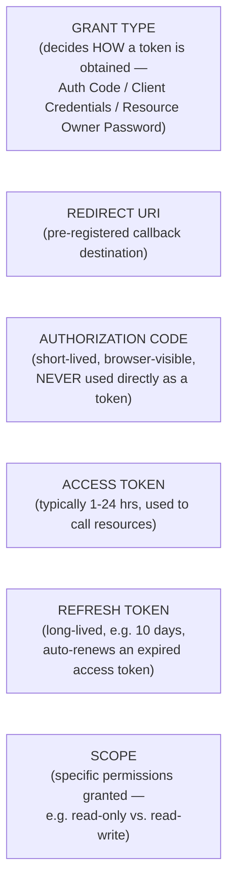
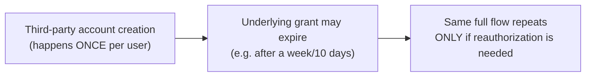

# Day 33 — Detailed Notes: OAuth 2.0, Authentication vs. Authorization, and the Authorization Code Grant

> **Watch alongside:** hold onto exactly one distinction as you read this — **authentication is "who are you," authorization is "what are you allowed to touch"** — and everything else (the whole Zomato/Facebook walkthrough, all the OAuth vocabulary) is just that one idea worked out in mechanical detail. The single most important design insight buried in the flow: the authorization code is visible in the browser, so it is deliberately *never* used as the access token itself — the real exchange always happens server-to-server, out of sight.

---

## 1. OAuth 2.0's Precise Classification

*"OAuth is an Authorization Framework, not Authentication Protocol."*

---

## 2. Authentication vs. Authorization — The Hotel Analogy

**Strict ordering, stated directly**: *"authentication happens [first, then] authorization."*

**Mapped onto API terms**: verifying WHO is calling (client ID/secret, credentials) = authentication; restricting a verified caller to only certain resources/methods (Resource 1 but not 2, 3, 4) = authorization.

---

## 3. The Authorization Code Grant Flow — Full Sequence

**Why the code-to-token exchange happens in the backend, stated directly**: *"until this authorization code, everything happens in the front-end... this auth code will also be visible in the browser... if it is visible, anyone can use that token... that is why the auth code is taken and the token is generated by communicating with tomato and facebook in the backend."*

**Why only `get profiles`, never `edit profile`**: *"he is not in a hurry, right? What did he say when I gave the consent? It is already clear. She said she will give only a few details."* The token's scope is limited to what was actually consented to.

---

## 4. The Four OAuth Actors, Mapped to MuleSoft

*"When we come to the MuleSoft ecosystem, what will be the resource server? Let's say it's a cloud hub... in our APIs, it's the workers, right?"*

---

## 5. Core OAuth Vocabulary

**Scope illustrated via a file-permissions analogy**: one user granted read-only, another read+write (but not delete), the owner retaining full read/write/delete.

**Refresh token's honest usage note**: *"it is clear, but they use it less. Many people have no idea."*

---

## 6. Frequency in the Real World — a Rare, One-Time Flow

*"Is it a rare scenario or a frequency scenario? It's a rare scenario. If you create it once, it will be done, right?"*

---

## Quick Recap
- **OAuth 2.0 is precisely an authorization framework, not an authentication protocol** — OpenID Connect is the related authentication-focused standard, though everyday usage often blends the two.
- **Authentication (who you are) always precedes authorization (what you can access)** — illustrated via the hotel check-in analogy.
- **The Authorization Code Grant Type powers "login with Google/Facebook" flows**: the client never sees the user's real password, receives a short-lived browser-visible authorization code, and exchanges it — server-to-server, along with its own client ID/secret — for an access token.
- **Four OAuth actors**: Resource Owner (user), Client (requesting app), Authorization Server (Okta/Auth0/API Manager), Resource Server (CloudHub Workers, in the MuleSoft mapping).
- **Core vocabulary**: grant type, redirect URI, authorization code, access token (short-lived), refresh token (long-lived, automates renewal), scope (limits what's shared/accessible).
- **The authorization code is never used directly as an access token** — it's visible in the browser and therefore interceptable, so the real token exchange always happens backend-to-backend.
- **Client Credentials, Resource Owner Password Grant, and JWT are deferred** to the next session (Day 34).
