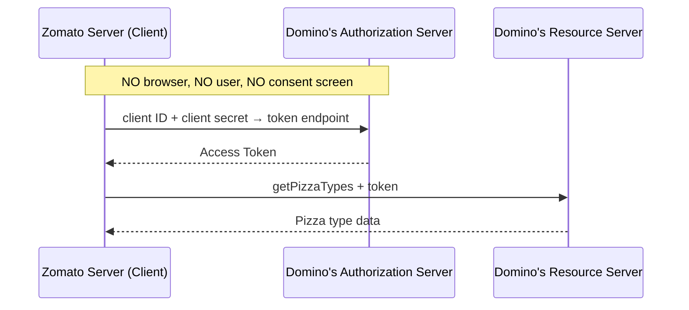
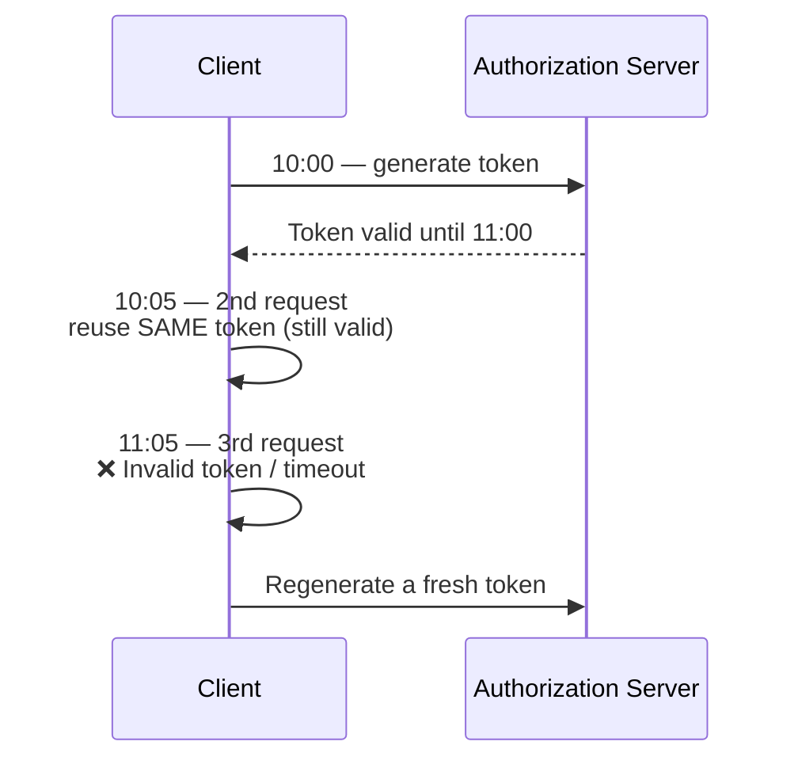
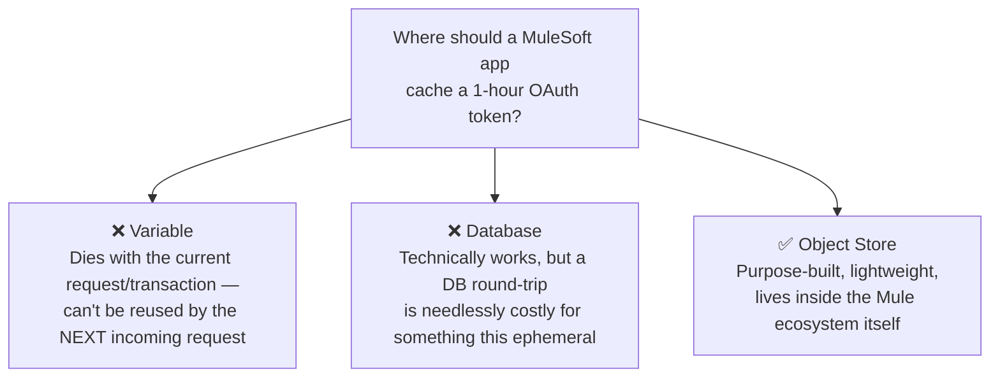
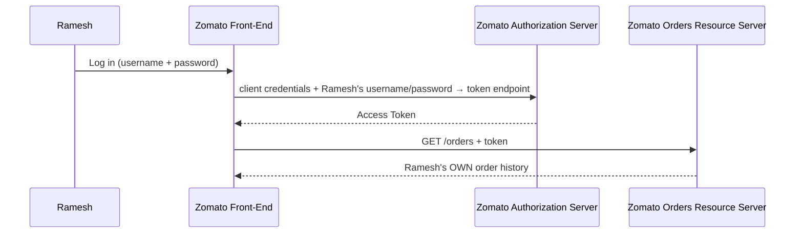
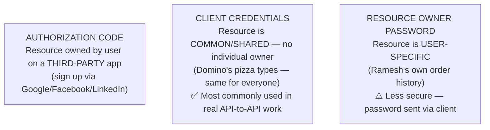
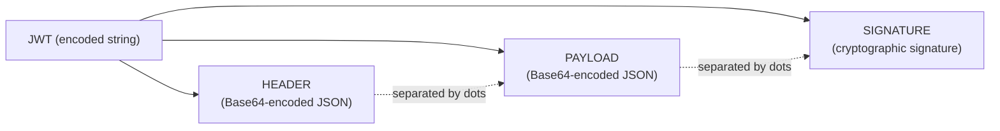
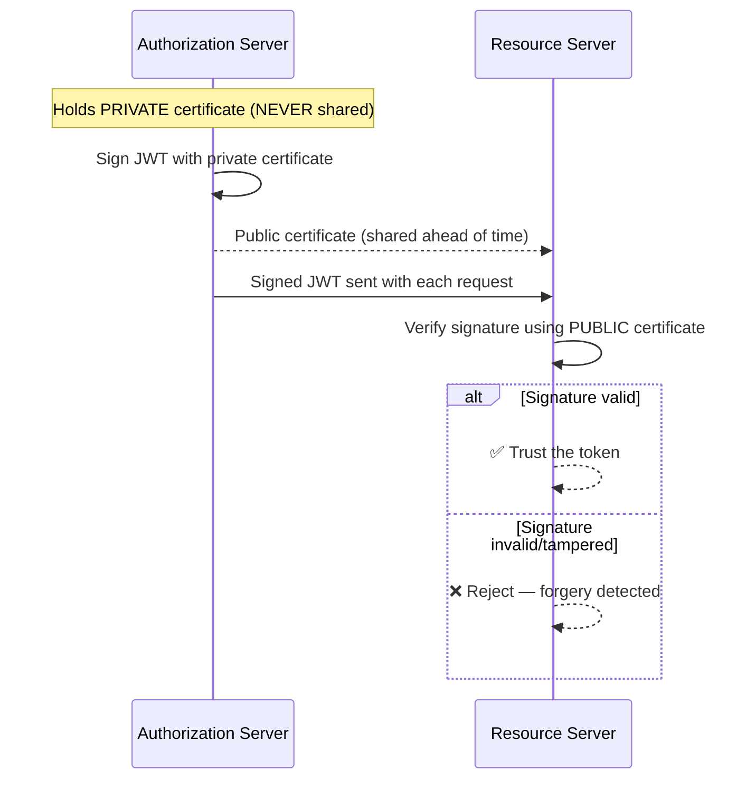
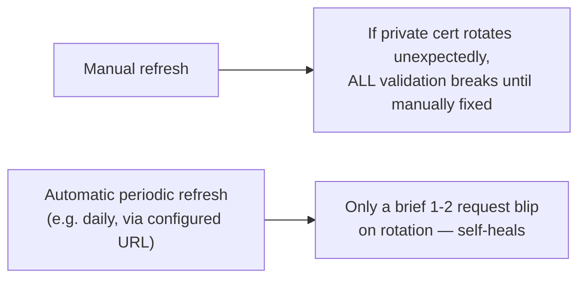
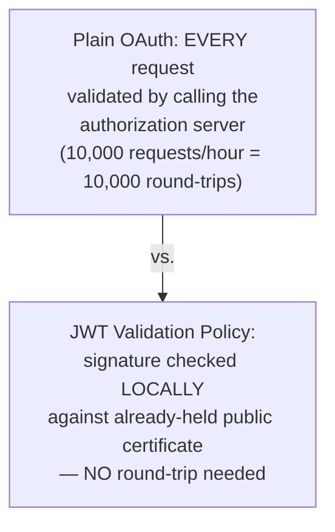

# Day 34 — Detailed Notes: Client Credentials, Resource Owner Password, Object Store Caching, and JWT

> **Watch alongside:** the one decision in this whole session with the highest real-world payoff is **where to cache an OAuth token on the MuleSoft side — Object Store, not a variable, not a database**. Variables die with the request; a database round-trip is needlessly expensive for something this ephemeral. Object Store is purpose-built for exactly this. Everything else (grant type selection, JWT's signature mechanism) is important but more about knowing the right vocabulary than making an architecture call.

---

## 1. Client Credentials Grant — Server-to-Server, No Browser

**The key structural difference from Authorization Code Grant, stated directly**: *"if you observe in the previous situation, I have sent the authorization code. But what I am doing here is sending client credentials."*

**Why so much simpler**: *"this is server to server communication. If you observe, there is no browser involvement here."*

---

## 2. Token Lifecycle — Reuse Within Validity, Regenerate After Expiry

*"Which token will you use then? Same token."* ... *"then it will throw an error. Invalid token. Timeout."*

---

## 3. Where to Cache the Token — Variable vs. Database vs. Object Store

**Why not a variable, stated directly**: *"in variable, it will only be one time... will it have access to the next request? It will not have."*

**Why not a database, stated as a direct cost comparison**: *"that communication process is very costly... I can do it in 100 rupees, I can do it in 20 rupees. Which should I choose?"*

**The efficiency framing tying this to developer craft**: *"a good coder or a good developer and a normal developer [differ in exactly this way]. Developing code efficiently is the difference."*

---

## 4. Resource Owner Password Grant — User-Owned Resource, Credentials Sent Directly

**Naming logic, stated directly**: *"is he the owner of this resource? Yes... is Ramesh the owner of the order details? Yes... that is why it is called Resource Owner Password Grant Type."*

**The explicit security downside**: *"this is a little less security. Basically, the credentials are also being utilized as part of the request"* — unlike Authorization Code Grant, where the password is typed ONLY into the authorization server's own page, never passing through the client.

---

## 5. All Three Grant Types, Compared by Ownership Pattern

*"We mostly use client credentials grant. I have observed it. I have also used it. This is more visible."*

---

## 6. JWT Structure — Header.Payload.Signature

*"It is compact, self-contained JSON object... it will be in three parts... separated by dots."* Demonstrated live on `jwt.io` (color-coded red/purple/blue) and via Notepad++'s MIME Tools Base64 encode/decode, establishing Base64 as a **reversible encoding**, not encryption.

---

## 7. The Private/Public Certificate Signing Mechanism

**The letter-and-signature analogy, given directly**: *"I am writing a letter to you... before writing the letter to you, I gave you a piece of my signature. That is the public certificate... let's assume this postman is a hacker... he also sent you a signature. But do you have my signature already?... can you verify it properly?"*

**Manual vs. automatic public-certificate refresh**:

---

## 8. JWT Validation Policy vs. Plain OAuth — Avoiding the Round-Trip

*"On an average 10,000 times 1 hour request... should I validate these 10,000 times?... that comes into JWT validation policy... it will reduce this step... it acts more intelligent than [plain OAuth]."*

---

## Quick Recap
- **Client Credentials Grant**: pure server-to-server, no user/browser — client's own registered ID/secret sent directly to the token endpoint (Domino's pizza example).
- **Cache OAuth tokens on the MuleSoft side using Object Store** — not a variable (too short-lived) and not a database (needlessly costly for this purpose).
- **Resource Owner Password Grant**: for genuinely user-owned resources — sends the user's actual credentials via the client, which is explicitly less secure than Authorization Code Grant.
- **Client Credentials is the most commonly used grant type in real API-to-API integration work.**
- **JWT = header.payload.signature**, Base64-encoded (reversible encoding, not encryption), signed with the issuer's private certificate and verified via the corresponding public certificate — with automatic periodic public-certificate refresh preferred over manual.
- **JWT Validation Policy avoids a network round-trip to the authorization server on every request**, checking the signature locally instead — a meaningful efficiency gain at scale over plain OAuth token validation.
