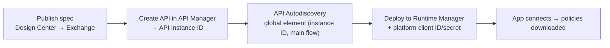
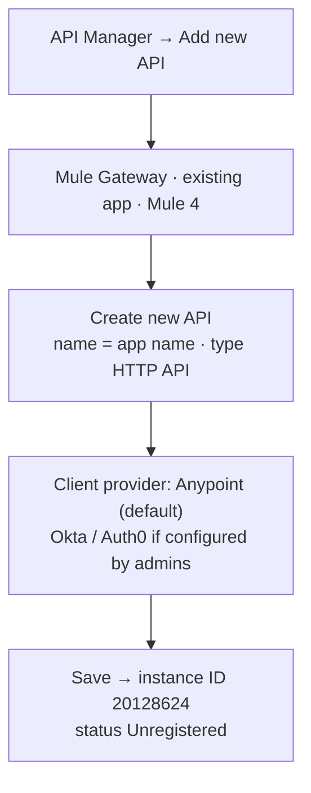
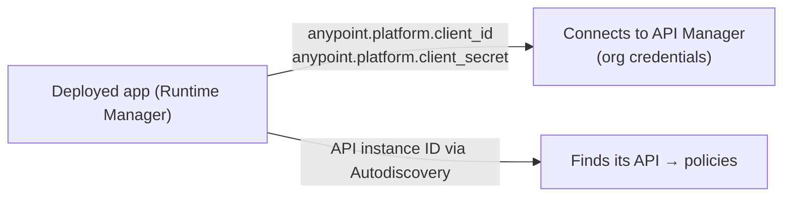
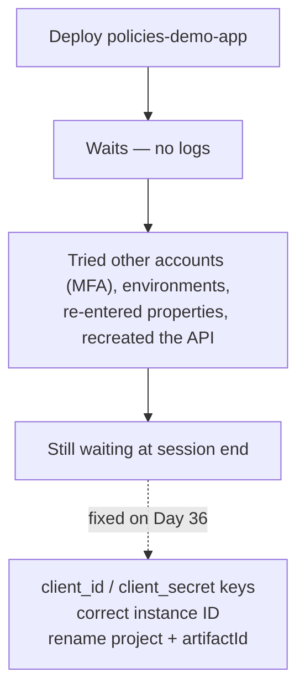

# Day 35 — Detailed Notes: Create an API Instance, Autodiscovery, and Deploying to CloudHub 2.0

> **Watch alongside:**
> - This is the setup half of the hands-on policy work: register the API in API Manager, wire Autodiscovery, and deploy with the platform client ID/secret.
> - The deployment didn't finish in class — the reasons (and fixes) are in Day 36. Read the two days together.

> **Video-verified:** written from the cleaned transcript and the class recording (24 Dec 2024). Slide images: [slides/day35](../slides/day35/).

---

## 1. The Four Steps for Any Policy

*"There is only one procedure for all of them. There are only few changes."*

A dummy **policies-demo-app** (Listener → Logger → Transform) is used because the HR project still refers to the old Anypoint account's assets.

---

## 2. Create New API (No Exchange Spec)

*"What does auto discovery do? It takes this ID and checks the application through the API manager."* — a frequent interview question.

---

## 3. Two Things the Deployed App Needs

- The values come from **Access Management → Business Groups → Settings** — the **organization's** credentials, not those created by Client ID Enforcement.
- Keys must use underscores: `client_id`, `client_secret` (the class typed `clientid`; corrected on Day 36).
- **Protect value** hides a property permanently — it can only be deleted and re-entered.
- In real projects the pipeline passes these; after a pipeline deploy they're visible under the app's Properties.

---

## 4. Where to Deploy

| | Shared space | Private space |
|---|---|---|
| Shared with | Other Anypoint customers | Nobody — your org only |
| Load balancer / logs | Shared | Your own |
| Used for | Practice | Real organizations |

- CloudHub 2.0 endpoints are **HTTPS** by default.
- Release channel: Edge (latest), Long Term Support (4.6.x), None (pick e.g. 4.4.0).
- Other deploy route: Studio → Anypoint Platform → Deploy to CloudHub; real projects use CI/CD.

---

## 5. The Deployment That Hung

*"Today's session was largely wasted — nothing productive could be done."*

---

## Quick Recap
- Applying any policy takes the same four steps: Exchange → API Manager (instance ID) → API Autodiscovery → deploy.
- With no spec in Exchange, use **Create new API** with asset type **HTTP API**.
- The **client provider** (Anypoint by default) issues client IDs for Client ID Enforcement.
- The deployed app needs `anypoint.platform.client_id` / `anypoint.platform.client_secret` — the org's credentials from Access Management.
- Organizations deploy to **private spaces** through **pipelines**; shared spaces are for practice.
- The class deployment hung; Day 36 has the cause and fix.
