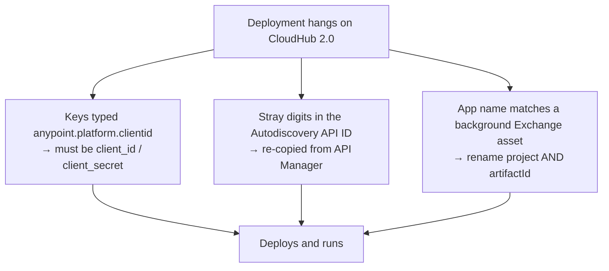
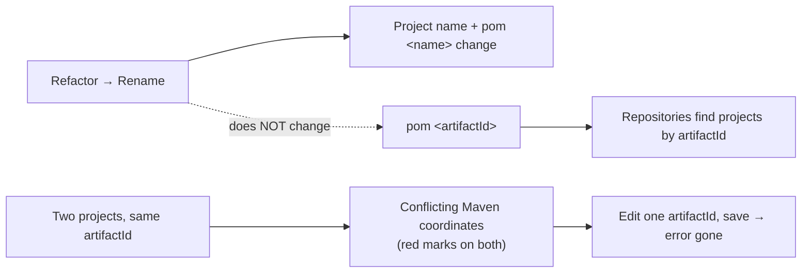
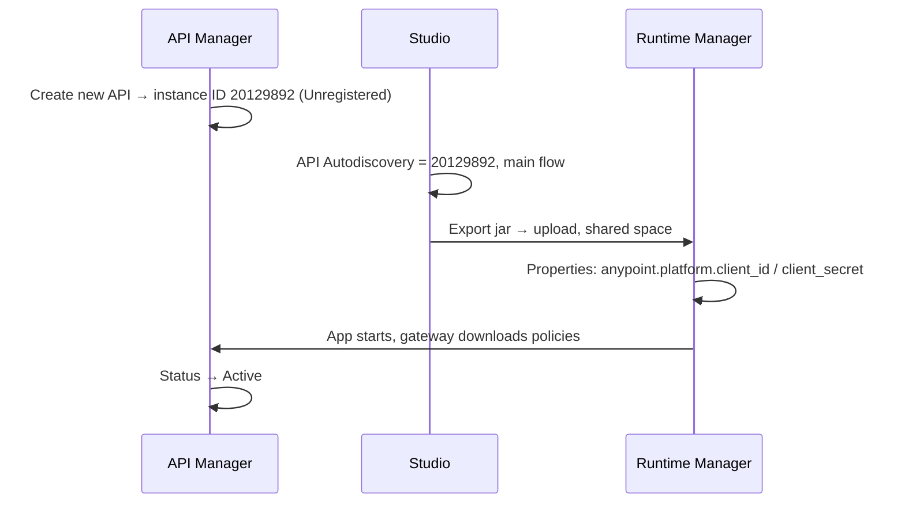
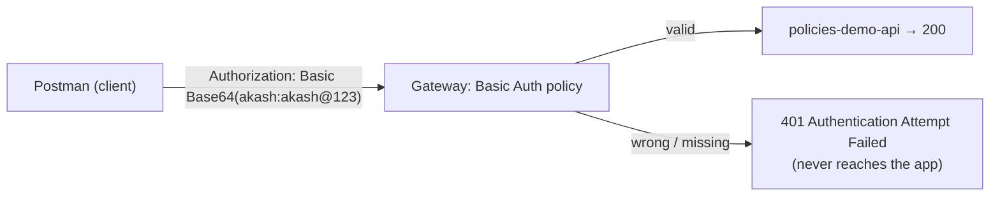
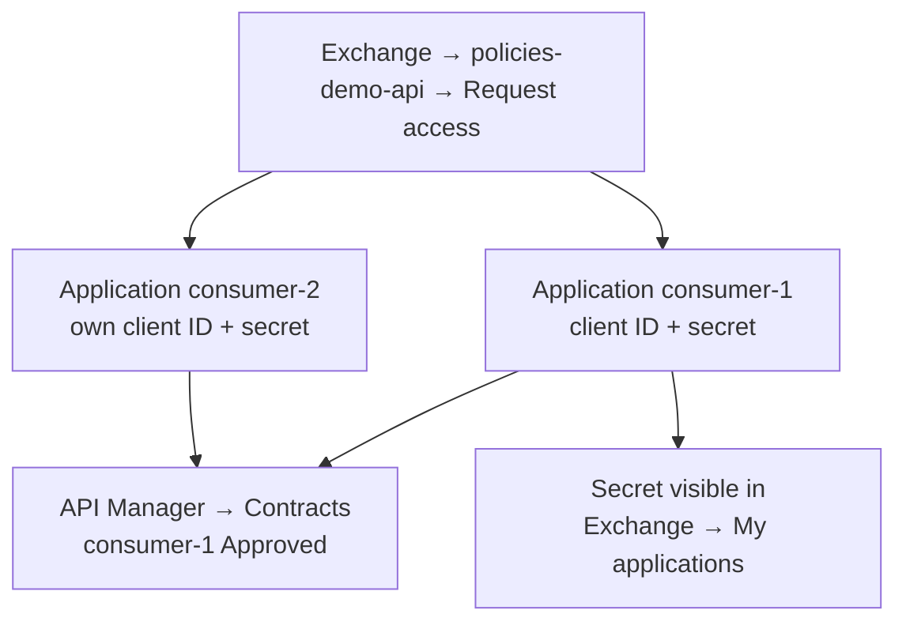

# Day 36 — Detailed Notes: Fixing the CloudHub 2.0 Deployment, Basic Authentication and Client ID Enforcement

> **Watch alongside:**
> - The most useful lesson isn't a policy — it's that a project's **artifactId**, not its name, is its identity. Renaming a project leaves the artifactId unchanged, and two projects with the same artifactId clash.
> - Once the app is Active, the two policies show the core difference: one shared username/password versus one client ID and secret per consumer.

> **Video-verified:** written from the cleaned transcript and the class recording (25 Dec 2024). Slide images: [slides/day36](../slides/day36/).

---

## 1. Why Day 35's Deployment Hung

*"It doesn't mean that the deployment is failing. It means that the deployment is getting hanged."* The key-name fix was a correction, not the cause of the hang.

---

## 2. Name vs. artifactId

- *"See machines or systems or applications are trying to refer the artifact ID, not the name."*
- **Instructor's suggestion:** keep the artifactId and the application name the same.
- In a real organization you wouldn't rename an application once its repository exists.

---

## 3. Deploying policies-demo-api

**Rolling update vs. Recreate:**

| | Rolling update | Recreate |
|---|---|---|
| Old version | Kept running until the new one is up | Killed first |
| Downtime | None | Yes, during redeploy |
| Used | Most of the time | Rarely |

On CloudHub 2.0, 0.1 vCore comes with 1.2 GB (500 MB on 1.0), and 0.05 vCore exists for paid orgs.

---

## 4. Basic Authentication – Simple

- Applied to all methods and resources (the usual choice); specific methods are possible.
- *Screen:* logs show `Applied policy http-basic-authentication … policies-demo-api (20129892)`.
- **Header rules:** the name `authorization` works in any case; `Basic` must be written exactly; a misspelt header name fails.
- Correlation IDs on each log line let you trace a single request.

---

## 5. Client ID Enforcement

*"Where are the client ID and client secret? We applied this. The policy is good. But... there are some extra steps."*

**Two ways for consumers to send credentials:**

| Option | How |
|---|---|
| HTTP Basic Authentication Header | client ID as username, secret as password (`Authorization: Basic …`) |
| Custom expression | headers named by the policy — default `client_id` / `client_secret`; demo renamed to `c_id` / `c_secret` |

- After the rename, the old `client_id` headers fail with **401 "Invalid Client"** — consumers must use exactly the names defined.
- A policy can be **disabled** (stays listed, not applied) or **removed**.
- Internal consumers (e.g. marketing and finance) may share one pair if the architect decides.

*"To understand all this, I took around 6 months."*

---

## Quick Recap
- The deployment hang came from wrong property keys (`client_id` / `client_secret`), a bad Autodiscovery ID, and a name clash with a background Exchange asset.
- **artifactId** is a project's identity; renaming a project doesn't change it, and duplicates cause "Conflicting Maven coordinates".
- **Rolling update** redeploys with no downtime; **Recreate** has a gap.
- API Manager shows **Active** once the app connects through Autodiscovery.
- **Basic Authentication** = one shared username/password; failures are rejected at the gateway with 401.
- **Client ID Enforcement** = one client ID/secret per consumer, created through **Exchange → Request access**, recorded as **contracts**, secret visible under **My applications**.
- Custom-expression header names must match exactly what the policy defines.
