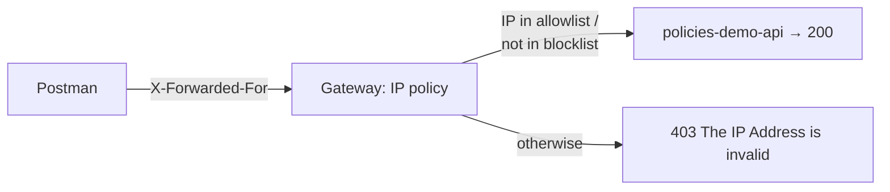
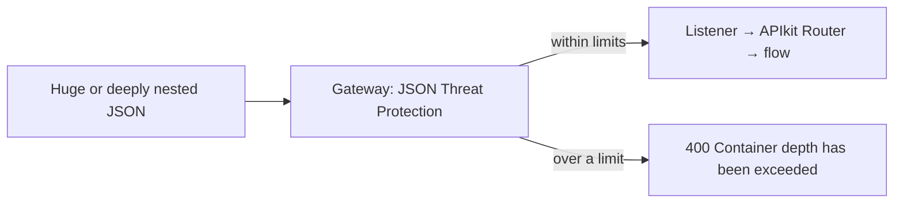
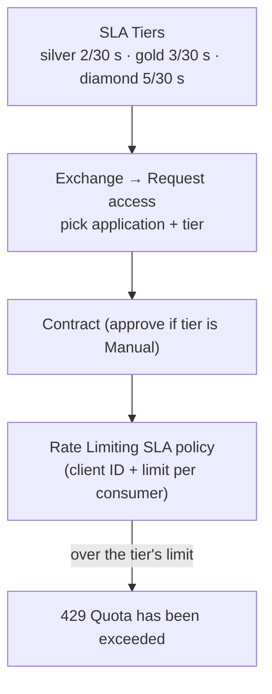
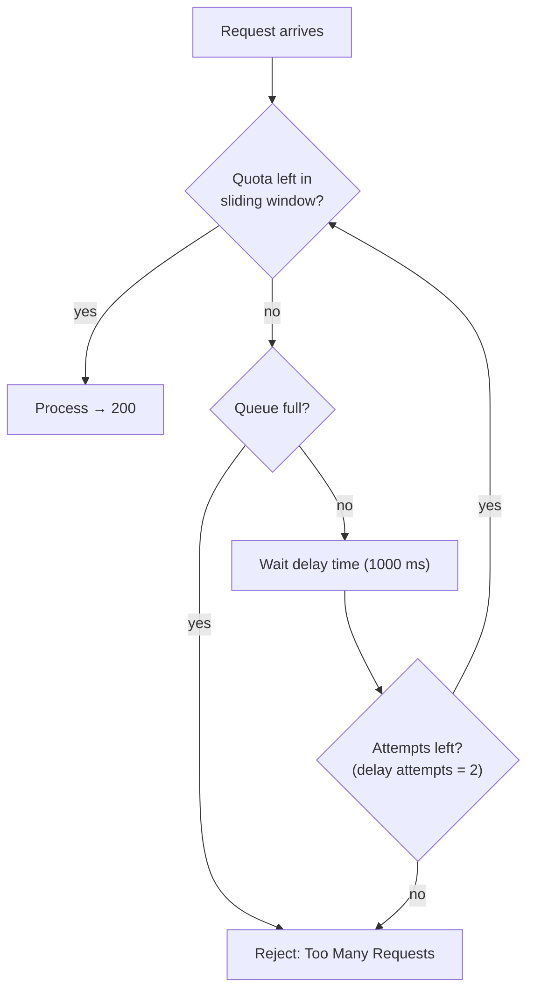

# Day 37 — Detailed Notes: IP Allowlist/Blocklist, Threat Protection, Rate Limiting, SLA Tiers and Spike Control

> **Watch alongside:**
> - Once the first two policies work, the rest go fast — each one is "Add policy → configure → hit it from Postman".
> - Focus on the difference between **rate limiting** (reject now) and **spike control** (queue and retry), and on why threat protection belongs at the gateway rather than in APIkit.

> **Video-verified:** written from the cleaned transcript and the class recording (26 Dec 2024). Slide images: [slides/day37](../slides/day37/).

---

## 1. IP Allowlist and Blocklist

- IP expression: `#[attributes.headers['x-forwarded-for']]` — a default header sent even when you add none.
- Give a single IP, a **CIDR range** (with a slash), or more rows.
- *Screen:* allowlist `10.1.25.45` → **403** "The IP Address is invalid: 122.169.236.221"; adding `122.169.236.221` fixed it.
- Blocklist with the same IP → **403**.
- **Instructor's experience:** rarely used — cloud workers get new IPs when replaced, so a consumer's IP can change.

---

## 2. JSON Threat Protection

| Field | Class value |
|---|---|
| Max container depth | 1 (object + array = 2) |
| Max string value length | 25 |
| Max object entry name length | 20 |
| Max object entry count | 6 |
| Max array element count | 0 |

- Defaults are **-1** = no limit.
- *"Between the Listener and the APIkit Router, memory is allocated for attributes, payload... Something can happen in that time."* — why the gateway is better than RAML validation for this.
- **XML Threat Protection** has the equivalents: node depth, attribute count, child count, text length, attribute length, comment length.

---

## 3. Rate Limiting and Rate Limiting SLA

- **Rate Limiting:** 3 requests per 1 minute → 4th gives **429 Too Many Requests**; after a minute it works again.
- **Rate Limiting SLA:** limits are **per consumer**; can't be combined with a separate Client ID Enforcement policy.
- Changing an existing consumer's tier = **Revoke → Delete** contract, then request access again.

---

## 4. Policy Order

- Reorder with the up/down arrows — policies run top to bottom.
- Logical order: rate limiting → JSON threat protection → basic auth.
- Too many policies hurt performance.

---

## 5. Spike Control (Throttling)

- Class values: **5 requests / 10000 ms**, delay time 1000 ms, delay attempts 2.
- Keep the delay small — request-reply must respond quickly.

| | Rate Limiting | Spike Control |
|---|---|---|
| Extra requests | Rejected immediately | Queued, retried |
| Result in class | 429 | 200 after waiting |

---

## Quick Recap
- IP policies read `X-Forwarded-For`; allowlist lets only listed IPs/ranges through, blocklist rejects listed ones — both give **403**.
- JSON/XML Threat Protection caps depth, lengths and counts at the gateway (-1 = no limit); exceeding gives **400**.
- Rate Limiting rejects over-limit requests with **429**.
- Rate Limiting SLA = client ID + per-consumer limits from **SLA tiers** chosen at request-access time.
- Policy order matters; apply only what you need.
- Spike Control queues extra requests and retries them after a delay; only the HTTP caching policy is left.
