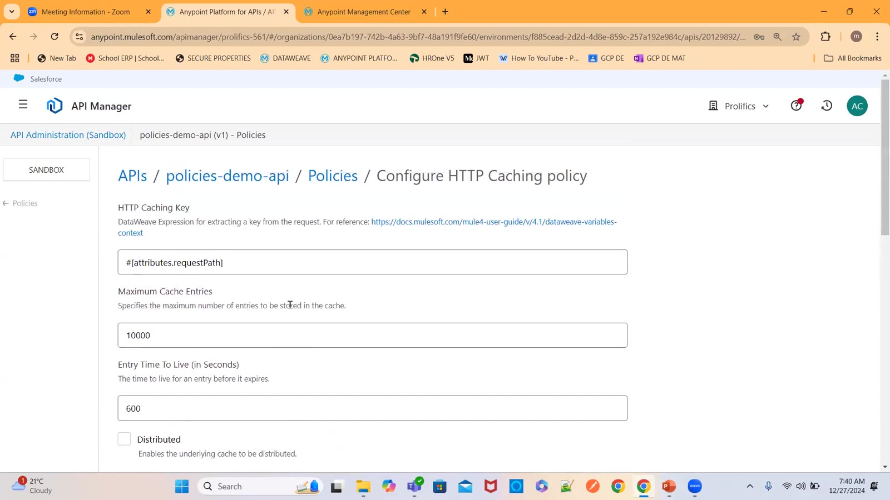
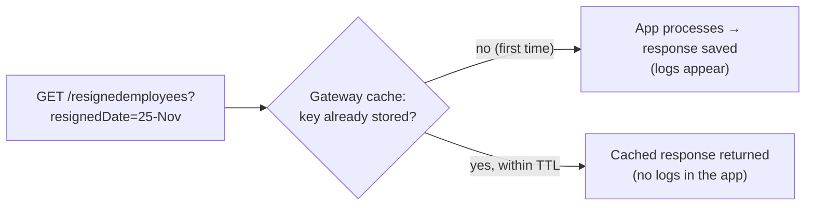
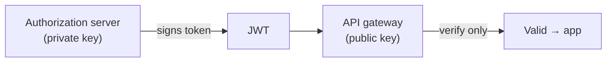
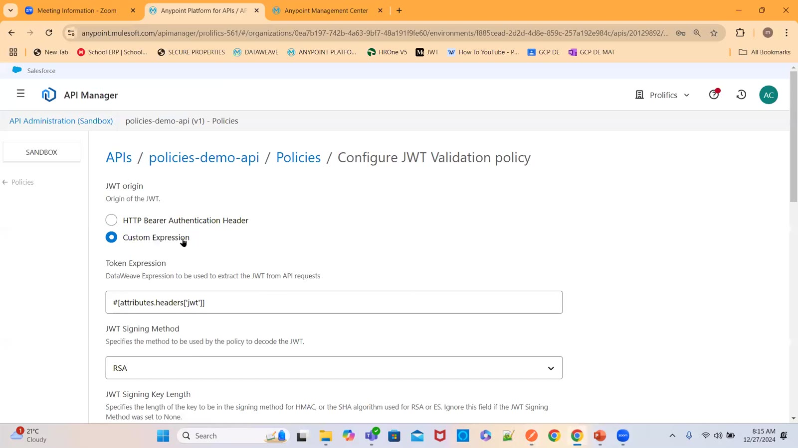
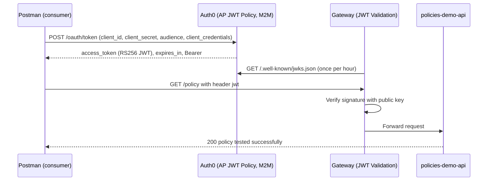
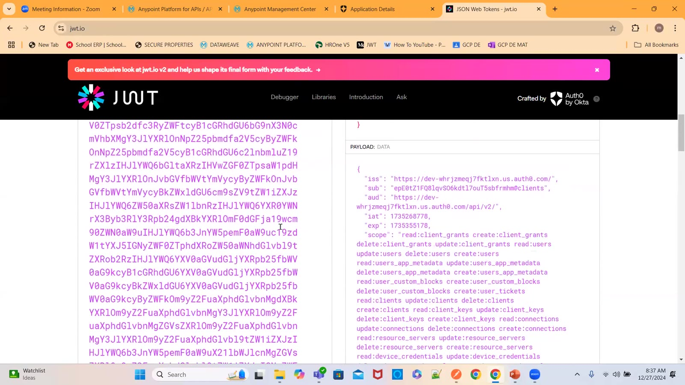
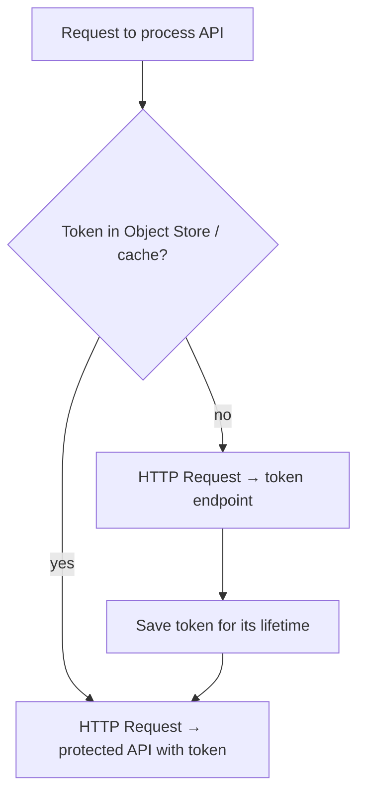

# Day 38 — Detailed Notes: HTTP Caching Policy and JWT Validation with Auth0

> **Watch alongside:**
> - The caching policy is explained well but didn't take effect in the demo — learn the fields and the 48-hour DB-credentials use case rather than the test.
> - The JWT part is the important one: Auth0 issues a signed token, and the gateway verifies it with a public key fetched from a **JWKS** URL.

> **Video-verified:** written from the cleaned transcript and the class recording (27 Dec 2024). Slide images: [slides/day38](../slides/day38/).

---

## 1. HTTP Caching

| Field | Class / default |
|---|---|
| Caching key | `#[attributes.requestPath]` → `#[attributes.queryParams.empid]` |
| Max cache entries | 10000 (reduce it) |
| Entry time to live | 600 s → 60 s for the test |
| Request condition | `#[attributes.method == 'GET' or attributes.method == 'HEAD']` |
| Response condition | 200, 203, 204, 206, 300, 301, 404 … — instructor: just 200 |

- **Persistent** = survives redeploy/restart; **distributed** = shared across workers.
- **Use case:** a small API returning Oracle DB credentials (password rotates every 3 months), cached for **48 hours** so 20 APIs fetch it once per 48 hours.
- In class the loggers printed every time — caching didn't take effect (warning about the listener path not having a `*`).

---

## 2. Symmetric vs. Asymmetric

- Symmetric: one key encrypts and decrypts.
- Asymmetric (**RSA**): private key signs, public key verifies — more secure.
- *"Can I sign with the public key? No — my job is only to verify."*

---

## 3. JWT Validation Configuration

- JWT origin: **Custom Expression** `#[attributes.headers['jwt']]` (or a Bearer header).
- Signing method **RSA**, key length 256.
- Key origin **JWKS**, caching TTL 60 min, connection timeout 10000 ms.
- Manual key = breaks if the provider rotates its key; JWKS updates automatically.

---

## 4. Auth0 Token Flow

| Claim | Value in class |
|---|---|
| `iss` | Auth0 tenant domain |
| `sub` | client ID `@clients` |
| `aud` | domain `/api/v2/` |
| `iat` / `exp` | Epoch times — 24 hours apart |
| `gty` / `azp` | client-credentials / client ID |

- No `jwt` header → **400** "JWT Token is required"; with the token → **200**.

---

## 5. Caching the Token on the Consumer Side

- A **variable** dies per request, so every request would hit the token endpoint — wrong.
- Mobile apps do the same in their web server code.

---

## Quick Recap
- HTTP Caching returns stored responses for repeated GET/HEAD requests without reaching the app; key, max entries and TTL control it.
- Persistent cache survives restarts; distributed cache spans workers.
- JWT Validation verifies a token signed by an authorization server; RSA uses a private key to sign and a public key to verify.
- JWKS keeps the public key current automatically.
- Auth0 M2M app + client-credentials grant gave a 24-hour RS256 token, decoded on jwt.io.
- Consumers should cache tokens in the Object Store, not a variable.
- Next: Scatter-Gather and Choice Router.
