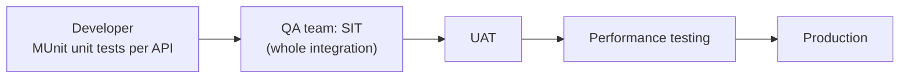
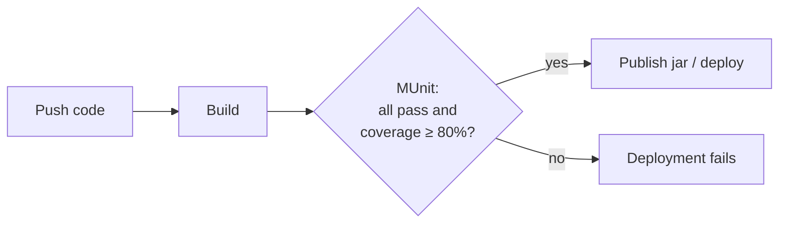
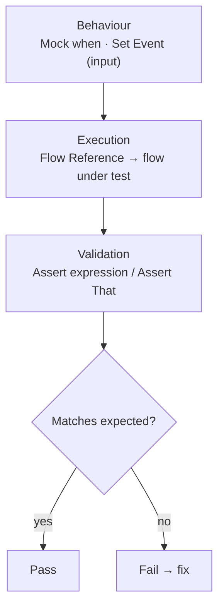
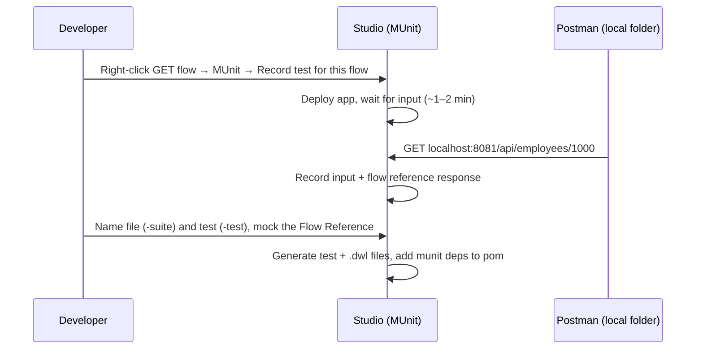

# Day 39 — Detailed Notes: MUnit Introduction and Recording a Test for the GET Flow

> **Watch alongside:**
> - The first half is theory: why developers unit-test, where MUnit sits in the CI/CD pipeline, and how the coverage percentage decides whether a deployment goes ahead.
> - The second half records a real test for the HR system API's GET flow — watch how the wizard builds the mock, Set Event and assert for you, and why the flow reference is mocked.

> **Video-verified:** written from the cleaned transcript and the class recording (30 Dec 2024). Slide images: [slides/day39](../slides/day39/).

---

## 1. Where Unit Testing Fits

- Car example: test each part, then assemble and test the whole car.
- Unit tests let you re-run everything after a small change to see what broke — the developer's job, not QA's.

---

## 2. MUnit in the Pipeline

- Pipelines: Jenkins (open source, widely used), Bamboo, GitHub, Bitbucket, Azure, AWS — usually built by DevOps.
- **Coverage** = covered components ÷ total: 30/40 = 75% fails; 35/40 = 87.5% passes.

---

## 3. Anatomy of a Test

| Processor | Use |
|---|---|
| Mock | Return a result without the real call — used most |
| Spy | Watch the process |
| Verify | Check in validation |

- Also: ignore tests, tag tests, coverage report.
- Tests go in `src/test/munit`, inputs in `src/test/resources`.

---

## 4. Recording the GET Test

**Before recording:**

- Test the app locally first ("No listener for endpoint" came from a cleared path).
- Set the MUnit run configuration arguments: `-M-Dmule.env=dev -M-Dsecure.key=…`.
- Comment out **API Autodiscovery** to run locally.
- Recording succeeds only if the request completes successfully.

**Why mock:** Jenkins can't reach the database, so the recorded response is replayed.

- Set Event reads payload, attributes and variables from `set-event_*.dwl` files via `readUrl(classpath)`.
- `pom.xml` gains `munit-runner`, `munit-tools` 2.3.9 (test) and `munit-maven-plugin`.

---

## 5. Running, Debugging and Coverage

- **Run MUnit suite** → Tests run 1, Failed 0, Errors 0; covered processors get green ticks.
- Debug timed out at **120,000 ms** — see **MUnit Errors** view; raise **Test timeout** if needed.
- Coverage report: **9.52%** → after an implementation-flow test plus a default-route test, **14.2%** overall and 100% for the GET implementation flow.
- A different XML file gets a different suite file.

---

## Quick Recap
- MUnit is MuleSoft's Maven-integrated testing framework; tests run as a CI/CD step with a coverage benchmark.
- Every test has Behaviour, Execution and Validation.
- Record success scenarios (Mule 4.3+); write failure scenarios manually.
- Mock external calls so tests don't need real systems.
- Set Event = payload + attributes + variables from recorded `.dwl` files.
- Cover each route (e.g. both Choice paths) with its own test to raise coverage.
