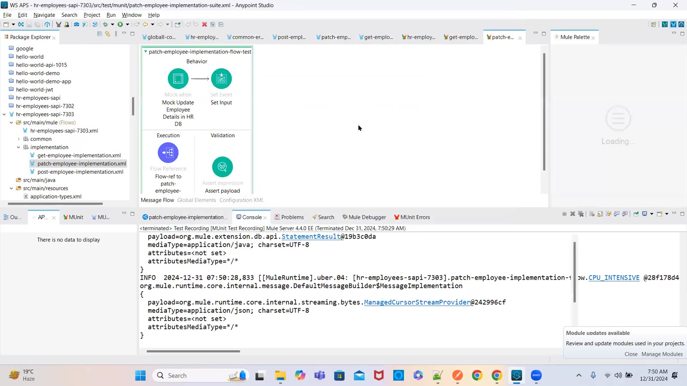
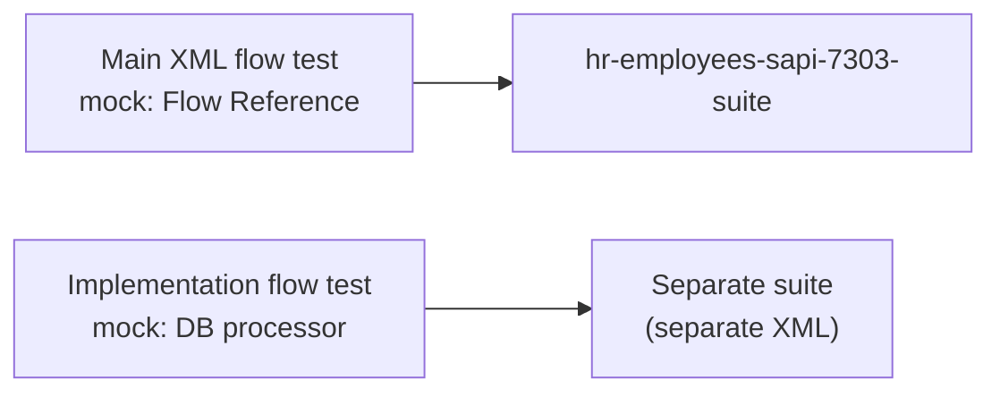
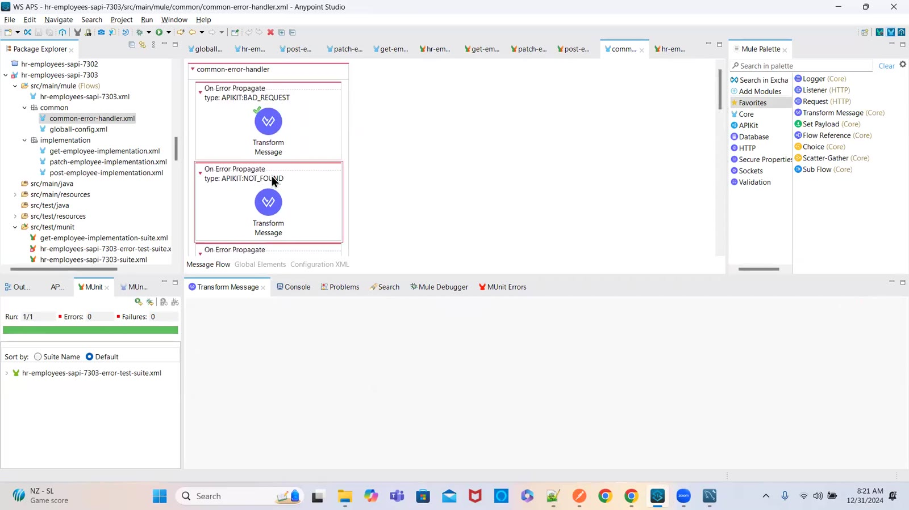
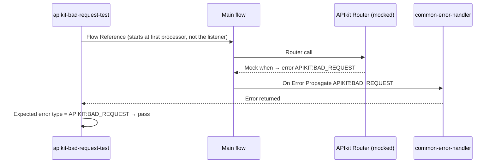
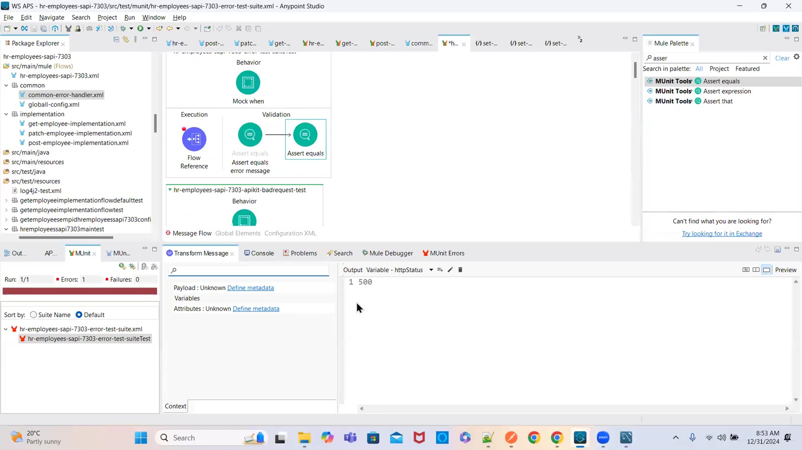
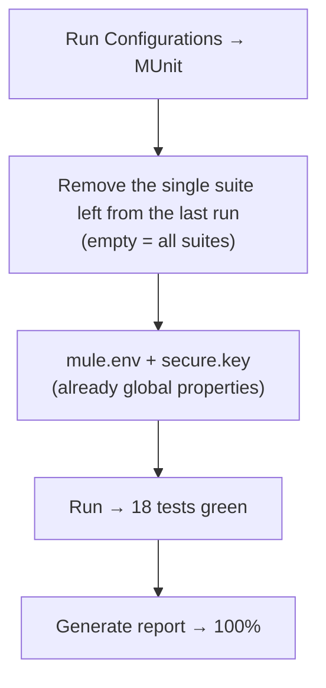
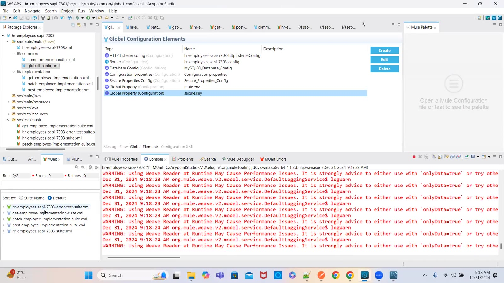
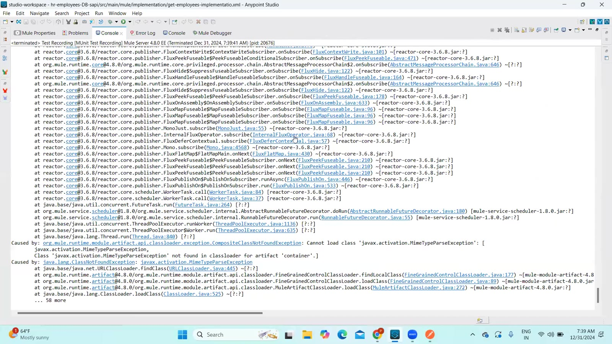

# Day 40 — Detailed Notes: PATCH and POST Tests, Error-Handler Tests, Asserts and Full Coverage

> **Watch alongside:**
> - Recording PATCH and POST is a repeat of Day 39 — the one new rule is that each POST recording needs a fresh employee ID.
> - The real lesson is the **manual error test**: mock the APIkit Router to raise an error, and let the common error handler run. Copying that test once per error type takes the handler to 100%.

> **Video-verified:** written from the cleaned transcript and the class recording (31 Dec 2024). Slide images: [slides/day40](../slides/day40/).

---

## 1. Recording PATCH and POST

| Flow | Input | Mocked |
|---|---|---|
| PATCH main | PATCH request (local folder) | Flow reference |
| PATCH implementation | Same request | Update Employee Details in HR DB |
| POST main | Employee **1050** | Flow reference |
| POST implementation | Employee **1051** | Create Employee Record in HR DB |

- Recording runs the real flow, so a repeated insert would fail and not be recorded.
- The DB mock replays `mock_payload.dwl` — the connector's recorded response.

---

## 2. Manual Error Test

- Start with **Create blank test for this flow**; rename the suite to `hr-employees-sapi-7303-error-test-suite`.
- Mock when → **pick target processor** (APIkit Router, by config-ref) → error type ID.
- Copy the test 9 times in XML; change name, mock error type and expected error type in the UI.
- Error suite: **10 tests** pass; error handler 100%, overall 38%.
- Right-click → **Ignore test / Enable test / Ignore other tests**.

---

## 3. Asserting Message and Status

- **Assert equals** `#[payload.message]` and `#[vars.httpStatus]` = 500 (DB:CONNECTIVITY).
- Need inputs? Record any test and **copy its Set Event**.
- The DB:CONNECTIVITY test kept failing with an **InterceptionException** (empty message vs. null, a wrong `vars.httpStatus` expression) — deleted, to be investigated.

---

## 4. Running Everything

- Report: containers = flows, weight = share of project components, coverage per XML.
- The Choice isn't counted as a component; 80% is fine in real projects.

---

## 5. Student's Recording Error

- *"Cannot load class 'javax.activation.MimeTypeParseException'"* on Mule 4.8.0 — the pom's `app.runtime` 4.8.0 vs. Studio runtime; unresolved in class.

---

## Quick Recap
- PATCH/POST tests are recorded like GET; POST needs a new ID per recording.
- Error tests are manual: blank test, Mock when raises an error, expected error type validates it.
- One copy per error type covers the whole common error handler.
- Assert equals checks message and status; copy recorded Set Events for inputs.
- Clear the suite list to run all suites → 18 tests, 100% coverage.
