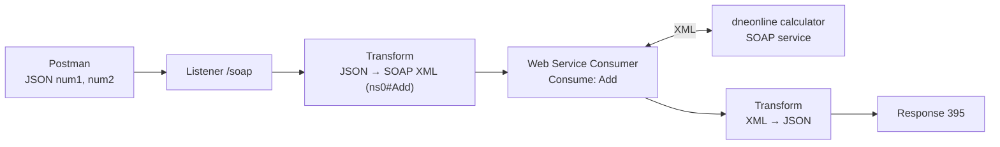
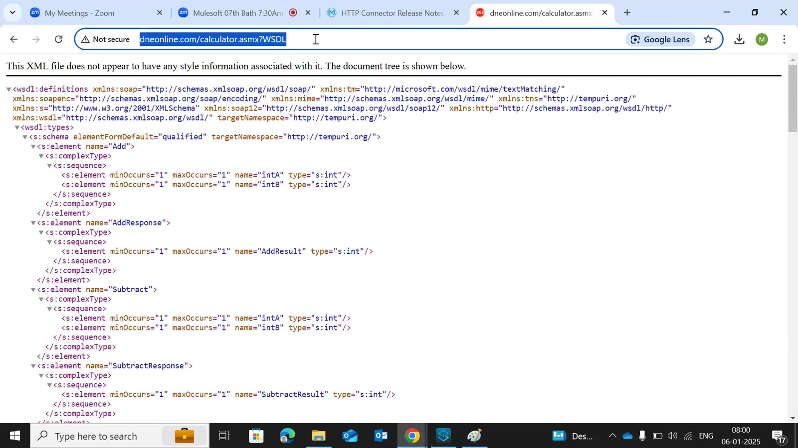
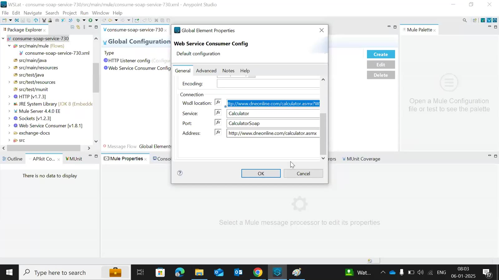
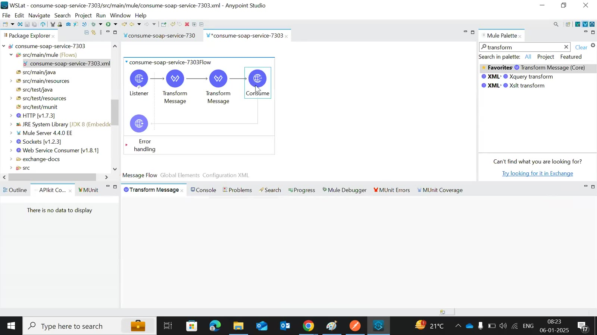
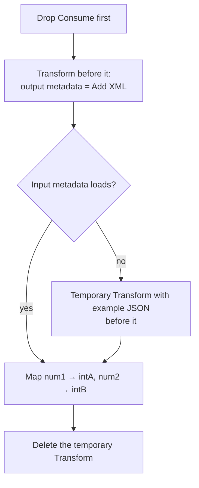
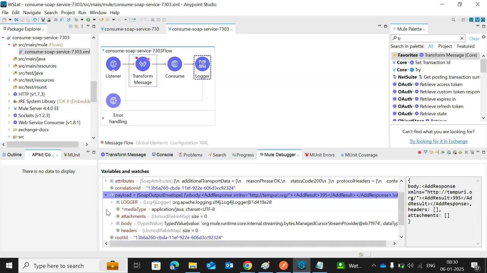

# Day 41 — Detailed Notes: Consuming a SOAP Service with the Web Service Consumer

> **Watch alongside:**
> - A short, complete hands-on: JSON in, convert to SOAP XML, call the free dneonline calculator, and turn the XML answer back into JSON.
> - Note the two Studio hacks — drop Consume first so the Transform before it knows the XML shape, and use a temporary example Transform when input metadata won't load.

> **Video-verified:** written from the cleaned transcript and the class recording (6 Jan 2025). Slide images: [slides/day41](../slides/day41/).

---

## 1. The Use Case



- We build REST; SOAP is only **consumed**, from older applications.
- **WSDL** is SOAP's RAML: `http://www.dneonline.com/calculator.asmx?WSDL` (Add, Subtract, Multiply, Divide).



---

## 2. Consumer Config



| Field | Value |
|---|---|
| WSDL location | `http://www.dneonline.com/calculator.asmx?WSDL` |
| Service | Calculator |
| Port | CalculatorSoap (or CalculatorSoap12) |
| Address | `http://www.dneonline.com/calculator.asmx` (WSDL URL minus `?WSDL`) |
| SOAP version | SOAP11 (default) |
| Operation | **Add** |

- Service/port/address fill automatically from the WSDL; otherwise copy them from it.

---

## 3. Building the XML Input





```dataweave
output application/xml
ns ns0 http://tempuri.org/
---
{ ns0#Add: { ns0#intA: payload.num1, ns0#intB: payload.num2 } }
```

- `ns0` is a short name for the namespace URI.

---

## 4. The Response



- Payload = **SoapOutputEnvelope** (Java) with body, headers, attachments; the body is XML `<AddResponse><AddResult>395</AddResult></AddResponse>`.

```dataweave
output json
---
{ Response: payload.body.AddResponse.AddResult, "serviceused": "addition" }
```

- Postman → `{"Response": "395", "serviceused": "addition"}`.
- DataWeave quotes the keys itself in JSON output.
- Only Add works reliably on this free service.

---

## Quick Recap
- SOAP services are consumed (rarely) from older systems with the **Web Service Consumer → Consume** operation.
- The WSDL gives service, port and address; address = WSDL URL without `?WSDL`.
- A Transform placed before Consume gets the XML request structure; map the JSON fields with the `ns0` namespace.
- The response envelope's body holds the XML result; map it to JSON for the consumer.
- Interview question: "Which connector for SOAP?" → Web Service Consumer.
