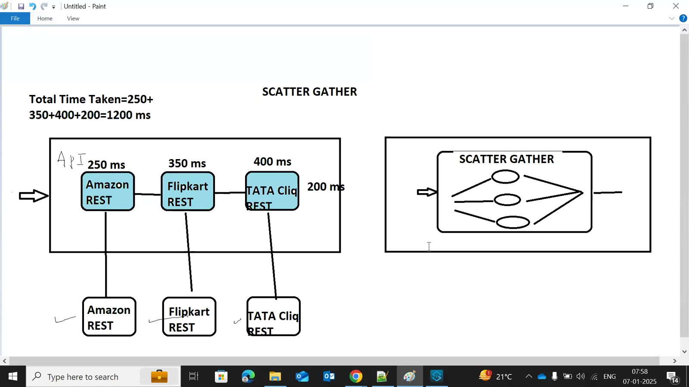
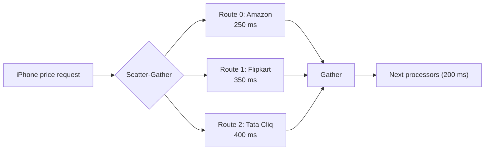
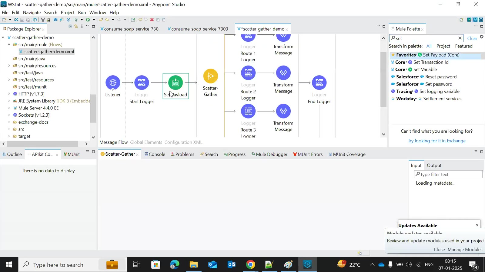
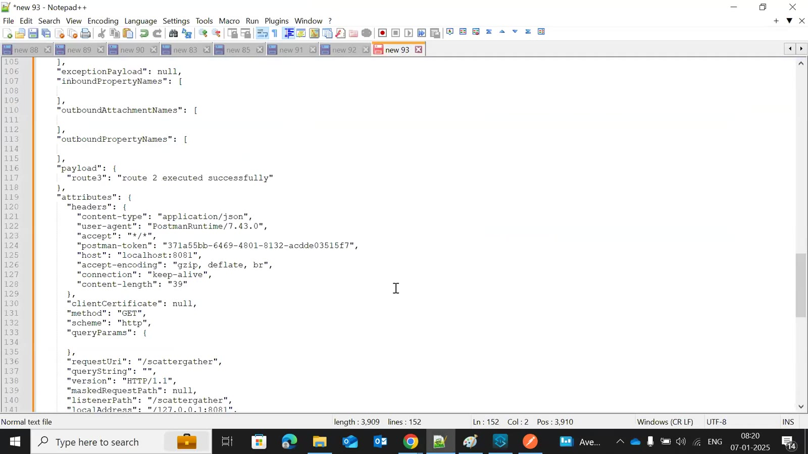
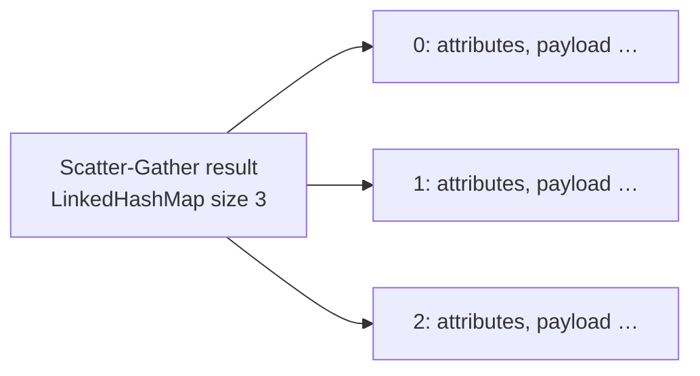
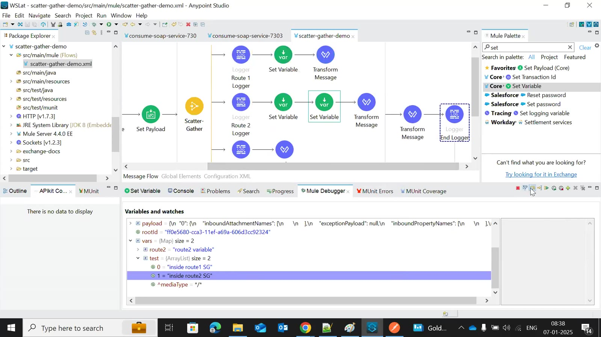
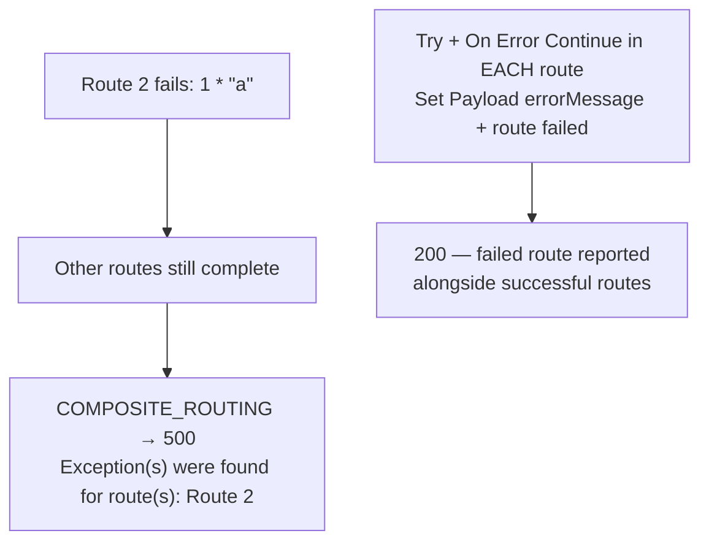
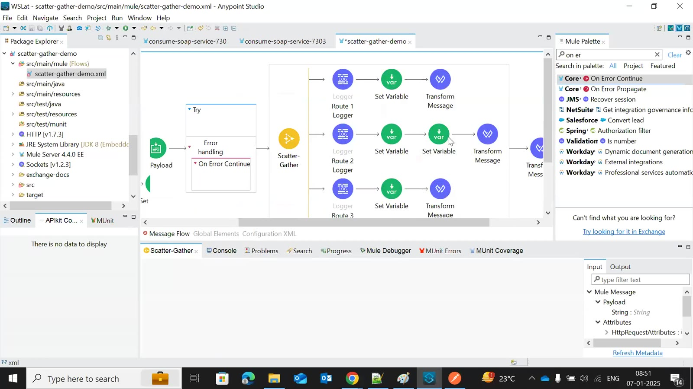

# Day 42 — Detailed Notes: Scatter-Gather

> **Watch alongside:**
> - The price-comparison drawing explains the whole point: independent calls run in parallel, so the total time is the slowest route, not the sum.
> - The second half covers what interviewers now ask — the shape of the gathered output, what happens to variables modified in routes, max concurrency 1, and how to stop one failed route from failing everything.

> **Video-verified:** written from the cleaned transcript and the class recording (7 Jan 2025). Slide images: [slides/day42](../slides/day42/).

---

## 1. Sequential vs. Parallel

| | Sequential | Scatter-Gather |
|---|---|---|
| Time | 250 + 350 + 400 + 200 = **1200 ms** | 400 + 200 = **600 ms** |
| Use when | Calls depend on each other | Calls are independent |

- At least 2 routes; every route gets the same payload, attributes and variables.

---

## 2. Properties

| Property | Meaning |
|---|---|
| Timeout | Per-route wait (ms) |
| Target | Store the result in a variable |
| Max Concurrency | Parallel routes; **1 = sequential** |

---

## 3. The Gathered Output

- An **object of objects** (not an array), keyed from "0".
- It's Java — add a Transform (`output application/json` / `payload`) or Postman shows it unreadable.

---

## 4. Variables Across Routes

| Case | After the Scatter-Gather |
|---|---|
| Set before, unchanged | Same value |
| Modified in one route | That value |
| Modified in two routes | **Collection** of both values |
| Created in a route | Available outside |

---

## 5. Errors in a Route

- Putting the whole Scatter-Gather in a Try continues the flow but loses the route results.
- Try inside each route keeps every result; the error payload tells you which route failed.
- Key order can change between runs (parallel) — label each route's result.

---

## Quick Recap
- Scatter-Gather runs independent routes in parallel; time = slowest route.
- Output: object of objects keyed "0", "1", "2" — convert to JSON.
- Timeout per route; Target to a variable; Max Concurrency 1 = sequential.
- Variables modified in several routes become a collection; new route variables are visible afterwards.
- A failed route gives COMPOSITE_ROUTING after all routes finish; handle with Try + On Error Continue in every route.
